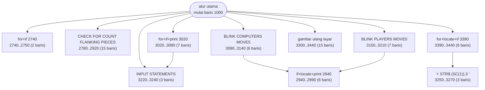
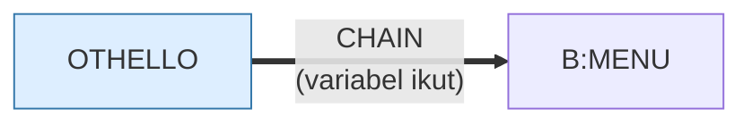

# OTHELLO.BAS — Othello

> Versi PET yang dimodifikasi Patrick Leabo, Tucson, Mar 1982. Penulisnya mengaku AI-nya belum selesai.

| | |
|---|---|
| Sumber | Public domain / listing majalah lain-lain |
| Tahun | 1982 |
| Panjang | 248 baris (nomor 1000–3450) |
| Subrutin | 10, dipanggil dari 21 tempat |
| Percabangan | 21 `GOTO`, 21 `GOSUB`, 0 target `ON…` |
| Komentar | 7% dari baris |
| Jalankan | `run\OTHELLO.bat` |

## Peta arsitektur

*Diagram di bawah ini bukan tafsiran — semuanya diturunkan langsung dari
kode: tiap panah adalah `GOSUB` yang benar-benar ada, tiap kotak adalah
blok antara sebuah entri dan `RETURN`-nya.*



Kotak bersudut miring berwarna = **penangan kejadian** (`ON KEY`/`ON ERROR`), yang dipanggil oleh interupsi, bukan oleh alur utama.

### Subrutin dan perannya

| Baris | Panjang | Dipanggil | Peran (diambil dari kode) |
|---|--:|--:|---|
| `3220`–`3240` | 3 baris | 6× | INPUT STATEMENTS |
| `2780`–`2920` | 15 baris | 4× | CHECK FOR COUNT & FLANKING PIECES |
| `2740`–`2750` | 2 baris | 2× | for+if @2740 |
| `2940`–`2990` | 6 baris | 2× | if+locate+print @2940 |
| `3390`–`3440` | 6 baris | 2× | for+locate+if @3390 |
| `3020`–`3080` | 7 baris | 1× | for+if+print @3020 |
| `3090`–`3140` | 6 baris | 1× | BLINK COMPUTERS MOVE5 |
| `3150`–`3210` | 7 baris | 1× | BLINK PLAYERS MOVE5 |
| `3250`–`3270` | 3 baris | 1× | "+ STR$ (SC(1)),3);" |
| `3300`–`3440` | 15 baris | 1× | gambar ulang layar |

### Program lain yang dimuat



### Perulangan utama

`GOTO` mundur terpanjang: dari baris **2420** kembali ke **1550** — melingkupi 870 nomor baris.
Itulah loop utama program ini; segala sesuatu di dalam rentang tersebut
dijalankan berulang.

### Data yang dipegang

| Array | Dipakai | Ditulis di baris |
|---|--:|---|
| `A` | 14× | 1430, 1450, 1460, 2160, 2740, … |
| `P$` | 12× | 1270, 1280, 1310 |
| `D$` | 4× | 1360, 1370, 1380 |
| `I4` | 3× | — |
| `J4` | 3× | — |

## Bagaimana program ini disusun

Sepuluh subrutin, dan yang terpenting dipanggil empat kali:

```basic
2780..2920   ' CHECK FOR COUNT & FLANKING PIECES
```

Itu inti Othello — memeriksa apakah sebuah langkah mengapit bidak lawan. Dipanggil
berulang karena harus diperiksa ke delapan arah.

Struktur data yang membuatnya mungkin:

```basic
DIM A(9,9), I4(7), J4(7), D$(2), P$(2)
```

`A(9,9)` untuk papan 8×8 — baris dan kolom ke-0 dan ke-9 jadi **pembatas**,
sehingga kode yang menyapu ke luar papan tidak perlu memeriksa tepi.

`I4(7)` dan `J4(7)` menyimpan **delapan vektor arah** (kombinasi −1, 0, 1). Jadi
"periksa delapan arah" jadi satu loop delapan kali, bukan delapan blok kode:

```
FOR arah = 0 TO 7 : periksa(baris + I4(arah), kolom + J4(arah)) : NEXT
```

Pola "simpan arah sebagai data, lalu satu loop" berlaku untuk hampir semua
permainan papan, pencarian jalur, dan pemrosesan citra. Kalau Anda menemukan diri
menulis delapan blok yang mirip, ini jawabannya.

Dan komentar paling jujur di koleksi ada di baris 1025:

```basic
1025 REM NOT DONE YET BUT HAVE FUN -- PLEASE ADD A GOOD ALGORITHM TO IT
```

Mencatat apa yang belum selesai, di dalam kode, adalah peta bagi siapa pun yang
datang berikutnya.

## Yang menarik dari kodenya

Program ini punya komentar paling jujur di seluruh koleksi:

```basic
1025 REM NOT DONE YET BUT HAVE FUN -- PLEASE ADD A GOOD ALGORITHM TO IT
```

Patrick Leabo memindahkan Othello dari Commodore PET ke IBM PC pada Maret 1982,
dan menandai sendiri bagian yang belum selesai: kecerdasan lawannya. Alih-alih
berpura-pura, ia menuliskannya di baris kedua puluh lima dan mengundang orang
lain memperbaikinya.

Ini `TODO` sebelum ada istilahnya, dan sekaligus undangan berkontribusi sebelum
ada *pull request*. Kalau Anda mencari alasan kenapa mencatat keterbatasan itu
berharga: empat puluh tahun kemudian, orang yang membaca kode ini langsung tahu
di mana harus mulai.

Papannya `A(9,9)` untuk permainan 8×8 — baris dan kolom ke-0 dan ke-9 jadi
pembatas, jadi kode yang memeriksa delapan arah tidak perlu memeriksa tepi.
`I4(7)` dan `J4(7)` menyimpan delapan vektor arah (−1,0,1 dalam kombinasi),
sehingga pencarian bidak yang terkepung cukup satu loop delapan kali, bukan
delapan blok kode.

Jejak PET-nya masih terlihat di spasi khas `CHR$ (11)` dan `STR$ (SC(1))` —
sama seperti `BLACKJCK.BAS` dan `MAXIT1.BAS`, ketiganya lewat tangan orang yang
sama.

## Yang bisa dipelajari

- **Catat apa yang belum selesai, di dalam kode.** Itu peta bagi siapa pun yang datang berikutnya, termasuk diri Anda enam bulan lagi.
- Simpan delapan arah sebagai dua array vektor (`I4`, `J4`) lalu satu loop. Jauh lebih baik daripada delapan salinan kode.
- Baris dan kolom pembatas di sekeliling papan menghapus semua kasus tepi.

## Lampiran

### Perkakas bahasa yang dipakai

`PLAY` — musik lewat bahasa makro not, `SOUND` — nada mentah (frekuensi, durasi), `BEEP`, `INKEY$` — baca tombol tanpa menunggu Enter, `CHAIN` — muat program lain, bawa variabel, `LOCATE` — posisikan kursor, `COLOR` — warna teks

### Deklarasi array

```basic
DIM A(9,9),I4(7),J4(7),D$(2),P$(2)
```

### Sepuluh baris pembuka

```basic
1000 REM  OTHELLO -- PET VERSION -- MODIFIED BY PATRICK   LEABO
1010 REM                                        TUCSON, ARIZONA
1020 REM                                             3-82
1025 REM NOT DONE YET BUT HAVE FUN -- PLEASE ADD A GOOD ALGORITHM TO IT
1026 REM
1030 SCREEN 0,0:COLOR 7,0:WIDTH 80:KEY OFF
1040 E$="":FOR I= 1 TO 39:E$= E$+ " ":NEXT
1050 D$= CHR$ (11)
1060 FOR I= 1 TO 20:D$= D$+ CHR$ (10):NEXT
1070 XL= 3:XH= 6:YL= 3:YH= 6
```

### Baris terpanjang (137 kolom)

```basic
3260 LOCATE 5,36:PRINT CHR$(2);RIGHT$ ("  "+ STR$ (SC(1)),3);" ":LOCATE 19,36:PRINT CHR$(1);RIGHT$ ("  "+ STR$ (SC(2)),3);" ";:LOCATE 1,1
```

---
[Dasar-dasar BASIC](00-DASAR-BASIC.md) · [Daftar review](README.md) · [Katalog koleksi](../README.md)
