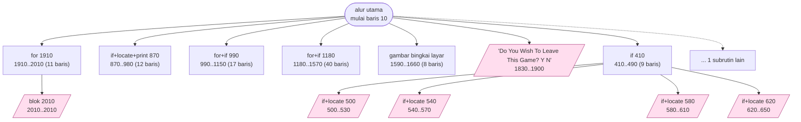
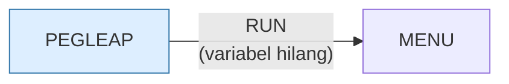

# PEGLEAP.BAS — Peg Leap

> Menu #1 pilihan C. Papan digambar dengan karakter garis CP437.

| | |
|---|---|
| Sumber | Friendlyware PC Introductory Set |
| Tahun | 1982 |
| Panjang | 202 baris (nomor 10–2010) |
| Subrutin | 13, dipanggil dari 22 tempat |
| Percabangan | 9 `GOTO`, 22 `GOSUB`, 14 target `ON…` |
| Komentar | 2% dari baris |
| Jalankan | `run\PEGLEAP.bat` |

## Peta arsitektur

*Diagram di bawah ini bukan tafsiran — semuanya diturunkan langsung dari
kode: tiap panah adalah `GOSUB` yang benar-benar ada, tiap kotak adalah
blok antara sebuah entri dan `RETURN`-nya.*



Kotak bersudut miring berwarna = **penangan kejadian** (`ON KEY`/`ON ERROR`), yang dipanggil oleh interupsi, bukan oleh alur utama.

### Subrutin dan perannya

| Baris | Panjang | Dipanggil | Peran (diambil dari kode) |
|---|--:|--:|---|
| `2010`–`2010` | 1 baris | 9× | blok @2010 *(handler)* |
| `410`–`490` | 9 baris | 2× | if @410 |
| `500`–`530` | 4 baris | 1× | if+locate @500 *(handler)* |
| `540`–`570` | 4 baris | 1× | if+locate @540 *(handler)* |
| `580`–`610` | 4 baris | 1× | if+locate @580 *(handler)* |
| `620`–`650` | 4 baris | 1× | if+locate @620 *(handler)* |
| `870`–`980` | 12 baris | 1× | if+locate+print @870 |
| `990`–`1150` | 17 baris | 1× | for+if @990 |
| `1180`–`1570` | 40 baris | 1× | for+if @1180 |
| `1590`–`1660` | 8 baris | 1× | gambar bingkai layar |
| `1830`–`1900` | 8 baris | 1× | "Do You Wish To Leave This Game? <Y/N" *(handler)* |
| `1880`–`1900` | 3 baris | 1× | "Strike <F10> To Leave This Game" |
| `1910`–`2010` | 11 baris | 1× | for @1910 |

### Program lain yang dimuat



### Kejadian yang dijebak

- `ON KEY(1)` → baris 2010
- `ON KEY(10)` → baris 1830
- `ON KEY(11)` → baris 500
- `ON KEY(12)` → baris 540
- `ON KEY(13)` → baris 580
- `ON KEY(14)` → baris 620
- `ON KEY(2)` → baris 2010
- `ON KEY(3)` → baris 2010
- `ON KEY(4)` → baris 2010
- `ON KEY(5)` → baris 2010
- `ON KEY(6)` → baris 2010
- `ON KEY(7)` → baris 2010
- `ON KEY(8)` → baris 2010
- `ON KEY(9)` → baris 2010

### Perulangan utama

`GOTO` mundur terpanjang: dari baris **1560** kembali ke **40** — melingkupi 1520 nomor baris.
Itulah loop utama program ini; segala sesuatu di dalam rentang tersebut
dijalankan berulang.

### Data yang dipegang

| Array | Dipakai | Ditulis di baris |
|---|--:|---|
| `B` | 35× | 330, 680, 820, 1040, 1070, … |
| `T` | 28× | 70, 90, 100, 700, 730, … |

## Bagaimana program ini disusun

Peta kejadiannya mengungkap sesuatu yang tidak muncul di program Friendlyware
lain:

```basic
ON KEY(11) GOSUB 500     ' panah atas
ON KEY(12) GOSUB 540     ' panah kiri
ON KEY(13) GOSUB 580     ' panah kanan
ON KEY(14) GOSUB 620     ' panah bawah
```

Di GW-BASIC, `KEY(11)` sampai `KEY(14)` adalah **tombol panah**. Jadi program ini
tidak memeriksa tombol panah lewat `INKEY$` di dalam loop — ia **menjebaknya
sebagai interupsi**.

Perbedaan arsitekturalnya nyata. Dengan `INKEY$`, loop utama harus terus-menerus
bertanya "ada tombol?" dan menangani hasilnya. Dengan `ON KEY`, gerakan kursor
terjadi **di luar** alur utama, dan alur utama tinggal memeriksa hasilnya.

Itu pemrograman berbasis kejadian — pola yang sama dengan `addEventListener`
sekarang. Dan sama seperti sekarang, konsekuensinya adalah keadaan harus
dititipkan lewat variabel bersama, karena penangan tidak bisa mengembalikan nilai.

Papannya `T(9,9)` untuk salib 7×7, dan cara mengisinya adalah trik yang bagus:

```basic
50 IF (R-4)*(R-5)*(R-6)=0 THEN 80
```

Hasilnya nol **jika dan hanya jika** R adalah 4, 5, atau 6 — satu perkalian
menggantikan tiga perbandingan dan dua `OR`. Cepat, tapi butuh komentar yang
tidak ada.

## Yang menarik dari kodenya

Baris 50–80 adalah trik matematis terbaik di koleksi ini:

```basic
50 IF (R-4)*(R-5)*(R-6)=0 THEN 80
60 IF (C-4)*(C-5)*(C-6)=0 THEN 80
70 T(R,C)=-5:GOTO 100
80 IF (R-1)*(C-1)*(R-9)*(C-9)=0 THEN 70
```

Papan peg solitaire berbentuk salib: hanya baris 4–6 atau kolom 4–6 yang berisi
lubang. Alih-alih menulis `IF R=4 OR R=5 OR R=6`, penulisnya mengalikan
`(R-4)*(R-5)*(R-6)` — hasilnya nol **jika dan hanya jika** R adalah salah satu
dari ketiganya, karena salah satu faktornya akan jadi nol.

Baris 80 memakai teknik yang sama untuk tepi: hasilnya nol kalau R atau C
menyentuh pinggir (1 atau 9).

Ini elegan dan cepat — perkalian lebih murah daripada tiga perbandingan plus
dua `OR` di 8088. Tapi harus jujur: **butuh beberapa detik untuk dimengerti**,
dan tidak ada komentar yang membantu. Kalau kecepatan bukan soal, tiga
perbandingan yang membosankan lebih baik.

Yang jelas benar: papan `T(9,9)` untuk salib 7×7, sekali lagi dengan tepi
pembatas. Dan `PEG$="o":HOLE$=" "` di baris 20 — rupa papan dijadikan konstanta
bernama, jadi mengubah tampilan cukup satu baris.

## Yang bisa dipelajari

- `(x-a)*(x-b)*(x-c)=0` menguji keanggotaan dalam satu himpunan kecil tanpa `OR`. Kenali polanya saat membaca kode lama.
- Simpan karakter tampilan di konstanta bernama (`PEG$`, `HOLE$`), jangan sebar literalnya.

## Yang jangan ditiru

- Trik matematis tanpa komentar. Kalau kode Anda butuh satu kalimat penjelasan, tulislah kalimat itu.

## Lampiran

### Perkakas bahasa yang dipakai

`PLAY` — musik lewat bahasa makro not, `ON KEY(n) GOSUB` — jebakan tombol fungsi, `ON x GOSUB` — pemanggilan berindeks, `INKEY$` — baca tombol tanpa menunggu Enter, `RUN "nama"` — muat program lain, variabel hilang, `STRING$` — ulang satu karakter n kali, `LOCATE` — posisikan kursor, `COLOR` — warna teks

### Deklarasi array

```basic
DIM B(70),T(9,9)
```

### Sepuluh baris pembuka

```basic
10 SCREEN 0,0,0:COLOR 3,0:KEY OFF:GOSUB 1590:GOSUB 1910
15 ON KEY(10) GOSUB 1830
20 PEG$="o":HOLE$=" "
30 DIM B(70),T(9,9)
40 CLS:XLIN=1:XPOS=1:GOSUB 1880:FOR R=1 TO 9:FOR C=1 TO 9
50 IF (R-4)*(R-5)*(R-6)=0 THEN 80
60 IF (C-4)*(C-5)*(C-6)=0 THEN 80
70 T(R,C)=-5:GOTO 100
80 IF (R-1)*(C-1)*(R-9)*(C-9)=0 THEN 70
90 T(R,C)=5:READ XY(R,C)
```

---
[Dasar-dasar BASIC](00-DASAR-BASIC.md) · [Daftar review](README.md) · [Katalog koleksi](../README.md)
