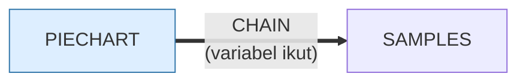

# PIECHART.BAS — IBM PC Piechart v1.10

> (C) IBM 1981, 1982.

| | |
|---|---|
| Sumber | Program contoh IBM Personal Computer |
| Tahun | 1982 |
| Panjang | 77 baris (nomor 940–1750) |
| Subrutin | 0, dipanggil dari 0 tempat |
| Percabangan | 16 `GOTO`, 0 `GOSUB`, 2 target `ON…` |
| Komentar | 6% dari baris |
| Jalankan | `run\PIECHART.bat` |

## Peta arsitektur

*Diagram di bawah ini bukan tafsiran — semuanya diturunkan langsung dari
kode: tiap panah adalah `GOSUB` yang benar-benar ada, tiap kotak adalah
blok antara sebuah entri dan `RETURN`-nya.*

Program ini **tidak punya satu pun subrutin** — seluruhnya alur lurus
dari atas ke bawah. Untuk program sekecil ini itu pilihan yang benar.

### Program lain yang dimuat



### Kejadian yang dijebak

- `ON ERROR` → baris 0, 1295

### Perulangan utama

`GOTO` mundur terpanjang: dari baris **1750** kembali ke **1680** — melingkupi 70 nomor baris.
Itulah loop utama program ini; segala sesuatu di dalam rentang tersebut
dijalankan berulang.

### Data yang dipegang

| Array | Dipakai | Ditulis di baris |
|---|--:|---|
| `R` | 6× | 1520 |
| `A$` | 5× | — |

## Bagaimana program ini disusun

**Nol subrutin** untuk 77 baris. Seluruhnya alur lurus, dan untuk program yang
tugasnya "baca angka, gambar lingkaran" itu memang tidak butuh struktur.

Yang layak dipelajari ada di penanganan galatnya:

```basic
1296 PRINT "THIS PROGRAM REQUIRES ADVANCED BASIC -- USE COMMAND 'BASICA'"
```

Bandingkan empat sikap berbeda terhadap masalah yang sama di koleksi ini:

| Program | Sikap |
|---|---|
| `INTRO.BAS` | semua galat → keluar diam-diam |
| `15PUZZLE.BAS` | deteksi, beri tahu, tetap lanjut |
| `MENU.BAS` | tangani satu galat spesifik, lepaskan sisanya |
| **`PIECHART.BAS`** | **beri tahu masalahnya + perintah persis untuk memperbaikinya** |

"USE COMMAND 'BASICA'" — bukan "fitur tidak tersedia", bukan "galat 73".
Kalimat yang bisa langsung dijalankan pemakai. Ini standar yang masih pantas
dikejar sekarang: **pesan galat harus menyebutkan tindakan, bukan gejala.**

Grafiknya lugas: `CIRCLE` dengan sudut awal dan akhir untuk tiap potongan, lalu
`PAINT` untuk mengisi. `R(100)` menampung nilai, `A$(100)` labelnya.

## Yang menarik dari kodenya

Program IBM resmi, hanya 77 baris, tapi memuat contoh sempurna **pesan galat
yang berguna**:

```basic
1296 PRINT "THIS PROGRAM REQUIRES ADVANCED BASIC -- USE COMMAND 'BASICA'":COLOR 15,0,0:FOR I=1 TO 9000:NEXT: RESUME 1298
```

Bandingkan dengan tiga cara lain menangani hal yang sama di koleksi ini:

- `INTRO.BAS`: semua galat → keluar diam-diam. Pemakai tidak tahu apa-apa.
- `15PUZZLE.BAS`: mendeteksi, memberi tahu, tetap lanjut.
- Program ini: **memberi tahu apa masalahnya dan perintah persis untuk
  memperbaikinya.**

"USE COMMAND 'BASICA'" — bukan "fitur tidak tersedia", bukan "galat 73".
Kalimat yang bisa langsung dijalankan pemakai. Ini standar yang masih pantas
dikejar sekarang.

Grafiknya sendiri lugas: `CIRCLE` untuk lingkaran dengan parameter sudut awal
dan akhir untuk tiap potongan, lalu `PAINT` untuk mengisinya. `R(100)` menampung
nilai dan `A$(100)` labelnya — sampai seratus potongan, yang jauh lebih banyak
daripada yang berguna di layar 320×200.

`FOR I=1 TO 9000:NEXT` sesudah pesan adalah jeda supaya pemakai sempat membaca.
Sekali lagi: penundaan berbasis cacah loop, dengan semua masalah yang menyertainya.

## Yang bisa dipelajari

- Pesan galat harus menyebutkan **tindakan** yang bisa diambil pemakai, bukan sekadar gejalanya.
- `CIRCLE` dengan sudut awal/akhir + `PAINT` sudah cukup untuk diagram lingkaran. Tidak perlu menghitung piksel sendiri.

## Yang jangan ditiru

- `FOR I=1 TO 9000:NEXT` sebagai jeda baca. Lebih baik minta pemakai menekan tombol — mereka yang menentukan kapan sudah selesai membaca.

## Lampiran

### Perkakas bahasa yang dipakai

`PLAY` — musik lewat bahasa makro not, `LINE` — menggambar garis & kotak, `CIRCLE`, `PAINT` — mengisi area tertutup, mode grafis CGA (`SCREEN 1`/`2`), `PEEK` — baca memori langsung, `DEF SEG` — pindah segmen memori, `ON ERROR GOTO` — penanganan galat, `ON x GOTO` — percabangan berindeks, `INKEY$` — baca tombol tanpa menunggu Enter, `CHAIN` — muat program lain, bawa variabel, `STRING$` — ulang satu karakter n kali, `LOCATE` — posisikan kursor, `COLOR` — warna teks

### Deklarasi array

```basic
DIM R(100),A$(100)
```

### Sepuluh baris pembuka

```basic
940 REM The IBM Personal Computer Piechart
950 REM Version 1.10 (C)Copyright IBM Corp 1981, 1982
960 REM Licensed Material - Program Property of IBM
975 DEF SEG
980 SAMPLES$="NO"
990 GOTO 1010
1000 SAMPLES$="YES"
1010 KEY OFF:SCREEN 0,1:COLOR 15,0,0:WIDTH 40:CLS:LOCATE 5,19:PRINT "IBM"
1020 LOCATE 7,12,0:PRINT "Personal Computer"
1030 COLOR 10,0:LOCATE 10,9,0:PRINT CHR$(213)+STRING$(21,205)+CHR$(184)
```

### Baris terpanjang (120 kolom)

```basic
1296 PRINT "THIS PROGRAM REQUIRES ADVANCED BASIC -- USE COMMAND 'BASICA'":COLOR 15,0,0:FOR I=1 TO 9000:NEXT: RESUME 1298
```

---
[Dasar-dasar BASIC](00-DASAR-BASIC.md) · [Daftar review](README.md) · [Katalog koleksi](../README.md)
