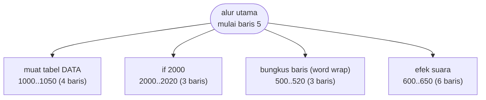
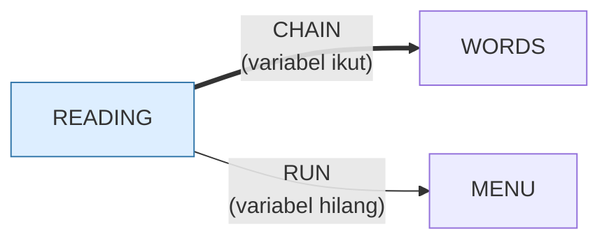

# READING.BAS — Tachistoscope (kecepatan baca)

> Menampilkan frasa sekejap, lalu meminta Anda mengetik apa yang terbaca.

| | |
|---|---|
| Sumber | Public domain / listing majalah lain-lain |
| Tahun | 1982 |
| Panjang | 39 baris (nomor 5–2020) |
| Subrutin | 4, dipanggil dari 4 tempat |
| Percabangan | 8 `GOTO`, 4 `GOSUB`, 1 target `ON…` |
| Komentar | 8% dari baris |
| Jalankan | `run\READING.bat` |

## Peta arsitektur

*Diagram di bawah ini bukan tafsiran — semuanya diturunkan langsung dari
kode: tiap panah adalah `GOSUB` yang benar-benar ada, tiap kotak adalah
blok antara sebuah entri dan `RETURN`-nya.*



Kotak bersudut miring berwarna = **penangan kejadian** (`ON KEY`/`ON ERROR`), yang dipanggil oleh interupsi, bukan oleh alur utama.

### Subrutin dan perannya

| Baris | Panjang | Dipanggil | Peran (diambil dari kode) |
|---|--:|--:|---|
| `500`–`520` | 3 baris | 1× | bungkus baris (word wrap) |
| `600`–`650` | 6 baris | 1× | efek suara |
| `1000`–`1050` | 4 baris | 1× | muat tabel DATA |
| `2000`–`2020` | 3 baris | 1× | if @2000 |

### Program lain yang dimuat



### Kejadian yang dijebak

- `ON ERROR` → baris 1050

### Perulangan utama

`GOTO` mundur terpanjang: dari baris **620** kembali ke **500** — melingkupi 120 nomor baris.
Itulah loop utama program ini; segala sesuatu di dalam rentang tersebut
dijalankan berulang.

## Bagaimana program ini disusun

Empat subrutin untuk 39 baris, tapi baris 74 adalah salah satu yang paling
penting di seluruh koleksi:

```basic
74 CHAIN MERGE "words", 75, ALL
```

`CHAIN MERGE` **menggabungkan program lain ke dalam program yang sedang
berjalan**, lalu melanjutkan di baris 75, dengan `ALL` berarti semua variabel
dipertahankan.

Jadi `WORDS.BAS` — yang isinya murni `DATA` daftar kata mulai baris 10000 —
disuntikkan ke sini **saat program berjalan**. Ini pemuatan modul dinamis, di
GW-BASIC, tahun 1982. Padanan modernnya `import()` di JavaScript atau
`importlib` di Python, dan alasannya sama: daftar kata bisa diganti tanpa
menyentuh program.

Yang membuatnya bekerja adalah **pembagian ruang nomor baris**: `READING`
memakai 5–75, `WORDS` memakai 10000 ke atas. Itu kontrak antarmodul, dan
satu-satunya yang mencegah keduanya saling menimpa. Tidak tertulis di mana pun.

Penyemaian acaknya juga jauh lebih baik daripada tetangganya:

```basic
75 XX=VAL(LEFT$(T$,2))*120+VAL(MID$(T$,4,2))*60+VAL(RIGHT$(T$,2)):RANDOMIZE XX
```

Jam, menit, dan detik digabung — puluhan ribu kemungkinan benih, bukan 60.

## Yang menarik dari kodenya

Program "tachistoscope" — menampilkan frasa sekejap lalu meminta Anda mengetik
apa yang terbaca. Hanya 39 baris, tapi baris 74 adalah salah satu yang paling
menarik di koleksi:

```basic
74 CHAIN MERGE "words", 75, ALL
```

`CHAIN MERGE` **menggabungkan program lain ke dalam program yang sedang
berjalan**, lalu melanjutkan di baris 75, dengan `ALL` berarti semua variabel
dipertahankan. Jadi `WORDS.BAS` — yang isinya murni `DATA` daftar kata mulai
dari baris 10000 — disuntikkan ke sini saat program berjalan.

Ini **pemuatan modul saat runtime**, di GW-BASIC, tahun 1982. Padanan modernnya
adalah `import()` dinamis di JavaScript atau `importlib` di Python. Dan
alasannya juga sama: daftar katanya bisa diganti tanpa menyentuh programnya.

Karena itulah `WORDS.BAS` memakai nomor baris 10000 ke atas — supaya tidak
bertabrakan dengan baris 5–75 milik `READING.BAS`. **Pembagian ruang nomor baris
adalah kontrak antarmodul di sini**, dan itu satu-satunya hal yang mencegah
keduanya saling menimpa.

Baris 75 menyemai pengacak dengan cara yang jauh lebih baik daripada tetangganya:

```basic
XX=VAL(LEFT$(T$,2))*120+VAL(MID$(T$,4,2))*60+VAL(RIGHT$(T$,2)):RANDOMIZE XX
```

Jam, menit, dan detik digabung — puluhan ribu kemungkinan benih, bukan 60.

## Yang bisa dipelajari

- `CHAIN MERGE` adalah pemuatan modul dinamis. Pisahkan data yang sering berubah ke berkas sendiri.
- Gabungkan jam+menit+detik untuk benih acak, jangan hanya detik.
- Kalau modul berbagi satu ruang nama (di sini nomor baris), tetapkan pembagian wilayahnya secara eksplisit.

## Yang jangan ditiru

- Kontrak ruang nomor baris yang tidak tertulis di mana pun. Kalau `WORDS.BAS` suatu saat dinomori ulang, keduanya rusak tanpa peringatan.

## Lampiran

### Perkakas bahasa yang dipakai

`PLAY` — musik lewat bahasa makro not, `ON ERROR GOTO` — penanganan galat, `ON x GOTO` — percabangan berindeks, `INKEY$` — baca tombol tanpa menunggu Enter, `CHAIN` — muat program lain, bawa variabel, `RUN "nama"` — muat program lain, variabel hilang, `RANDOMIZE` — menyemai pengacak, `DEFINT` — variabel default bilangan bulat, `DEFSTR` — variabel default teks, `STRING$` — ulang satu karakter n kali, `LOCATE` — posisikan kursor, `COLOR` — warna teks

### Sepuluh baris pembuka

```basic
5 REM This program is Reading
10 KEY OFF:WIDTH 80:CLS:DEFSTR C,R,S,Z:DEFINT I,L,T
20 LOCATE 1,27:COLOR 0,7:PRINT " ***** TACHISTOSCOPE *****";
30 LOCATE 3,10:COLOR 7,0:PRINT "This program is designed to improve your reading speed.";
40 LOCATE 5,10:PRINT "I will briefly display a short phase and you try and read it.";
50 LOCATE 7,10:PRINT "Type what you see, and I will tell you if you were right.";
70 COLOR 15: LOCATE 25,25:PRINT "press any key when you're ready";
74 CHAIN MERGE "words", 75, ALL
75 GOSUB 1000:T1=1000:T4=100:T$=TIME$:XX=VAL(LEFT$(T$,2))*120+VAL(MID$(T$,4,2))*60+VAL(RIGHT$(T$,2)):RANDOMIZE XX
78 C(1)="Right":C(2)="Correct":C(3)="Absolutely":C(4)="You're doing OK!":C(5)="I knew you'd get that one"
```

### Baris terpanjang (113 kolom)

```basic
75 GOSUB 1000:T1=1000:T4=100:T$=TIME$:XX=VAL(LEFT$(T$,2))*120+VAL(MID$(T$,4,2))*60+VAL(RIGHT$(T$,2)):RANDOMIZE XX
```

---
[Dasar-dasar BASIC](00-DASAR-BASIC.md) · [Daftar review](README.md) · [Katalog koleksi](../README.md)
