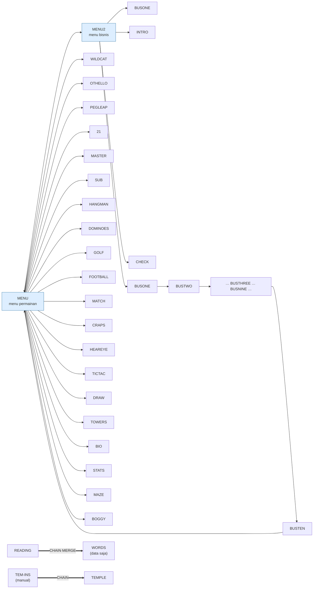

# Code review — 83 program BASIC

Tiap program punya satu berkas review. Isinya, berurutan:

1. **Peta arsitektur** — diagram Mermaid dari *call graph* yang sebenarnya,
   tabel subrutin beserta perannya, tabel dispatch, peta kejadian, loop utama,
   dan array mana yang jadi pusat program. Semuanya **diekstrak dari kode**,
   bukan ditafsirkan: tiap panah adalah `GOSUB` yang benar-benar ada.
2. **Bagaimana program ini disusun** — apa pola arsitekturnya, kenapa
   bentuknya begitu, dan apa yang bisa dibawa ke pemrograman sekarang.
3. **Yang menarik dari kodenya**, **yang bisa dipelajari**, **yang jangan
   ditiru**.

**Baca [00-DASAR-BASIC.md](00-DASAR-BASIC.md) lebih dulu** kalau Anda belum
pernah menyentuh BASIC era 1980-an.

---

## Peta ketergantungan antarprogram

Program mana memuat program mana (`RUN` / `CHAIN`). Ini struktur disket
Friendlyware, dan sekaligus penjelasan kenapa `run\` harus tetap rata.

Panah tebal (`==>`) = `CHAIN`, variabel ikut menyeberang. Panah biasa =
`RUN`, seluruh variabel hilang.

---

## Urutan baca yang disarankan

Disusun menurut **pola arsitektur**, bukan menurut abjad atau ukuran.
Kalau tujuan Anda belajar, ikuti urutan ini.

### 1 · Bentuk paling dasar: tanpa struktur sama sekali

- [`GERMFOLK.BAS`](GERMFOLK.md) — 10 baris, nol percabangan — konfigurasi lalu isi
- [`DREAM.BAS`](DREAM.md) — data-sebagai-program: frasa disimpan, lalu disusun
- [`OCTAVE.BAS`](OCTAVE.md) — satu rumus, satu loop, dan kenapa loop tanpa jalan keluar itu buruk
- [`WORDS.BAS`](WORDS.md) — berkas tanpa kode sama sekali — dan urutannya membawa kurikulum
- [`WHATMONF.BAS`](WHATMONF.md) — empat baris, dan salah: kode yang tidak pernah diuji

### 2 · Memecah program: kapan dan kenapa

- [`BREAKOUT.BAS`](BREAKOUT.md) — **satu** subrutin untuk 164 baris — teknik yang tepat menghapus kebutuhan struktur
- [`HISTORY.BAS`](HISTORY.md) — 4 subrutin untuk 351 baris — jangan memecah yang tidak dipakai ulang
- [`ATTACK.BAS`](ATTACK.md) — subrutin yang dipanggil sekali, murni untuk memberi nama
- [`ABM2A.BAS`](ABM2A.md) — nol panah antar-subrutin: inlining manual demi kecepatan
- [`DOMINOES.BAS`](DOMINOES.md) — 46 subrutin — dan kenapa struktur bagus tetap gagal tanpa nama

### 3 · Tabel dispatch: `switch` sebelum ada `switch`

- [`HANGMAN.BAS`](HANGMAN.md) — **mulai dari sini** — tiap bagian tubuh satu rutin, `ON CHANCE GOTO` menyambungnya
- [`BLACK.BAS`](BLACK.md) — `ON CARD+1 GOSUB` dengan 14 cabang = tabel penggambar kartu
- [`LANDER.BAS`](LANDER.md) — 13 cabang untuk 13 sudut kemiringan — rotasi sebagai pencarian tabel
- [`MAXIT1.BAS`](MAXIT1.md) — `ON 2+SGN(S2-S1)` — ubah perbandingan jadi indeks
- [`SUB.BAS`](SUB.md) — indeks acak: tujuh perilaku tanpa logika kecerdasan
- [`ELIZA.BAS`](ELIZA.md) — 44 cabang, 29 tujuan — tabel pengiriman skala penuh

### 4 · Pemrograman berbasis kejadian

- [`XWING.BAS`](XWING.md) — menembak dan bermanuver sebagai interupsi — input terpisah dari simulasi
- [`PEGLEAP.BAS`](PEGLEAP.md) — `KEY(11)`–`KEY(14)` = tombol panah dijebak sebagai kejadian
- [`BIO.BAS`](BIO.md) — menjebak tombol untuk **mematikannya** — `preventDefault` versi 1982
- [`DRAW.BAS`](DRAW.md) — enam tombol, enam mode, dan kenapa program bermodus harus menunjukkan modusnya

### 5 · Struktur data yang menentukan bentuk program

- [`STARTREK.BAS`](STARTREK.md) — dua array berbentuk sama: dunia nyata vs pengetahuan pemain (*fog of war*)
- [`LIFE2.BAS`](LIFE2.md) — double buffering — dan kenapa tanpa itu hasilnya bukan Game of Life
- [`SOLITAIR.BAS`](SOLITAIR.md) — dua penunjuk per tumpukan = inti pemodelan solitaire
- [`YAHTZEE.BAS`](YAHTZEE.md) — tabel frekuensi menggantikan belasan pemeriksaan bersarang
- [`TICTAC.BAS`](TICTAC.md) — delapan garis kemenangan dipraberhitung jadi satu daftar rata
- [`HIQUE2.BAS`](HIQUE2.md) — logika dipindahkan ke tabel, kodenya jadi tipis
- [`OTHELLO.BAS`](OTHELLO.md) — delapan arah sebagai data, bukan delapan blok kode
- [`SUB.BAS`](SUB.md) — ruang 3D diratakan jadi array 1D
- [`MATCH.BAS`](MATCH.md) — pemain sebagai **indeks**, bukan variabel bernomor

### 6 · Modul, overlay, dan memuat kode lain

- [`BUSONE.BAS`](BUSONE.md) — overlay: nenek moyang *code splitting*
- [`READING.BAS`](READING.md) — `CHAIN MERGE` — pemuatan modul saat runtime, tahun 1982
- [`MORTGAGE.BAS`](MORTGAGE.md) — nomor baris sebagai antarmuka publik + dua pintu masuk
- [`HEAREYE.BAS`](HEAREYE.md) — dua pintu masuk ke satu blok = argumen opsional
- [`INTEGRAT.BAS`](INTEGRAT.md) — callback berupa rentang nomor baris yang dicadangkan
- [`WRTSTR.BAS`](WRTSTR.md) — generator data: praberhitungan dipindah ke *waktu pembuatan*
- [`ELIZA.BAS`](ELIZA.md) — aturan di berkas data, mesin di program
- [`MENU.BAS`](MENU.md) — peta seluruh disket dalam 41 baris

### 7 · Menangani galat dan masukan

- [`MENU.BAS`](MENU.md) — tangani satu galat spesifik, lalu **lepaskan** sisanya
- [`PIECHART.BAS`](PIECHART.md) — pesan galat yang menyebutkan perintah perbaikannya
- [`INTRO.BAS`](INTRO.md) — kebalikannya: semua galat ditelan tanpa dicatat
- [`CHECK.BAS`](CHECK.md) — bercabang berdasarkan **lokasi** kode — jangan pernah
- [`15PUZZLE.BAS`](15PUZZLE.md) — deteksi kemampuan dengan mencobanya, lalu tutup penangkapnya
- [`TOWERS.BAS`](TOWERS.md) — buat masukan tak sah **tidak mungkin dinyatakan**
- [`STATS.BAS`](STATS.md) — deteksi prasyarat dari isi, bukan dari pertanyaan
- [`MASTER.BAS`](MASTER.md) — enam kondisi dalam satu `IF` — dan cara membelahnya

### 8 · Keacakan: tiga cara benar, satu sia-sia

- [`METEOR.BAS`](METEOR.md) — aduk benih selagi menunggu pemain — entropi dari waktu reaksi
- [`READING.BAS`](READING.md) — gabungkan jam+menit+detik
- [`WILDCAT.BAS`](WILDCAT.md) — `RANDOMIZE` dua kali dari sumber yang sama — **tidak menambah apa pun**
- [`BLACKJCK.BAS`](BLACKJCK.md) — hanya detik: 60 kemungkinan benih

### 9 · Ketika program tumbuh melampaui strukturnya

- [`TEMPLE.BAS`](TEMPLE.md) — 1187 baris, 255 `GOTO`, 20 tabel dispatch — hanya lapisan input yang sempat diabstraksi
- [`WIZARD.BAS`](WIZARD.md) — 944 baris, tapi tak satu pun melebihi 78 kolom
- [`BATSHIP.BAS`](BATSHIP.md) — subrutin sepanjang 224 baris — bab, bukan fungsi
- [`MENU2.BAS`](MENU2.md) — 66 subrutin di berkas yang namanya 'menu'
- [`FOOTBALL.BAS`](FOOTBALL.md) — rutin kembar untuk dua tim = parameter yang belum diangkat

### 10 · Kinerja: menukar keterbacaan dengan kecepatan

- [`MAZE.BAS`](MAZE.md) — `POKE` langsung ke memori layar, dan bagaimana itu membentuk sisa program
- [`BREAKOUT.BAS`](BREAKOUT.md) — `PUT ... XOR`: gerak tanpa kedip, tanpa menyimpan latar
- [`FLYS.BAS`](FLYS.md) — aset dibangun di fase persiapan, loop tinggal memakai
- [`SPACE.BAS`](SPACE.md) — seluruh alur pembuatan sprite dalam satu baris
- [`BOWLING.BAS`](BOWLING.md) — layar sebagai struktur data — cepat, dan **salah**

### 11 · Kode yang ditulis untuk dibaca orang lain

- [`METEOR.BAS`](METEOR.md) — 32% komentar karena akan dicetak di majalah
- [`DROIDS.BAS`](DROIDS.md) — delapan subrutin, delapan nama — baca kolom nama, paham seluruh permainan
- [`LIFE2.BAS`](LIFE2.md) — komentar yang menjelaskan **kenapa**, bukan **apa**
- [`CURVE.BAS`](CURVE.md) — sengaja dibuat datar karena targetnya kertas
- [`NOTETABL.BAS`](NOTETABL.md) — 1990: nama huruf kecil, indentasi, `OPTION BASE 1`
- [`MAXIT1.BAS`](MAXIT1.md) — komentar yang merangkap tanda tangan fungsi

---

## Daftar lengkap menurut abjad

| Program | Judul | Thn | Baris | Subrutin | Panah | Dispatch | `GOTO` |
|---|---|---|--:|--:|--:|--:|--:|
| [`15PUZZLE.BAS`](15PUZZLE.md) | The 15 Puzzle | 1982 | 117 | 4 | 1 | 0 | 13 |
| [`21.BAS`](21.md) | Blackjack | 1982 | 336 | 17 | 2 | 0 | 39 |
| [`ABM2A.BAS`](ABM2A.md) | ABM 2 (Anti-Ballistic Missile) | 1982 | 231 | 6 | 0 | 1 | 39 |
| [`ANATOMY.BAS`](ANATOMY.md) | Tutorial anatomi tubuh | 1982 | 159 | 14 | 20 | 0 | 12 |
| [`ATTACK.BAS`](ATTACK.md) | Attack v1.1 | 1982 | 204 | 8 | 1 | 0 | 17 |
| [`BACKGAM.BAS`](BACKGAM.md) | Backgammon | 1986 | 161 | 7 | 3 | 2 | 35 |
| [`BATSHIP.BAS`](BATSHIP.md) | Battleship | 1982 | 544 | 8 | 3 | 11 | 95 |
| [`BIO.BAS`](BIO.md) | Biorhythm pribadi | 1982 | 169 | 13 | 1 | 0 | 11 |
| [`BJ.BAS`](BJ.md) | Blackjack (versi ringkas) | 1980 | 218 | 16 | 12 | 3 | 31 |
| [`BLACK.BAS`](BLACK.md) | Blackjack (1-2 pemain) | 1982 | 396 | 27 | 14 | 2 | 16 |
| [`BLACKJCK.BAS`](BLACKJCK.md) | CCII Blackjack | 1978 | 282 | 24 | 10 | 2 | 64 |
| [`BOGGY.BAS`](BOGGY.md) | Boggy Marsh | 1982 | 101 | 5 | 0 | 0 | 12 |
| [`BOWLING.BAS`](BOWLING.md) | Bowling Champ | 1986 | 75 | 8 | 2 | 2 | 5 |
| [`BREAKOUT.BAS`](BREAKOUT.md) | Spinout (Breakout) | 1982 | 164 | 1 | 0 | 0 | 27 |
| [`BUSEIGHT.BAS`](BUSEIGHT.md) | Business Simulation, bagian 8 | 1982 | 102 | 9 | 0 | 0 | 1 |
| [`BUSFIVE.BAS`](BUSFIVE.md) | Business Simulation, bagian 5 | 1982 | 110 | 7 | 0 | 0 | 1 |
| [`BUSFOUR.BAS`](BUSFOUR.md) | Business Simulation, bagian 4 | 1982 | 66 | 4 | 0 | 0 | 2 |
| [`BUSNINE.BAS`](BUSNINE.md) | Business Simulation, bagian 9 | 1982 | 53 | 7 | 0 | 0 | 1 |
| [`BUSONE.BAS`](BUSONE.md) | Business Simulation, bagian 1 | 1982 | 138 | 14 | 0 | 0 | 1 |
| [`BUSSEVEN.BAS`](BUSSEVEN.md) | Business Simulation, bagian 7 | 1982 | 102 | 8 | 0 | 0 | 1 |
| [`BUSSIX.BAS`](BUSSIX.md) | Business Simulation, bagian 6 | 1982 | 102 | 11 | 0 | 0 | 1 |
| [`BUSTEN.BAS`](BUSTEN.md) | Business Simulation, bagian 10 | 1982 | 54 | 4 | 0 | 0 | 2 |
| [`BUSTHREE.BAS`](BUSTHREE.md) | Business Simulation, bagian 3 | 1982 | 125 | 13 | 0 | 0 | 1 |
| [`BUSTWO.BAS`](BUSTWO.md) | Business Simulation, bagian 2 | 1982 | 59 | 4 | 0 | 0 | 1 |
| [`CHECK.BAS`](CHECK.md) | Buku Cek / Check Book Register | 1982 | 65 | 8 | 1 | 0 | 6 |
| [`CRAPS.BAS`](CRAPS.md) | Nevada Dice (Craps) | 1982 | 254 | 14 | 3 | 1 | 31 |
| [`CRAZY8.BAS`](CRAZY8.md) | Crazy Eights | 1986 | 294 | 5 | 0 | 0 | 8 |
| [`CURVE.BAS`](CURVE.md) | Curve - regresi kuadrat terkecil | 1982 | 89 | 3 | 0 | 0 | 10 |
| [`DOMINOES.BAS`](DOMINOES.md) | Domino | 1982 | 387 | 46 | 25 | 4 | 77 |
| [`DRAW.BAS`](DRAW.md) | You Draw It (menggambar) | 1982 | 287 | 23 | 21 | 0 | 30 |
| [`DREAM.BAS`](DREAM.md) | Dream (musik) | 1984 | 18 | 0 | 0 | 0 | 0 |
| [`DROIDS.BAS`](DROIDS.md) | Droids | 1986 | 183 | 8 | 2 | 0 | 26 |
| [`ELIZA.BAS`](ELIZA.md) | Eliza v3.0 | 1981 | 514 | 82 | 60 | 47 | 121 |
| [`FLYS.BAS`](FLYS.md) | Flys (pukul lalat) | 1985 | 180 | 3 | 0 | 0 | 3 |
| [`FOOTBALL.BAS`](FOOTBALL.md) | Head Coach (football) | 1982 | 345 | 29 | 4 | 0 | 53 |
| [`GERMFOLK.BAS`](GERMFOLK.md) | Lagu rakyat Jerman | 1990 | 10 | 0 | 0 | 0 | 0 |
| [`GOLF.BAS`](GOLF.md) | PC Golf | 1982 | 361 | 29 | 10 | 3 | 39 |
| [`HANGMAN.BAS`](HANGMAN.md) | Hangman | 1983 | 217 | 21 | 25 | 1 | 7 |
| [`HEAREYE.BAS`](HEAREYE.md) | Tes Mata & Pendengaran | 1982 | 117 | 5 | 1 | 0 | 3 |
| [`HINTS.BAS`](HINTS.md) | Layar bantuan / petunjuk | 1982 | 132 | 4 | 0 | 0 | 1 |
| [`HIQUE2.BAS`](HIQUE2.md) | Hique (peg solitaire) | 1986 | 142 | 3 | 0 | 0 | 19 |
| [`HISTORY.BAS`](HISTORY.md) | Evolusi Ukuran Komputer | 1982 | 351 | 4 | 0 | 0 | 1 |
| [`INTEGRAT.BAS`](INTEGRAT.md) | Integrate - aturan Simpson | 1982 | 42 | 2 | 0 | 0 | 2 |
| [`INTRO.BAS`](INTRO.md) | Pengantar Komputer | 1982 | 23 | 1 | 0 | 0 | 2 |
| [`KENO.BAS`](KENO.md) | PC Keno | 1984 | 137 | 1 | 0 | 0 | 8 |
| [`LANDER.BAS`](LANDER.md) | Lunar Lander v1.0 | 1982 | 399 | 20 | 5 | 6 | 48 |
| [`LIFE2.BAS`](LIFE2.md) | Game of Life (Conway) | 1983 | 188 | 13 | 4 | 0 | 20 |
| [`MASTER.BAS`](MASTER.md) | Mastermind | 1982 | 137 | 6 | 0 | 0 | 11 |
| [`MATCH.BAS`](MATCH.md) | Match (permainan ingatan) | 1982 | 369 | 23 | 12 | 0 | 24 |
| [`MAXIT1.BAS`](MAXIT1.md) | The Game of Maxit | 1982 | 145 | 14 | 7 | 2 | 9 |
| [`MAZE.BAS`](MAZE.md) | Killer Maze | 1982 | 305 | 40 | 27 | 2 | 11 |
| [`MENU.BAS`](MENU.md) | Friendlyware Menu #1 | 1982 | 41 | 2 | 1 | 0 | 3 |
| [`MENU2.BAS`](MENU2.md) | Friendlyware Menu #2 | 1982 | 642 | 66 | 60 | 0 | 92 |
| [`METEOR.BAS`](METEOR.md) | Meteor | 1981 | 80 | 6 | 2 | 0 | 6 |
| [`MORTGAGE.BAS`](MORTGAGE.md) | IBM PC Mortgage v1.00 | 1982 | 204 | 3 | 0 | 0 | 31 |
| [`MUSIC.BAS`](MUSIC.md) | IBM PC Music v1.10 | 1982 | 210 | 1 | 0 | 0 | 22 |
| [`MUSIC1.BAS`](MUSIC1.md) | IBM PC Music v1.10 (duplikat) | 1984 | 210 | 1 | 0 | 0 | 22 |
| [`NOTETABL.BAS`](NOTETABL.md) | Tabel nada / frekuensi | 1990 | 26 | 0 | 0 | 0 | 0 |
| [`OCTAVE.BAS`](OCTAVE.md) | Demo satu oktaf | 1990 | 6 | 0 | 0 | 0 | 1 |
| [`OTHELLO.BAS`](OTHELLO.md) | Othello | 1982 | 248 | 10 | 4 | 0 | 21 |
| [`PEGLEAP.BAS`](PEGLEAP.md) | Peg Leap | 1982 | 202 | 13 | 5 | 0 | 9 |
| [`PIECHART.BAS`](PIECHART.md) | IBM PC Piechart v1.10 | 1982 | 77 | 0 | 0 | 0 | 16 |
| [`READING.BAS`](READING.md) | Tachistoscope (kecepatan baca) | 1982 | 39 | 4 | 0 | 0 | 8 |
| [`SERPENT.BAS`](SERPENT.md) | Serpent v00 | 1982 | 64 | 1 | 0 | 0 | 15 |
| [`SIMEQN.BAS`](SIMEQN.md) | Pemecah persamaan linear serentak | 1982 | 50 | 2 | 0 | 0 | 3 |
| [`SOLITAIR.BAS`](SOLITAIR.md) | Klondyke Solitaire | 1984 | 313 | 18 | 7 | 0 | 29 |
| [`SPACE.BAS`](SPACE.md) | IBM PC Space v1.10 | 1982 | 57 | 0 | 0 | 0 | 15 |
| [`STARTREK.BAS`](STARTREK.md) | Star Trek | 1981 | 508 | 14 | 2 | 7 | 92 |
| [`STATS.BAS`](STATS.md) | Sports Predicting | 1982 | 449 | 25 | 13 | 0 | 47 |
| [`SUB.BAS`](SUB.md) | Sea Battle (kapal selam) | 1982 | 317 | 19 | 6 | 3 | 22 |
| [`TEM-INS.BAS`](TEM-INS.md) | Temple of Loth - petunjuk | 2000 | 290 | 0 | 0 | 0 | 26 |
| [`TEMPLE.BAS`](TEMPLE.md) | The Temple of Loth v4.2 | 1995 | 1187 | 19 | 2 | 20 | 255 |
| [`TICTAC.BAS`](TICTAC.md) | Tic Tac Toe | 1982 | 141 | 10 | 6 | 2 | 28 |
| [`TOWERS.BAS`](TOWERS.md) | Towers of Atlantis (Menara Hanoi) | 1982 | 131 | 8 | 0 | 0 | 12 |
| [`TRUCKER.BAS`](TRUCKER.md) | Trucker | 1982 | 385 | 20 | 6 | 3 | 31 |
| [`WHATMONF.BAS`](WHATMONF.md) | Deteksi jenis monitor | 1990 | 4 | 0 | 0 | 0 | 0 |
| [`WILDCAT.BAS`](WILDCAT.md) | Wildcatter (pengeboran minyak) | 1982 | 296 | 9 | 3 | 0 | 19 |
| [`WIZARD.BAS`](WIZARD.md) | The Wizard's Castle | 1980 | 944 | 18 | 0 | 18 | 224 |
| [`WORDS.BAS`](WORDS.md) | Words | 1990 | 36 | 0 | 0 | 0 | 0 |
| [`WRTSTR.BAS`](WRTSTR.md) | Penulis STRINGS.FIL | 1982 | 17 | 0 | 0 | 0 | 0 |
| [`XWING.BAS`](XWING.md) | X-Wing Fighter (Star Pilot) | 1978 | 732 | 8 | 0 | 0 | 63 |
| [`YAHTZEE.BAS`](YAHTZEE.md) | Yatzee | 1980 | 612 | 18 | 3 | 4 | 58 |
| [`ZAP'EM.BAS`](ZAP'EM.md) | Zap'em v1B | 1982 | 137 | 7 | 4 | 0 | 17 |

**Subrutin** = blok antara sebuah entri `GOSUB` dan `RETURN`-nya. 
**Panah** = pemanggilan antar-subrutin (bukan dari alur utama); makin banyak, 
makin berlapis arsitekturnya. **Dispatch** = jumlah `ON … GOTO/GOSUB`.

---

## Angka menarik dari seluruh koleksi

- **Paling terbagi** (subrutin terbanyak): `ELIZA.BAS` (82), `MENU2.BAS` (66), `DOMINOES.BAS` (46), `MAZE.BAS` (40), `FOOTBALL.BAS` (29)
- **Paling berlapis** (panah antar-subrutin): `ELIZA.BAS` (60), `MENU2.BAS` (60), `MAZE.BAS` (27), `DOMINOES.BAS` (25), `HANGMAN.BAS` (25)
- **Paling banyak tabel dispatch**: `ELIZA.BAS` (47), `TEMPLE.BAS` (20), `WIZARD.BAS` (18), `BATSHIP.BAS` (11), `STARTREK.BAS` (7)
- **Paling datar** (subrutin ≤1): `BREAKOUT.BAS`, `DREAM.BAS`, `GERMFOLK.BAS`, `INTRO.BAS`, `KENO.BAS`, `MUSIC.BAS`, `MUSIC1.BAS`, `NOTETABL.BAS`, `OCTAVE.BAS`, `PIECHART.BAS`, `SERPENT.BAS`, `SPACE.BAS`, `TEM-INS.BAS`, `WHATMONF.BAS`, `WORDS.BAS`, `WRTSTR.BAS`
- **Terpanjang**: `TEMPLE.BAS` (1187), `WIZARD.BAS` (944), `XWING.BAS` (732), `MENU2.BAS` (642), `YAHTZEE.BAS` (612)
- **Paling banyak `GOTO`**: `TEMPLE.BAS` (255), `WIZARD.BAS` (224), `ELIZA.BAS` (121), `BATSHIP.BAS` (95), `MENU2.BAS` (92)
- **Paling banyak komentar**: `BLACK.BAS` (37%), `METEOR.BAS` (32%), `YAHTZEE.BAS` (27%), `INTEGRAT.BAS` (21%), `WRTSTR.BAS` (18%)
- **Baris terpanjang**: `HANGMAN.BAS` (253 kolom), `ANATOMY.BAS` (250 kolom), `TEM-INS.BAS` (250 kolom), `BATSHIP.BAS` (247 kolom), `GOLF.BAS` (247 kolom)
- **Paling disiplin lebar barisnya**: `GERMFOLK.BAS` (37 kolom), `WHATMONF.BAS` (41 kolom), `OCTAVE.BAS` (49 kolom), `SIMEQN.BAS` (50 kolom), `NOTETABL.BAS` (51 kolom)

---

Katalog dan sejarah koleksi: [../README.md](../README.md)
