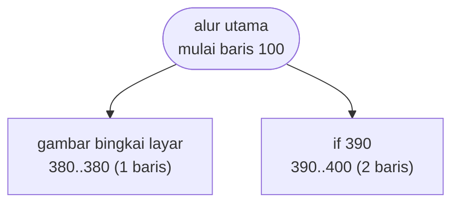

# SIMEQN.BAS — Pemecah persamaan linear serentak

> Phil Feldman & Tom Rugg. Eliminasi Gauss pada matriks augmented N x N+1.

| | |
|---|---|
| Sumber | Listing Feldman & Rugg, 1982 |
| Tahun | 1982 |
| Panjang | 50 baris (nomor 100–590) |
| Subrutin | 2, dipanggil dari 3 tempat |
| Percabangan | 3 `GOTO`, 3 `GOSUB`, 0 target `ON…` |
| Komentar | 8% dari baris |
| Jalankan | `run\SIMEQN.bat` |

## Peta arsitektur

*Diagram di bawah ini bukan tafsiran — semuanya diturunkan langsung dari
kode: tiap panah adalah `GOSUB` yang benar-benar ada, tiap kotak adalah
blok antara sebuah entri dan `RETURN`-nya.*



Kotak bersudut miring berwarna = **penangan kejadian** (`ON KEY`/`ON ERROR`), yang dipanggil oleh interupsi, bukan oleh alur utama.

### Subrutin dan perannya

| Baris | Panjang | Dipanggil | Peran (diambil dari kode) |
|---|--:|--:|---|
| `380`–`380` | 1 baris | 2× | gambar bingkai layar |
| `390`–`400` | 2 baris | 1× | if @390 |

### Perulangan utama

`GOTO` mundur terpanjang: dari baris **220** kembali ke **180** — melingkupi 40 nomor baris.
Itulah loop utama program ini; segala sesuatu di dalam rentang tersebut
dijalankan berulang.

### Data yang dipegang

| Array | Dipakai | Ditulis di baris |
|---|--:|---|
| `A` | 16× | 500, 520 |
| `R` | 10× | 530 |
| `V` | 6× | 400, 560, 590 |

## Bagaimana program ini disusun

Dua subrutin, keduanya sepele. **Seluruh eliminasi Gauss ada di alur utama**,
dalam 50 baris dengan lebar maksimum 50 kolom.

Seperti `CURVE.BAS` dan `INTEGRAT.BAS`, kedataran ini disengaja — headernya
menyatakan "Any BASIC, any CRT", dan program ini ditujukan untuk **diketik ulang
dari majalah**. Setiap `GOSUB` adalah satu nomor baris lagi yang bisa salah
ketik.

Yang layak dipelajari adalah bagaimana sistem tipe dipakai untuk menyatakan
peran:

```basic
150 CLEAR:CLS:DEFINT J,K,L,M,N
    DIM A(N,N),R(N),V(N)
```

`DEFINT J,K,L,M,N` menandai kelima huruf itu sebagai **indeks bilangan bulat** —
konvensi matematika (i, j, k untuk indeks) yang dipetakan ke sistem tipe BASIC.
Sementara `A`, `R`, `V` dibiarkan floating point karena berisi koefisien.

Jadi dengan melihat nama variabel saja Anda tahu perannya: huruf tengah abjad =
indeks, huruf lain = data. Ini penggunaan `DEFINT` yang **menyatakan maksud**,
bukan sekadar mengejar kecepatan — dan itu langka di koleksi ini.

`SWAP` yang muncul di sini juga bukan hiasan: eliminasi Gauss butuh *pivoting*,
menukar baris ketika elemen diagonalnya nol. Tanpa itu, program akan gagal
membagi nol pada matriks yang sebenarnya sah.

## Yang menarik dari kodenya

Lima puluh baris, **baris terpanjang cuma 50 kolom** — terpendek di koleksi —
dan menyelesaikan sistem persamaan linear dengan eliminasi Gauss.

Bagian dari trio Feldman & Rugg, dengan disiplin portabilitas yang sama:
hanya `BEEP`, `SWAP`, `DEFINT`, `STRING$`, dan `COLOR`. Tidak ada `LOCATE`,
tidak ada `PEEK`. Bisa diketik ulang di mesin mana pun.

`SWAP` di sini bukan hiasan — ia adalah bagian penting dari algoritmanya.
Eliminasi Gauss butuh *pivoting*: kalau elemen diagonal bernilai nol, barisnya
harus ditukar dengan baris di bawahnya yang tidak nol, kalau tidak akan terjadi
pembagian dengan nol. `SWAP` menyatakan pertukaran itu dalam satu kata.

```basic
150 CLEAR:CLS:DEFINT J,K,L,M,N
    DIM A(N,N),R(N),V(N)
```

`DEFINT J,K,L,M,N` menandai kelima huruf itu sebagai indeks bilangan bulat —
konvensi matematika (i, j, k untuk indeks) yang dipetakan ke sistem tipe BASIC.
Sementara `A`, `R`, `V` tetap floating point karena berisi koefisien.

Ini contoh langka di koleksi ini: **sistem tipe dipakai untuk menyatakan maksud**,
bukan sekadar untuk kecepatan.

## Yang bisa dipelajari

- Pakai `DEFINT` untuk huruf indeks (J–N) dan biarkan huruf data tetap pecahan. Tipe jadi menyatakan peran.
- Eliminasi Gauss butuh pivoting. Kalau implementasi Anda tidak menukar baris, ia akan gagal pada matriks yang sah.
- Baris 50 kolom di seluruh program membuktikan kode padat tidak harus panjang ke samping.

## Lampiran

### Perkakas bahasa yang dipakai

`BEEP`, `SWAP` — tukar isi dua variabel, `DEFINT` — variabel default bilangan bulat, `STRING$` — ulang satu karakter n kali, `COLOR` — warna teks

### Deklarasi array

```basic
DIM A(N,N),R(N),V(N)
```

### Sepuluh baris pembuka

```basic
100 REM: SIMEQN
110 REM: A simultaneous linear equation solver.
120 REM: COPYRIGHT 1982 Phil Feldman and Tom Rugg.
130 REM: Any BASIC, any CRT.
140 KEY OFF:SCREEN 0,0,0,0:WIDTH 40:COLOR 7,0,0
150 CLEAR:CLS:DEFINT J,K,L,M,N
160 PRINT TAB(5) "A SIMULTANEOUS LINEAR EQUATION"
170 PRINT TAB(17) "SOLVER"
180 PRINT
190 INPUT "Number of equations";N
```

---
[Dasar-dasar BASIC](00-DASAR-BASIC.md) · [Daftar review](README.md) · [Katalog koleksi](../README.md)
