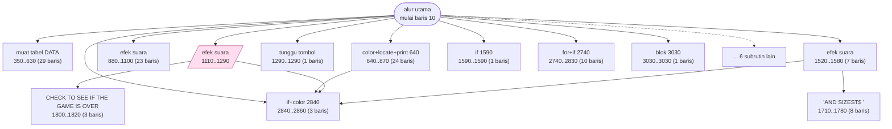

# SOLITAIR.BAS — Klondyke Solitaire

> Jeff Littlefield; simbol suit ditambah Ken Handzik 27 Nov 1983; direvisi 2 Feb 1984. 'For public use, may not be sold.'

| | |
|---|---|
| Sumber | Public domain / listing majalah lain-lain |
| Tahun | 1984 |
| Panjang | 313 baris (nomor 10–65399) |
| Subrutin | 18, dipanggil dari 31 tempat |
| Percabangan | 29 `GOTO`, 31 `GOSUB`, 1 target `ON…` |
| Komentar | 6% dari baris |
| Jalankan | `run\SOLITAIR.bat` |

## Peta arsitektur

*Diagram di bawah ini bukan tafsiran — semuanya diturunkan langsung dari
kode: tiap panah adalah `GOSUB` yang benar-benar ada, tiap kotak adalah
blok antara sebuah entri dan `RETURN`-nya.*



Kotak bersudut miring berwarna = **penangan kejadian** (`ON KEY`/`ON ERROR`), yang dipanggil oleh interupsi, bukan oleh alur utama.

### Subrutin dan perannya

| Baris | Panjang | Dipanggil | Peran (diambil dari kode) |
|---|--:|--:|---|
| `2840`–`2860` | 3 baris | 8× | if+color @2840 |
| `880`–`1100` | 23 baris | 2× | efek suara |
| `1290`–`1290` | 1 baris | 2× | tunggu tombol |
| `1520`–`1580` | 7 baris | 2× | efek suara |
| `1590`–`1590` | 1 baris | 2× | if @1590 |
| `2740`–`2830` | 10 baris | 2× | for+if @2740 |
| `3030`–`3030` | 1 baris | 2× | blok @3030 |
| `350`–`630` | 29 baris | 1× | muat tabel DATA |
| `640`–`870` | 24 baris | 1× | color+locate+print @640 |
| `1110`–`1290` | 19 baris | 1× | efek suara *(handler)* |
| `1460`–`1510` | 6 baris | 1× | if+for+locate @1460 |
| `1710`–`1780` | 8 baris | 1× | "AND SIZEST$=" |
| `1800`–`1820` | 3 baris | 1× | CHECK TO SEE IF THE GAME IS OVER |
| `2230`–`2270` | 5 baris | 1× | efek suara |

*(4 subrutin lain tidak ditampilkan)*

### Kejadian yang dijebak

- `ON KEY(1)` → baris 1110

### Perulangan utama

`GOTO` mundur terpanjang: dari baris **2670** kembali ke **300** — melingkupi 2370 nomor baris.
Itulah loop utama program ini; segala sesuatu di dalam rentang tersebut
dijalankan berulang.

### Data yang dipegang

| Array | Dipakai | Ditulis di baris |
|---|--:|---|
| `STACKPTR` | 26× | 520, 1390, 2040, 2120, 2200, … |
| `STACK$` | 17× | 490, 580 |
| `DECK$` | 15× | 430, 550, 1480, 2430 |
| `VISIPTR` | 15× | 530, 740, 2020, 2110 |
| `CARD$` | 5× | 390, 440 |
| `TOP$` | 5× | 610, 1580 |
| `XYARR$` | 5× | 2970 |

## Bagaimana program ini disusun

Delapan belas subrutin, tapi arsitektur sesungguhnya ada di struktur datanya:

```basic
DIM DECK$(52), STACK$(7,21), CARD$(52), TOP$(4), STACKPTR(7), VISIPTR(7)
```

Tujuh tumpukan, empat fondasi, dan — ini bagian pentingnya — **dua penunjuk per
tumpukan**:

| Array | Dibaca | Arti |
|---|--:|---|
| `STACKPTR` | 26× | berapa kartu total di tumpukan |
| `VISIPTR` | 15× | berapa yang terbuka |

Memisahkan keduanya adalah inti pemodelan solitaire. Tumpukan kartu biasa cuma
butuh satu penunjuk; solitaire butuh dua karena sebagian kartu tertutup. Semua
aturan permainan — kartu mana yang bisa dipindah, kapan kartu terbuka — turun
dari selisih dua angka itu.

`STACKPTR` dibaca 26 kali, paling sering di seluruh program. Menghitung berapa
kali sebuah struktur data disentuh adalah cara cepat menemukan **mana yang
sebenarnya jadi pusat program**.

Baris 10 menyembunyikan detail yang menyenangkan:

```basic
10 REM $LINESIZE:132
```

Itu **direktif kompiler** untuk IBM BASIC Compiler, yang membacanya dari dalam
komentar. Jadi berkas ini dirancang bisa dijalankan lewat interpreter *dan*
di-compile. Trik "komentar yang bermakna bagi perkakas" masih hidup di mana-mana:
`# type:` di Python, `/* eslint-disable */`, `// @ts-ignore`.

## Yang menarik dari kodenya

Klondike solitaire karya Jeff Littlefield, dengan **riwayat kontribusi
terlengkap di koleksi**:

```basic
40 REM     The Game of Klondyke Solitar
50 REM     By:  Jeff Littlefield
80 REM     FOR PUBLIC USE    MAY NOT BE SOLD
    Modified by Ken Handzik 11/27/83 to display card suits
    Revised by Jeff Littlefield 2/2/84 to give better instructions
```

Penulis asli, kontributor luar dengan tanggal dan **apa yang ia ubah**, lalu
penulis asli merevisi lagi. Ini riwayat commit dalam lima baris `REM`. Perhatikan
bahwa tiap entri menyebutkan *apa* yang berubah, bukan sekadar *bahwa* ada
perubahan — persis yang membedakan pesan commit yang baik dari "update".

Baris 10 juga menarik: `REM $LINESIZE:132`. Itu **direktif kompiler** untuk IBM
BASIC Compiler, yang membacanya dari dalam komentar. Jadi berkas ini dirancang
bisa dijalankan lewat interpreter *dan* di-compile. Trik "komentar yang bermakna
bagi perkakas" ini masih hidup di mana-mana sekarang: `# type:` di Python,
`/* eslint-disable */`, `// @ts-ignore`.

Struktur datanya adalah pemodelan solitaire yang benar:

```basic
DIM DECK$(52), STACK$(7,21), CARD$(52), TOP$(4), STACKPTR(7), VISIPTR(7)
```

Tujuh tumpukan, empat fondasi, dan **dua penunjuk per tumpukan**: `STACKPTR`
(berapa kartu total) dan `VISIPTR` (berapa yang terbuka). Memisahkan keduanya
adalah kunci — itu persis yang membedakan solitaire dari tumpukan kartu biasa.

## Yang bisa dipelajari

- Catat siapa mengubah apa dan kapan. Kalimat 'to display card suits' lebih berharga daripada tanggalnya.
- Dua penunjuk per tumpukan (jumlah total vs jumlah terbuka) adalah inti pemodelan solitaire.
- Komentar yang dibaca perkakas (`$LINESIZE`) adalah pola lama yang masih dipakai luas.

## Lampiran

### Perkakas bahasa yang dipakai

`PLAY` — musik lewat bahasa makro not, `SOUND` — nada mentah (frekuensi, durasi), `PSET`/`PRESET` — piksel tunggal, mode grafis CGA (`SCREEN 1`/`2`), `PEEK` — baca memori langsung, `DEF SEG` — pindah segmen memori, `ON KEY(n) GOSUB` — jebakan tombol fungsi, `ON x GOSUB` — pemanggilan berindeks, `INKEY$` — baca tombol tanpa menunggu Enter, `WHILE`/`WEND` — perulangan berkondisi, `RANDOMIZE` — menyemai pengacak, `DEFINT` — variabel default bilangan bulat, `LOCATE` — posisikan kursor, `COLOR` — warna teks

### Deklarasi array

```basic
DIM DECK$(52), STACK$(7,21),CARD$(52),TOP$(4),STACKPTR(7),VISIPTR(7),XYARR
```

### Sepuluh baris pembuka

```basic
10 REM $LINESIZE:132
20 REM ----------------------------------------------------------------------
30 REM
40 REM		 The Game of Klondyke Solitar
50 REM		 By:  Jeff Littlefield
60 REM		 For: the IBM PC and the Color Graphics Card
70 REM
80 REM		 FOR PUBLIC USE    MAY NOT BE SOLD
90 REM		 ALL  RIGHTS  RESERVED
100 REM
```

### Baris terpanjang (135 kolom)

```basic
940 LOCATE 8,3:PRINT "4. The Game can be claimed Victory when all cards are uncovered and":LOCATE 9,6:PRINT "no cards are in the pile."
```

---
[Dasar-dasar BASIC](00-DASAR-BASIC.md) · [Daftar review](README.md) · [Katalog koleksi](../README.md)
