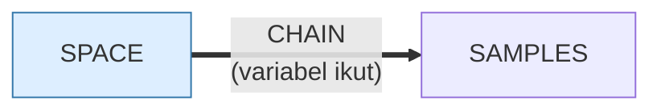

# SPACE.BAS — IBM PC Space v1.10

> (C) IBM 1981, 1982. Penulis R. Heiney & M. Hallerman.

| | |
|---|---|
| Sumber | Program contoh IBM Personal Computer |
| Tahun | 1982 |
| Panjang | 57 baris (nomor 940–1500) |
| Subrutin | 0, dipanggil dari 0 tempat |
| Percabangan | 15 `GOTO`, 0 `GOSUB`, 2 target `ON…` |
| Komentar | 12% dari baris |
| Jalankan | `run\SPACE.bat` |

## Peta arsitektur

*Diagram di bawah ini bukan tafsiran — semuanya diturunkan langsung dari
kode: tiap panah adalah `GOSUB` yang benar-benar ada, tiap kotak adalah
blok antara sebuah entri dan `RETURN`-nya.*

Program ini **tidak punya satu pun subrutin** — seluruhnya alur lurus
dari atas ke bawah. Untuk program sekecil ini itu pilihan yang benar.

### Program lain yang dimuat



### Kejadian yang dijebak

- `ON ERROR` → baris 0, 1295

### Perulangan utama

`GOTO` mundur terpanjang: dari baris **1150** kembali ke **1110** — melingkupi 40 nomor baris.
Itulah loop utama program ini; segala sesuatu di dalam rentang tersebut
dijalankan berulang.

## Bagaimana program ini disusun

**Nol subrutin** untuk 57 baris, dan salah satu baris terpadat di koleksi:

```basic
1430 CLS:CIRCLE(160,100),30,1,,,0.45:PAINT(160,100),1,1:DRAW"bm160,100e30bm160,100h30":LINE (130,100)-(190,100),2:GET(130,70)-(190,130),I
```

Baca berurutan, dan Anda melihat **alur pembuatan aset grafis** yang lengkap
dalam satu baris:

1. `CIRCLE(160,100),30,1,,,0.45` — lingkaran jari-jari 30. Parameter terakhir
   `0.45` adalah **rasio aspek**: piksel CGA tidak persegi, jadi tanpa koreksi
   ini "lingkaran" akan tampak lonjong.
2. `PAINT(160,100),1,1` — isi dari titik tengah sampai ketemu batas.
3. `DRAW "bm160,100e30..."` — pindah tanpa menggambar, lalu garis diagonal.
4. `LINE (130,100)-(190,100),2` — garis mendatar.
5. `GET(130,70)-(190,130),I` — **potret seluruh hasilnya ke array `I(800)`**.

Jadi objek dibangun dari primitif, lalu disimpan sebagai sprite yang bisa
di-`PUT` berkali-kali. **Gambar sekali, pakai berulang** — pemisahan fase
persiapan dari fase jalan, sama seperti `FLYS.BAS`.

Angka `0.45` layak diingat: monitor CGA 320×200 pada rasio 4:3 membuat piksel
lebih tinggi daripada lebar. Setiap program grafis era ini harus
memperhitungkannya.

## Yang menarik dari kodenya

Lima puluh tujuh baris, program IBM resmi karya R. Heiney dan M. Hallerman, dan
**nol `GOSUB`** — semuanya alur lurus dengan 15 `GOTO`.

Baris 1430 adalah demonstrasi padat seluruh sistem grafis CGA dalam satu baris:

```basic
1430 CLS:CIRCLE(160,100),30,1,,,0.45:PAINT(160,100),1,1:DRAW"bm160,100e30bm160,100h30":LINE (130,100)-(190,100),2:GET(130,70)-(190,130),I
```

Baca berurutan:
- `CIRCLE(160,100),30,1,,,0.45` — lingkaran jari-jari 30, tapi parameter terakhir
  `0.45` adalah **rasio aspek**, jadi yang tergambar adalah elips pipih. Piksel
  CGA tidak persegi, dan tanpa koreksi ini "lingkaran" akan tampak lonjong.
- `PAINT(160,100),1,1` — isi dari titik tengah sampai ketemu batas warna 1.
- `DRAW "bm160,100e30..."` — pindah tanpa menggambar (`bm`), lalu garis diagonal.
- `LINE (130,100)-(190,100),2` — garis mendatar.
- `GET(130,70)-(190,130),I` — **potret seluruh hasilnya ke array `I(800)`**.

Jadi satu baris membangun sebuah objek grafis dari primitif, lalu menyimpannya
sebagai sprite yang bisa di-`PUT` berkali-kali. Menggambar sekali, memakai
berulang.

`0.45` itu layak diingat: monitor CGA 320×200 pada rasio 4:3 membuat piksel
lebih tinggi daripada lebar. Setiap program grafis era ini harus
memperhitungkannya.

## Yang bisa dipelajari

- Parameter aspek pada `CIRCLE` mengoreksi piksel yang tidak persegi. Tanpa itu, lingkaran jadi lonjong.
- Bangun aset grafis dari primitif sekali, `GET` ke array, lalu `PUT` berulang. Jauh lebih cepat daripada menggambar ulang.

## Yang jangan ditiru

- Lima operasi grafis dalam satu baris tanpa komentar. Isinya bagus; penyajiannya menyembunyikan itu.

## Lampiran

### Perkakas bahasa yang dipakai

`PLAY` — musik lewat bahasa makro not, `DRAW` — bahasa makro menggambar garis, `GET`/`PUT` — sprite disalin ke/dari array, `LINE` — menggambar garis & kotak, `CIRCLE`, `PAINT` — mengisi area tertutup, mode grafis CGA (`SCREEN 1`/`2`), `PEEK` — baca memori langsung, `DEF SEG` — pindah segmen memori, `ON ERROR GOTO` — penanganan galat, `ON x GOTO` — percabangan berindeks, `INKEY$` — baca tombol tanpa menunggu Enter, `CHAIN` — muat program lain, bawa variabel, `DEFINT` — variabel default bilangan bulat, `STRING$` — ulang satu karakter n kali, `LOCATE` — posisikan kursor, `COLOR` — warna teks

### Deklarasi array

```basic
DIM I(800)
```

### Sepuluh baris pembuka

```basic
940 REM The IBM Personal Computer Space
950 REM Version 1.10 (C)Copyright IBM Corp 1981, 1982
960 REM Licensed Material - Program Property of IBM
970 REM Author - R. Heiney & M. Hallerman
975 DEF SEG
980 SAMPLES$="NO"
990 GOTO 1010
1000 SAMPLES$="YES"
1010 KEY OFF:SCREEN 0,1:COLOR 15,0,0:WIDTH 40:CLS:LOCATE 5,19:PRINT "IBM"
1020 LOCATE 7,12,0:PRINT "Personal Computer"
```

### Baris terpanjang (137 kolom)

```basic
1430 CLS:CIRCLE(160,100),30,1,,,0.45:PAINT(160,100),1,1:DRAW"bm160,100e30bm160,100h30":LINE (130,100)-(190,100),2:GET(130,70)-(190,130),I
```

---
[Dasar-dasar BASIC](00-DASAR-BASIC.md) · [Daftar review](README.md) · [Katalog koleksi](../README.md)
