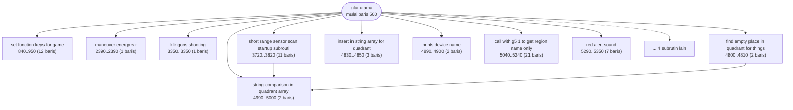
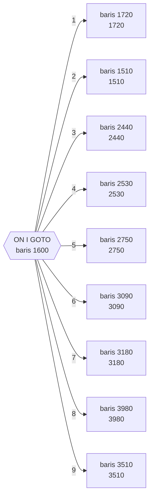
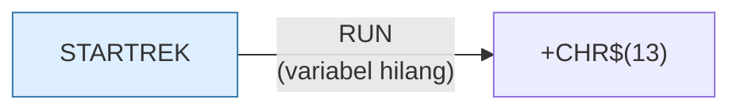

# STARTREK.BAS — Star Trek

> Dari 'BASIC Computer Games' karya Dave Ahl; diport ke IBM PC oleh Bob & Sharon Fritz, Okt-Nov 1981. Manual di docs/STARTREK.DOC.

| | |
|---|---|
| Sumber | Public domain / listing majalah lain-lain |
| Tahun | 1981 |
| Panjang | 508 baris (nomor 500–5570) |
| Subrutin | 14, dipanggil dari 48 tempat |
| Percabangan | 92 `GOTO`, 48 `GOSUB`, 55 target `ON…` |
| Komentar | 10% dari baris |
| Jalankan | `run\STARTREK.bat` |

## Peta arsitektur

*Diagram di bawah ini bukan tafsiran — semuanya diturunkan langsung dari
kode: tiap panah adalah `GOSUB` yang benar-benar ada, tiap kotak adalah
blok antara sebuah entri dan `RETURN`-nya.*



Kotak bersudut miring berwarna = **penangan kejadian** (`ON KEY`/`ON ERROR`), yang dipanggil oleh interupsi, bukan oleh alur utama.

### Subrutin dan perannya

| Baris | Panjang | Dipanggil | Peran (diambil dari kode) |
|---|--:|--:|---|
| `4830`–`4850` | 3 baris | 10× | insert in string array for quadrant |
| `840`–`950` | 12 baris | 7× | set function keys  for game |
| `4990`–`5000` | 2 baris | 6× | string comparison in quadrant array |
| `4890`–`4900` | 2 baris | 5× | prints device name |
| `3350`–`3350` | 1 baris | 4× | klingons shooting |
| `4800`–`4810` | 2 baris | 4× | find empty place in quadrant (for things) |
| `5040`–`5240` | 21 baris | 3× | call with g5=1 to get region name only |
| `2390`–`2390` | 1 baris | 2× | maneuver energy s/r |
| `5290`–`5350` | 7 baris | 2× | red alert sound |
| `3720`–`3820` | 11 baris | 1× | short range sensor scan & startup subroutine |
| `4810`–`4810` | 1 baris | 1× | blok @4810 |
| `5360`–`5410` | 6 baris | 1× | torpedo sound |
| `5420`–`5470` | 6 baris | 1× | phaser sound |
| `5480`–`5570` | 10 baris | 1× | alarm sound |

### Tabel dispatch

Program ini punya **7** percabangan berindeks (`ON … GOTO/GOSUB`).
Yang terbesar ada di baris 1600 dengan 9 cabang:



### Program lain yang dimuat



### Perulangan utama

`GOTO` mundur terpanjang: dari baris **4780** kembali ke **1520** — melingkupi 3260 nomor baris.
Itulah loop utama program ini; segala sesuatu di dalam rentang tersebut
dijalankan berulang.

### Data yang dipegang

| Array | Dipakai | Ditulis di baris |
|---|--:|---|
| `D` | 53× | 990, 1060, 1520, 1950, 2020, … |
| `K` | 39× | 1400, 1410, 1460, 1900, 1920, … |
| `C` | 34× | 1030, 1040, 1050 |
| `G` | 18× | 1150, 1170, 1180, 2720, 3060 |
| `N` | 11× | 2470, 2480 |
| `Z` | 8× | 1100, 1280, 2480, 2720, 3060, … |

## Bagaimana program ini disusun

Empat belas subrutin, tujuh tabel dispatch, dan **nama-nama yang menceritakan
seluruh permainan**:

| Baris | Dipanggil | Nama di kode |
|---|--:|---|
| 4830 | 10× | `insert in string array for quadrant` |
| 840 | 7× | `set function keys for game` |
| 4990 | 6× | `string comparison in quadrant array` |
| 4890 | 5× | `prints device name` |
| 4800 | 4× | `find empty place in quadrant (for things)` |
| 3350 | 4× | `klingons shooting` |
| 5040 | 3× | `call with g5=1 to get region name only` |

Perhatikan yang terakhir: **komentarnya mendokumentasikan parameternya**. "Panggil
dengan g5=1 untuk hanya mengambil nama wilayah" adalah dokumentasi API, ditulis
untuk `GOSUB` yang tidak punya parameter.

Struktur datanya adalah pelajaran utamanya:

```basic
DIM G(8,8), C(9,2), K(3,3), N(3), Z(8,8), D(8)
```

`G(8,8)` = galaksi sebenarnya. `Z(8,8)` = **peta yang sudah Anda kunjungi**.
Dua array berbentuk sama: satu berisi kebenaran, satu berisi pengetahuan pemain.

Itu *fog of war*, dan pemisahan "keadaan dunia" dari "keadaan yang diketahui
pemain" adalah pola yang masih dipakai di setiap game strategi. Tanpa pemisahan
itu, mekanik eksplorasi tidak mungkin ada.

`D(8)` menyimpan kerusakan delapan sistem kapal — indeks yang sama dipakai untuk
melaporkan kerusakan **dan** untuk memeriksa apakah sebuah perintah bisa
dijalankan. Satu sumber kebenaran, dua kegunaan.

## Yang menarik dari kodenya

Keturunan langsung dari Star Trek karya Mike Mayfield yang dipopulerkan lewat
*BASIC Computer Games* karangan Dave Ahl — program BASIC paling banyak diketik
ulang dalam sejarah. Versi ini diport ke IBM PC oleh Bob dan Sharon Fritz,
Oktober–November 1981, hanya beberapa bulan setelah PC dirilis.

Struktur datanya adalah inti permainan:

```basic
DIM G(8,8), C(9,2), K(3,3), N(3), Z(8,8), D(8)
```

`G(8,8)` adalah galaksi 8×8 kuadran; `Z(8,8)` adalah **peta yang sudah Anda
kunjungi**. Dua array dengan bentuk sama: satu berisi kebenaran, satu berisi
pengetahuan pemain. Itu *fog of war*, dan pemisahan "keadaan dunia" dari
"keadaan yang diketahui pemain" adalah pola yang masih dipakai di setiap game
strategi sampai sekarang.

`D(8)` menyimpan kerusakan delapan sistem kapal — indeks yang sama dipakai untuk
melaporkan kerusakan dan untuk memeriksa apakah sebuah perintah bisa dijalankan.

Antarmukanya memakai makro tombol fungsi:

```basic
860 KEY 2,"SRS"+CHR$(13)
870 KEY 3,"LRS"+CHR$(13)
```

Menekan F2 mengetikkan "SRS" dan Enter sekaligus. Jadi program tetap membaca
perintah teks — tidak ada penanganan tombol khusus sama sekali — tapi pemain
merasa menekan tombol. **Satu lapisan kenyamanan tanpa satu baris pun logika
tambahan.** Baris bantuan di dasar layar bahkan terisi otomatis oleh GW-BASIC.

Manual permainannya ada di `..\docs\STARTREK.DOC`.

## Yang bisa dipelajari

- Pisahkan **keadaan dunia** dari **pengetahuan pemain**. Dua array berbentuk sama, dan seluruh mekanik eksplorasi jadi mungkin.
- Makro `KEY n,"perintah"+CHR$(13)` memberi antarmuka tombol fungsi tanpa mengubah kode yang membaca perintah teks.
- Satu array status kerusakan yang diindeks sama dengan daftar sistem — satu sumber kebenaran untuk lapor dan untuk cek.

## Yang jangan ditiru

- 92 `GOTO` dalam 508 baris. Bahkan program legendaris pun mewarisi struktur dari BASIC 1971 yang belum punya `GOSUB` yang layak.

## Lampiran

### Perkakas bahasa yang dipakai

`PLAY` — musik lewat bahasa makro not, `SOUND` — nada mentah (frekuensi, durasi), `POKE` — tulis memori langsung, `USR`/`CALL` — panggil rutin bahasa mesin, `ON x GOTO` — percabangan berindeks, `RUN "nama"` — muat program lain, variabel hilang, `DEF FN` — fungsi buatan sendiri satu baris, `RANDOMIZE` — menyemai pengacak, `COLOR` — warna teks, `KEY n,"..."` — isi ulang label tombol fungsi

### Deklarasi array

```basic
DIM G(8,8),C(9,2),K(3,3),N(3),Z(8,8),D(8)
```

### Sepuluh baris pembuka

```basic
500 CLS
510 PLAY "mb"
520 REM
530 REM
540 REM ****       **** STAR TREK ****       ****
550 REM ****  Simulation of a mission of the starship ENTERPRISE
560 REM ****  as seen on the Star Trek tv show.
570 REM ****  Original program in Creative Computing
580 REM ****  Basic Computer Games by Dave Ahl.
590 REM ****  Modifications by Bob Fritz and Sharon Fritz
```

---
[Dasar-dasar BASIC](00-DASAR-BASIC.md) · [Daftar review](README.md) · [Katalog koleksi](../README.md)
