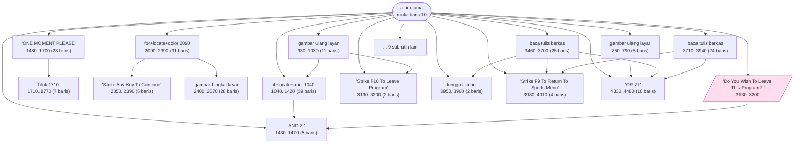
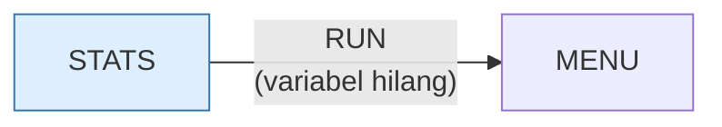

# STATS.BAS — Sports Predicting

> Menu #1 pilihan R. Juga meminta disket data yang bisa ditulis.

| | |
|---|---|
| Sumber | Friendlyware PC Introductory Set |
| Tahun | 1982 |
| Panjang | 449 baris (nomor 10–4490) |
| Subrutin | 25, dipanggil dari 39 tempat |
| Percabangan | 47 `GOTO`, 39 `GOSUB`, 6 target `ON…` |
| Komentar | 1% dari baris |
| Jalankan | `run\STATS.bat` |

## Peta arsitektur

*Diagram di bawah ini bukan tafsiran — semuanya diturunkan langsung dari
kode: tiap panah adalah `GOSUB` yang benar-benar ada, tiap kotak adalah
blok antara sebuah entri dan `RETURN`-nya.*



Kotak bersudut miring berwarna = **penangan kejadian** (`ON KEY`/`ON ERROR`), yang dipanggil oleh interupsi, bukan oleh alur utama.

### Subrutin dan perannya

| Baris | Panjang | Dipanggil | Peran (diambil dari kode) |
|---|--:|--:|---|
| `4330`–`4480` | 16 baris | 5× | "OR ZI>" |
| `1040`–`1420` | 39 baris | 3× | if+locate+print @1040 |
| `1430`–`1470` | 5 baris | 3× | "AND Z<>" |
| `3980`–`4010` | 4 baris | 3× | "Strike <F9> To Return To Sports Menu" |
| `1710`–`1770` | 7 baris | 2× | blok @1710 |
| `2350`–`2390` | 5 baris | 2× | "Strike Any Key To Continue" |
| `3190`–`3200` | 2 baris | 2× | "Strike <F10> To Leave Program" |
| `3950`–`3960` | 2 baris | 2× | tunggu tombol |
| `510`–`550` | 5 baris | 1× | "OR TEAM$(1)<>" |
| `750`–`790` | 5 baris | 1× | gambar ulang layar |
| `850`–`890` | 5 baris | 1× | "AND TEAM$(1)<>" |
| `920`–`920` | 1 baris | 1× | blok @920 |
| `930`–`1030` | 11 baris | 1× | gambar ulang layar |
| `1480`–`1700` | 23 baris | 1× | "ONE MOMENT PLEASE" |

*(11 subrutin lain tidak ditampilkan)*

### Program lain yang dimuat



### Kejadian yang dijebak

- `ON ERROR` → baris 0, 4030
- `ON KEY(10)` → baris 3130, 4490
- `ON KEY(9)` → baris 4010

### Perulangan utama

`GOTO` mundur terpanjang: dari baris **4000** kembali ke **3180** — melingkupi 820 nomor baris.
Itulah loop utama program ini; segala sesuatu di dalam rentang tersebut
dijalankan berulang.

### Data yang dipegang

| Array | Dipakai | Ditulis di baris |
|---|--:|---|
| `Z` | 61× | 730, 1000, 1560, 1630, 1650, … |
| `D` | 11× | — |
| `TEAMNAME$` | 9× | 3890 |
| `AVG!` | 8× | 2680, 2780, 2830 |
| `VALUE` | 3× | — |

## Bagaimana program ini disusun

25 subrutin, 13 panah, dan **tiga tombol berbeda dipetakan ke tiga penangan
berbeda** — F9 kembali ke menu olahraga, F10 keluar program, plus penangan galat.
Program dengan navigasi bertingkat.

Yang paling layak dipelajari ada di baris 30:

```basic
30 LOCATE 10,35:FILES"menu.bas"
40 IF F THEN 150
50 LOCATE 5,22:PRINT"You Must Use A Data Diskette With This Program..."
```

`FILES "menu.bas"` mencoba mendaftar berkas itu. Kalau berhasil, berarti disket
yang terpasang adalah **disket program**, bukan disket data — dan program menolak
menulis ke sana.

Ini pemeriksaan prasyarat yang cerdas: alih-alih bertanya "ini disket apa?",
program **mendeteksinya dari isi**. Dan pesannya memberi tahu persis apa yang
harus dilakukan.

Struktur datanya paling rumit di koleksi: `Z(22,10,1)` dibaca **61 kali** — array
tiga dimensi yang jadi pusat seluruh program.

```basic
DIM Z(22,10,1), D(2,33,1), AVG!(21), VALUE(21), TEAMNAME$(30)
```

Perhatikan `AVG!(21)` — akhiran `!` memaksa single precision meski `DEFINT`
mungkin berlaku. Rata-rata memang tidak boleh dibulatkan. **Menimpa tipe default
untuk satu variabel yang memang berbeda** adalah penggunaan akhiran tipe yang
tepat.

Untuk menulis berkas ia memakai `WRITE#`, bukan `PRINT#` — `WRITE#` menyisipkan
koma dan tanda kutip otomatis, jadi hasilnya bisa dibaca kembali `INPUT#` tanpa
ambiguitas. Format CSV, disediakan bahasa, tahun 1982.

## Yang menarik dari kodenya

Program Friendlyware yang menyimpan data ke disket, dan justru karena itu ia
memperlihatkan satu praktik yang sangat baik di baris 30:

```basic
30 LOCATE 10,35:FILES"menu.bas"
40 IF F THEN 150
50 LOCATE 5,22:PRINT"You Must Use A Data  Diskette With This Program..."
```

`FILES "menu.bas"` mencoba mendaftar berkas itu. Kalau disket yang terpasang
adalah disket program (yang berisi `menu.bas`), berarti pemakai **lupa mengganti
ke disket data** — dan program menolak menulis ke sana.

Ini pemeriksaan prasyarat yang cerdas: alih-alih bertanya "ini disket apa?",
program mendeteksinya dari isi. Dan pesannya memberi tahu persis apa yang harus
dilakukan.

Struktur datanya paling rumit di koleksi:

```basic
DIM Z(22,10,1), D(2,33,1), AVG!(21), VALUE(21), TEAMNAME$(30)
```

Perhatikan `AVG!(21)` — akhiran `!` memaksa single precision, padahal `DEFINT`
mungkin sedang berlaku. Rata-rata memang tidak boleh dibulatkan ke bilangan
bulat. **Menimpa tipe default untuk satu variabel yang memang butuh** adalah
penggunaan akhiran tipe yang benar.

Baris 3430 memakai `WRITE#` (bukan `PRINT#`) untuk menulis berkas. Bedanya
penting: `WRITE#` menyisipkan koma pemisah dan tanda kutip di sekeliling teks
secara otomatis, jadi hasilnya bisa dibaca kembali `INPUT#` tanpa ambiguitas.
Ini format CSV, disediakan bahasa, tahun 1982.

## Yang bisa dipelajari

- Deteksi prasyarat dari isi, bukan dari pertanyaan ke pemakai. Lalu beri pesan yang menyebutkan tindakannya.
- `WRITE#` menghasilkan berkas yang bisa dibaca kembali `INPUT#`. `PRINT#` tidak menjamin itu.
- Akhiran tipe (`AVG!`) untuk menimpa default pada satu variabel yang memang berbeda — itu gunanya.

## Yang jangan ditiru

- `DIM Z(22,10,1)` dengan nama `Z` untuk struktur tiga dimensi terpenting di program. Nol komentar menjelaskan apa arti tiap dimensi.

## Lampiran

### Perkakas bahasa yang dipakai

`PEEK` — baca memori langsung, `POKE` — tulis memori langsung, `DEF SEG` — pindah segmen memori, `ON KEY(n) GOSUB` — jebakan tombol fungsi, `ON ERROR GOTO` — penanganan galat, `ON x GOTO` — percabangan berindeks, `ON x GOSUB` — pemanggilan berindeks, `INKEY$` — baca tombol tanpa menunggu Enter, `RUN "nama"` — muat program lain, variabel hilang, `OPEN` — baca/tulis berkas, `DEF FN` — fungsi buatan sendiri satu baris, `WHILE`/`WEND` — perulangan berkondisi, `DEFINT` — variabel default bilangan bulat, `DEFSTR` — variabel default teks, `STRING$` — ulang satu karakter n kali, `LOCATE` — posisikan kursor, `COLOR` — warna teks

### Deklarasi array

```basic
DIM Z(22,10,1),D(2,33,1),AVG!(21),VALUE(21),TEAMNAME$(30)
DIM Z(22,10,1)
DIM TEAMNAME$(30)
```

### Sepuluh baris pembuka

```basic
10 SCREEN 0,0,0:CLEAR:ON ERROR GOTO 4030:ON KEY(10) GOSUB 4490:KEY(10) ON
20 DEFSTR Z:CLS:COLOR 7,0
30 LOCATE 10,35:FILES"menu.bas"
40 IF F THEN 150
50 LOCATE 5,22:PRINT"You Must Use A Data  Diskette With This
60 LOCATE 6,22:PRINT"Program. Insert A Formated Diskette And
70 LOCATE 7,22:PRINT"      Strike Any Key To Continue
80 LOCATE 25,25:COLOR 0,7:PRINT" Strike <F10> To Return To Menu ";:COLOR 7,0
90 A$=INKEY$:IF A$="" THEN 90
100 LOCATE 10,35:FILES"menu.bas"
```

### Baris terpanjang (148 kolom)

```basic
3430 WRITE#1,Z(A,1,B),Z(A+1,1,B),Z(A+2,1,B),Z(A+3,1,B),Z(A+4,1,B),Z(A+5,1,B),                Z(A+6,1,B),Z(A+7,1,B),Z(A+8,1,B),Z(A+9,1,B),Z(A+10,1,B)
```

---
[Dasar-dasar BASIC](00-DASAR-BASIC.md) · [Daftar review](README.md) · [Katalog koleksi](../README.md)
