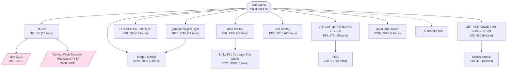
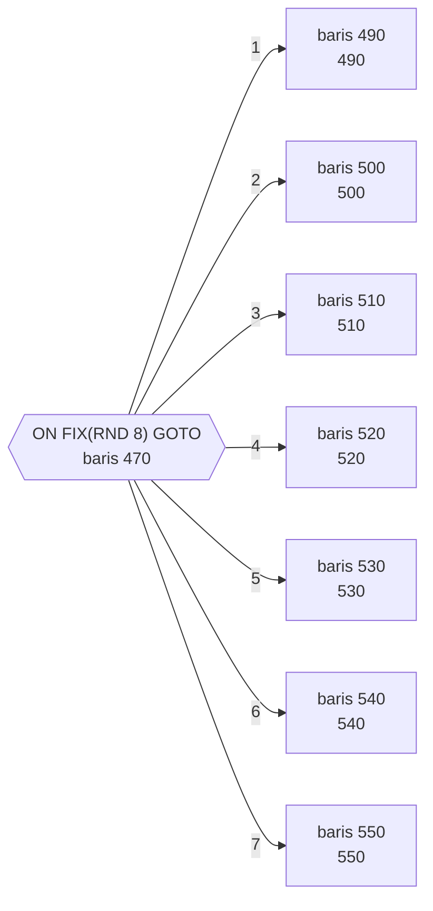

# SUB.BAS — Sea Battle (kapal selam)

> Menu #1 pilihan F. Tiga tingkat kedalaman dan grid 24 kuadran.

| | |
|---|---|
| Sumber | Friendlyware PC Introductory Set |
| Tahun | 1982 |
| Panjang | 317 baris (nomor 10–3160) |
| Subrutin | 19, dipanggil dari 35 tempat |
| Percabangan | 22 `GOTO`, 35 `GOSUB`, 23 target `ON…` |
| Komentar | 3% dari baris |
| Jalankan | `run\SUB.bat` |

## Peta arsitektur

*Diagram di bawah ini bukan tafsiran — semuanya diturunkan langsung dari
kode: tiap panah adalah `GOSUB` yang benar-benar ada, tiap kotak adalah
blok antara sebuah entri dan `RETURN`-nya.*



Kotak bersudut miring berwarna = **penangan kejadian** (`ON KEY`/`ON ERROR`), yang dipanggil oleh interupsi, bukan oleh alur utama.

### Subrutin dan perannya

| Baris | Panjang | Dipanggil | Peran (diambil dari kode) |
|---|--:|--:|---|
| `2010`–`2010` | 1 baris | 9× | blok @2010 *(handler)* |
| `630`–`670` | 5 baris | 3× | if @630 |
| `30`–`140` | 12 baris | 2× | for @30 |
| `390`–`410` | 3 baris | 2× | tunggu tombol |
| `430`–`560` | 14 baris | 2× | PUT SUB ON THE MAP |
| `580`–`670` | 10 baris | 2× | DISPLAY LETTERS AND LEVELS |
| `2590`–`2620` | 4 baris | 2× | muat tabel DATA |
| `3070`–`3090` | 3 baris | 2× | tunggu tombol |
| `300`–`380` | 9 baris | 1× | GET RESPONSE FOR SUB SEARCH |
| `710`–`910` | 21 baris | 1× | move depth charge |
| `930`–`1340` | 42 baris | 1× | map display |
| `1360`–`2010` | 66 baris | 1× | sub display |
| `2050`–`2070` | 3 baris | 1× | ANCHORS AWAY |
| `2080`–`2180` | 11 baris | 1× | gambar bingkai layar |

*(5 subrutin lain tidak ditampilkan)*

### Tabel dispatch

Program ini punya **3** percabangan berindeks (`ON … GOTO/GOSUB`).
Yang terbesar ada di baris 470 dengan 7 cabang:



### Program lain yang dimuat


### Kejadian yang dijebak

- `ON KEY(1)` → baris 2010
- `ON KEY(10)` → baris 2960
- `ON KEY(2)` → baris 2010
- `ON KEY(3)` → baris 2010
- `ON KEY(4)` → baris 2010
- `ON KEY(5)` → baris 2010
- `ON KEY(6)` → baris 2010
- `ON KEY(7)` → baris 2010
- `ON KEY(8)` → baris 2010
- `ON KEY(9)` → baris 2010

### Perulangan utama

`GOTO` mundur terpanjang: dari baris **2950** kembali ke **160** — melingkupi 2790 nomor baris.
Itulah loop utama program ini; segala sesuatu di dalam rentang tersebut
dijalankan berulang.

### Data yang dipegang

| Array | Dipakai | Ditulis di baris |
|---|--:|---|
| `A` | 18× | 200, 210, 220, 630, 640, … |
| `B` | 16× | 200, 210, 220, 230, 560 |
| `SUB` | 13× | 200, 210, 220, 230, 560 |

## Bagaimana program ini disusun

Sembilan belas subrutin, dan tabel dispatch yang menarik:

```basic
470 ON FIX(RND*8) GOTO (7 target)
```

Indeksnya **bilangan acak**. Jadi ini bukan percabangan berdasarkan keadaan,
melainkan **pemilihan acak dari tujuh perilaku** — cara membuat kapal selam
bergerak tak terduga tanpa menulis logika kecerdasan apa pun.

Pola "tabel + indeks acak" adalah cara termurah membuat sesuatu terasa hidup, dan
masih dipakai di mana-mana (dialog NPC, variasi animasi, pemilihan musuh).

Struktur datanya memakai teknik yang layak dikenali:

```basic
DIM A(71), B(23), SUB(3)
```

`A(71)` = 72 sel = **24 kuadran × 3 tingkat kedalaman**. Ruang tiga dimensi
diratakan jadi satu array satu dimensi, dengan indeks dihitung dari kuadran dan
kedalaman.

Ini *flattening*, dan masih dipakai di mana-mana — buffer gambar, tensor, tabel
hash — karena array satu dimensi lebih cepat diakses dan lebih mudah
dialokasikan.

Harganya keterbacaan: `A(37)` tidak memberi tahu kuadran mana dan kedalaman
berapa. Kalau memakai teknik ini, rumus indeksnya wajib ditulis di komentar atau
dibungkus `DEF FN`.

Peta kejadiannya sama dengan `BIO.BAS`: F1–F5 semua ke baris 2010 yang isinya
`RETURN` kosong — tombol dimatikan dengan dijebak.

## Yang menarik dari kodenya

"Sea Battle" Friendlyware — berburu kapal selam di grid tiga dimensi: 24 kuadran
(A–X) dikali tiga tingkat kedalaman.

```basic
DIM A(71), B(23), SUB(3)
```

`A(71)` = 72 sel = 24 kuadran × 3 tingkat. Jadi ruang tiga dimensi **diratakan
jadi satu array satu dimensi**, dengan indeks dihitung dari kuadran dan
kedalaman. Ini teknik *flattening* yang masih dipakai di mana-mana — buffer
gambar, tensor, tabel hash — karena array satu dimensi lebih cepat diakses dan
lebih mudah dialokasikan.

Yang hilang: keterbacaan. `A(37)` tidak memberi tahu apa pun tentang kuadran
mana dan kedalaman berapa. Kalau memakai teknik ini, rumus indeksnya wajib
ditulis di komentar, atau dibungkus `DEF FN`.

Baris 30–90 sekali lagi menjebak F1–F9 satu per satu, tujuh baris identik.
Bandingkan dengan `MATCH.BAS` baris 110 yang menyelesaikannya dalam satu `FOR`.
Dalam satu produk yang sama, dua gaya hidup berdampingan — tanda bahwa
program-program Friendlyware ditulis oleh beberapa orang tanpa standar bersama.

## Yang bisa dipelajari

- Meratakan array multi-dimensi jadi satu dimensi itu cepat dan umum. Tapi tulis rumus indeksnya di komentar.
- Membandingkan dua berkas dalam satu produk yang menyelesaikan masalah sama dengan cara berbeda memberi tahu banyak soal bagaimana tim itu bekerja.

## Yang jangan ditiru

- Tujuh baris `ON KEY` identik yang bisa jadi satu `FOR`.

## Lampiran

### Perkakas bahasa yang dipakai

`PLAY` — musik lewat bahasa makro not, `SOUND` — nada mentah (frekuensi, durasi), `PEEK` — baca memori langsung, `POKE` — tulis memori langsung, `DEF SEG` — pindah segmen memori, `ON KEY(n) GOSUB` — jebakan tombol fungsi, `ON x GOTO` — percabangan berindeks, `ON x GOSUB` — pemanggilan berindeks, `INKEY$` — baca tombol tanpa menunggu Enter, `RUN "nama"` — muat program lain, variabel hilang, `RANDOMIZE` — menyemai pengacak, `DEFSTR` — variabel default teks, `STRING$` — ulang satu karakter n kali, `LOCATE` — posisikan kursor, `COLOR` — warna teks

### Deklarasi array

```basic
DIM A(71),B(23),SUB(3)
```

### Sepuluh baris pembuka

```basic
10 COLOR 3,0,0:KEY OFF:WIDTH 80:SCREEN 0,0,0:LOCATE ,,0
20 GOTO 150
30 ON KEY(1) GOSUB 2010
40 ON KEY(2) GOSUB 2010
50 ON KEY(3) GOSUB 2010
60 ON KEY(4) GOSUB 2010
70 ON KEY(5) GOSUB 2010
80 ON KEY(6) GOSUB 2010
90 ON KEY(7) GOSUB 2010
100 ON KEY(8) GOSUB 2010
```

---
[Dasar-dasar BASIC](00-DASAR-BASIC.md) · [Daftar review](README.md) · [Katalog koleksi](../README.md)
