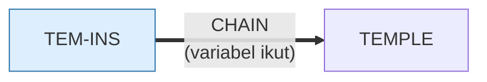

# TEM-INS.BAS — Temple of Loth - petunjuk

> Manual untuk TEMPLE.BAS, yang sendirinya ditulis sebagai program BASIC.

| | |
|---|---|
| Sumber | Public domain / listing majalah lain-lain |
| Tahun | 2000 |
| Panjang | 290 baris (nomor 10–3010) |
| Subrutin | 0, dipanggil dari 0 tempat |
| Percabangan | 26 `GOTO`, 0 `GOSUB`, 0 target `ON…` |
| Komentar | 6% dari baris |
| Jalankan | `run\TEM-INS.bat` |

## Peta arsitektur

*Diagram di bawah ini bukan tafsiran — semuanya diturunkan langsung dari
kode: tiap panah adalah `GOSUB` yang benar-benar ada, tiap kotak adalah
blok antara sebuah entri dan `RETURN`-nya.*

Program ini **tidak punya satu pun subrutin** — seluruhnya alur lurus
dari atas ke bawah. Untuk program sekecil ini itu pilihan yang benar.

### Program lain yang dimuat



### Perulangan utama

`GOTO` mundur terpanjang: dari baris **2840** kembali ke **10** — melingkupi 2830 nomor baris.
Itulah loop utama program ini; segala sesuatu di dalam rentang tersebut
dijalankan berulang.

## Bagaimana program ini disusun

**Nol subrutin** untuk 290 baris. Seluruhnya `PRINT` berurutan, dengan satu loop
raksasa (10←2840) yang membungkus semuanya.

Ini manual permainan `TEMPLE.BAS` — yang ditulis sebagai program BASIC. Kenapa?
Karena di DOS, menampilkan berkas teks berarti `TYPE FILE.TXT` yang menggulung
tanpa henti. Program bisa berhenti tiap layar, memberi warna, dan menyediakan
menu bab.

Jadi ini **pembaca dokumen**, dan menulisnya sebagai program adalah cara termurah
mendapatkannya. Prinsipnya masih berlaku: dokumentasi yang bisa dijalankan
(berhenti tiap layar, punya navigasi) jauh lebih terpakai daripada teks panjang.

Setelah selesai, ia `CHAIN "TEMPLE"` — manual dan permainan tersambung jadi satu
alur.

Yang layak diperhatikan ada di baris 70–80:

```basic
70 'LOCATE 4,45:PRINT "A. Sex
80 'LOCATE 5,7:PRINT "C. Points
```

Baris yang **dikomentari keluar** dengan tanda kutip tunggal — daftar isi versi
lama yang ditinggalkan di tempatnya. Kebiasaan yang masih sangat umum, dengan
konsekuensi yang juga masih sama: pembaca tidak bisa tahu apakah itu dinonaktifkan
sementara atau sudah mati selamanya. Hapus saja, atau tulis alasannya.

## Yang menarik dari kodenya

Manual permainan `TEMPLE.BAS` — yang ditulis sebagai program BASIC. 290 baris
yang isinya hampir seluruhnya `PRINT`.

Kenapa manual ditulis sebagai program, bukan berkas teks? Karena di disket DOS,
menampilkan berkas teks berarti `TYPE FILE.TXT` yang menggulung tanpa henti.
Program bisa berhenti tiap layar, memberi warna, dan menyediakan menu bab.
Ini **pembaca dokumen**, dan menulisnya sebagai program adalah cara termurah
mendapatkannya.

Yang menarik untuk dipelajari ada di baris 70–80:

```basic
70 'LOCATE 4,45:PRINT "A. Sex
80 'LOCATE 5,7:PRINT "C. Points
```

Baris-baris yang **dikomentari keluar** dengan tanda kutip tunggal — daftar isi
versi lama yang ditinggalkan di tempatnya. Ini kebiasaan yang masih sangat umum
sekarang, dan konsekuensinya juga masih sama: pembaca tidak bisa tahu apakah
baris itu sengaja dinonaktifkan sementara, atau sudah mati selamanya.

Karena `TEM-INS` dan `TEMPLE` berbagi mekanisme `CHAIN`, keduanya harus sepakat
soal nama berkas. Menjalankan `TEM-INS.bat` akan membawa Anda ke permainan
setelah manualnya habis dibaca.

## Yang bisa dipelajari

- Dokumentasi yang bisa dijalankan (berhenti tiap layar, punya menu bab) jauh lebih terpakai daripada berkas teks panjang.

## Yang jangan ditiru

- Meninggalkan kode yang dikomentari keluar tanpa penjelasan. Hapus saja — kalau perlu lagi, riwayat versi yang menyimpannya. (Dan kalau tidak ada riwayat versi, tulis alasannya di komentar.)

## Lampiran

### Perkakas bahasa yang dipakai

`PLAY` — musik lewat bahasa makro not, `DRAW` — bahasa makro menggambar garis, `CHAIN` — muat program lain, bawa variabel, `OPEN` — baca/tulis berkas, `WHILE`/`WEND` — perulangan berkondisi, `LOCATE` — posisikan kursor, `COLOR` — warna teks

### Sepuluh baris pembuka

```basic
10 CLS:KEY OFF:COLOR 3,0,1
20 LOCATE 1,28:COLOR 27,0,1:PRINT "Temple of Loth instructions"
30 COLOR 3,0,1:LOCATE 4,3
40 PRINT "     Temple of Loth is a computerized simulation of one of the most common and       popular fantasy motifs, the lone adventurer's quest with an immense under       ground labyrinth. Each ga
50 PRINT "     challenge even after you have won. Each game will result in a win or loss       depending on the player's  skill and luck.  The instruction  which follow       will explain the rules an
60 COLOR 3,0,1:LOCATE 12,7:PRINT "A. Character Creation
70 'LOCATE 4,45:PRINT "A. Sex
80 'LOCATE 5,7:PRINT "C. Points
90 LOCATE 12,45:PRINT "B. Equipments
100 'LOCATE 5,7:PRINT "C. Lamps and Flares
```

### Baris terpanjang (250 kolom)

```basic
1450 PRINT " LAMP    Allows you to shine your lamp into any one of the rooms north, south,           east, and west of your current position, revealing the room contents.           Unlike flares, the lamp may be used repeatedly. You may use your lamp
```

---
[Dasar-dasar BASIC](00-DASAR-BASIC.md) · [Daftar review](README.md) · [Katalog koleksi](../README.md)
