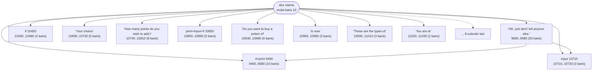
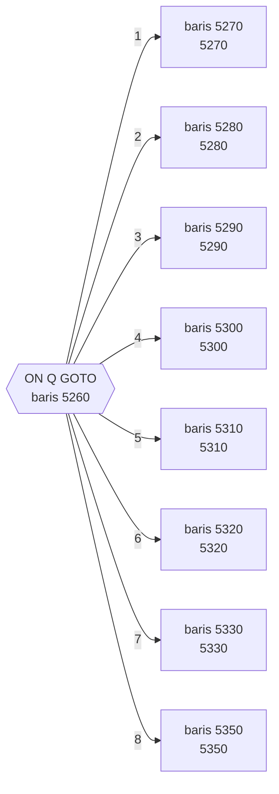
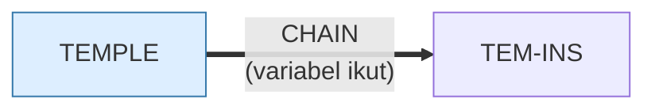

# TEMPLE.BAS — The Temple of Loth v4.2

> Dengan 1187 baris, program terbesar di sini. Grafik karakter opsional.

| | |
|---|---|
| Sumber | Public domain / listing majalah lain-lain |
| Tahun | 1995 |
| Panjang | 1187 baris (nomor 10–12200) |
| Subrutin | 19, dipanggil dari 54 tempat |
| Percabangan | 255 `GOTO`, 48 `GOSUB`, 64 target `ON…` |
| Komentar | 7% dari baris |
| Jalankan | `run\TEMPLE.bat` |

## Peta arsitektur

*Diagram di bawah ini bukan tafsiran — semuanya diturunkan langsung dari
kode: tiap panah adalah `GOSUB` yang benar-benar ada, tiap kotak adalah
blok antara sebuah entri dan `RETURN`-nya.*



Kotak bersudut miring berwarna = **penangan kejadian** (`ON KEY`/`ON ERROR`), yang dipanggil oleh interupsi, bukan oleh alur utama.

### Subrutin dan perannya

| Baris | Panjang | Dipanggil | Peran (diambil dari kode) |
|---|--:|--:|---|
| `10710`–`10730` | 3 baris | 10× | input @10710 |
| `10450`–`10480` | 4 baris | 8× | if @10450 |
| `10690`–`10730` | 5 baris | 7× | "Your choice" |
| `10990`–`11010` | 3 baris | 4× | "These are the types of" |
| `10740`–`10810` | 8 baris | 3× | "How many points do you wish to add t" |
| `10850`–`10890` | 5 baris | 3× | print+input+if @10850 |
| `10930`–`10980` | 6 baris | 3× | "Do you want to buy a potion of" |
| `10960`–`10980` | 3 baris | 3× | "is now" |
| `9490`–`9580` | 10 baris | 2× | if+print @9490 |
| `11020`–`11030` | 2 baris | 2× | "You are at (" |
| `3180`–`3190` | 2 baris | 1× | "stepped on dragon @#*%!" |
| `3200`–`3270` | 8 baris | 1× | efek suara |
| `3440`–`3450` | 2 baris | 1× | "sneezed!" |
| `3460`–`3470` | 2 baris | 1× | "see a bat fly by!" |

*(5 subrutin lain tidak ditampilkan)*

### Tabel dispatch

Program ini punya **20** percabangan berindeks (`ON … GOTO/GOSUB`).
Yang terbesar ada di baris 5260 dengan 8 cabang:



### Program lain yang dimuat



### Perulangan utama

`GOTO` mundur terpanjang: dari baris **10140** kembali ke **910** — melingkupi 9230 nomor baris.
Itulah loop utama program ini; segala sesuatu di dalam rentang tersebut
dijalankan berulang.

### Data yang dipegang

| Array | Dipakai | Ditulis di baris |
|---|--:|---|
| `L` | 35× | 980 |
| `R$` | 31× | 1790, 2160 |
| `T` | 30× | 1950, 6620, 6830, 7040, 7080, … |
| `C` | 25× | 830, 1710, 1720, 1730, 1740, … |
| `C$` | 24× | — |
| `R` | 17× | 1830, 1840, 1850, 8520 |
| `O` | 11× | 1890, 1900, 1910, 6770, 10310 |
| `W$` | 9× | — |

## Bagaimana program ini disusun

**1187 baris, 255 `GOTO`, hanya 19 subrutin, dan 20 tabel dispatch.** Program
terbesar di koleksi, dan contoh paling jelas tentang **bagaimana program tumbuh
melampaui strukturnya**.

Sembilan belas subrutin untuk 1187 baris berarti rata-rata satu rutin per 62
baris — dan kalau Anda lihat daftarnya, hampir semuanya kecil (1–8 baris) dan
mengurus **input**, bukan logika:

| Baris | Dipanggil | Peran |
|---|--:|---|
| 10710 | 10× | baca input |
| 10450 | 8× | validasi |
| 10690 | 7× | `"Your choice"` |

Jadi yang berhasil diabstraksi hanyalah lapisan terluar. Seluruh logika permainan
— peta, pertarungan, inventaris — tetap berupa alur lurus yang saling melompat
lewat 255 `GOTO`.

Pola pertumbuhannya bisa dibaca dari angka: tiap fitur baru menambah satu tabel
dispatch (ada 20) dan beberapa `GOTO`, tapi tak ada satu titik pun di mana
seseorang berhenti untuk menata ulang. **Biaya menata naik seiring ukuran, jadi
semakin lama ditunda semakin tidak akan pernah dilakukan.**

Struktur datanya identik dengan `WIZARD.BAS` sampai ke nama array (`C$(34)`,
`I$(34)`, `L(512)`, `C(3,4)`) — bukti kuat bahwa Temple adalah turunan
langsungnya.

`L(512)` = 8×8×8, labirin tiga dimensi yang diratakan.

Dan ada kode curang tersembunyi: mengetik `ARIOCH` pada pertanyaan grafis di
baris 55 melompat ke baris 700.

## Yang menarik dari kodenya

**Program terbesar di koleksi**: 1187 baris, 255 `GOTO`, hanya 48 `GOSUB`.
Rasio lompatan tertinggi dari semuanya — dan pada ukuran ini, itu berarti
program yang praktis tidak bisa dipetakan tanpa alat bantu.

Ini sekaligus contoh terbaik tentang **bagaimana program tumbuh melampaui
strukturnya**. Dengan 48 subrutin untuk 1187 baris, rata-rata satu subrutin
melayani 25 baris; sisanya alur lurus yang saling melompat. Setiap penambahan
fitur menambah `GOTO` baru, dan tak ada titik di mana seseorang berhenti untuk
menatanya kembali.

Baris 55 menyembunyikan sesuatu yang menyenangkan:

```basic
30 INPUT "Do you want graphics (Y/N)";ANS$
40 IF ANS$ = "y" GOTO 70
50 IF ANS$ = "Y" GOTO 70
55 IF ANS$="ARIOCH" GOTO 700
60 GOTO 350
```

Mengetik `ARIOCH` sebagai jawaban pertanyaan grafis melompat ke baris 700 —
sebuah **kode curang**, tersembunyi di tempat yang tidak akan ditemukan orang
yang tidak membaca kodenya. (Arioch adalah nama Dewa Kekacauan di novel Elric
karya Michael Moorcock; penulisnya jelas pembaca fantasi.)

Baris 40 dan 50 memeriksa "y" dan "Y" secara terpisah, dua baris. `UCASE$` tidak
ada di GW-BASIC, tapi `IF ANS$="y" OR ANS$="Y"` sudah cukup — dan lebih baik lagi
memakai idiom yang dipakai `BLACKJCK.BAS`:
`IF H$>"Z" THEN H$=CHR$(ASC(H$)-32)`.

Struktur datanya sama persis dengan `WIZARD.BAS` (`C$(34)`, `I$(34)`, `L(512)`,
`C(3,4)`) — jadi `TEMPLE` hampir pasti turunan langsung dari `WIZARD`, ditulis
ulang dan diperluas.

## Yang bisa dipelajari

- `L(512)` untuk labirin 8×8×8 — sekali lagi array multi-dimensi yang diratakan.
- Bandingkan dengan `WIZARD.BAS`: struktur datanya identik. Melihat dua program berbagi bentuk data adalah cara menemukan silsilah.

## Yang jangan ditiru

- 255 `GOTO` untuk 48 `GOSUB`. Kalau program Anda tumbuh sampai ukuran ini, berhentilah sesekali untuk menatanya — biayanya hanya naik.
- Dua baris terpisah untuk memeriksa huruf besar dan kecil, diulang di seluruh program.

## Lampiran

### Perkakas bahasa yang dipakai

`PLAY` — musik lewat bahasa makro not, `SOUND` — nada mentah (frekuensi, durasi), `BEEP`, `DRAW` — bahasa makro menggambar garis, `LINE` — menggambar garis & kotak, `CIRCLE`, `PAINT` — mengisi area tertutup, `PSET`/`PRESET` — piksel tunggal, mode grafis CGA (`SCREEN 1`/`2`), `ON x GOTO` — percabangan berindeks, `ON x GOSUB` — pemanggilan berindeks, `CHAIN` — muat program lain, bawa variabel, `OPEN` — baca/tulis berkas, `DEF FN` — fungsi buatan sendiri satu baris, `WHILE`/`WEND` — perulangan berkondisi, `RANDOMIZE` — menyemai pengacak, `DEFINT` — variabel default bilangan bulat, `LOCATE` — posisikan kursor, `COLOR` — warna teks, `LPRINT` — cetak ke printer

### Deklarasi array

```basic
DIM C$(34),I$(34),R$(4),W$(8),E$(8)
DIM L(512),C(3,4),T(8),O(3),R(3)
```

### Sepuluh baris pembuka

```basic
10 KEY OFF
15 N=VAL (MID$(TIME$,7,2))
20 RANDOMIZE N
30 INPUT "Do you want graphics (Y/N)";ANS$
40 IF ANS$ = "y" GOTO 70
50 IF ANS$ = "Y" GOTO 70
55 IF ANS$="ARIOCH" GOTO 700
60 GOTO 350
70 SCREEN 1:CLS
80  CIRCLE (20,20),20
```

### Baris terpanjang (141 kolom)

```basic
2820 INPUT "Flares give off light which allows you to see all the rooms around you.  At a   cost of 1gp each how many do you want to buy?";O$
```

---
[Dasar-dasar BASIC](00-DASAR-BASIC.md) · [Daftar review](README.md) · [Katalog koleksi](../README.md)
