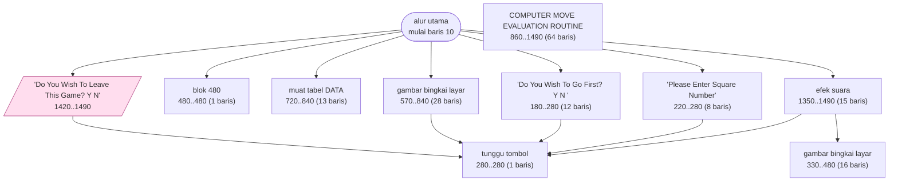
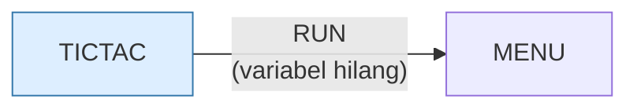

# TICTAC.BAS — Tic Tac Toe

> Menu #1 pilihan N.

| | |
|---|---|
| Sumber | Friendlyware PC Introductory Set |
| Tahun | 1982 |
| Panjang | 141 baris (nomor 10–1490) |
| Subrutin | 10, dipanggil dari 16 tempat |
| Percabangan | 28 `GOTO`, 15 `GOSUB`, 6 target `ON…` |
| Komentar | 2% dari baris |
| Jalankan | `run\TICTAC.bat` |

## Peta arsitektur

*Diagram di bawah ini bukan tafsiran — semuanya diturunkan langsung dari
kode: tiap panah adalah `GOSUB` yang benar-benar ada, tiap kotak adalah
blok antara sebuah entri dan `RETURN`-nya.*



Kotak bersudut miring berwarna = **penangan kejadian** (`ON KEY`/`ON ERROR`), yang dipanggil oleh interupsi, bukan oleh alur utama.

### Subrutin dan perannya

| Baris | Panjang | Dipanggil | Peran (diambil dari kode) |
|---|--:|--:|---|
| `280`–`280` | 1 baris | 6× | tunggu tombol |
| `1350`–`1490` | 15 baris | 2× | efek suara |
| `180`–`280` | 12 baris | 1× | "Do You Wish To Go First? <Y/N>" |
| `220`–`280` | 8 baris | 1× | "Please Enter Square Number" |
| `330`–`480` | 16 baris | 1× | gambar bingkai layar |
| `480`–`480` | 1 baris | 1× | blok @480 |
| `570`–`840` | 28 baris | 1× | gambar bingkai layar |
| `720`–`840` | 13 baris | 1× | muat tabel DATA |
| `860`–`1490` | 64 baris | 1× | COMPUTER MOVE EVALUATION ROUTINE |
| `1420`–`1490` | 8 baris | 1× | "Do You Wish To Leave This Game? <Y/N" *(handler)* |

### Program lain yang dimuat



### Kejadian yang dijebak

- `ON KEY(10)` → baris 1420

### Perulangan utama

`GOTO` mundur terpanjang: dari baris **1040** kembali ke **290** — melingkupi 750 nomor baris.
Itulah loop utama program ini; segala sesuatu di dalam rentang tersebut
dijalankan berulang.

### Data yang dipegang

| Array | Dipakai | Ditulis di baris |
|---|--:|---|
| `C` | 56× | 730, 750, 1020, 1070, 1090, … |
| `D` | 18× | — |
| `A` | 4× | — |
| `B` | 3× | 720 |
| `E` | 3× | — |

## Bagaimana program ini disusun

Sepuluh subrutin, enam panah — kecil tapi seluruh bagiannya jelas. Alur utamanya
bisa dibaca sebagai kalimat:

```basic
130 GOSUB 720:GOSUB 570        ' muat tabel, gambar papan
140 GOSUB 180                   ' tanya siapa duluan
150 ON T(T) GOSUB 220,860       ' giliran manusia ATAU komputer
160 FOR A=6 TO 18:IF C(A)<>0 THEN NEXT:GOSUB 1350:GOTO 140
```

Baris 150 adalah tabel dispatch dua cabang: `220` = langkah manusia,
`860` = `COMPUTER MOVE EVALUATION ROUTINE`. **Giliran siapa pun ditangani lewat
satu titik**, dengan indeks memilih implementasinya. Itu polimorfisme paling
sederhana yang bisa ditulis.

Struktur datanya adalah bagian terbaiknya:

```basic
120 DIM A(9),B(9),C(24),D(7),E(18)
```

`C(24)` dibaca **56 kali** — array tersibuk di program. Kenapa 24? Karena tic tac
toe punya **delapan garis kemenangan** (3 baris + 3 kolom + 2 diagonal), dan
8 × 3 = 24. `C` menyimpan seluruh garis kemenangan sebagai daftar rata.

Jadi memeriksa kemenangan tidak perlu memeriksa baris, kolom, dan diagonal
terpisah — cukup satu loop atas delapan kelompok tiga. **Tabel yang
dipraberhitung menggantikan tiga kasus khusus.**

Baris 160 memakai `NEXT` di dalam `IF` sebagai pengganti `break`. Jalan di
GW-BASIC, tapi meninggalkan `FOR` yang tidak seimbang — hindari.

## Yang menarik dari kodenya

Tic Tac Toe Friendlyware, dan pilihan struktur datanya jauh lebih menarik
daripada permainannya:

```basic
120 DEFSTR Z:DIM A(9),B(9),C(24),D(7),E(18)
```

`A(9)` dan `B(9)` adalah papan (sembilan kotak). Tapi `C(24)`? Ada **delapan
garis kemenangan** di tic tac toe (3 baris + 3 kolom + 2 diagonal), dan
8 × 3 = 24. Jadi `C` menyimpan seluruh garis kemenangan sebagai daftar rata.

Artinya memeriksa kemenangan tidak perlu memeriksa baris, kolom, dan diagonal
secara terpisah — cukup satu loop atas delapan kelompok tiga. Ini **precompute
tabel** lagi, pola yang sama dengan `HIQUE2.BAS`.

Baris 150 memakai idiom yang harus diperhatikan:

```basic
150 ON T(T) GOSUB 220,860
```

`T(T)` — array `T` diindeks oleh skalar `T`, sama seperti di `MATCH.BAS`. Di
BASIC ini sah karena array dan skalar punya ruang nama terpisah, tapi tetap
membingungkan.

Baris 160 juga layak dibaca dua kali:

```basic
160 FOR A=6 TO 18:IF C(A)<>0 THEN NEXT:GOSUB 1350:GOTO 140
```

`NEXT` di dalam `IF` — jadi loop hanya berlanjut kalau kondisinya benar, dan
keluar lebih awal kalau salah. Ini `break` yang disamarkan, dan ia bekerja karena
GW-BASIC tidak mempermasalahkan `NEXT` yang dieksekusi bersyarat. Sah, tapi
merusak keseimbangan `FOR`/`NEXT` dan bisa membingungkan interpreter kalau
bersarang.

## Yang bisa dipelajari

- Precompute daftar 'garis kemenangan' jadi satu tabel rata. Pemeriksaan menang lalu jadi satu loop, bukan tiga kasus.

## Yang jangan ditiru

- `NEXT` di dalam `IF` sebagai pengganti `break`. Jalan di GW-BASIC, tapi meninggalkan `FOR` yang tidak seimbang.
- Array dan skalar dengan nama sama (`T(T)`).

## Lampiran

### Perkakas bahasa yang dipakai

`PLAY` — musik lewat bahasa makro not, `SOUND` — nada mentah (frekuensi, durasi), `POKE` — tulis memori langsung, `DEF SEG` — pindah segmen memori, `ON KEY(n) GOSUB` — jebakan tombol fungsi, `ON x GOTO` — percabangan berindeks, `ON x GOSUB` — pemanggilan berindeks, `INKEY$` — baca tombol tanpa menunggu Enter, `RUN "nama"` — muat program lain, variabel hilang, `DEFSTR` — variabel default teks, `STRING$` — ulang satu karakter n kali, `LOCATE` — posisikan kursor, `COLOR` — warna teks

### Deklarasi array

```basic
DIM A(9),B(9),C(24),D(7),E(18)
```

### Sepuluh baris pembuka

```basic
10 WIDTH 80:SCREEN 0,0,0:CLS:KEY OFF:KEY(10) ON:ON KEY(10) GOSUB 1420
110 FOR A=1 TO 9:ON KEY(A) GOSUB 480:KEY(A) ON:NEXT
120 DEFSTR Z:DIM A(9),B(9),C(24),D(7),E(18)
130 GOSUB 720:GOSUB 570
140 GOSUB 180
150 ON T(T) GOSUB 220,860
160 FOR A=6 TO 18:IF C(A)<>0 THEN NEXT:GOSUB 1350:GOTO 140
170 IF W<>1 THEN 150 ELSE GOSUB 1350:GOTO 140
180 LOCATE 22,26:COLOR 15,0
190 PRINT "Do You Wish To Go First? <Y/N>         ":COLOR 3,0
```

### Baris terpanjang (125 kolom)

```basic
360 LOCATE A,19:PRINT CHR$(219):LOCATE A,32:PRINT STRING$(2,219):LOCATE A,46:PRINT STRING$(2,219):LOCATE A,60:PRINT CHR$(219)
```

---
[Dasar-dasar BASIC](00-DASAR-BASIC.md) · [Daftar review](README.md) · [Katalog koleksi](../README.md)
