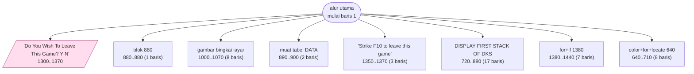
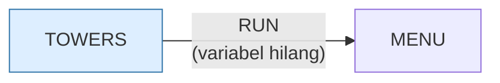

# TOWERS.BAS — Towers of Atlantis (Menara Hanoi)

> Menu #1 pilihan P. Update terakhir 1 Sep 1982.

| | |
|---|---|
| Sumber | Friendlyware PC Introductory Set |
| Tahun | 1982 |
| Panjang | 131 baris (nomor 1–1500) |
| Subrutin | 8, dipanggil dari 8 tempat |
| Percabangan | 12 `GOTO`, 8 `GOSUB`, 2 target `ON…` |
| Komentar | 0% dari baris |
| Jalankan | `run\TOWERS.bat` |

## Peta arsitektur

*Diagram di bawah ini bukan tafsiran — semuanya diturunkan langsung dari
kode: tiap panah adalah `GOSUB` yang benar-benar ada, tiap kotak adalah
blok antara sebuah entri dan `RETURN`-nya.*



Kotak bersudut miring berwarna = **penangan kejadian** (`ON KEY`/`ON ERROR`), yang dipanggil oleh interupsi, bukan oleh alur utama.

### Subrutin dan perannya

| Baris | Panjang | Dipanggil | Peran (diambil dari kode) |
|---|--:|--:|---|
| `640`–`710` | 8 baris | 1× | color+for+locate @640 |
| `720`–`880` | 17 baris | 1× | DISPLAY FIRST STACK OF DKS |
| `880`–`880` | 1 baris | 1× | blok @880 |
| `890`–`900` | 2 baris | 1× | muat tabel DATA |
| `1000`–`1070` | 8 baris | 1× | gambar bingkai layar |
| `1300`–`1370` | 8 baris | 1× | "Do You Wish To Leave This Game? <Y/N" *(handler)* |
| `1350`–`1370` | 3 baris | 1× | "Strike <F10> to leave this game" |
| `1380`–`1440` | 7 baris | 1× | for+if @1380 |

### Program lain yang dimuat



### Kejadian yang dijebak

- `ON KEY(10)` → baris 1300

### Perulangan utama

`GOTO` mundur terpanjang: dari baris **630** kembali ke **170** — melingkupi 460 nomor baris.
Itulah loop utama program ini; segala sesuatu di dalam rentang tersebut
dijalankan berulang.

## Bagaimana program ini disusun

Delapan subrutin, **nol panah antar-subrutin** — datar sepenuhnya. Untuk Menara
Hanoi yang logikanya sederhana, itu proporsional.

Yang layak dipelajari adalah **rancangan inputnya**. Alih-alih mengetik
"pindahkan cakram 3 ke tiang 2", pemain menggerakkan bintang berkedip:

```
"Position Flashing Star Above Target Disk"
"Then Strike Enter Key"
```

Antarmuka penunjuk-dan-pilih, tanpa mouse, tahun 1982.

Dampak arsitekturalnya lebih besar daripada kelihatannya: karena bintang hanya
bisa berhenti di tiga posisi yang sah, **masukan tak sah menjadi tidak mungkin
dinyatakan**. Program tidak butuh validasi sama sekali — tidak ada pemeriksaan
"apakah tiang itu ada", tidak ada pesan "masukan tidak valid".

Ini prinsip yang masih diajarkan: *make illegal states unrepresentable*. Kalau
Anda merasa menulis banyak validasi, tanyakan dulu apakah bentuk masukannya bisa
diubah agar yang salah tidak bisa dimasukkan.

Detail kecil di baris 140–160:

```basic
140 TRYS=-1
160 TRYS=TRYS+1
```

Pencacah dimulai dari −1 supaya setelah kenaikan pertama nilainya nol —
menghapus kasus khusus di iterasi pertama.

## Yang menarik dari kodenya

Menara Hanoi versi Friendlyware, dengan antarmuka yang layak diperhatikan:
alih-alih mengetik "pindahkan cakram 3 ke tiang 2", pemain **menggerakkan bintang
berkedip** di atas cakram lalu menekan Enter.

```basic
"Position Flashing Star Above Target Disk"
"Then Strike Enter Key"
```

Ini antarmuka penunjuk-dan-pilih, tanpa mouse, tahun 1982. Dibandingkan dengan
mengetik koordinat, ini menghilangkan seluruh kelas kesalahan input — pemain
tidak bisa memasukkan angka yang tidak sah karena bintangnya hanya bisa berhenti
di tempat yang sah.

**Menghilangkan keadaan tak sah dengan membuatnya tidak bisa dinyatakan** adalah
prinsip perancangan yang masih diajarkan hari ini.

Baris 430 memperlihatkan percobaan indentasi yang sama dengan `BOGGY.BAS`:

```basic
430   IF TW(PL,DK) THEN HOLD=TW(PL,DK)                                   :HOLD1=PL:HOLD2=DK:GOTO 460
```

Spasi panjang di tengah baris untuk memisahkan bagian. Sekali lagi: niatnya
benar, sarananya tidak ada.

Perhatikan juga `TRYS=-1` di baris 140 lalu `TRYS=TRYS+1` di baris 160. Mulai
dari −1 supaya setelah kenaikan pertama nilainya nol. Trik kecil untuk
menghindari kasus khusus di iterasi pertama.

## Yang bisa dipelajari

- Rancang input sehingga masukan tak sah **tidak mungkin dinyatakan**. Itu mengalahkan validasi sebanyak apa pun.
- Menginisialisasi pencacah ke −1 agar kenaikan pertama menghasilkan 0 menghapus kasus khusus di awal loop.

## Yang jangan ditiru

- Nol komentar pada 131 baris.
- Indentasi dengan spasi di dalam satu baris logis.

## Lampiran

### Perkakas bahasa yang dipakai

`PLAY` — musik lewat bahasa makro not, `POKE` — tulis memori langsung, `DEF SEG` — pindah segmen memori, `ON KEY(n) GOSUB` — jebakan tombol fungsi, `ON x GOSUB` — pemanggilan berindeks, `INKEY$` — baca tombol tanpa menunggu Enter, `RUN "nama"` — muat program lain, variabel hilang, `DEFSTR` — variabel default teks, `STRING$` — ulang satu karakter n kali, `LOCATE` — posisikan kursor, `COLOR` — warna teks

### Sepuluh baris pembuka

```basic
1 'last update 9/1/82 10:00 am
2 '
10 DEFSTR Z:SCREEN 0,0,0:COLOR 3,0,0:WIDTH 80:LOCATE ,,0
20 KEY OFF:ON KEY (10) GOSUB 1300
120 FOR A=1 TO 9:ON KEY(A) GOSUB 880:KEY(A) ON:NEXT
130 GOSUB 1000:GOSUB 890:XLIN=1:YPOS=1:GOSUB 1350
140 TRYS=-1:FIRSTTIME=0
150 GOSUB 720
160 TRYS=TRYS+1
170 COLOR 7,0
```

---
[Dasar-dasar BASIC](00-DASAR-BASIC.md) · [Daftar review](README.md) · [Katalog koleksi](../README.md)
