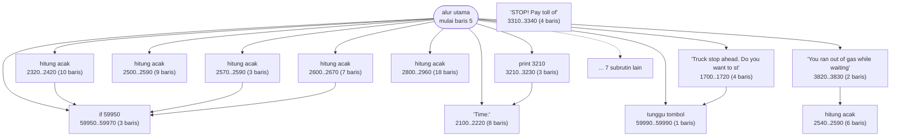
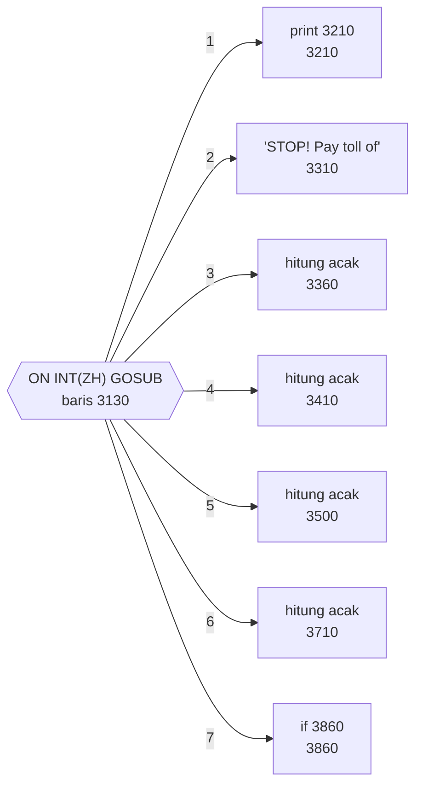
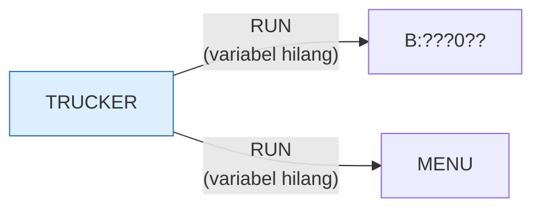

# TRUCKER.BAS — Trucker

> Simulasi bisnis angkutan truk lintas negara bagian.

| | |
|---|---|
| Sumber | Public domain / listing majalah lain-lain |
| Tahun | 1982 |
| Panjang | 385 baris (nomor 5–59990) |
| Subrutin | 20, dipanggil dari 56 tempat |
| Percabangan | 31 `GOTO`, 50 `GOSUB`, 13 target `ON…` |
| Komentar | 4% dari baris |
| Jalankan | `run\TRUCKER.bat` |

## Peta arsitektur

*Diagram di bawah ini bukan tafsiran — semuanya diturunkan langsung dari
kode: tiap panah adalah `GOSUB` yang benar-benar ada, tiap kotak adalah
blok antara sebuah entri dan `RETURN`-nya.*



Kotak bersudut miring berwarna = **penangan kejadian** (`ON KEY`/`ON ERROR`), yang dipanggil oleh interupsi, bukan oleh alur utama.

### Subrutin dan perannya

| Baris | Panjang | Dipanggil | Peran (diambil dari kode) |
|---|--:|--:|---|
| `59950`–`59970` | 3 baris | 20× | if @59950 |
| `2100`–`2220` | 8 baris | 10× | "Time:" |
| `59990`–`59990` | 1 baris | 9× | tunggu tombol |
| `1700`–`1720` | 4 baris | 1× | "Truck stop ahead.  Do you want to st" |
| `2300`–`2310` | 2 baris | 1× | hitung acak |
| `2320`–`2420` | 10 baris | 1× | hitung acak |
| `2500`–`2590` | 9 baris | 1× | hitung acak |
| `2540`–`2590` | 6 baris | 1× | hitung acak |
| `2570`–`2590` | 3 baris | 1× | hitung acak |
| `2600`–`2670` | 7 baris | 1× | hitung acak |
| `2800`–`2960` | 18 baris | 1× | hitung acak |
| `3000`–`3010` | 2 baris | 1× | "..E.X.H.A.U.S.T.E.D.." |
| `3210`–`3230` | 3 baris | 1× | print @3210 |
| `3310`–`3340` | 4 baris | 1× | "STOP!   Pay toll of" |

*(6 subrutin lain tidak ditampilkan)*

### Tabel dispatch

Program ini punya **3** percabangan berindeks (`ON … GOTO/GOSUB`).
Yang terbesar ada di baris 3130 dengan 7 cabang:



### Program lain yang dimuat



### Perulangan utama

`GOTO` mundur terpanjang: dari baris **4170** kembali ke **1000** — melingkupi 3170 nomor baris.
Itulah loop utama program ini; segala sesuatu di dalam rentang tersebut
dijalankan berulang.

### Data yang dipegang

| Array | Dipakai | Ditulis di baris |
|---|--:|---|
| `DS$` | 9× | 200 |
| `MT` | 6× | 3680 |
| `NT$` | 6× | 190 |
| `MP` | 5× | 3670 |
| `MR$` | 4× | 3660 |
| `MP$` | 3× | — |
| `ZM` | 3× | — |

## Bagaimana program ini disusun

Dua puluh subrutin, dan yang paling sering dipakai ada di **nomor baris 59950
dan 59990** — jauh dari kode permainan, sama seperti `BACKGAM.BAS` dan
`BLACK.BAS`:

| Baris | Dipanggil | Peran |
|---|--:|---|
| 59950 | 20× | jeda waktu |
| 59990 | 9× | tunggu tombol |
| 2100 | 10× | tampilkan `"Time:"` |

Dua puluh sembilan panggilan ke dua rutin utilitas. Pemisahan wilayah nomor baris
ini adalah bentuk modularisasi paling awal yang tersedia: 1000–4000 = permainan,
59950+ = pustaka.

Tabel dispatchnya memodelkan ekonomi permainan:

```basic
3130 ON INT(ZH) GOSUB (7 target)
```

Tujuh cabang dipilih oleh `INT(ZH)` — kemungkinan besar jenis muatan atau
kejadian di jalan.

Struktur datanya rapi dan menceritakan permainannya:

```basic
DIM MT(2), MP(2,25), MP$(2,25), MR$(2,25), ZM(2,25), DS$(6), NT$(4)
```

Pola `(2,25)` berulang **empat kali**: tiga entitas (indeks 0–2), masing-masing
dengan 25 atribut. Bentuk `DIM` yang berulang seperti ini adalah petunjuk kuat
bahwa keempatnya adalah **atribut dari entitas yang sama** — di bahasa modern
mereka akan jadi satu array berisi objek.

Dan `MP`/`MP$` adalah pasangan angka-dan-teks untuk hal yang sama: tabel paralel
lagi.

## Yang menarik dari kodenya

Simulasi bisnis angkutan truk. Delapan baris pertamanya bukan logika sama sekali
— melainkan **logo raksasa "TRUCKER" yang digambar huruf demi huruf** dengan
karakter kotak CP437:

```basic
20 LOCATE 5,3:PRINT"╔════════╗";:LOCATE 6,3:PRINT"╚═══╗╔═══╝";:...
30 LOCATE 5,14:PRINT"╔════════╗";:LOCATE 6,14:PRINT"║╔══════╗║";:...
```

Tiap baris membangun satu huruf pada posisi kolom tertentu (3, 14, 25, 36,
47…). Jadi baris 20 adalah huruf "T", baris 30 huruf "R", dan seterusnya.

Ini **font raksasa yang di-hardcode**, dan menunjukkan berapa banyak usaha yang
orang mau keluarkan untuk layar pembuka. Sekitar 60 baris kode hanya untuk satu
kata.

Cara yang lebih baik ada di koleksi ini juga: `BUSFOUR.BAS` merakit garisnya
dengan loop dan `STRING$`. Tapi untuk bentuk yang tidak beraturan seperti huruf,
menulis langsung memang lebih jelas — trade-off yang sama dengan `KENO.BAS`.

Struktur datanya rapi dan menceritakan permainannya:

```basic
DIM MT(2), MP(2,25), MP$(2,25), MR$(2,25), ZM(2,25), DS$(6), NT$(4)
```

Pola `(2,25)` berulang empat kali: tiga entitas (indeks 0–2) masing-masing dengan
25 atribut. Dan `MP`/`MP$` adalah pasangan angka-dan-teks untuk hal yang sama —
tabel paralel lagi.

Program ini juga memakai `USR` — memanggil rutin bahasa mesin — di tengah
simulasi. Tanpa berkas biner pendampingnya, bagian itu kemungkinan gagal.

## Yang bisa dipelajari

- Untuk bentuk tidak beraturan (huruf raksasa), menulis langsung lebih jelas daripada merakit dengan loop.
- Bentuk `DIM` yang berulang (`(2,25)` empat kali) mengungkap bahwa keempatnya adalah atribut dari entitas yang sama.

## Yang jangan ditiru

- Enam puluh baris untuk satu logo statis. Itu data — `DATA` + satu loop cetak akan menyusutkannya jadi sepersepuluh.

## Lampiran

### Perkakas bahasa yang dipakai

`PLAY` — musik lewat bahasa makro not, `USR`/`CALL` — panggil rutin bahasa mesin, `ON x GOTO` — percabangan berindeks, `ON x GOSUB` — pemanggilan berindeks, `INKEY$` — baca tombol tanpa menunggu Enter, `RUN "nama"` — muat program lain, variabel hilang, `OPEN` — baca/tulis berkas, `WHILE`/`WEND` — perulangan berkondisi, `RANDOMIZE` — menyemai pengacak, `DEFINT` — variabel default bilangan bulat, `STRING$` — ulang satu karakter n kali, `LOCATE` — posisikan kursor, `COLOR` — warna teks

### Deklarasi array

```basic
DIM MT(2), MP(2,25), MP$(2,25), MR$(2,25), ZM(2,25), DS$(6), NT$(4)
```

### Sepuluh baris pembuka

```basic
5 REM This program is Trucker
10 KEY OFF:WIDTH 80:CLS:DEFINT C-S
20 LOCATE 5,3:PRINT"╔════════╗";:LOCATE 6,3:PRINT"╚═══╗╔═══╝";:LOCATE 7,7:FOR X=1 TO 7:PRINT"║║" CHR$(31) STRING$(2,29);:NEXT X:PRINT"╚╝";
30 LOCATE 5,14:PRINT"╔════════╗";:LOCATE 6,14:PRINT"║╔══════╗║";:LOCATE 7,14:PRINT"║║      ║║";:LOCATE 8,14:PRINT"║║      ║║";:LOCATE 9,14:PRINT"║╚══════╝║";:LOCATE 10,14:PRINT"║╔══╗ ╔══╝";
40 LOCATE 11,14:PRINT"║║  ╚╗╚╗";:LOCATE 12,14:PRINT"║║   ╚╗╚╗";:LOCATE 13,14:PRINT"║║    ╚╗╚╗";:LOCATE 14,14:PRINT"╚╝     ╚═╝";
50 LOCATE 5,25:PRINT"╔╗      ╔╗";:FOR X=6 TO 12:LOCATE X,25:PRINT"║║      ║║";:NEXT X:LOCATE 13,25:PRINT"║╚══════╝║";:LOCATE 14,25:PRINT"╚════════╝";
60 LOCATE 5,36:PRINT"╔════════╗";:LOCATE 6,36:PRINT"║╔══════╗║";:LOCATE 7,36:PRINT"║║      ╚╝";:FOR X=8 TO 11:LOCATE X,36:PRINT"║║";:NEXT X:LOCATE 12,36:PRINT"║║      ╔╗";:LOCATE 13,36:PRINT"║╚══════╝
70 LOCATE 5,47:PRINT"╔╗   ╔═╗";:LOCATE 6,47:PRINT"║║  ╔╝╔╝";:LOCATE 7,47:PRINT"║║ ╔╝╔╝";:LOCATE 8,47:PRINT"║║╔╝╔╝";:LOCATE 9,47:PRINT"║╚╝╔╝";:LOCATE 10,47:PRINT"║╔╗╚╗";:LOCATE 11,47:PRINT"║║╚╗╚╗";:LOC
80 LOCATE 13,47:PRINT"║║  ╚╗╚╗";:LOCATE 14,47:PRINT"╚╝   ╚═╝";
90 LOCATE 5,58:PRINT"╔════════╗";:LOCATE 6,58:PRINT"║╔═══════╝";:LOCATE 7,58:PRINT"║║";:LOCATE 8,58:PRINT"║║";:LOCATE 9,58:PRINT"║╚═══╗";:LOCATE 10,58:PRINT"║╔═══╝";:LOCATE 11,58:PRINT"║║";
```

### Baris terpanjang (235 kolom)

```basic
60 LOCATE 5,36:PRINT"╔════════╗";:LOCATE 6,36:PRINT"║╔══════╗║";:LOCATE 7,36:PRINT"║║      ╚╝";:FOR X=8 TO 11:LOCATE X,36:PRINT"║║";:NEXT X:LOCATE 12,36:PRINT"║║      ╔╗";:LOCATE 13,36:PRINT"║╚══════╝║";:LOCATE 14,36:PRINT"╚════════╝";
```

---
[Dasar-dasar BASIC](00-DASAR-BASIC.md) · [Daftar review](README.md) · [Katalog koleksi](../README.md)
