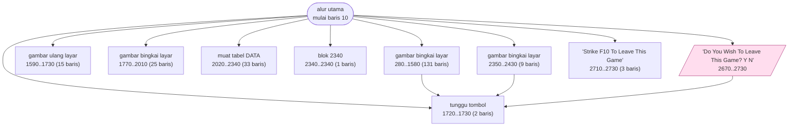

# WILDCAT.BAS — Wildcatter (pengeboran minyak)

> Menu #1 pilihan A. Update terakhir 17 Jul 1982 oleh A. Vanchura.

| | |
|---|---|
| Sumber | Friendlyware PC Introductory Set |
| Tahun | 1982 |
| Panjang | 296 baris (nomor 10–2960) |
| Subrutin | 9, dipanggil dari 13 tempat |
| Percabangan | 19 `GOTO`, 13 `GOSUB`, 2 target `ON…` |
| Komentar | 0% dari baris |
| Jalankan | `run\WILDCAT.bat` |

## Peta arsitektur

*Diagram di bawah ini bukan tafsiran — semuanya diturunkan langsung dari
kode: tiap panah adalah `GOSUB` yang benar-benar ada, tiap kotak adalah
blok antara sebuah entri dan `RETURN`-nya.*



Kotak bersudut miring berwarna = **penangan kejadian** (`ON KEY`/`ON ERROR`), yang dipanggil oleh interupsi, bukan oleh alur utama.

### Subrutin dan perannya

| Baris | Panjang | Dipanggil | Peran (diambil dari kode) |
|---|--:|--:|---|
| `1720`–`1730` | 2 baris | 5× | tunggu tombol |
| `280`–`1580` | 131 baris | 1× | gambar bingkai layar |
| `1590`–`1730` | 15 baris | 1× | gambar ulang layar |
| `1770`–`2010` | 25 baris | 1× | gambar bingkai layar |
| `2020`–`2340` | 33 baris | 1× | muat tabel DATA |
| `2340`–`2340` | 1 baris | 1× | blok @2340 |
| `2350`–`2430` | 9 baris | 1× | gambar bingkai layar |
| `2670`–`2730` | 7 baris | 1× | "Do You Wish To Leave This Game? <Y/N" *(handler)* |
| `2710`–`2730` | 3 baris | 1× | "Strike <F10> To Leave This Game" |

### Program lain yang dimuat


### Kejadian yang dijebak

- `ON KEY(10)` → baris 2670

### Perulangan utama

`GOTO` mundur terpanjang: dari baris **920** kembali ke **510** — melingkupi 410 nomor baris.
Itulah loop utama program ini; segala sesuatu di dalam rentang tersebut
dijalankan berulang.

### Data yang dipegang

| Array | Dipakai | Ditulis di baris |
|---|--:|---|
| `MAP` | 18× | 230, 480, 1970, 2030, 2040, … |
| `WELL` | 5× | 1400 |
| `PAY` | 4× | — |
| `Z` | 3× | — |
| `HIT` | 3× | — |

## Bagaimana program ini disusun

Sembilan subrutin untuk 296 baris, dan salah satunya **131 baris** (280–1580).
Blok sebesar itu bukan fungsi — ia seluruh fase permainan yang dibungkus jadi
satu.

Perbandingan yang berguna: `DOMINOES.BAS` punya ukuran serupa tapi 46 subrutin.
Dua penulis, dua filosofi, produk yang sama.

Yang layak diperiksa ada di baris 70–80:

```basic
70 RANDOMIZE(VAL(RIGHT$(TIME$,2)))
80 RANDOMIZE(RND*30000)
```

Menyemai **dua kali**. Yang pertama dari detik jam, yang kedua dari angka acak
yang dihasilkan benih pertama.

Apakah ini membantu? **Tidak.** Benih kedua sepenuhnya ditentukan oleh yang
pertama, jadi jumlah kemungkinan urutan tetap 60. Ini kesalahan yang bagus untuk
dipahami: **entropi hanya bertambah dari sumber yang benar-benar independen.**
Mengaduk ulang data yang sama tidak menambah informasi.

Bandingkan dengan `METEOR.BAS` yang mengaduk benihnya selagi menunggu pemain
(waktu reaksi manusia = entropi nyata), atau `READING.BAS` yang menggabung
jam+menit+detik.

Baris 1830 memperlihatkan sisi lain: sebelas `POKE` berjarak kelipatan 12,
menulis langsung ke memori layar untuk menggambar kolom — teknik yang sama dengan
`MAZE.BAS`.

## Yang menarik dari kodenya

"Wildcatter" — simulasi pengeboran minyak, ditandatangani A. Vanchura, 17 Juli
1982, sama dengan `GOLF.BAS`.

Dua baris berturut-turut di awal patut diperhatikan:

```basic
70 RANDOMIZE(VAL(RIGHT$(TIME$,2)))
80 RANDOMIZE(RND*30000)
```

Menyemai dua kali. Yang pertama dari detik jam (60 kemungkinan), yang kedua dari
angka acak yang dihasilkan benih pertama, dikalikan 30000. Apakah ini membantu?
**Tidak.** Benih kedua sepenuhnya ditentukan oleh yang pertama, jadi jumlah
kemungkinan urutan tetap 60. Ini *security theatre* versi generator acak —
terlihat lebih aman, sebenarnya tidak menambah apa pun.

Bandingkan dengan `METEOR.BAS` yang mengaduk benihnya selagi menunggu tombol
pemain, atau `READING.BAS` yang menggabung jam+menit+detik. Keduanya benar-benar
menambah entropi.

Baris 1830 menunjukkan sesuatu yang lain:

```basic
1830 POKE A,B8:POKE A+12,B9:POKE A+24,B9:POKE A+36,B9:...:POKE A+120,B0
```

Sebelas `POKE` dengan jarak kelipatan 12. Ini menulis langsung ke memori layar
untuk menggambar kolom — sama seperti `MAZE.BAS`. Angka 12 adalah jarak antar
posisi dalam byte. Cepat, tapi terikat mati pada tata letak memori CGA.

`DIM Z(10),HIT(3,40),PAY(20,5,3),MAP(100,3),WELL(10)` — `PAY(20,5,3)` adalah
tabel imbalan tiga dimensi, inti dari ekonomi permainan ini.

## Yang bisa dipelajari

- `RANDOMIZE` dua kali dari sumber yang sama **tidak menambah keacakan**. Entropi hanya bertambah dari sumber yang benar-benar independen.

## Yang jangan ditiru

- Menyemai ulang pengacak dari keluarannya sendiri. Terlihat aman, tidak menambah apa pun.
- Nol komentar untuk 296 baris dengan lima array dan `POKE` langsung ke memori layar.

## Lampiran

### Perkakas bahasa yang dipakai

`PLAY` — musik lewat bahasa makro not, `PEEK` — baca memori langsung, `POKE` — tulis memori langsung, `DEF SEG` — pindah segmen memori, `ON KEY(n) GOSUB` — jebakan tombol fungsi, `ON x GOSUB` — pemanggilan berindeks, `INKEY$` — baca tombol tanpa menunggu Enter, `RUN "nama"` — muat program lain, variabel hilang, `RANDOMIZE` — menyemai pengacak, `DEFSTR` — variabel default teks, `STRING$` — ulang satu karakter n kali, `LOCATE` — posisikan kursor, `COLOR` — warna teks

### Deklarasi array

```basic
DIM Z(10),HIT(3,40),PAY(20,5,3),MAP(100,3),WELL(10)
```

### Sepuluh baris pembuka

```basic
10 'Last Update - 7/17/82:AM:A.Vanchura
20 FOR A=1 TO 9:ON KEY(A) GOSUB 2340:KEY(A) ON:NEXT
30 ON KEY(10) GOSUB 2670
40 WIDTH 80:SCREEN 0,0,0:COLOR 3,0,0:XX=1:YY=1
50 KEY OFF:LOCATE 1,1,0
60 CLS:DEFSNG A-Y:DEFSTR Z:DIM Z(10),HIT(3,40),PAY(20,5,3),MAP(100,3),WELL(10)
70 RANDOMIZE(VAL(RIGHT$(TIME$,2)))
80 RANDOMIZE(RND*30000)
90 ZUM="$$########,.##"
100 CSH=1000000
```

### Baris terpanjang (151 kolom)

```basic
1830 POKE A,B8:POKE A+12,B9:POKE A+24,B9:POKE A+36,B9:POKE A+48,B9:POKE A+60,B9:     POKE A+72,B9:POKE A+84,B9:POKE A+96,B9:POKE A+108,B9:POKE A+120,B0
```

---
[Dasar-dasar BASIC](00-DASAR-BASIC.md) · [Daftar review](README.md) · [Katalog koleksi](../README.md)
