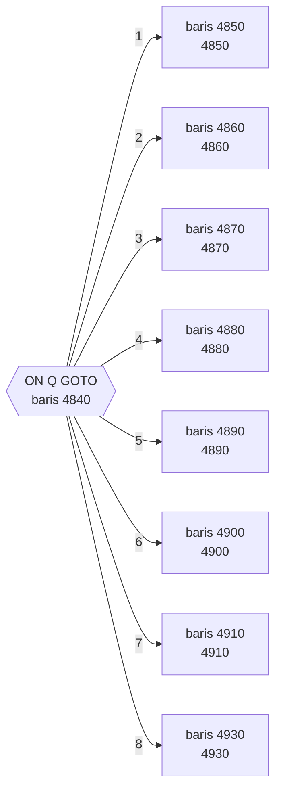
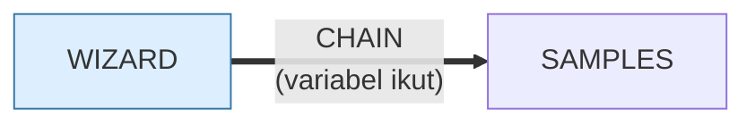

# WIZARD.BAS — The Wizard's Castle

> Disk IPCO 2039-A. Joseph R. Power untuk Exidy Sorcerer, Recreational Computing Jul/Agu 1980; diport ke Heath Microsoft BASIC oleh J.F. Stetson.

| | |
|---|---|
| Sumber | International PC Owners (pustaka PD, Pittsburgh PA) |
| Tahun | 1980 |
| Panjang | 944 baris (nomor 10–10180) |
| Subrutin | 18, dipanggil dari 55 tempat |
| Percabangan | 224 `GOTO`, 49 `GOSUB`, 59 target `ON…` |
| Komentar | 8% dari baris |
| Jalankan | `run\WIZARD.bat` |

## Peta arsitektur

*Diagram di bawah ini bukan tafsiran — semuanya diturunkan langsung dari
kode: tiap panah adalah `GOSUB` yang benar-benar ada, tiap kotak adalah
blok antara sebuah entri dan `RETURN`-nya.*

```mermaid
flowchart TD
    MAIN(["alur utama<br/>mulai baris 10"])
    S8740["if+print 8740<br/>8740..8830 (10 baris)"]
    S9590["if 9590<br/>9590..9620 (4 baris)"]
    S9770["for+print 9770<br/>9770..9820 (6 baris)"]
    S9830["'YOUR CHOICE'<br/>9830..9870 (5 baris)"]
    S9850["input 9850<br/>9850..9870 (3 baris)"]
    S9880["'HOW MANY POINTS DO YOU WISH TO ADD T'<br/>9880..9950 (8 baris)"]
    S9990["print+input+if 9990<br/>9990..10030 (5 baris)"]
    S10070["'DO YOU WANT TO BUY A POTION OF'<br/>10070..10120 (6 baris)"]
    S10100["'IS NOW'<br/>10100..10120 (3 baris)"]
    S10130["'THESE ARE THE TYPES OF'<br/>10130..10150 (3 baris)"]
    MORE["... 8 subrutin lain"]
    MAIN -.-> MORE
    MAIN --> S9770
    MAIN --> S9590
    MAIN --> S9830
    MAIN --> S9850
    MAIN --> S9880
    MAIN --> S10130
    MAIN --> S8740
    MAIN --> S9990
    MAIN --> S10070
    MAIN --> S10100
```



Kotak bersudut miring berwarna = **penangan kejadian** (`ON KEY`/`ON ERROR`), yang dipanggil oleh interupsi, bukan oleh alur utama.

### Subrutin dan perannya

| Baris | Panjang | Dipanggil | Peran (diambil dari kode) |
|---|--:|--:|---|
| `9850`–`9870` | 3 baris | 10× | input @9850 |
| `9590`–`9620` | 4 baris | 8× | if @9590 |
| `9830`–`9870` | 5 baris | 7× | "YOUR CHOICE" |
| `10130`–`10150` | 3 baris | 4× | "THESE ARE THE TYPES OF" |
| `9770`–`9820` | 6 baris | 3× | for+print @9770 |
| `9880`–`9950` | 8 baris | 3× | "HOW MANY POINTS DO YOU WISH TO ADD T" |
| `9990`–`10030` | 5 baris | 3× | print+input+if @9990 |
| `10070`–`10120` | 6 baris | 3× | "DO YOU WANT TO BUY A POTION OF" |
| `10100`–`10120` | 3 baris | 3× | "IS NOW" |
| `8740`–`8830` | 10 baris | 2× | if+print @8740 |
| `10160`–`10170` | 2 baris | 2× | "YOU ARE AT (" |
| `3130`–`3140` | 2 baris | 1× | "STEPPED ON A FROG!" |
| `3150`–`3180` | 4 baris | 1× | "A SCREAM!" |
| `3250`–`3260` | 2 baris | 1× | "SNEEZED!" |

*(4 subrutin lain tidak ditampilkan)*

### Tabel dispatch

Program ini punya **18** percabangan berindeks (`ON … GOTO/GOSUB`).
Yang terbesar ada di baris 4840 dengan 8 cabang:



### Program lain yang dimuat



### Perulangan utama

`GOTO` mundur terpanjang: dari baris **9320** kembali ke **1240** — melingkupi 8080 nomor baris.
Itulah loop utama program ini; segala sesuatu di dalam rentang tersebut
dijalankan berulang.

### Data yang dipegang

| Array | Dipakai | Ditulis di baris |
|---|--:|---|
| `L` | 34× | 1310 |
| `R$` | 32× | 1890, 2160 |
| `C` | 25× | 1160, 1810, 1820, 1830, 1840, … |
| `C$` | 22× | — |
| `T` | 19× | 2050, 6150, 6360, 6400, 8300, … |
| `R` | 17× | 1930, 1940, 1950, 7840 |
| `O` | 11× | 1990, 2000, 2010, 6090, 9450 |
| `W$` | 9× | — |

## Bagaimana program ini disusun

944 baris, **18 tabel dispatch**, dan nol panah antar-subrutin. Semua rutin
dipanggil langsung dari alur utama.

Delapan belas tabel dispatch untuk satu program adalah angka yang bercerita: tiap
`ON x GOTO` adalah satu titik tempat pemain memilih. Ini permainan yang seluruh
strukturnya adalah **rangkaian menu**, dan itulah bentuk RPG teks era ini.

Rutin-rutinnya hampir semuanya lapisan input:

| Baris | Dipanggil | Peran |
|---|--:|---|
| 9850 | 10× | baca input |
| 9590 | 8× | validasi |
| 9830 | 7× | `"YOUR CHOICE"` |
| 10130 | 4× | `"THESE ARE THE TYPES OF"` |

Pola yang persis sama dengan `TEMPLE.BAS` — dan itu bukan kebetulan, karena
struktur datanya identik sampai ke nama array (`L(512)`, `C$(34)`, `I$(34)`,
`C(3,4)`). Temple adalah turunan langsung Wizard.

Yang membedakan keduanya: baris terpanjang Wizard hanya **78 kolom**. Untuk
program 944 baris, itu disiplin luar biasa — dan hampir pasti warisan dari format
listing majalah yang harus muat di lebar kertas.

Silsilahnya tercatat tiga lapis di dalam kodenya sendiri: ditulis Joseph R. Power
untuk Exidy Sorcerer (*Recreational Computing*, Juli/Agustus 1980), diport
J.F. Stetson ke Heath Microsoft BASIC, lalu sampai ke IBM PC lewat pustaka
public-domain IPCO.

## Yang menarik dari kodenya

944 baris, dan **silsilah paling lengkap di koleksi** — tercatat di kodenya
sendiri, tiga lapis:

```
WIZARD'S CASTLE GAME FROM JULY/AUGUST 1980 ISSUE OF RECREATIONAL COMPUTING MAGAZINE
WRITTEN FOR EXIDY SORCERER BY JOSEPH R. POWER
MODIFIED FOR HEATH MICROSOFT BASIC BY J.F. STETSON
```

Lalu didistribusikan sebagai disk IPCO `2039-A` di Pittsburgh. Empat mesin,
empat orang, satu majalah, satu kelompok pengguna — semuanya terekam dalam
berkas yang sama.

Baris terpanjangnya hanya **78 kolom**. Untuk program 944 baris, itu disiplin
yang luar biasa, dan hampir pasti warisan dari format listing majalah yang harus
muat di lebar kertas.

Struktur datanya:

```basic
DIM C$(34), I$(34), R$(4), W$(8), E$(8)
DIM L(512), C(3,4), T(8), O(3), R(3)
```

`L(512)` = 8×8×8 = labirin tiga dimensi yang diratakan. `C$(34)`/`I$(34)` adalah
pasangan nama-benda dan deskripsinya. Struktur ini **identik dengan
`TEMPLE.BAS`** — bukti kuat bahwa Temple of Loth adalah turunan langsungnya.

224 `GOTO` untuk 49 `GOSUB` adalah rasio yang buruk, tapi harus dilihat dalam
konteks: program ini lahir di BASIC mikrokomputer 1980 yang bahkan belum punya
`WHILE`/`WEND`. Struktur yang tersedia memang cuma lompatan.

`DEF FN` dipakai — jarang di koleksi ini, dan tanda penulis yang berpengalaman.

## Yang bisa dipelajari

- Batasi lebar baris. 78 kolom untuk 944 baris membuktikan ukuran program bukan alasan.
- Struktur data yang identik antara dua program adalah bukti silsilah yang lebih kuat daripada kemiripan nama.
- Rekam setiap tahap perjalanan kode: mesin asal, penulis, majalah, dan siapa yang mem-port.

## Yang jangan ditiru

- 224 `GOTO`. Sebagian karena zamannya, tapi tetap alasan kenapa program ini sulit diubah.

## Lampiran

### Perkakas bahasa yang dipakai

`PLAY` — musik lewat bahasa makro not, `DRAW` — bahasa makro menggambar garis, `ON x GOTO` — percabangan berindeks, `ON x GOSUB` — pemanggilan berindeks, `INKEY$` — baca tombol tanpa menunggu Enter, `CHAIN` — muat program lain, bawa variabel, `OPEN` — baca/tulis berkas, `DEF FN` — fungsi buatan sendiri satu baris, `WHILE`/`WEND` — perulangan berkondisi, `DEFINT` — variabel default bilangan bulat

### Deklarasi array

```basic
DIM C$(34),I$(34),R$(4),W$(8),E$(8)
DIM L(512),C(3,4),T(8),O(3),R(3)
```

### Sepuluh baris pembuka

```basic
10 KEY OFF:CLS
20 PRINT"░░░░░░░░░░░░░░░░░░░░░░░░░░░░░░░░░░░░░░░"
30 PRINT"░┌───────────────────────────────────┐░"
40 PRINT"░│                                   │░"
50 PRINT"░│            2039-A.BAS             │░"
60 PRINT"░│        THE WIZARD'S CASTLE        │░"
70 PRINT"░│                                   │░"
80 PRINT"░│                                   │░"
90 PRINT"░│ BROUGHT TO YOU BY THE MEMBERS OF  │░"
100 PRINT"░│      ▄▄▄▄▄ ▄▄▄▄▄ ▄▄▄▄▄ ▄▄▄▄▄      │░"
```

---
[Dasar-dasar BASIC](00-DASAR-BASIC.md) · [Daftar review](README.md) · [Katalog koleksi](../README.md)
