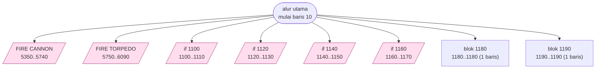

# XWING.BAS — X-Wing Fighter (Star Pilot)

> Disk IPCO 2060-A. George Blank, Leechburg PA, v4.0 25 Sep 1978; port IBM PC oleh Ernest Smith & Raymond Rogers, Houston, Des 1982.

| | |
|---|---|
| Sumber | International PC Owners (pustaka PD, Pittsburgh PA) |
| Tahun | 1978 |
| Panjang | 732 baris (nomor 10–8030) |
| Subrutin | 8, dipanggil dari 27 tempat |
| Percabangan | 63 `GOTO`, 27 `GOSUB`, 6 target `ON…` |
| Komentar | 4% dari baris |
| Jalankan | `run\XWING.bat` |

## Peta arsitektur

*Diagram di bawah ini bukan tafsiran — semuanya diturunkan langsung dari
kode: tiap panah adalah `GOSUB` yang benar-benar ada, tiap kotak adalah
blok antara sebuah entri dan `RETURN`-nya.*



Kotak bersudut miring berwarna = **penangan kejadian** (`ON KEY`/`ON ERROR`), yang dipanggil oleh interupsi, bukan oleh alur utama.

### Subrutin dan perannya

| Baris | Panjang | Dipanggil | Peran (diambil dari kode) |
|---|--:|--:|---|
| `1180`–`1180` | 1 baris | 12× | blok @1180 |
| `1190`–`1190` | 1 baris | 9× | blok @1190 |
| `1100`–`1110` | 2 baris | 1× | if @1100 *(handler)* |
| `1120`–`1130` | 2 baris | 1× | if @1120 *(handler)* |
| `1140`–`1150` | 2 baris | 1× | if @1140 *(handler)* |
| `1160`–`1170` | 2 baris | 1× | if @1160 *(handler)* |
| `5350`–`5740` | 40 baris | 1× | FIRE CANNON *(handler)* |
| `5750`–`6090` | 35 baris | 1× | FIRE  TORPEDO *(handler)* |

### Kejadian yang dijebak

- `ON KEY(1)` → baris 5350
- `ON KEY(11)` → baris 1100
- `ON KEY(12)` → baris 1120
- `ON KEY(13)` → baris 1140
- `ON KEY(14)` → baris 1160
- `ON KEY(2)` → baris 5750

### Perulangan utama

`GOTO` mundur terpanjang: dari baris **8030** kembali ke **1300** — melingkupi 6730 nomor baris.
Itulah loop utama program ini; segala sesuatu di dalam rentang tersebut
dijalankan berulang.

### Data yang dipegang

| Array | Dipakai | Ditulis di baris |
|---|--:|---|
| `LASAR` | 88× | 1960, 1970, 1980, 1990, 2000, … |
| `IM8` | 55× | 1470, 1480, 1490, 1500, 1510, … |
| `DV8` | 51× | 1710, 1720, 1730, 1740, 1750 |
| `IM7` | 45× | 1410, 1420, 1430, 1440, 1450 |
| `DV7` | 45× | 1650, 1660, 1670, 1680, 1690 |
| `DV` | 30× | 3930, 3940, 5010, 5120, 5710 |
| `IM` | 26× | 2860, 2870, 3880, 5560 |
| `IM6` | 23× | 1380, 1390 |

## Bagaimana program ini disusun

Delapan subrutin, dan **enam di antaranya adalah penangan kejadian**. Ini
arsitektur paling berbasis-kejadian di seluruh koleksi:

| Tombol | Ke baris | Peran |
|---|---|---|
| F1 | 5350 | `FIRE CANNON` |
| F2 | 5750 | `FIRE TORPEDO` |
| KEY(11) | 1100 | panah atas |
| KEY(12) | 1120 | panah kiri |
| KEY(13) | 1140 | panah kanan |
| KEY(14) | 1160 | panah bawah |

Di GW-BASIC, `KEY(11)`–`KEY(14)` adalah **tombol panah**. Jadi menembak dan
bermanuver keduanya terjadi sebagai **interupsi**, di luar loop utama.

Konsekuensi arsitekturalnya penting: loop utama tidak perlu memeriksa input sama
sekali. Ia hanya mengurus simulasi — gerakkan musuh, hitung tabrakan, gambar
ulang — sementara input datang kapan saja dan mengubah variabel bersama.

Ini **pemisahan input dari simulasi**, dan bentuknya sama dengan game loop modern
yang memisahkan `handleInput()` dari `update()`. Yang membuatnya mungkin di sini
adalah `ON KEY`, dan yang membuatnya rapuh adalah tidak adanya cara mengoper
data selain variabel global.

Array-nya menunjukkan di mana pekerjaan berat berada: `LASAR` dibaca **88 kali**,
`IM8` 55 kali, `DV8` 51 kali. Nama `IM` = image (sprite), `DV` = kemungkinan
divisor/vektor. Enam sprite berukuran bertingkat (6, 6, 6, 6, 13, 20) memberi
kesan kapal mendekat — penskalaan bertahap tanpa perhitungan perspektif.

## Yang menarik dari kodenya

Program tertua di koleksi menurut tanggal aslinya: **versi 4.0, 25 September
1978**, ditulis George Blank di Leechburg, Pennsylvania, sebagai "Star Pilot",
lalu diport ke IBM PC oleh Ernest Smith dan Raymond Rogers di Houston pada
Desember 1982. Didistribusikan sebagai disk IPCO `2060-A`.

Komentar lisensinya adalah salah satu yang paling manusiawi yang pernah ditulis:

```basic
FOR PUBLIC DOMAIN UNLESS MOVIEMAKERS OBJECT
```

Program ini dibuat tahun 1978 — setahun setelah Star Wars keluar — dan
penulisnya sadar betul soal itu.

Sprite-nya disimpan di enam array dengan ukuran yang bercerita:

```basic
DIM IM(6), IM1(6), IM2(6), IM3(6), IM4(13), IM5(20)
```

Empat sprite kecil berukuran sama (6), satu sedang (13), satu besar (20).
Ini kemungkinan besar kapal dari kejauhan sampai dekat — **penskalaan berbasis
tahap**, cara membuat kesan mendekat tanpa perhitungan perspektif.

Baris 1250 adalah bagian favorit:

```basic
1250 SOUND 525.25,18.2:SOUND 783.99,18.2/2:SOUND 698.46,18.2/6:SOUND 659.26,18.2/6:SOUND 587.33,18.2/6:SOUND 1046.6,18.2:...
```

Frekuensi ditulis sampai dua desimal (`525.25`, `783.99`, `659.26`) — itu nada
temperamen sama yang dihitung dengan rumus di `OCTAVE.BAS`. Dan durasinya
pecahan dari `18.2`, yaitu jumlah detak pencacah PC per detik. Jadi `18.2/6`
adalah sepertigapuluh detik.

Melodinya sendiri, kalau Anda mainkan: **tema Star Wars**.

## Yang bisa dipelajari

- Penskalaan sprite berbasis tahap (kecil/sedang/besar) memberi kesan kedalaman tanpa matematika perspektif.
- Durasi `SOUND` dalam satuan 1/18,2 detik. Menulisnya sebagai `18.2/6` jauh lebih jelas daripada `3.03`.

## Yang jangan ditiru

- Nama array `IM`, `IM1`…`IM5` yang tidak memberi tahu ukuran atau kegunaan masing-masing.

## Lampiran

### Perkakas bahasa yang dipakai

`PLAY` — musik lewat bahasa makro not, `SOUND` — nada mentah (frekuensi, durasi), `DRAW` — bahasa makro menggambar garis, `GET`/`PUT` — sprite disalin ke/dari array, `LINE` — menggambar garis & kotak, `CIRCLE`, `PAINT` — mengisi area tertutup, mode grafis CGA (`SCREEN 1`/`2`), `PEEK` — baca memori langsung, `POKE` — tulis memori langsung, `DEF SEG` — pindah segmen memori, `ON KEY(n) GOSUB` — jebakan tombol fungsi, `ON x GOSUB` — pemanggilan berindeks, `INKEY$` — baca tombol tanpa menunggu Enter, `CHAIN` — muat program lain, bawa variabel, `RANDOMIZE` — menyemai pengacak, `DEFINT` — variabel default bilangan bulat, `LOCATE` — posisikan kursor, `COLOR` — warna teks

### Deklarasi array

```basic
DIM IM(6)
DIM IM1(6)
DIM IM2(6)
DIM IM3(6)
DIM IM4(13)
DIM IM5(20)
```

### Sepuluh baris pembuka

```basic
10 KEY OFF:CLS
20 SCREEN 0
30 WIDTH 40
40 PRINT"░░░░░░░░░░░░░░░░░░░░░░░░░░░░░░░░░░░░░░░"
50 PRINT"░┌───────────────────────────────────┐░"
60 PRINT"░│                                   │░"
70 PRINT"░│            2060-A.BAS             │░"
80 PRINT"░│              XWING                │░"
90 PRINT"░│                                   │░"
100 PRINT"░│                                   │░"
```

### Baris terpanjang (201 kolom)

```basic
1250  SOUND 525.25,18.2:SOUND 783.99,18.2/2:SOUND 698.46,18.2/6:SOUND 659.26,18.2/6:SOUND 587.33,18.2/6:SOUND 1046.6,18.2:SOUND 783.99,18.2/2:SOUND 698.46,18.2/6:SOUND 659.26,18.2/6:SOUND 587.33,18.2/6
```

---
[Dasar-dasar BASIC](00-DASAR-BASIC.md) · [Daftar review](README.md) · [Katalog koleksi](../README.md)
