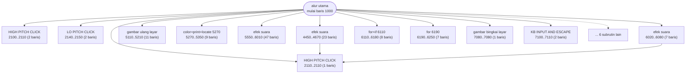
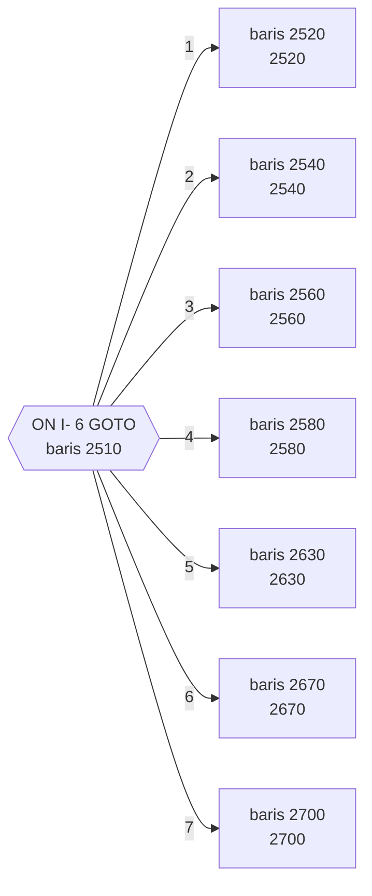

# YAHTZEE.BAS — Yatzee

> Asli oleh JL Helms & MF Pezok untuk CCII, Coronado CA; diadaptasi ke IBM PC oleh Patrick Leabo, Tucson.

| | |
|---|---|
| Sumber | Public domain / listing majalah lain-lain |
| Tahun | 1980 |
| Panjang | 612 baris (nomor 1000–7110) |
| Subrutin | 18, dipanggil dari 43 tempat |
| Percabangan | 58 `GOTO`, 43 `GOSUB`, 17 target `ON…` |
| Komentar | 27% dari baris |
| Jalankan | `run\YAHTZEE.bat` |

## Peta arsitektur

*Diagram di bawah ini bukan tafsiran — semuanya diturunkan langsung dari
kode: tiap panah adalah `GOSUB` yang benar-benar ada, tiap kotak adalah
blok antara sebuah entri dan `RETURN`-nya.*



Kotak bersudut miring berwarna = **penangan kejadian** (`ON KEY`/`ON ERROR`), yang dipanggil oleh interupsi, bukan oleh alur utama.

### Subrutin dan perannya

| Baris | Panjang | Dipanggil | Peran (diambil dari kode) |
|---|--:|--:|---|
| `6190`–`6250` | 7 baris | 7× | for @6190 |
| `2110`–`2110` | 1 baris | 6× | HIGH PITCH CLICK |
| `7080`–`7080` | 1 baris | 4× | gambar bingkai layar |
| `7100`–`7110` | 2 baris | 4× | KB INPUT AND ESCAPE |
| `5270`–`5350` | 9 baris | 3× | color+print+locate @5270 |
| `5550`–`6010` | 47 baris | 3× | efek suara |
| `2100`–`2110` | 2 baris | 2× | HIGH PITCH CLICK |
| `2140`–`2150` | 2 baris | 2× | LO PITCH CLICK |
| `5110`–`5210` | 11 baris | 2× | gambar ulang layar |
| `6110`–`6180` | 8 baris | 2× | for+if @6110 |
| `2130`–`2130` | 1 baris | 1× | GLISSANDO SOUND |
| `4450`–`4670` | 23 baris | 1× | efek suara |
| `4680`–`4680` | 1 baris | 1× | blok @4680 |
| `5360`–`5490` | 14 baris | 1× | if+for @5360 |

*(4 subrutin lain tidak ditampilkan)*

### Tabel dispatch

Program ini punya **4** percabangan berindeks (`ON … GOTO/GOSUB`).
Yang terbesar ada di baris 2510 dengan 7 cabang:



### Perulangan utama

`GOTO` mundur terpanjang: dari baris **5070** kembali ke **1110** — melingkupi 3960 nomor baris.
Itulah loop utama program ini; segala sesuatu di dalam rentang tersebut
dijalankan berulang.

### Data yang dipegang

| Array | Dipakai | Ditulis di baris |
|---|--:|---|
| `S` | 92× | 2220, 2260, 2270, 2300, 2360, … |
| `K` | 85× | 1390, 2050, 2460, 2570, 2620, … |
| `F` | 30× | 1490, 1690, 1740, 1800, 1810, … |
| `C` | 20× | 1480 |
| `A$` | 14× | 1270, 1280, 1300, 4850, 5180 |
| `M` | 9× | 4410, 4420 |

## Bagaimana program ini disusun

Delapan belas subrutin untuk 612 baris, dengan **27% komentar**. Tapi
arsitektur sesungguhnya ada di dua array yang paling sibuk di seluruh koleksi:

| Array | Dibaca |
|---|--:|
| `S(6,5)` | 92× |
| `K(18,7)` | 85× |

`M(13)` = tiga belas kategori skor (jumlah baris di kartu skor Yahtzee).
`TN(6)` dan `DU(6)` = **hitungan tiap angka mata dadu 1–6**.

Yang terakhir itu kuncinya. Dengan tabel frekuensi, memeriksa "three of a kind",
"full house", atau "yahtzee" jadi sekadar **melihat nilai terbesar di tabel** —
bukan membandingkan lima dadu satu per satu dengan `IF` bertingkat.

Menghitung frekuensi lebih dulu, lalu menjawab semua pertanyaan dari tabel itu,
adalah teknik yang sangat berguna dan masih dipakai di mana-mana: histogram,
`Counter` di Python, `GROUP BY` di SQL. **Satu penyapuan data menggantikan
belasan pemeriksaan.**

Rutin `KB INPUT AND ESCAPE` (7100) dipanggil 4 kali, `HIGH PITCH CLICK` (2110) 6
kali — lapisan input dan umpan balik yang dipisah dengan benar.

Detail antarmuka yang sopan di baris 1590:

```basic
1590 POKE 106,0:PRINT " HOW MANY DICE TO ROLL AGAIN? ";:LOCATE ,,1:GOSUB 2100:...:LOCATE ,,0
```

`LOCATE ,,1` **menyalakan kursor** sebelum meminta input, `LOCATE ,,0`
mematikannya sesudahnya. Kursor hanya terlihat saat pemakai memang diminta
mengetik — sinyal visual kecil yang hampir tidak ada program lain di koleksi ini
repot melakukannya.

## Yang menarik dari kodenya

612 baris dengan **27% komentar** — rasio tertinggi kedua di koleksi, setelah
`METEOR.BAS` dan `BLACK.BAS`. Diadaptasi Patrick Leabo dari versi CCII karya
JL Helms dan MF Pezok di Coronado, California.

Deklarasi datanya adalah pemodelan Yahtzee yang benar:

```basic
1070 DIM C(5):DIM K(18,7):DIM F(5):DIM A$(7)
1080 DIM S(6,5):DIM M(13),TN(6),DU(6)
```

`C(5)` = lima dadu. `M(13)` = tiga belas kategori skor (yang memang jumlah baris
di kartu skor Yahtzee). `TN(6)` dan `DU(6)` = hitungan tiap angka mata dadu 1–6 —
ini **tabel frekuensi**, dan dengan itu memeriksa "three of a kind", "full
house", atau "yahtzee" jadi sekadar melihat nilai terbesar di tabel, bukan
membandingkan dadu satu per satu.

Menghitung frekuensi lebih dulu, lalu menjawab semua pertanyaan dari tabel itu,
adalah teknik yang sangat berguna dan masih dipakai di mana-mana (histogram,
`Counter` di Python, `GROUP BY` di SQL).

Baris 1590 menunjukkan detail antarmuka yang sopan:

```basic
1590 POKE 106,0:PRINT " HOW MANY DICE TO ROLL AGAIN? ";:LOCATE ,,1:GOSUB 2100:...:LOCATE ,,0
```

`LOCATE ,,1` **menyalakan kursor** sebelum meminta input, `LOCATE ,,0`
mematikannya lagi sesudahnya. Jadi kursor hanya terlihat saat pemakai memang
sedang diminta mengetik. Sinyal visual kecil yang sangat membantu, dan hampir
tidak ada program lain di koleksi yang repot melakukannya.

## Yang bisa dipelajari

- Hitung tabel frekuensi lebih dulu, lalu jawab semua pertanyaan darinya. Untuk permainan dadu, ini menghapus semua perbandingan bersarang.
- Nyalakan kursor hanya saat meminta input (`LOCATE ,,1`), matikan sesudahnya. Pemakai langsung tahu kapan gilirannya.
- 27% komentar pada 612 baris. Program besar yang masih bisa diikuti orang lain.

## Lampiran

### Perkakas bahasa yang dipakai

`PLAY` — musik lewat bahasa makro not, `SOUND` — nada mentah (frekuensi, durasi), `BEEP`, `DRAW` — bahasa makro menggambar garis, `PSET`/`PRESET` — piksel tunggal, `POKE` — tulis memori langsung, `ON x GOTO` — percabangan berindeks, `ON x GOSUB` — pemanggilan berindeks, `INKEY$` — baca tombol tanpa menunggu Enter, `WHILE`/`WEND` — perulangan berkondisi, `RANDOMIZE` — menyemai pengacak, `DEFINT` — variabel default bilangan bulat, `STRING$` — ulang satu karakter n kali, `LOCATE` — posisikan kursor, `COLOR` — warna teks

### Deklarasi array

```basic
DIM C(5)
DIM K(18,7)
DIM F(5)
DIM A$(7)
DIM S(6,5)
DIM M(13),TN(6),DU(6)
```

### Sepuluh baris pembuka

```basic
1000 '     YATZEE
1010 ' ORIGINAL BY JL HELMS & MF PEZOK FOR CCII
1020 ' CORONADO, CA
1030 ' ADAPTED TO IBM PC BY PATRICK LEABO
1040 ' TUCSON, AZ
1050 '
1060 DEFINT A-Z
1070 DIM C(5):DIM K(18,7):DIM F(5):DIM A$(7)
1080 DIM S(6,5):DIM M(13),TN(6),DU(6):KEY OFF:COLOR 7,0:WIDTH 80
1090 SCREEN 0,1:RESTORE 1150:FOR N= 1 TO 6:READ TN(N):NEXT
```

### Baris terpanjang (129 kolom)

```basic
1590 POKE 106,0:PRINT " HOW MANY DICE TO ROLL AGAIN? ";:LOCATE ,,1:GOSUB 2100:GOSUB 7100:F$=KB$:PRINT F$;:F=ASC(F$)-48:LOCATE ,,0
```

---
[Dasar-dasar BASIC](00-DASAR-BASIC.md) · [Daftar review](README.md) · [Katalog koleksi](../README.md)
