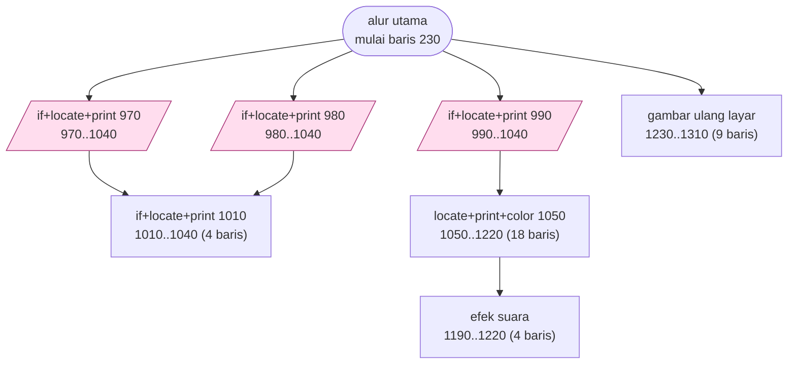
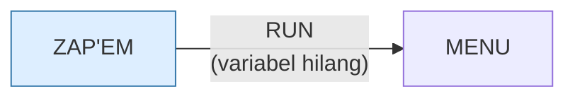

# ZAP'EM.BAS — Zap'em v1B

> Bertanggal 3 Feb 1982, kode build MAV-5-5-K.

| | |
|---|---|
| Sumber | Seri Attack / Serpent / Zap'em, 1982 |
| Tahun | 1982 |
| Panjang | 137 baris (nomor 230–1590) |
| Subrutin | 7, dipanggil dari 8 tempat |
| Percabangan | 17 `GOTO`, 8 `GOSUB`, 3 target `ON…` |
| Komentar | 4% dari baris |
| Jalankan | `run\ZAP'EM.bat` |

## Peta arsitektur

*Diagram di bawah ini bukan tafsiran — semuanya diturunkan langsung dari
kode: tiap panah adalah `GOSUB` yang benar-benar ada, tiap kotak adalah
blok antara sebuah entri dan `RETURN`-nya.*



Kotak bersudut miring berwarna = **penangan kejadian** (`ON KEY`/`ON ERROR`), yang dipanggil oleh interupsi, bukan oleh alur utama.

### Subrutin dan perannya

| Baris | Panjang | Dipanggil | Peran (diambil dari kode) |
|---|--:|--:|---|
| `1010`–`1040` | 4 baris | 2× | if+locate+print @1010 |
| `970`–`1040` | 8 baris | 1× | if+locate+print @970 *(handler)* |
| `980`–`1040` | 7 baris | 1× | if+locate+print @980 *(handler)* |
| `990`–`1040` | 6 baris | 1× | if+locate+print @990 *(handler)* |
| `1050`–`1220` | 18 baris | 1× | locate+print+color @1050 |
| `1190`–`1220` | 4 baris | 1× | efek suara |
| `1230`–`1310` | 9 baris | 1× | gambar ulang layar |

### Program lain yang dimuat



### Kejadian yang dijebak

- `ON KEY(1)` → baris 990
- `ON KEY(11)` → baris 980
- `ON KEY(14)` → baris 970

### Perulangan utama

`GOTO` mundur terpanjang: dari baris **1180** kembali ke **620** — melingkupi 560 nomor baris.
Itulah loop utama program ini; segala sesuatu di dalam rentang tersebut
dijalankan berulang.

### Data yang dipegang

| Array | Dipakai | Ditulis di baris |
|---|--:|---|
| `A` | 18× | 730, 750, 760, 770, 780, … |
| `B` | 17× | 730, 750, 760, 780, 790, … |
| `SCORE` | 12× | 1440 |
| `NME$` | 8× | 1440 |

## Bagaimana program ini disusun

Tujuh subrutin, dan peta kejadiannya memakai teknik yang sama dengan
`XWING.BAS`:

```basic
ON KEY(1)  GOSUB 990     ' F1
ON KEY(11) GOSUB 980     ' panah atas
ON KEY(14) GOSUB 970     ' panah bawah
```

`KEY(11)` dan `KEY(14)` adalah tombol panah. Ketiga penangan itu berakhir di
baris yang sama (1040) — **tiga pintu masuk ke satu blok**, masing-masing
menjalankan satu baris tambahan sebelum bergabung.

Pola *entry point overloading* yang sama muncul di `HEAREYE.BAS` dan
`MORTGAGE.BAS`. Di sini gunanya: tiap arah menetapkan variabel arahnya sendiri,
lalu semuanya memakai kode gerakan yang sama.

Yang membedakan berkas ini dari dua saudaranya (`ATTACK`, `SERPENT`) adalah
**papan skor yang bertahan antar sesi**:

```basic
DIM NME$(50), SCORE(50)
```

Lima puluh nama dan skor, dibaca dari dan ditulis ke berkas. Dua array paralel —
tapi baris 1480 memakai **dua `SWAP`**, jadi nama ikut bergeser bersama skornya
dan risikonya justru dihindari.

Cerita latarnya di baris 1270 memperlihatkan masalah lain:

```
"...The Horde is  a huge mass of drone ships that is try- ing to get past..."
```

Spasi ganda dan `try- ing` yang patah di tengah kata — teksnya **sudah dipotong
manual agar pas di layar 40 kolom**. Konsekuensinya, teks ini rusak di lebar
layar mana pun selain 40. Bandingkan dengan `ELIZA.BAS` yang membaca lebar layar
dari BIOS dan menyesuaikan diri.

## Yang menarik dari kodenya

Yang paling tua dari trio: 3 Februari 1982, kode build `MAV-5-5-K`. Layar
pembukanya sama dengan `ATTACK` dan `SERPENT` — "IBM / General utility programs" —
yang menunjukkan ketiganya dari disket bermerek IBM.

Yang membedakan berkas ini dari dua saudaranya: **ia menyimpan papan skor ke
disket**.

```basic
DIM A(250),B(250)
DIM NME$(50),SCORE(50)
```

`NME$(50)` dan `SCORE(50)` adalah lima puluh nama dan skor, dibaca dari dan
ditulis ke berkas.

> [!WARNING]
> **Koreksi, ditambahkan saat porting web (2026-08-10).** Bagian ini semula
> menyebut berkas skornya `BS.SCO`. **Itu keliru.** Baris 1390 dan 1500 jelas
> berbunyi:
>
> ```basic
> 1390 OPEN "METEOR.DAT" FOR INPUT AS #1
> 1500 OPEN "METEOR.DAT" FOR OUTPUT AS #1
> ```
>
> `BS.SCO` memang ada di `run\`, tapi **tidak ada satu pun program di koleksi
> yang membukanya** — sudah dicari di seluruh 83 berkas — dan isinya lima entri
> kosong bernilai 0. Ia yatim.
>
> Dan `METEOR.DAT` menyesatkan dengan cara yang lain: `METEOR.BAS` punya **nol**
> pernyataan `OPEN`. Berkas itu sepenuhnya milik ZAP'EM, bernama seperti program
> yang tidak pernah menyentuhnya.
>
> Isinya sepuluh skor sungguhan: `GAV 3100`, `FRED 2900`, `STEPHEN 2850`, dan
> seterusnya. Cap waktunya 1 Januari 1980 — tanggal bawaan PC tanpa baterai jam.
>
> Soal larik paralel: baris 1480 memakai **dua `SWAP`**, jadi nama ikut bergeser
> bersama skornya. Risikonya nyata secara umum, tapi program ini menghindarinya.
> Rinciannya di [`web/docs/zapem.md`](../web/docs/zapem.md) §3.

Baris 1270 memuat cerita latar permainannya, dan cara penulisannya menarik:

```basic
1270 PRINT:PRINT"  Your mission is to zap the invading   Horde ships in your path. The Horde is  a huge mass of drone ships that is try- ing to get past the imperial fleet and  into the rich homeworld systems."
```

Perhatikan spasi ganda dan tanda hubung `try- ing` yang dipatahkan di tengah
kata. Teksnya **sudah dipotong manual agar pas di layar 40 kolom** — penulisnya
menghitung karakter sendiri, karena tidak ada pembungkus kata otomatis.

Konsekuensinya: teks ini rusak kalau lebar layar berubah. Bandingkan dengan
`ELIZA.BAS` yang membaca lebar layar dari BIOS dan menyesuaikan diri.

## Yang bisa dipelajari

- Menyimpan papan skor antar sesi adalah fitur kecil yang membuat permainan terasa jauh lebih hidup.
- **Cerita latar bisa menutup laporan bug sebelum ada yang menulisnya.** "Ghost ships" di baris 1280 menjanjikan kapal yang butuh lebih dari satu tembakan dan kapal yang lenyap tanpa skor. Keduanya benar-benar terjadi — dan keduanya cacat kode: `B(LL)=0` memakai kolom sebagai indeks kapal, dan baris 1070-1090 cuma menguji kapal berindeks terkecil yang sebaris sehingga tembakan meleset kalau kapal itu masih di luar jangkauan sinar (kolom 3-24) padahal kapal lain sudah masuk. Diukur saat porting: **80 dari 749 tembakan** meleset karena sebab kedua. Rinciannya di [`web/docs/zapem.md`](../web/docs/zapem.md) §2.
- **Menanyakan benih acak kepada pemain** (baris 460+550) membuat permainannya bisa diulang dengan sengaja — *seeded run*, tiga puluh tahun sebelum istilahnya ada.

## Yang jangan ditiru

- Memotong teks manual agar pas di lebar layar tertentu. Ia akan rusak di lebar mana pun selain itu — tulis rutin pembungkus kata sekali saja.
- Nama dan skor di dua array terpisah tanpa peringatan bahwa keduanya harus selalu diurutkan bersama.

## Lampiran

### Perkakas bahasa yang dipakai

`PLAY` — musik lewat bahasa makro not, `SOUND` — nada mentah (frekuensi, durasi), `BEEP`, `ON KEY(n) GOSUB` — jebakan tombol fungsi, `ON x GOSUB` — pemanggilan berindeks, `INKEY$` — baca tombol tanpa menunggu Enter, `RUN "nama"` — muat program lain, variabel hilang, `OPEN` — baca/tulis berkas, `RANDOMIZE` — menyemai pengacak, `SWAP` — tukar isi dua variabel, `STRING$` — ulang satu karakter n kali, `LOCATE` — posisikan kursor, `COLOR` — warna teks

### Deklarasi array

```basic
DIM A(250),B(250)
DIM NME$(50),SCORE(50)
```

### Sepuluh baris pembuka

```basic
230 CLS
240 KEY OFF:SCREEN 0,1:COLOR 15,0,0:WIDTH 40:CLS:LOCATE 5,19:PRINT "IBM"
250 LOCATE 7,8 ,0:PRINT "General  utility  programs"
260 COLOR 9 ,0:LOCATE 10,9,0:PRINT CHR$(213)+STRING$(21,205)+CHR$(184)
270 LOCATE 11,9,0:PRINT CHR$(179)+"       ZAP'EM        "+CHR$(179)
280 LOCATE 12,9,0:PRINT CHR$(179)+STRING$(21,32)+CHR$(179)
290 COLOR 9,0:LOCATE 13,9,0:PRINT CHR$(179)+"     Version  1B     "+CHR$(179)
300 BEEP
310 LOCATE 14,9,0:PRINT CHR$(212)+STRING$(21,205)+CHR$(190)
320 COLOR 15,0  :LOCATE 17,7,0:PRINT "FEBRUARY 03,1982   MAV-5-5-K "
```

### Baris terpanjang (210 kolom)

```basic
1270 PRINT:PRINT"  Your mission is to zap the invading   Horde ships in your path. The Horde is  a huge mass of drone ships that is try- ing to get past the imperial fleet and  into the rich homeworld systems."
```

---
[Dasar-dasar BASIC](00-DASAR-BASIC.md) · [Daftar review](README.md) · [Katalog koleksi](../README.md)
