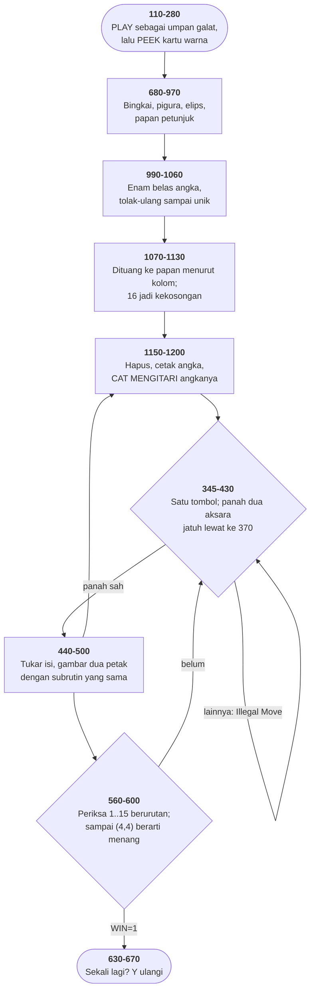

# 15PUZZLE.BAS di penelusur

> Program ketujuh puluh lima. 117 baris, nomor 100–1200, cakupan tabel
> **117/117 (100%)**.

Sumber: `run/15PUZZLE.BAS` · tabel: `tracer/program/15PUZZLE.js`

The 15 Puzzle (Dale Dewey, 1982). Angka yang baru dicetak dipakai sebagai dinding penahan cat — dan separuh teka-tekinya mustahil diselesaikan.

## Angka sebagai tembok

Subrutin di baris 1150 dipanggil setiap kali sebuah petak berubah. Isinya lima pernyataan, dan tiga di antaranya bekerja sama dengan cara yang tidak biasa:

```basic
1160 PAINT (45+32*X0,37+24*Y0),0,3
```

```basic
1180 PRINT "  ";CHR$(29);CHR$(29);: IF N0<>0 THEN PRINT USING "##";N0;
```

```basic
1190 PAINT (45+32*X0,37+24*Y0),C0,3
```

Baris 1160 mengecat seluruh isi petak dengan warna 0. Batasnya warna 3 — garis-garis kisi yang digambar baris 750. Sesudah ini petaknya kosong melompong.

Baris 1180 mencetak angkanya. Warna hurufnya 3, dipasang baris 960 lewat `POKE &H4E,3`. Jadi sekarang di dalam petak ada coretan berwarna 3 berbentuk angka.

Dan baris 1190 mengecat lagi — kali ini dengan warna ubin yang sebenarnya, batas tetap 3.

Cat mengalir dari tengah petak ke segala arah dan berhenti di warna 3. Ia berhenti di garis kisi, tentu saja. Tapi ia juga berhenti di **coretan angkanya**, karena angka itu juga berwarna 3.

Hasilnya: seluruh petak jadi warna ubin, kecuali coretan angka yang tetap berwarna 3.

Bisa dihitung. Ubin kiri-atas berisi angka 4 mengisi 713 piksel; sesudah cat yang kedua, 684 di antaranya berwarna ubin dan **29 tetap berwarna 3** — tepat coretan angkanya. Dan tidak satu piksel pun di luar petak ikut berubah warna: catnya tidak bocor.

Tidak ada topeng yang disimpan. Tidak ada penyalinan. Tidak ada larik berisi bentuk angka. Angkanya dicetak lebih dulu, lalu cat disuruh mengitarinya — dan yang mengitarinya bukan perhitungan apa pun, melainkan sifat "berhenti di warna tertentu" yang sudah dimiliki `PAINT`.

Yang membuatnya pantas dicatat: `PAINT` dibuat untuk mengisi bidang tertutup, dan di sini ia dipakai untuk hal yang sama sekali lain — mempertahankan bentuk yang sudah ada. Alat yang sama, dibaca dari sisi yang berlawanan.

## Separuh teka-tekinya mustahil

Baris 990 sampai 1060 mengocok enam belas angka:

```basic
1000  ST(I)=INT(RND*16)+1
```

```basic
1020  FOR J=1 TO I-1
```

```basic
1030   IF ST(I)=ST(J) THEN 1000
```

```basic
1040  NEXT J
```

Ambil angka acak; kalau sudah terpakai, ambil lagi. Sederhana, benar, dan menghasilkan permutasi yang benar-benar seragam — tiap susunan dari 16! kemungkinan punya peluang yang persis sama.

Itu justru cacatnya.

Geseran di papan lima belas hanya bisa menghasilkan susunan yang satu **kelas paritas** dengan susunan awalnya. Setiap geseran menukar kekosongan dengan satu ubin — sebuah transposisi — dan sekaligus memindahkan kekosongan satu petak. Kedua perubahan itu terikat, dan hasilnya sebuah besaran yang tidak pernah berubah sepanjang permainan.

Separuh dari 16! susunan punya nilai besaran itu yang benar. Separuh lagi tidak, dan tidak ada urutan geseran mana pun — sepanjang apa pun — yang bisa menyeberang.

Program ini mengambil dari 16! itu tanpa memilah. Jadi kira-kira setiap teka-teki kedua yang ia bagikan mustahil diselesaikan.

Dihitung di penelusur atas seratus dua puluh benih yang berbeda: **54 dari 120** susunan awalnya berada di kelas paritas yang salah. Empat puluh lima persen, dan yang sebenarnya lima puluh.

Dan pemainnya tidak pernah diberi tahu. Layar tidak berubah, tampilannya sama, "Move ####" tetap bertambah. Yang membedakan cuma bahwa "You have WON!" tidak akan pernah muncul.

Perbaikannya tiga baris: hitung paritas susunannya, dan kalau salah, tukar dua ubin sembarang. Yang mahal bukan menuliskannya, melainkan menyadari bahwa **acak seragam** dan **acak yang sah** adalah dua hal berbeda — dan bahwa pengocok yang lebih jujur di sini justru yang lebih salah.

## Peta arsitektur



## Alur yang layak diikuti

| baris | yang terjadi |
|---|---|
| `1190` | cat berhenti di warna 3 → **angka yang baru dicetak jadi tembok** |
| `1160` | …didahului cat warna 0 yang menghapus seluruh petak |
| `990` | kocokan tolak-ulang: **seragam**, dan karena itu separuhnya mustahil |
| `580` | sampai petak (4,4) berarti menang — kekosongannya tidak perlu diperiksa |
| `590` | `RETURN` dari dalam dua gelung; bingkainya ditinggalkan menggantung |
| `360` | `ELSE` menempel pada IF yang **kedua**; panah lolos ke 370 |
| `790` | `POKE &H4E` — satu-satunya cara mewarnai huruf di mode grafik |
| `355` | `WHILE+` dengan plus nyasar; penyangga tombol dikosongkan |
| `1100` | angka **16** adalah kekosongan; letaknya disimpan di `XZ,YZ` |

## Yang bisa dicoba di halaman

| coba ini | yang terlihat |
|---|---|
| pasang titik henti di 1190 | cat berhenti di warna 3 → **angka yang baru dicetak jadi tembok** |
| pasang titik henti di 1160 | …didahului cat warna 0 yang menghapus seluruh petak |
| pasang titik henti di 990 | kocokan tolak-ulang: **seragam**, dan karena itu separuhnya mustahil |
| pasang titik henti di 580 | sampai petak (4,4) berarti menang — kekosongannya tidak perlu diperiksa |
| pasang titik henti di 590 | `RETURN` dari dalam dua gelung; bingkainya ditinggalkan menggantung |

Aslinya dijalankan dengan `run\\15PUZZLE.bat`.

> Empat tombol panah menggeser ubin ke dalam petak kosong. Q berhenti. Perhatikan bahwa angka pada ubin tetap utuh setiap kali warnanya berubah — dan bahwa teka-tekinya belum tentu bisa diselesaikan.

## Penyimpangan dari aslinya

1. **`PLAY` dan `SOUND` diam.** Baris 120 memakai `PLAY "mf"` bukan untuk bunyi melainkan sebagai umpan galat; di penelusur ia selalu lulus, jadi baris 140-190 tidak pernah dicapai.
2. **`PEEK(&H410)` selalu menjawab "ada kartu warna"**, jadi baris 220-280 juga tidak pernah dicapai.
3. **`RANDOMIZE VAL(RIGHT$(TIME$,2))` diganti benih tetap**, supaya kocokan yang sama bisa ditelusuri dua kali.
4. **`DEF SEG: POKE &H4E,n` ditiru sungguhan** sebagai warna huruf, karena itu memang artinya dan tanpa itu papan petunjuknya kehilangan warnanya. Lihat `warnaTeks` di `mesin/penjalan.js`.

## Yang layak ditiru

**Cetak dulu, cat kemudian.** Subrutin 1150-1200 menggambar satu petak dengan tiga pernyataan, dan urutannya yang membuatnya bekerja: `PAINT` warna 0 menghapus petak, `PRINT USING "##"` mencetak angkanya dengan warna 3, lalu `PAINT` warna `C0` dengan **batas 3**. Cat yang terakhir mengalir dari tengah petak dan berhenti begitu menemui warna 3. Yang berwarna 3 di dalam petak itu cuma coretan angkanya. Jadi catnya mengalir mengitari angka, dan angkanya selamat. Tidak ada topeng, tidak ada penyalinan, tidak ada larik yang menyimpan bentuk angka. Sifat "berhenti di warna tertentu" milik `PAINT` dipakai untuk sesuatu yang bukan bidang tertutup.

**Satu subrutin untuk dua hal yang berlawanan.** Baris 460-500 memanggil subrutin yang sama dua kali: sekali dengan `C0=0` untuk menggambar petak asal sebagai kekosongan, sekali dengan `C0=2` untuk menggambar petak tujuan sebagai ubin. Di antara keduanya, `SWAP Y0,YZ: SWAP X0,XZ` menukar **penunjuknya**, bukan isi papan. Isi papan sudah ditukar di baris 450. Menggambar dan menghapus jadi pernyataan yang sama dengan argumen berbeda — sebelas baris untuk seluruh animasi geseran.

**Menguji kemampuan dengan mencoba memakainya.** Baris 110-130 tidak menanyakan versi penafsirnya. Ia memasang penangkap galat, lalu **mencoba** `PLAY "mf"` — pernyataan yang hanya ada di BASICA. Kalau galat 73 datang, penafsirnya BASIC biasa. Dan kalau galat lain yang datang, baris 130 melanjutkannya ke 200 seolah tidak terjadi apa-apa. Uji kemampuan yang tidak salah menuduh.

## Yang jangan ditiru

**Pengocok yang terlalu jujur.** Baris 990-1060 menghasilkan permutasi acak enam belas angka yang benar-benar seragam. Itu terdengar seperti yang diinginkan. Tapi papan lima belas hanya bisa dikembalikan ke urutan dari **separuh** permutasinya. Separuh yang lain terkurung di kelas paritas yang berbeda, dan tidak ada urutan geseran mana pun yang menyeberang. Jadi kira-kira setengah teka-teki yang dibagikan program ini MUSTAHIL diselesaikan, dan pemainnya tidak pernah diberi tahu. Ia akan menggeser sampai bosan, lalu menyalahkan dirinya. Tambalannya sepele: hitung paritas permutasinya, dan kalau ganjil, tukar dua ubin sembarang. Tiga baris. Yang mahal bukan perbaikannya, melainkan MENYADARI bahwa "acak seragam" dan "acak yang sah" adalah dua hal yang berbeda.

**ELSE yang menempel pada IF yang salah dibaca.** `360 IF LEN(ANS$)=1 THEN IF ANS$="Q" OR ANS$="q" THEN 630 ELSE 430` Dibaca sekilas, `ELSE 430` seperti pasangan `IF LEN(ANS$)=1`. Sebenarnya ia milik IF yang kedua. Kebetulan itulah yang dimaui — tombol panah panjangnya dua aksara dan harus jatuh lewat ke baris 370. Tapi kebenarannya bergantung pada aturan penguraian yang tidak terlihat di barisnya. Satu tanda kurung, atau memecahnya jadi dua baris, akan menghilangkan seluruh keraguan.

**RETURN dari dalam dua gelung, tiap gerakan.** Subrutin 560-600 selalu keluar lewat `RETURN` di baris 580 atau 590, tidak pernah lewat `NEXT`. Tiap panggilan meninggalkan dua bingkai gelung menggantung di tumpukan penafsirnya. Yang menyelamatkannya aturan GW-BASIC: `FOR` dengan nama variabel yang sama membuang bingkai lama. Karena panggilan berikutnya juga memakai I dan J, tumpukannya tidak pernah tumbuh. Program ini benar — tapi kebenarannya dititipkan pada perilaku pembersihan penafsir, bukan pada strukturnya sendiri.

**Baris 610 yang punya dua tuan.** Baris 610 mencetak "Illegal Move!!" dan ia BUKAN bagian dari subrutin pemeriksa kemenangan di atasnya — meski ia berada tepat sesudah `NEXT J: NEXT I` dan berbagi `RETURN` di baris 620 dengannya. Kalau gelung 560-600 sampai habis, alurnya jatuh ke 610 dan mencetak "Illegal Move!!" pada saat pemain baru saja menang. Itu tidak terjadi — baris 580 selalu memotong lebih dulu — tapi yang mencegahnya sebuah kebetulan aritmetika, bukan sebuah batas.

---
[Rancangan penelusur](_rancangan.md) · [BREAKOUT](breakout.md) · [SOLITAIR](solitair.md)
