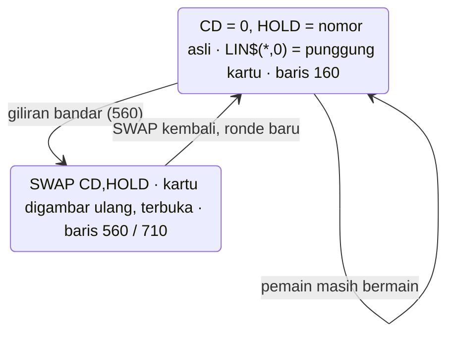
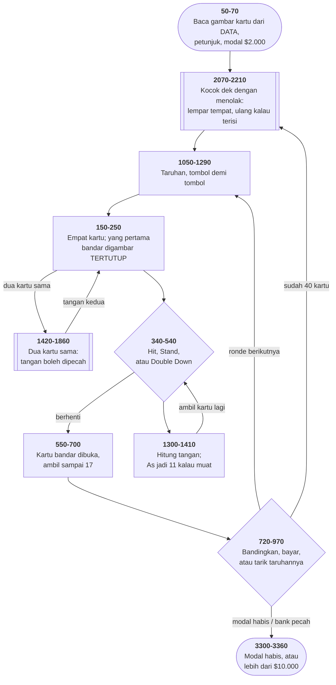

# 21.BAS di penelusur

> Program kesembilan belas. 336 baris, nomor 10–3360, cakupan tabel
> **336/336 (100%)**.

Sumber: `run/21.BAS` · tabel: `tracer/program/21.js`

Blackjack. Kartu digambar sebagai kotak 11×7 dan isinya dibaca dari tabel —
lima baris teks untuk tiap nilai kartu.

Terverifikasi apa adanya di penelusur:

```
╔═════════╗╔═════════╗
║XXXXXXXXX║║7 ▄   ▄  ║                                                You Have
║XXXXXXXXX║║♠   ▄    ║                                               $1,500.00
║XXXXXXXXX║║  ▄   ▄  ║
║XXXXXXXXX║║        ♠║                                              The Bet Is
║XXXXXXXXX║║  ▄   ▄ 7║                                                 $500.00
╚═════════╝╚═════════╝
╔═════════╗╔═════════╗
║8 ▄   ▄  ║║Q        ║
║♣   ▄    ║║♣        ║
║  ▄   ▄  ║║         ║
║    ▄   ♣║║        ♣║
║  ▄   ▄ 8║║        Q║
╚═════════╝╚═════════╝
```

## Kartu tertutup yang tidak butuh bendera

Kartu pertama bandar dibagikan tertutup. Cara wajar memprogramnya: satu bendera
`tertutup`, dan penggambar kartu yang memeriksanya.

Program ini tidak punya bendera itu. Lihat baris 160:

```basic
160 A=1:B=1:CP(1)=DK(CD):HOLD=CD:CD=0:GOSUB 2220:CD=HOLD
```

Nilai kartunya disimpan ke `CP(1)` seperti biasa. Lalu nomor urutnya
dititipkan ke `HOLD`, dan `CD` — penunjuk kartu yang dipakai penggambar —
diisi **nol**.

Penggambar di baris 2320 membaca `LIN$(1,DK(CD))`. Dengan `CD=0`, `DK(0)` juga
nol, dan baris `DATA` pertama (2470) berisi lima baris `"XXXXXXXXX"`. Punggung
kartu.

Waktu tiba saatnya membuka, baris 560:

```basic
560 A=1:SWAP CD,HOLD:B=1:GOSUB 2220:SWAP HOLD,CD
```

Nomornya ditukar kembali, kartunya digambar ulang **di tempat yang sama**, dan
ditukar lagi.



Pola yang layak diingat: **keadaan yang diwakili oleh nilai data, bukan oleh
bendera terpisah.** Tidak ada yang bisa lupa memeriksa benderanya, karena
benderanya tidak ada.

Terverifikasi: taruh 5 keping, dapat 8♣ dan Q♣ (= 18), tekan `S`. Kartu bandar
terbuka jadi 8♦, ia menarik 6♥ → 21, dan baris 23 menulis
`Dealer Has 21 . You Have 18 . Dealer Wins`.

## Mengocok dengan menolak

```basic
2130 B=FIX(RND*52)+1
2150 IF DK(B)<>0 THEN 2130
2160 DK(B)=A:CDSU(B)=C
```

Lempar tempat acak di dek; kalau sudah terisi, lempar lagi. Namanya
**penolakan**: coba, dan kalau hasilnya tidak boleh, coba lagi. Benar — tiap
susunan dek punya peluang yang sama — dan seluruhnya lima baris tanpa larik
bantu.

Harganya terlihat menjelang akhir. Waktu tinggal satu tempat kosong, tiap
lemparan cuma punya peluang 1 dari 52 mengenainya, jadi rata-rata perlu **52
lemparan untuk kartu terakhir**. Seluruh dek butuh sekitar 236 lemparan
alih-alih 52.

Untuk 52 kartu itu tidak terasa. Untuk lima puluh ribu, program ini akan tampak
menggantung. **Algoritma yang benar dan algoritma yang *terus* benar waktu
dibesarkan adalah dua hal berbeda.**

Cara yang tidak menolak — kocokan Fisher-Yates — menukar tiap kartu dengan
kartu acak di depannya, sekali jalan, 52 langkah tepat.

## As yang ditawari sebelas satu per satu

```basic
1310 FOR C=1 TO TS+2 ... PYRHD=PYRHD+PYR(C) ... NEXT
1360 FOR C=1 TO TS+2
1370  IF PYR(C)<>1 THEN 1400
1380  IF PYRHD+10=21 THEN PYRHD=21:RETURN
1390  IF PYRHD+10<21 THEN PYRHD=PYRHD+10
1400 NEXT
```

Semua kartu dijumlah dulu **sebagai satu**, lalu tiap As ditawari kenaikan
sepuluh — diterima kalau masih muat. Dua As jadi 1+11, tiga As jadi 1+1+11.
Aturan yang rumit diucapkan sebagai gelung sederhana.

Dan aturan bandarnya seluruhnya satu baris:

```basic
670 IF CPHD>16 THEN 720
```

Ambil kartu sampai 17. Bukan penyederhanaan program ini — memang begitu aturan
kasino.

## Peta arsitektur



## Seratus sembilan puluh baris yang tidak melakukan apa pun

Baris 2700 sampai 2890 memuat satu subrutin lengkap: penggambar tumpukan keping
taruhan di meja.

**Tidak ada satu pun `GOSUB 2700` atau `GOTO 2700` di seluruh program.** Baris
2690 berakhir dengan `RETURN`, dan tidak ada yang jatuh ke sana.

Dari mana asalnya? Bandingkan dengan [CRAPS.BAS](craps.md) baris 2310–2500 —
sama persis, termasuk nama variabelnya. Dan salah satu variabel itu, `P`, di
CRAPS.BAS berarti "bertaruh PASS atau DON'T PASS". Di sini `P` **tidak pernah
diisi sama sekali**; nilainya nol selamanya.

Ceritanya jelas: penulisnya menyalin blok kode yang berguna dari permainan
sebelumnya, lalu memutuskan memakai cara lain (baris 2620–2680, yang menggambar
tumpukan di tepi kanan) — dan lupa membuang yang lama.

Kode mati begini tidak membuat program salah. Yang dirusaknya kepercayaan:
pembaca berikutnya harus membaca seluruh 190 baris itu untuk tahu bahwa ia
tidak perlu membacanya. **Dan di penelusur, sorotannya tidak akan pernah
sekali pun menyentuh baris-baris itu — itulah caranya terlihat.**

## Yang bisa dicoba di halaman

| coba ini | yang terlihat |
|---|---|
| pasang titik henti di 160 | `CD=0` — kartu bandar jadi "kartu nomor nol" |
| pasang titik henti di 560 | `SWAP CD,HOLD` dan kartunya digambar ulang, terbuka |
| pasang titik henti di 2130 | pengocokan yang menolak; makin akhir makin sering mengulang |
| pasang titik henti di 1360 | tiap As ditawari +10, satu per satu |
| pasang titik henti di 2140 | `ABC` dihitung dan tidak pernah dibaca siapa pun |
| jalankan sampai selesai | sorotan **tidak pernah** menyentuh baris 2700–2890 |
| tekan `D` saat modal kurang | baris 380 gagal, pesan di baris 400 |
| dapat dua kartu sama | tawaran memecah tangan (baris 260) |

## Penyimpangan dari aslinya

1. **`HOLD` adalah skalar DAN larik di program ini.** Skalarnya menyimpan nomor
   kartu tertutup (baris 160); lariknya jadi tempat parkir kartu waktu tangan
   dipecah (baris 1460). Di penelusur lariknya bernama `HOLD_`.
2. **`SOUND` diam**, jadi klik tiap kartu dibagikan tidak terdengar, dan
   **`COLOR 31` di baris 3350 tidak berkedip.**
3. **Pengacaknya berbenih tetap**, jadi urutan kartunya selalu sama. Itu justru
   berguna: strategi yang sama bisa diulang dan dibandingkan.
4. **Kelima gelung tunda habis seketika**, termasuk jeda 1500 putaran sebelum
   bandar mengambil kartu (baris 680) yang di aslinya membuat permainannya
   terasa berdebar.

## Yang jangan ditiru

- **Kode mati yang ikut tersalin dari program lain.** Baris 2700–2890.
- **Perhitungan yang hasilnya tidak pernah dibaca.** Baris 2140:
  `ABC=RND*RND*RND*RND*RND*(ABC+2)`. `ABC` tidak muncul di tempat lain mana
  pun; yang sebenarnya terjadi cuma lima panggilan `RND`.
- **Nilai kartu yang diubah di tempatnya.** Baris 200–250 menulis `PYR(1)=10`
  untuk J, Q, K — nilai aslinya hilang selamanya.
- **Melompat satu baris terlalu jauh.** Baris 1990 kembali ke **1940**, bukan
  1950, jadi `HIT` dan `STD` dinolkan ulang tiap tombol salah ditekan. Tidak
  berbahaya di sini, tapi persis begitulah cara gelung yang benar berubah jadi
  gelung yang salah.

---
[Rancangan penelusur](_rancangan.md) · [MENU](menu.md) · [INTRO](intro.md) · [CHECK](check.md) · [TOWERS](towers.md) · [HEAREYE](heareye.md) · [TICTAC](tictac.md) · [MASTER](master.md) · [BOGGY](boggy.md) · [PEGLEAP](pegleap.md) · [BIO](bio.md) · [HANGMAN](hangman.md) · [BUSONE](busone.md) · [OTHELLO](othello.md) · [CRAPS](craps.md) · [DRAW](draw.md) · [WILDCAT](wildcat.md) · [MAZE](maze.md) · [SUB](sub.md)
