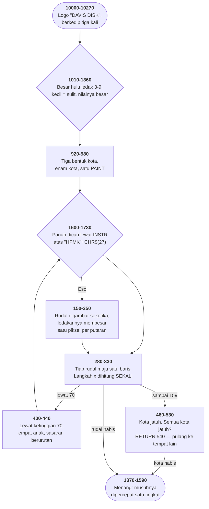

# ABM2A.BAS di penelusur

> Program ketujuh puluh sembilan. 231 baris, nomor 10–10270, cakupan tabel
> **231/231 (100%)**.

Sumber: `run/ABM2A.BAS` · tabel: `tracer/program/ABM2A.js`

ABM 2 (Ed Davis, 18 Juli 1982). Bahasa DRAW dipakai sebagai bahasa pemrograman: string yang memanggil string lain sebagai subrutin gambar.

## Bahasa gambar yang punya subrutin

Bahasa `DRAW` punya perintah bernama `X`, dan ia satu-satunya perintah di bahasa itu yang tidak menggambar apa pun.

`X` berarti: *jalankan string LAIN sebagai perintah gambar, lalu kembali ke sini.*

Yang menyusul `X` bukan nama variabelnya melainkan ALAMATNYA di memori, dan cara mendapatkan alamat itu `VARPTR$`:

```basic
950 PSET(0,180):DRAW "R32;X"+VARPTR$(CT2$)+"R16;X"+VARPTR$(CT$)
```

```basic
960 DRAW "R16;X"+VARPTR$(CT3$)+"R5U10R6D10R5;X"+VARPTR$(CT$)+"R16;X"+VARPTR$(CT2$)+"R16;X"+VARPTR$(CT$)+"R16;"
```

Dua baris, dan seluruh garis langit enam kota tergambar.

Bacalah baris 960 sebagai daftar perintah: geser 16 ke kanan, gambar kota bentuk ketiga, geser dan gambar sebuah menara kecil dari lima perintah mentah, gambar kota bentuk pertama, geser, gambar kota bentuk kedua, geser, gambar kota bentuk pertama lagi, geser.

Tiga bentuk kota, dipakai enam kali, dan sebuah menara yang digambar langsung di tengah panggilan — karena bentuknya cuma dipakai sekali dan tidak layak disimpan.

Yang membuatnya pantas dicatat: `DRAW` di sini bukan lagi cara menggambar. Ia bahasa pemrograman yang punya prosedur, dan program yang ditulis dengannya ada di dalam empat variabel string.

Dan penutupnya baris 970:

```basic
970 PAINT (120,190),3
```

Satu titik. Karena jalur yang digambar itu bersambung dari tepi ke tepi dan bertumpu di dasar layar, seluruh kota adalah satu bidang tertutup. Enam kota, satu perintah isi.

Dihitung di penelusur: pena berakhir di x=323 — tiga piksel di luar tepi kanan layar, jadi jalurnya benar-benar menyeberang penuh. Dan `PAINT` yang menyusul mengisi **8.682** piksel, tepat bagian bawah layar; 55.318 sisanya tetap kosong. Tidak ada kebocoran.

## Enam belas rudal di tujuh baris larik

```basic
40 DIM T%(1,5):DIM M(6,15):DIM CH%(66)
```

`M` berukuran 7×16, dan tiap barisnya berarti hal yang berbeda:

`M(0,I)` keadaan — 0 habis, 1 terbang, 2 menunggu

`M(1,I)` nomor kota sasarannya

`M(2,I)`, `M(3,I)` tempatnya sekarang

`M(4,I)` langkah mendatar per baris

`M(5,I)`, `M(6,I)` tempat ia diluncurkan

Tidak ada tipe data. Tidak ada nama. Tujuh larik sejajar, ditumpuk jadi satu dan dibedakan oleh indeks pertamanya.

Dua belas rudal pertama disiapkan di baris 660-720 dan diberi keadaan 2 — menunggu. Baris 730 mengubah SATU saja jadi 1:

```basic
730 M(0,0)=1:REM THIS ENABLES ONLY ONE MISSLE ******
```

Sisanya dinyalakan satu per satu oleh baris 350-390, dengan peluang empat persen tiap putaran gelung utama. Tidak ada jadwal, tidak ada penghitung waktu, tidak ada antrean. Sebuah lemparan dadu, dan rudal pertama yang masih menunggu berangkat.

Nomor 12 sampai 15 tidak pernah disentuh oleh persiapan itu. Mereka disisakan.

Baris 320 menandai rudal pertama yang melewati ketinggian 70, dan baris 400-440 mengisi keempat nomor sisa itu dengan anak-anaknya — lahir di tempat induknya, masing-masing menuju kota yang berbeda:

```basic
410 N=N+1:TT%=TT%+1:IF TT%>5 THEN TT%=TT%-6
```

```basic
420 I=N+11: M(0,I)=1:M(1,I)=TT%:M(2,I)=M(2,MIRV%)…
```

`TT%` berjalan dari sasaran induknya ke kota berikutnya, melingkar kembali ke nol sesudah lima. Empat anak, empat kota berurutan — satu serangan yang menyebar rapi.

MIRV, sepuluh baris. Dan yang membuatnya sepuluh baris: nomor 12 sampai 15 sudah ada sejak awal, sudah punya tujuh baris atribut yang sama dengan rudal biasa, dan gelung di baris 280-330 sudah menelusuri sampai 15 tanpa tahu apa yang akan mengisinya.

Larik yang dibuat sedikit lebih besar daripada yang dibutuhkan, dan sebuah kemampuan yang tumbuh di ruang sisa itu.

## Peta arsitektur



## Alur yang layak diikuti

| baris | yang terjadi |
|---|---|
| `950` | `X`+`VARPTR$` — DRAW **memanggil string lain** sebagai subrutin |
| `920` | …tiga bentuk kota, enam kota, dua baris |
| `970` | …dan satu `PAINT` mengisi seluruh garis langitnya |
| `40` | `M(6,15)` — **tujuh arti** di satu larik |
| `420` | …nomor 12-15 disisakan untuk anak MIRV |
| `430` | …pembaginya **90**, bukan 160: sisa perjalanan dari ketinggian 70 |
| `1620` | panah dicari lewat `INSTR("HPMK")` — kode pindainya huruf |
| `520` | subrutin memakai `I`, nama yang **masih dipakai pemanggilnya** |
| `530` | `RETURN 540` — pulang ke tempat lain |
| `250` | warnanya ditulis `O` (huruf), bukan `0` — dan tetap benar |
| `1210` | penyangga papan tik dikosongkan — **terbalik** dari LIFE2 baris 2016 |

## Yang bisa dicoba di halaman

| coba ini | yang terlihat |
|---|---|
| pasang titik henti di 950 | `X`+`VARPTR$` — DRAW **memanggil string lain** sebagai subrutin |
| pasang titik henti di 920 | …tiga bentuk kota, enam kota, dua baris |
| pasang titik henti di 970 | …dan satu `PAINT` mengisi seluruh garis langitnya |
| pasang titik henti di 40 | `M(6,15)` — **tujuh arti** di satu larik |
| pasang titik henti di 420 | …nomor 12-15 disisakan untuk anak MIRV |

Aslinya dijalankan dengan `run\\ABM2A.bat`.

> Pilih 3 untuk hulu ledak paling kecil, lalu 3 untuk kecepatan musuh normal. Panah menggerakkan bidikan, Esc menembak. Perhatikan rudal pertama yang melewati tengah layar: ia memecah diri jadi lima.

## Penyimpangan dari aslinya

1. **`PLAY` dan `SOUND` diam.**
2. **`VARPTR$` tidak punya padanan di penelusur.** Tabel barisnya menulis NAMA variabelnya langsung di dalam string DRAW (`XCT2$;` menggantikan `"X"+VARPTR$(CT2$)`). Yang berubah cuma cara stringnya menyebut tujuannya; yang dikerjakan sama persis.
3. **`POKE &H410` di baris 1870 dan 1950 tidak melakukan apa-apa.** Di mesin aslinya keduanya benar-benar menukar kartu tampilan yang dikira BASIC terpasang.
4. **`LOAD"MENU",R` tidak bisa dijalankan** — bentuk KEEMPAT dari "jalan pulang ke menu" di koleksi ini, sesudah `RUN "MENU"`, `CHAIN "MENU"`, dan `RUN "MENU.PGM"` yang berkasnya tidak ada.
5. **`RANDOMIZE VAL(RIGHT$(TIME$,2))` diganti benih tetap.**

## Yang layak ditiru

**Subrutin di dalam sebuah string.** Baris 920-940 menyimpan tiga siluet kota sebagai string DRAW biasa. Ketiganya tidak pernah digambar langsung. Baris 950-960 memanggilnya: `950 PSET(0,180):DRAW "R32;X"+VARPTR$(CT2$)+"R16;X"+VARPTR$(CT$)` Perintah `X` berarti "jalankan string yang alamatnya menyusul". `VARPTR$` memberikan alamat itu. Jadi DRAW pergi ke string lain, menjalankan isinya, lalu kembali — panggilan subrutin, di dalam sebuah bahasa yang seluruhnya berupa string. Enam kota digambar dari tiga bentuk, dan yang memisahkan mereka cuma `R16` di sela-selanya: geser pena enam belas piksel ke kanan, gambar kota berikutnya. Ini fitur GW-BASIC yang paling jarang dipakai di seluruh koleksi ini — satu-satunya pemakaian, di satu program.

**Satu PAINT untuk seluruh kota.** Baris 970: `PAINT (120,190),3`. Satu titik, satu warna, dan seluruh garis langit terisi. Yang membolehkannya: garis langitnya digambar sebagai SATU jalur bersambung dari tepi kiri layar sampai tepi kanan, dan ia bertumpu di tepi bawah. Jadi bagian bawah layar adalah satu bidang tertutup yang bentuknya kebetulan berupa enam kota. Tidak ada satu pun kota yang dicat sendiri-sendiri.

**Langkah yang dihitung sekali.** `710 M(4,I)=(T%(1,II)-M(5,I))/160` Selisih antara tempat lahir rudal dan kota sasarannya, dibagi 160 — jumlah baris yang harus dilaluinya. Hasilnya langkah x per baris. Sesudah itu rudalnya tidak pernah memikirkan sasarannya lagi. Baris 300 cuma menambah dua bilangan: `300 M(2,I)=M(2,I)+M(4,I):M(3,I)=M(3,I)+1` Enam belas rudal yang mengejar sasaran, dan tidak satu pun yang perlu tahu di mana sasarannya. Pengejarannya sudah dibakukan jadi sebuah bilangan. Dan baris 430 melakukan hal yang sama untuk anak MIRV dengan pembagi **90** — karena mereka lahir di ketinggian 70 dan sisa perjalanannya sembilan puluh baris. Angka yang benar, dihitung sekali, dan tidak pernah dijelaskan.

**Kode pindai yang kebetulan huruf.** `1600 K$=RIGHT$(INKEY$,1)` `1620 J=INSTR("HPMK"+CHR$(27),K$):ON J GOTO 1640,1660,1680,1700,1720` Tombol panah datang sebagai dua aksara: `CHR$(0)` lalu kode pindainya. Kode pindai panah atas 72, dan CHR$(72) adalah huruf **H**. Bawah 80 = P, kanan 77 = M, kiri 75 = K. Jadi `RIGHT$(INKEY$,1)` mengambil aksara kedua, dan keempat panah bisa dicari sekaligus dengan satu `INSTR` di dalam string `"HPMK"`. Lima kemungkinan, satu pencarian, satu `ON GOTO`. Akibat sampingannya: menekan huruf H juga menaikkan bidikan.

**Ledakan berongga dari dua lingkaran.** `470 FOR R=6 TO 36:IF R<30 THEN CIRCLE (M(2,I),160),R,2` `480 CIRCLE (M(2,I),160),R-5,0` Satu lingkaran berwarna menggambar tepi luar, satu lingkaran berwarna latar berjari-jari lima lebih kecil menghapus di belakangnya. Yang terlihat cincin setebal lima piksel yang mengembang lalu lenyap. Dan `IF R<30` menghentikan yang menggambar lebih awal daripada yang menghapus, jadi enam putaran terakhir hanya membersihkan. Api padam sendiri.

## Yang jangan ditiru

**Subrutin yang mencuri pencacah pemanggilnya.** Baris 280-330 adalah gelung `FOR I=0 TO 15` yang memajukan tiap rudal. Di dalamnya, baris 310 memanggil `GOSUB 460` saat sebuah rudal mencapai tanah. Dan subrutin itu, di baris 520, membuka gelungnya sendiri: `FOR I=0 TO 5` — nama yang sama. Kalau sebuah kota masih berdiri, baris 520 `RETURN` di tengah gelung, dan `I` membawa nomor KOTA, bukan nomor rudal. Sesudah pulang, baris 320 memeriksa rudal ke-I yang salah, dan baris 330 melanjutkan gelung dari tempat yang salah. Diukur di penelusur: rudal nomor **0** mencapai tanah, dan sesudah `RETURN` nilai `I` menjadi **1** — nomor kota pertama yang masih berdiri. `NEXT I` lalu menaikkannya ke 2, jadi rudal nomor 1 TIDAK dimajukan sama sekali pada bingkai itu. Arah kesalahannya bergantung angka mana yang lebih besar. Kalau nomor kota yang selamat lebih KECIL daripada nomor rudal yang meledak, rudal-rudal di antaranya justru diproses dua kali dan melompat dua baris sekaligus. Gejalanya: sesudah sebuah kota jatuh, beberapa rudal tersendat atau menyentak. Cocok betul dengan suasana permainannya, dan karena itu tidak pernah dilaporkan sebagai cacat.

**Rekor yang diumumkan sebelum diperbarui.** Baris 580 mencetak `HSC`. Baris 600 baru menaikkannya kalau skor barusan lebih tinggi. Jadi pemain yang baru saja memecahkan rekor melihat rekor LAMA di layar yang mengumumkan kekalahannya. Rekornya baru muncul di permainan berikutnya. Dua puluh baris di bawahnya, urutan yang sama ditulis dengan benar: baris 1440 memperbarui `HSC` sebelum baris 1460 mencetaknya.

**Huruf O yang menyamar jadi nol.** `250 LINE (M(5,I),M(6,I))-(M(2,I),M(3,I)),O` Argumen warnanya huruf **O**, bukan angka **0**. Baris ini seharusnya menghapus jejak rudal yang baru ditembak jatuh. Ia bekerja — karena variabel `O` tidak pernah diisi di seluruh 231 baris ini, jadi nilainya nol, jadi warnanya nol, jadi jejaknya terhapus. Kebenaran yang dititipkan pada sebuah variabel yang tidak ada. Satu baris `O=3` di mana pun akan mengubah baris 250 jadi menggambar ulang jejak yang mau dihapusnya.

**Menu yang menawarkan empat dan menerima tujuh.** Baris 1160-1200 menawarkan hulu ledak 3, 4, 5, dan 9. `1230 IF VAL(K$)>2 THEN WH%=VAL(K$) ELSE GOTO 1220` Syaratnya cuma "lebih dari dua". Angka 6, 7, dan 8 diterima tanpa sepatah kata — dan berfungsi persis seperti yang diharapkan, karena `WH%` dipakai langsung sebagai jangkauan ledakan. Bukan cacat yang merusak apa pun. Tapi menunya berbohong tentang apa yang bisa dipilih, dan yang menentukan bukan menunya melainkan satu perbandingan di baris lain.

---
[Rancangan penelusur](_rancangan.md) · [FLYS](flys.md) · [LANDER](lander.md) · [BREAKOUT](breakout.md)
