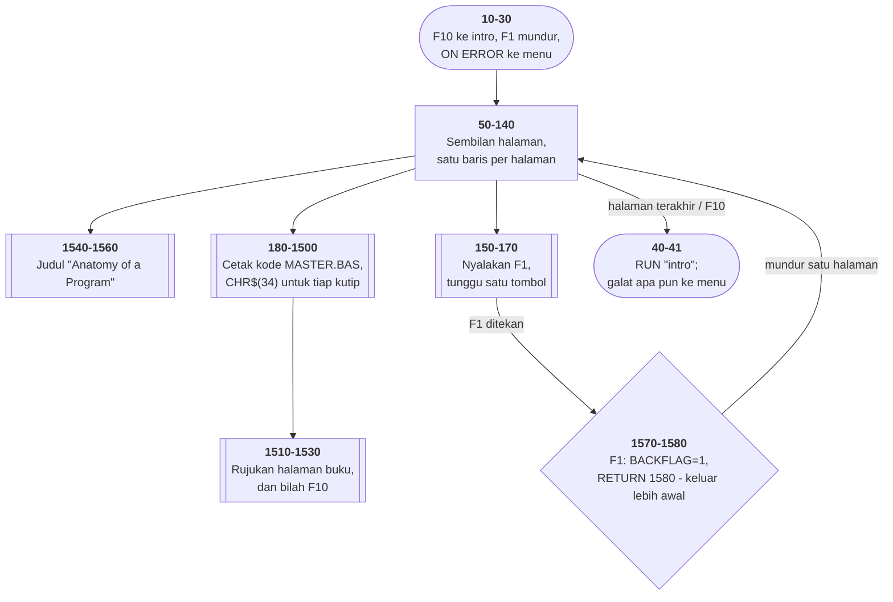

# ANATOMY.BAS di penelusur

> Program kelima puluh empat. 159 baris, nomor 10–1580, cakupan tabel
> **159/159 (100%)**.

Sumber: `run/ANATOMY.BAS` · tabel: `tracer/program/ANATOMY.js`

"Anatomy of a Program": sembilan halaman yang **menampilkan kode sumber program
lain**, satu bagian per halaman, dengan rujukan nomor halaman ke buku petunjuk
cetak.

## Kenapa CHR$(34) ada di mana-mana

Di BASIC, string dibatasi tanda kutip, dan **tidak ada cara menaruh tanda kutip
di dalamnya**. Tidak ada `\"` seperti di C, tidak ada `""` seperti di Pascal.
Yang ada satu jalan: patahkan stringnya, sisipkan `CHR$(34)`, sambung lagi.

Untuk menampilkan satu baris seperti ini:

```basic
170 LOCATE 5,20,0:PRINT"Welcome to Master Mind."
```

program ini harus menulis:

```basic
180 PRINT"170 LOCATE 5,20,0:PRINT"CHR$(34)"Welcome to Master Mind."CHR$(34)"
```

(Perhatikan juga tanda kutip di ujungnya yang tidak pernah ditutup — kebiasaan
yang sama dengan BUSSIX.BAS dan [HINTS.BAS](hints.md).)

Enam puluh baris berikutnya adalah variasi dari masalah yang sama. Itu membuat
berkas ini bacaan yang tidak sengaja bagus tentang **kenapa bahasa modern punya
aksara pelolos** — bukan karena elegan, melainkan karena tanpanya, menulis
program yang menulis program jadi latihan menyambung tali.

## Bahan ajar yang mengajarkan versi yang salah

Program yang dibedah adalah MASTER.BAS — Master Mind, yang juga ada di koleksi
ini dan sudah punya [halamannya sendiri](master.md).

Tapi bukan MASTER.BAS yang ada di disket:

| | |
|---|---|
| ditampilkan ANATOMY | `"exists that you may have 2 of the same number in a series."` |
| MASTER.BAS baris 310 | `"exists that you may have TWO of the same number in an answer."` |

Nomor barisnya juga tidak cocok. Yang ditampilkan ANATOMY sebagai baris 170
adalah layar sambutan; di MASTER.BAS, baris 170 adalah `KEY OFF:SCREEN 0,0,0`.

Yang **cocok** justru bagian yang paling sulit ditulis ulang: baris 1010 di
tampilan — syarat "benar tapi salah tempat" dengan lima `AND` berturut-turut —
identik dengan baris 1160 di MASTER.BAS, sampai ke urutan pemeriksaannya.

Jadi ceritanya jelas: MASTER.BAS **dinomori ulang dan diperhalus kata-katanya**
sesudah bahan ajar ini dibuat, dan bahan ajarnya tidak ikut diperbarui.

Ini jenis kerusakan yang paling sulit ditemukan, karena tidak ada satu pun
bagian yang salah **sendirian**. MASTER.BAS benar. ANATOMY.BAS berjalan
sempurna. Yang salah cuma hubungan di antara keduanya — dan tidak ada apa pun
di kedua berkas yang menyebutkan bahwa hubungan itu ada.

## Satu huruf dolar yang hilang

```basic
1150 PAGE=15:GOSUB 1510        ' halaman 7
1260 PAGE=15:GOSUB 1510        ' halaman 8
1490 PAGE$=" 15 ":GOSUB 1510   ' halaman 9
1510 LOCATE 23,17:PRINT "Screen corresponds to page"PAGE$"in your manual";
```

`PAGE` dan `PAGE$` adalah variabel **berbeda**. Baris 1510 mencetak yang kedua,
jadi nilai 15 di baris 1150 dan 1260 tidak pernah dipakai.

Terverifikasi di penelusur, kaki kesembilan halaman:

```
1/"11 & 12"/-    2/"12 & 13"/-   3/"13 & 14"/-   4/"14"/-
5/"14 & 15"/-    6/"15"/-        7/"15"/15      8/"15"/15
```

Halaman 7 dan 8 menampilkan **"15"** — dan itu **kebetulan benar**, karena
halaman 6 sudah menyetel `PAGE$=" 15 "`.

Cacatnya **laten**: ia baru terlihat kalau rujukan halaman 6 berubah. Tidak ada
galat — BASIC dengan senang hati membuat variabel baru.

## RETURN ke tempat lain, lagi

```basic
1570 KEY(1) OFF:BACKFLAG=1:RETURN 1580
1580 RETURN
```

Trik yang persis sama dengan [HINTS.BAS](hints.md): alamat pulang jebakan F1
dibuang, dan `RETURN` di 1580 pulang dari `GOSUB 150` — jadi penungguan tombol
keluar lebih awal dengan bendera terpasang.

Terverifikasi: F1 ditekan di halaman 2 → `BACKFLAG=1` → kembali ke isi halaman
1 (baris 180).

Dua program di koleksi ini memakai pola yang sama untuk hal yang sama.

## Peta arsitektur



## Dokumentasi yang berjalan

Kaki tiap halaman menyebut nomor halaman di buku petunjuk cetak: *"Screen
corresponds to page 11 & 12 in your manual"*.

Perangkat lunak 1982 datang dengan buku, dan program ini **jembatannya** —
layar dan kertas dirujuk silang, satu arah. Kalau bukunya hilang, separuh
rujukan itu jadi tidak berarti; dan bukunya memang sudah hilang.

## Yang bisa dicoba di halaman

| coba ini | yang terlihat |
|---|---|
| maju sembilan halaman | seluruh MASTER.BAS versi lama, potong demi potong |
| tekan F1 | `RETURN 1580` — mundur satu halaman |
| pasang titik henti di 1150 | `PAGE` diisi, `PAGE$` tidak |
| bandingkan dengan [MASTER](master.md) | nomor baris dan kata-katanya sudah berbeda |

## Penyimpangan dari aslinya

1. **`POKE 106,0` dijadikan pembuang penyangga tombol** (baris 160), karena
   dipasangkan dengan gelung pembuang `IF INKEY$<>""` di baris yang sama.
2. **Berakhir dengan `RUN"intro`**, dan penangkap galat di baris 41 dengan
   `RUN"menu` — keduanya tanpa tanda kutip penutup.

## Yang jangan ditiru

- **Dokumentasi yang mendokumentasikan versi lain.**
- **Satu huruf dolar yang hilang.** `PAGE` vs `PAGE$` — dan cacatnya tertutupi
  oleh kebetulan.
- **String yang dirakit dari kode aksara.** Baris 320:
  `PAGE$=CHR$(32)+CHR$(49)+CHR$(49)+CHR$(32)+CHR$(38)+…` — delapan pemanggilan
  untuk menulis `" 11 & 12 "`. Baris 1490 menulis string yang sama dengan cara
  biasa.
- **Salah ketik yang ikut dipamerkan.** Baris 1290 menampilkan
  `C O N G R A G U L A T I O N S` — salah ketik dari program aslinya, disalin
  apa adanya ke bahan ajar.

---
[Rancangan penelusur](_rancangan.md) · [MASTER](master.md) · [HINTS](hints.md) · [MORTGAGE](mortgage.md)
