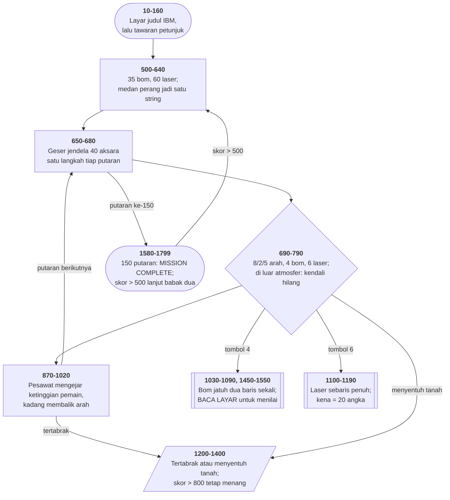

# ATTACK.BAS di penelusur

> Program keenam puluh. 204 baris, nomor 10–2350, cakupan tabel
> **204/204 (100%)**.

Sumber: `run/ATTACK.BAS` · tabel: `tracer/program/ATTACK.js`

Attack (mengebom pabrik Apple, Oktober 1982). Sebuah permainan pengebom, di disket utilitas IBM, yang sasarannya pabrik Apple.

## Dunia yang muat di satu string

Baris 540 panjangnya lebih dari dua ratus aksara, dan isinya seluruh medan perang:

`A$="_____/\\_____/\\__/\\____…▄╥╥╥▄__▄┴┴┴▄_…"`

Garis bawah adalah tanah datar. `/\\` adalah bukit. Kumpulan aksara blok adalah bangunan — dan yang di tengah, `▄╥╥╥▄__▄┴┴┴▄`, adalah pabrik Apple.

Yang tampak di layar cuma empat puluh aksara:

```basic
670 B$=MID$(A$,L+Z,40-Z)
680 LOCATE 23,1+Z:PRINT B$;
```

Dan `L` naik satu tiap putaran. Itu saja seluruh mesin gulungannya. Tidak ada larik peta, tidak ada penggambaran ulang per petak, tidak ada perhitungan tepi — **satu `MID$`, dan dunianya bergerak**.

Yang lebih rapi lagi: `Z`. Waktu bom meledak, baris 1530 menyetel `Z=4`, dan baris 660 menguranginya satu tiap putaran. Selama itu, irisannya diambil dari tempat yang sama dan dicetak digeser ke kanan — **pemandangannya berhenti bergerak** sementara pesawat dan musuh tetap jalan.

Satu variabel, dan sebuah jeda dramatis yang tidak menghentikan apa pun yang lain.

## Sasarannya bernama

Petunjuk di baris 1820–1850 tidak berbasa-basi:

*"YOUR MISSION IS TO ATTACK AND DESTROY THE APPLE COMPUTER MANUFACTURING PLANT… THERE ARE APPLE-OWNED FIGHTERS TRYING TO STOP YOU."*

Tanggalnya **7 Oktober 1982**, dan berkasnya duduk di disket bertuliskan "IBM General utility programs" — layar judul yang sama dengan SERPENT.BAS dan ZAP'EM.BAS di koleksi ini.

Pada 1982, Apple II sudah lima tahun di pasar dan IBM PC baru setahun. Persaingannya nyata, dan bagi orang yang menulis program ini ia cukup terasa untuk dijadikan permainan.

Yang menarik secara teknis: **pabriknya bukan gambar terpisah**. Ia bagian dari string medan perang di baris 540, dan yang membuatnya bernilai lebih cuma dua kode aksara — 210 dan 193 — yang diperiksa baris 1510 waktu bom mendarat.

Jadi "pabrik Apple" di program ini bukan benda, bukan struktur data, bukan entri di tabel apa pun. Ia **dua kode aksara di sebuah string**, dan sebuah `IF` yang tahu artinya.

## Peta arsitektur



## Alur yang layak diikuti

| baris | yang terjadi |
|---|---|
| `540` | seluruh medan perang jadi **satu string** sepanjang dua ratus aksara |
| `670` | `B$ = MID$(A$, L+Z, 40-Z)` — **jendela yang bergeser** |
| `1530` | `Z=4` **menahan** gulungannya empat putaran sesudah bom meledak |
| `810` | menyentuh garis biru → `Y5=1`: **kendali hilang, pesawat jatuh** |
| `960` | pesawat musuh mengejar ketinggian pemain… |
| `980` | …tapi satu dari delapan kali arahnya **dibalik**, supaya bisa dihindari |
| `1430` | pesawat baru muncul begitu ada yang mencapai kolom 30 — sampai empat |
| `1460` | `BE = SCREEN(BY+2,3)` — **bom membaca layar** |
| `1510` | kode 210/193 = pabrik Apple; nilainya `(25-Y2)*12` — makin tinggi makin besar |
| `1295` | skor > 800 → **menang, walaupun pesawatnya baru saja hancur** |

## Yang bisa dicoba di halaman

| coba ini | yang terlihat |
|---|---|
| pasang titik henti di 540 | seluruh medan perang jadi **satu string** sepanjang dua ratus aksara |
| pasang titik henti di 670 | `B$ = MID$(A$, L+Z, 40-Z)` — **jendela yang bergeser** |
| pasang titik henti di 1530 | `Z=4` **menahan** gulungannya empat putaran sesudah bom meledak |
| pasang titik henti di 810 | menyentuh garis biru → `Y5=1`: **kendali hilang, pesawat jatuh** |
| pasang titik henti di 960 | pesawat musuh mengejar ketinggian pemain… |

Aslinya dijalankan dengan `run\\ATTACK.bat`.

> Kemudikan dengan 8 (naik), 2 (turun), 5 (berhenti); 4 menjatuhkan bom, 6 menembakkan laser. Jangan menyentuh garis biru di atas maupun tanah di bawah.

## Penyimpangan dari aslinya

1. **`WIDTH 40` tidak ditiru**; konsol tetap 80 kolom. Jendela pemandangannya tetap selebar 40 karena diiris program sendiri.
2. **`SOUND` dan `BEEP` diam.**
3. **Gelung tunda habis seketika**, jadi animasi lepas landas (2100–2270) dan ledakan (1500) lewat dalam satu langkah.
4. **`RANDOMIZE` memasang benih tetap.**
5. **`POKE &H17,&H40` dan `POKE 1047,32` tidak ditiru.** Keduanya alamat yang **sama** — 0040:0017 dan 0:1047 — ditulis dengan dua cara berbeda di satu program.
6. **Tiga blok "huruf demi huruf" (1310-1340, 1360-1390, 1750-1780) digabung** jadi satu entri tabel per blok, karena tiga baris di tengahnya tidak punya percabangan. Nomor barisnya tetap ada di tabel supaya cakupannya utuh.
7. **`LOAD "MENU",R` diperlakukan sama seperti `RUN "MENU"`.**

## Yang layak ditiru

**Peta sebagai string, tampilan sebagai jendela.** Baris 540 menyimpan seluruh medan perang — bukit, gedung, pabrik — sebagai **satu string sepanjang dua ratus aksara**. Baris 670 mengiris empat puluh di antaranya dan mencetaknya. Menggeser `L` satu langkah menggeser seluruh dunia. Tidak ada larik peta, tidak ada penggambaran ulang — **gulungan mendatar dari satu `MID$`**.

**Menahan gulungan tanpa menghentikan permainan.** `Z=4` di baris 1530, dan baris 660 menguranginya satu tiap putaran. Selama `Z` masih ada, baris 670 mengiris dari tempat yang sama dan mencetaknya digeser ke kanan — jadi pemandangannya **berhenti bergerak** sejenak supaya ledakannya sempat terlihat, sementara pesawat dan musuh tetap jalan.

**Bom yang membaca layar.** `BE=SCREEN(BY+2,3)` menanyakan aksara apa yang ada tepat di bawah bom. Kode 210 dan 193 adalah bagian pabrik Apple; apa pun di atas 169 adalah bangunan lain. **Nilai sasaran disimpan sebagai kode aksara gambarnya**, dan tidak ada tabel di mana pun. Program keenam di koleksi ini yang memakai layar sebagai data.

**Nilai yang bergantung keberanian.** Baris 1510: pabrik Apple bernilai `(25-Y2)*12`, dengan `Y2` ketinggian saat bom **dijatuhkan**. Mengebom dari atas aman tapi murah; menukik rendah berbahaya tapi mahal. Satu perkalian, dan permainannya punya pilihan.

**Kesulitan yang tumbuh dari keadaan.** Baris 950 memanggil 1430 begitu ada pesawat mencapai kolom 30, dan 1430 memunculkan satu pesawat baru — sampai empat. Tidak ada penghitung tingkat, tidak ada jadwal. **Makin lama bertahan, makin ramai**, dan itu akibat langsung dari geraknya sendiri.

## Yang jangan ditiru

**Dua ejaan untuk satu alamat.** Baris 520 menulis `DEF SEG=&H40:POKE &H17,&H40`; baris 625 menulis `DEF SEG=0:POKE 1047,32`. Keduanya menyentuh **bita yang sama** — 0040:0017 dan 0:1047 adalah alamat yang identik. Satu program, dua cara menuliskannya, seratus baris berjauhan.

**Tanda banding yang terbalik.** Baris 1514: `IF BE=>169`. Yang benar `>=`. GW-BASIC menerimanya diam-diam — dan karena menerimanya, tidak ada yang pernah memperbaikinya.

**Pencacah gelung yang dinaikkan sendiri.** Baris 900: `IF Q<Q1 THEN Q=Q+1:GOTO 880`, di dalam gelung `FOR Q`. Pola yang sama dengan KENO.BAS baris 690 — dan sama sulitnya dibaca.

**Menang sesudah hancur.** Baris 1295 memeriksa `SC>800` **di dalam** jalur kehancuran pesawat. Jadi pemain yang skornya cukup akan melihat pesawatnya meledak, lalu diberi tahu "GOOD JOB!!". Mungkin disengaja — kerusakan yang sudah dilakukan lebih penting daripada nasib pilotnya — tapi tidak ada satu kata pun yang mengatakannya.

**Salah eja di petunjuk.** `ALLOTED` (baris 1840) dan `LOOSE` untuk "lose" (baris 1910).

---
[Rancangan penelusur](_rancangan.md) · [SERPENT](serpent.md) · [ZAP'EM](zapem.md) · [METEOR](meteor.md)
