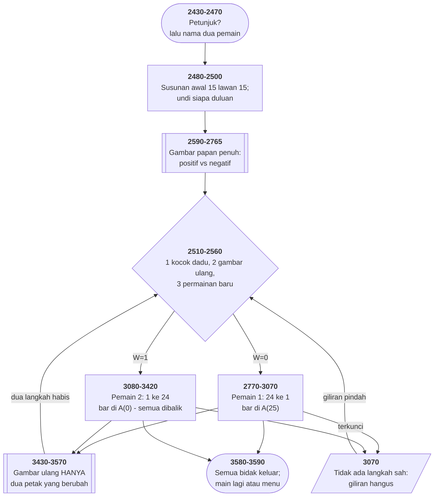

# BACKGAM.BAS di penelusur

> Program kelima puluh enam. 161 baris, nomor 2430–59990, cakupan tabel
> **161/161 (100%)**.

Sumber: `run/BACKGAM.BAS` · tabel: `tracer/program/BACKGAM.js`

Backgammon (satu larik bertanda untuk dua pemain). Dua pemain di satu papan tombol, dan seluruh papannya muat di satu larik dua puluh enam unsur.

## Satu larik, dua pemain, dibedakan tandanya

Papan backgammon punya 24 titik, dan tiap titik bisa berisi bidak salah satu pemain — tidak pernah keduanya.

Cara biasa menyimpannya: dua larik, satu per pemain. Atau satu larik pasangan (pemilik, jumlah).

Program ini memakai **satu larik bilangan bertanda**:

```basic
2482 A(24)=2:A(19)=-5:A(17)=-3:A(13)=5:A(12)=-5:A(8)=3:A(6)=5:A(1)=-2
```

Positif berarti bidak pemain 1, negatif pemain 2, besarnya berapa banyak. Jumlah mutlaknya lima belas di tiap sisi — susunan awal backgammon yang benar, dalam satu baris.

Yang membuat pilihan ini menang: **seluruh aturannya jadi perbandingan**.

`A(x) < -1` — ada dua bidak lawan atau lebih, titik itu diblokir untuk pemain 1.
`A(T) = -1` — ada tepat satu bidak lawan, itu *blot* yang bisa dipukul.
`A(T) > 1` — kebalikannya, dari sudut pandang pemain 2.

Tidak ada satu pun `IF pemilik = ...` di seluruh program. Kepemilikan dan jumlah disimpan di satu bilangan, dan operator perbandingan yang membacanya.

Dan dua ujung lariknya — `A(0)` dan `A(25)` — bukan titik papan sama sekali; keduanya **bar**, tempat bidak yang dipukul menunggu. Karena kedua pemain bergerak ke arah berlawanan, masing-masing punya ujungnya sendiri, dan setiap gelung yang menulis `FOR X=1 TO 24` otomatis melewatinya.

## Harga dari dua arah yang berlawanan

Pemain 1 bergerak dari titik 24 ke titik 1. Pemain 2 dari 1 ke 24. Itu aturan backgammon, dan itu yang membuat separuh berkas ini kembar.

Baris 2770–3070 adalah giliran pemain 1. Baris 3080–3420 giliran pemain 2. Keduanya melakukan hal yang sama persis — periksa bar, cari langkah sah, tanya asal dan tujuan, pukul kalau ada blot, buang dadu — dengan **setiap perbandingan dibalik**:

```basic
2790 IF A(25)>0 AND A(25-L)<-1 AND A(25-M)<-1
3110 IF A(0)>0 AND A(L)>1 AND A(M)>1
```

Tiga puluh lima baris, dua kali. Setiap perbaikan di satu sisi harus dikerjakan lagi di sisi lain, dan tidak ada apa pun yang memaksa keduanya tetap sejalan.

Menyatukannya sebenarnya bisa: tambahkan variabel arah (`+1` atau `−1`), tanda pemain, dan nomor bar. Semua perbandingan lalu dikalikan tanda itu.

Yang membuat penulisnya memilih menyalin mungkin sederhana: di BASIC tanpa fungsi berparameter, "tambahkan variabel arah" berarti menyetel empat variabel global sebelum tiap pemanggilan, dan membacanya kembali sesudahnya. Salinannya lebih panjang, tapi tiap barisnya bisa dibaca sendirian.

**Duplikasi bukan selalu kemalasan; kadang ia harga dari bahasa yang tidak punya cara lain.**

## Peta arsitektur



## Alur yang layak diikuti

| baris | yang terjadi |
|---|---|
| `2482` | susunan awal: **positif** bidak pemain 1, **negatif** pemain 2 |
| `2560` | kocok dua dadu; dobel → `D=4`, dan `SWAP` membuat L yang besar |
| `2790` | `A(x) < -1` — titik **diblokir** untuk pemain 1 |
| `2810` | sisir seluruh papan: **ada langkah sah?** kalau tidak, giliran hangus |
| `2920` | dadu yang dipakai **dibuang** dengan menyalin yang lain ke atasnya |
| `2950` | `A(T) = -1` → **BLOT**: bidak lawan dikirim ke bar |
| `2980` | menang kalau semua 25 petak sudah bukan milik lawan |
| `3080` | giliran pemain 2 — **kembar, dengan setiap perbandingan dibalik** |
| `3430` | gambar ulang **hanya dua petak**, bukan seluruh papan |

## Yang bisa dicoba di halaman

| coba ini | yang terlihat |
|---|---|
| pasang titik henti di 2482 | susunan awal: **positif** bidak pemain 1, **negatif** pemain 2 |
| pasang titik henti di 2560 | kocok dua dadu; dobel → `D=4`, dan `SWAP` membuat L yang besar |
| pasang titik henti di 2790 | `A(x) < -1` — titik **diblokir** untuk pemain 1 |
| pasang titik henti di 2810 | sisir seluruh papan: **ada langkah sah?** kalau tidak, giliran hangus |
| pasang titik henti di 2920 | dadu yang dipakai **dibuang** dengan menyalin yang lain ke atasnya |

Aslinya dijalankan dengan `run\\BACKGAM.bat`.

> Dua pemain bergantian di satu papan tombol. Ketik nomor titik asal lalu tujuan; 99 untuk mengeluarkan bidak dari papan.

## Penyimpangan dari aslinya

1. **`PLAY` diam.**
2. **Gelung tunda di baris 59950 habis seketika.**
3. **`COLOR 25` (baris 3580) adalah 9 + 16** — biru terang **berkedip**. Konsol penelusur tidak berkedip, jadi pengumuman pemenang tampil diam.
4. **`LOAD "MENU",R` diperlakukan sama seperti `RUN "MENU"`.**

## Yang layak ditiru

**Tanda membedakan dua pemain.** `A(1)` sampai `A(24)` menyimpan isi tiap titik sebagai **bilangan bertanda**: positif berarti bidak pemain 1, negatif pemain 2, besarnya berapa banyak. Akibatnya seluruh aturan jadi perbandingan sederhana: `A(x) < -1` berarti diblokir, `A(T) = -1` berarti ada blot yang bisa dipukul. Satu larik, dua pemain, nol percabangan.

**Dua ujung larik sebagai bar.** `A(0)` dan `A(25)` bukan titik papan — keduanya **bar**, tempat bidak yang dipukul menunggu. Karena pemain bergerak ke arah berlawanan, masing-masing punya ujungnya sendiri, dan gelung `FOR X=1 TO 24` otomatis melewatinya.

**Dadu yang dipakai dibuang dengan menyalin.** Baris 2920–2930: kalau langkahnya sejauh `L`, maka `L=M`. Kalau sejauh `M`, maka `M=L`. Sesudah satu langkah, kedua variabel berisi dadu yang tersisa; sesudah dua, keduanya sama dan `D` sudah nol. **Membuang tanpa menghapus.**

**Gambar ulang hanya yang berubah.** Subrutin 3430–3570 menggambar ulang **dua petak** — asal dan tujuan — bukan seluruh papan. Di layar 4,77 MHz, menggambar 24 titik memakan waktu yang terasa; menggambar dua tidak. Dan tombol "2 = REDRAW BOARD" ada justru untuk saat penggambaran sebagian itu meleset.

**Sisir dulu, baru tanya.** Baris 2810–2840 menyisir seluruh papan untuk mencari apakah **ada** langkah sah, sebelum pemain diminta memasukkan apa pun. Kalau tidak ada, gilirannya hangus dengan pesan "You can't move!". Bandingkan HIQUE2.BAS, yang tidak pernah memeriksa ini.

## Yang jangan ditiru

**Dua giliran yang hampir kembar.** Baris 2770–3070 dan 3080–3420 melakukan hal yang sama untuk dua pemain, dengan setiap perbandingan dibalik. **Tiga puluh lima baris, dua kali**. Karena arah dan tandanya berlawanan, menyatukannya butuh variabel arah — dan penulisnya memilih menyalin. Akibatnya setiap perbaikan harus dikerjakan dua kali, dan tidak ada apa pun yang memaksa keduanya tetap sejalan.

**Variabel jeda yang tidak pernah dipakai.** Empat tempat menyetel `TIMEOUT=3` atau `TIMEOUT=6` sebelum `GOSUB 59950`. Baris 59950 berbunyi `FOR I=1 TO 1000:NEXT:RETURN` — **`TIMEOUT` tidak muncul di sana sama sekali**. Semua jeda sama panjang, dan empat penugasan itu tidak berarti apa-apa.

**Pengurangan dua lalu penambahan satu.** Baris 3300: `IF F=0 THEN A(0)=A(0)-2`, lalu baris 3310 menambahkan satu ke `A(F)` yang sama. Hasil bersihnya minus satu — ditulis sebagai dua langkah yang saling menghapus sebagian.

**Nomor baris yang mulai dari 2430.** Dua ribu empat ratus dua puluh sembilan nomor pertama tidak pernah ada. Bersama SERPENT.BAS (mulai 500) dan ZAP'EM.BAS (mulai 230), ini berkas ketiga yang penomorannya dimulai jauh dari nol tanpa penjelasan.

**Salah eja di petunjuk.** `compulsorary` (baris 3710), dan `it may jumped` (3680) yang kehilangan kata "be".

---
[Rancangan penelusur](_rancangan.md) · [DROIDS](droids.md) · [MORTGAGE](mortgage.md)
