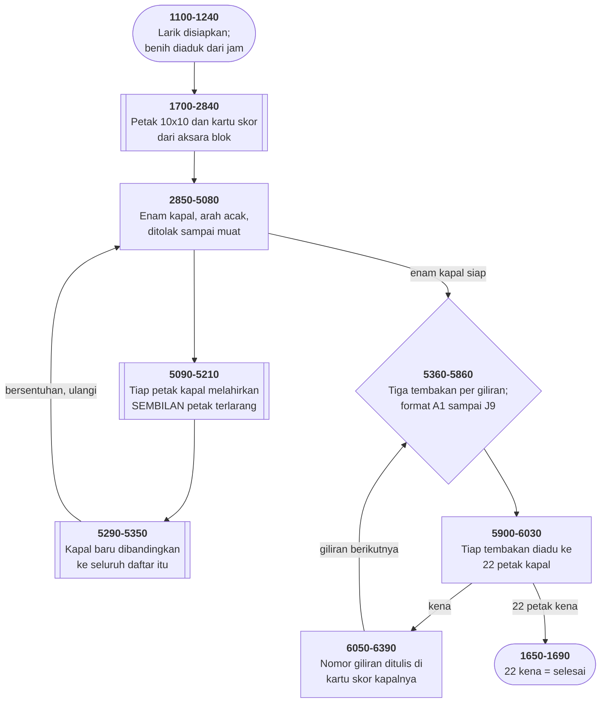

# BATSHIP.BAS di penelusur

> Program ketujuh puluh. 544 baris, nomor 1000–6430, cakupan tabel
> **544/544 (100%)**.

Sumber: `run/BATSHIP.BAS` · tabel: `tracer/program/BATSHIP.js`

Battleship (G.S. Alberts, IBM Burlington, 27 Juli 1982). Enam kapal disembunyikan di petak sepuluh kali sepuluh, dengan aturan "tidak boleh bersentuhan" yang diwujudkan sebagai daftar.

## Membuat yang terlarang, bukan menghitungnya

Aturan Kapal Perang versi ini lebih ketat daripada versi papan biasa: kapal tidak boleh **bersentuhan**, bahkan di sudut. Baris 1260-1270 mengatakannya di depan.

Cara yang wajar memeriksanya: untuk tiap petak kapal baru, bandingkan dengan setiap petak kapal lama, dan hitung apakah jaraknya kurang dari dua di kedua sumbu. Itu perhitungan ketetanggaan, dikerjakan saat menguji.

Program ini melakukan yang sebaliknya. Begitu sebuah kapal ditempatkan, ia **menuliskan seluruh larangannya**:

```basic
5110 J=(((I-1)*9)+1)
5120 XED(J)=X(I):YED(J)=Y(I)+1
5130 XED(J+1)=X(I):YED(J+1)=Y(I)-1
…
5200 XED(J+8)=X(I):YED(J+8)=Y(I)
```

Sembilan entri per petak kapal: delapan tetangganya, dan dirinya sendiri. Sesudah keenam kapal, daftarnya berisi 198 pasang koordinat.

Dan pengujiannya (5290-5350) jadi sesederhana mungkin:

```basic
5320 IF X(J)=XED(I) AND Y(J)=YED(I) THEN FLIP=1
```

Tidak ada pengurangan, tidak ada nilai mutlak, tidak ada perbandingan jarak. Cuma "apakah pasangan ini ada di daftar".

Daftarnya boros. Sebuah petak yang bertetangga dengan dua bagian kapal yang sama akan tercatat dua kali; petak yang di dalam badan kapal tercatat berkali-kali. Tidak ada usaha membuang duplikat.

Dan justru itu yang membuatnya bekerja. Membuang duplikat berarti mencari dulu sebelum menyisipkan — pekerjaan yang lebih besar daripada yang dihematnya. Larik lima ratus unsur di mesin 64K adalah harga yang murah untuk sebuah pengujian yang tidak bisa salah hitung.

Ini pola yang sama dengan tabel pencarian melawan rumus: yang satu menghabiskan ruang supaya tidak perlu berpikir, yang lain berpikir supaya tidak perlu ruang. Di sini pilihannya jatuh ke ruang, dan alasannya terbaca dari kodenya sendiri.

## Lima baris yang dikirim dalam keadaan mati

Di tengah subrutin pembuat daftar terlarang, ada catatan ini:

```basic
5220 REM DELETE REM FROM THE NEXT 5 LINES FOR DEBUG - CHECK THE PLACEMENT OF THE SHIPS IS CORRECTLY DONE WITHOUT TOUCHING OR OVERLAP
```

Dan kelima barisnya:

```basic
5230 REM FOR I=1 TO 9*ZZZ
5240 REM A(I)=((YED(I)*2)+3):B(I)=((XED(I)*5)+6)
5250 REM LOCATE A(I),B(I)
5260 REM PRINT "X"
5270 REM NEXT
```

Membuang lima kata `REM` mengubah permainan ini jadi **alat pemeriksa aturannya sendiri**: setiap petak terlarang digambar dengan huruf X di papan, dan siapa pun bisa melihat apakah kapalnya benar-benar tidak bersentuhan.

Ini bentuk paling awal dari sesuatu yang sekarang kita sebut *debug flag* atau *feature toggle* — dan mekanismenya cuma sebuah penyunting teks.

Yang membuatnya lebih baik daripada sekadar membuang kodenya: pemeriksanya **ikut dikirim**. Siapa pun yang menerima disket ini, sepuluh atau empat puluh tahun kemudian, bisa menyalakannya tanpa menulis apa pun.

Dan yang membuatnya lebih buruk daripada seharusnya ada di baris 1120:

```basic
1120 DIM A(500),B(500)
```

Kedua larik itu **tidak dipakai di mana pun** selain lima baris yang mati itu. Tapi `DIM`-nya ada di luar, hidup, dan dijalankan setiap kali program dimulai.

Di mesin 64K, seribu unsur presisi tunggal adalah empat ribu bita — enam persen dari seluruh ruang kerja — disediakan untuk kode yang tidak pernah berjalan.

Penguji yang tinggal di dalam kodenya adalah ide bagus. Biayanya yang tinggal di luar saklarnya bukan.

## Peta arsitektur



## Alur yang layak diikuti

| baris | yang terjadi |
|---|---|
| `5100` | tiap petak kapal melahirkan **sembilan** entri terlarang: dirinya dan delapan tetangganya |
| `5300` | kapal berikutnya dibandingkan ke **seluruh daftar** — pengujiannya cuma pencarian |
| `1110` | 22 petak × 9 = 198 entri; lariknya di-DIM **lima ratus** |
| `3050` | `ON Z GOTO` tiga sasaran untuk **empat** nilai — `Z=0` sengaja jatuh |
| `2910` | `E` memilih **ujung mana** kapal induk yang bersalib |
| `5230` | lima baris **penguji** yang dikirim dalam keadaan dimatikan dengan REM |
| `1120` | …dan `A(500)`, `B(500)` ada **hanya untuk kelimanya** |
| `5780` | tembakan berulang diperiksa dengan banding **string mentah**: "A1" ≠ "a1" |
| `1400` | petunjuknya **mengakui** bahwa kartu skor tidak menandai bagian yang kena |
| `1660` | pesan kemenangan bilang "SHOTS" padahal `TURN` menghitung **giliran** |

## Yang bisa dicoba di halaman

| coba ini | yang terlihat |
|---|---|
| pasang titik henti di 5100 | tiap petak kapal melahirkan **sembilan** entri terlarang: dirinya dan delapan tetangganya |
| pasang titik henti di 5300 | kapal berikutnya dibandingkan ke **seluruh daftar** — pengujiannya cuma pencarian |
| pasang titik henti di 1110 | 22 petak × 9 = 198 entri; lariknya di-DIM **lima ratus** |
| pasang titik henti di 3050 | `ON Z GOTO` tiga sasaran untuk **empat** nilai — `Z=0` sengaja jatuh |
| pasang titik henti di 2910 | `E` memilih **ujung mana** kapal induk yang bersalib |

Aslinya dijalankan dengan `run\\BATSHIP.bat`.

> Ketik koordinat seperti A1, C8, atau G2 — satu huruf dan satu angka. Tiga tembakan tiap giliran, dan enam kapal harus ditenggelamkan seluruhnya (22 petak).

## Penyimpangan dari aslinya

1. **`SOUND` dan `PLAY` diam.** Baris 5820 menyapu 2000 sampai 80 Hz tiap tembakan; 6400 dan 6420 memainkan terompet serbu dan terompet berkabung.
2. **`RANDOMIZE` memasang benih tetap.** Baris 1170-1200 tetap ditelusuri supaya terlihat bagaimana benihnya diaduk dari jam — termasuk lipatan `H=8-H` yang menghasilkan bilangan negatif.
3. **`CHAIN "MENU",1000` (baris 1540-1550) dan `LOAD "MENU",R` (baris 1690) sama-sama diperlakukan sebagai `RUN "MENU"`.** Dua cara berbeda meninggalkan program yang sama, di berkas yang sama.
4. **Baris 1040 dan 1050 sudah disunting pemilik koleksi** — alamat rumah dan nomor telepon dalam kantor IBM Burlington.

## Yang layak ditiru

**Aturan yang diwujudkan, bukan dihitung.** Aturan permainannya: kapal tidak boleh bersentuhan, bahkan di sudutnya. Cara yang wajar mengujinya: untuk tiap petak kapal baru, periksa apakah salah satu dari delapan tetangganya sudah dipakai. Program ini membalik arahnya. Begitu sebuah kapal ditempatkan, baris 5100-5210 **menuliskan** sembilan petak terlarang untuk tiap petaknya — dirinya sendiri dan kedelapan tetangganya — ke dalam `XED()` dan `YED()`. Pengujian kapal berikutnya (5290-5350) lalu tidak menghitung apa pun. Ia cuma bertanya: apakah petak ini ada di daftar? Daftarnya penuh pengulangan — petak yang bertetangga dengan dua bagian kapal tercatat dua kali. Itu tidak apa-apa, karena pencariannya cuma perlu tahu "ada atau tidak". Ruang ditukar dengan kesederhanaan, dan yang ditukarkan cuma 198 pasang angka.

**Nol yang sengaja tidak melompat.** `3050 ON Z GOTO 3130,3200,3270` — tiga sasaran, padahal `Z` bernilai 0 sampai 3. Di BASIC, `ON 0 GOTO` tidak melompat ke mana-mana; ia jatuh ke baris berikutnya. Jadi arah ke-0 adalah baris di bawahnya, dan tiga arah lain jadi sasaran daftar. **Empat cabang dari tiga alamat**, dan pola yang sama dipakai empat kali di berkas ini.

**Penguji yang ikut dikirim, dimatikan.** Baris 5220 berbunyi: *"DELETE REM FROM THE NEXT 5 LINES FOR DEBUG - CHECK THE PLACEMENT OF THE SHIPS IS CORRECTLY DONE"*. Kelima baris di bawahnya menggambar huruf X di setiap petak terlarang. Membuang lima `REM` mengubah program permainan jadi alat pemeriksa aturannya sendiri. Itu cara membangun yang layak ditiru: alat penguji **tinggal di dalam** yang diujinya, dan menyalakannya cuma butuh sebuah penyunting teks.

**Satu kapal yang bukan garis lurus.** Kapal induk memakai tujuh petak: lima berjajar, dan dua tegak lurus di salah satu ujungnya. Variabel `E` memilih ujung yang mana. Itu sebabnya penolakannya paling banyak — dua belas baris (2930-3040), enam untuk memastikan badannya muat dan enam lagi untuk salibnya. Kapal lain cukup empat.

**Rentang indeks sebagai identitas kapal.** `X(1..7)` kapal induk, `X(8..12)` kapal perang, dan seterusnya sampai `X(22)` kapal PT. Tidak ada larik "kapal ini milik siapa" — yang menentukan cuma **di mana indeksnya jatuh**. Baris 5940-5990 membaca itu kembali dengan enam perbandingan rentang. Dua puluh dua petak, enam kapal, dan satu larik datar.

## Yang jangan ditiru

**Seribu unsur larik untuk kode yang dimatikan.** Baris 1120: `DIM A(500),B(500)`. Kedua larik itu dipakai **hanya** di baris 5240-5260 — yang seluruhnya `REM`. Di mesin 64K, dua larik lima ratus unsur presisi tunggal memakan empat ribu bita. Empat ribu bita yang disediakan untuk lima baris yang tidak pernah dijalankan siapa pun. Menyimpan penguji di dalam program itu ide bagus. Menyimpan `DIM`-nya di luar bagian yang dikomentari bukan.

**Sepuluh huruf, dua puluh baris.** Baris 5470-5660 menerjemahkan huruf baris jadi angka. Besar dan kecil ditulis **terpisah**: `IF YY$="A" THEN 0`, lalu `IF YY$="a" THEN 0`, dua puluh kali. Satu baris pengubah huruf — seperti yang dipakai ELIZA.BAS di koleksi yang sama, `CHR$(ASC(x) OR &H20)` — akan menghapus separuhnya.

**Dan akibatnya: tembakan yang sama bisa dipakai dua kali.** Baris 5780 memeriksa pengulangan dengan membandingkan **string mentah**: `IF S$(TURN,J)=S$(K,L) THEN FLIP=1`. Karena hurufnya tidak pernah diseragamkan, `"A1"` dan `"a1"` adalah dua string yang berbeda — padahal baris 5470 dan 5480 sudah menerjemahkan keduanya ke petak yang sama. Terukur di penelusur: menembak `A1` lalu `a1` menghasilkan dua petak yang **sama persis** (1,0), penjaga ulangan di baris 5810 tidak berbunyi, dan permainan langsung meminta tembakan ketiga. Satu tembakan habis tanpa peringatan.

**Pesan kemenangan yang salah satuan.** Baris 1660: *"SO YOU FINALLY DID IT IN ";TURN;"SHOTS"*. Tapi `TURN` menghitung **giliran**, dan tiap giliran berisi tiga tembakan. Pemain yang menang dalam 12 giliran diberitahu "12 shots" — padahal ia menembak 36 kali.

**Kartu skor yang mengakui dirinya kira-kira.** Baris 1400-1420 di bagian petunjuk: *"HOWEVER THE PLACE WHERE THE SHOT IS RECORDED ON THE SCORECARD WILL NOT NECESSARILY BE THE PART OF THE SHIP HIT."* Sebabnya ada di baris 6070: `ON HAC GOTO ...` memakai **jumlah** kena, bukan petak mana yang kena. Kena pertama selalu ditandai di kotak pertama, apa pun bagian kapal yang sebenarnya tertembak. Yang menarik bukan cacatnya — melainkan bahwa penulisnya memilih **menuliskannya di petunjuk** alih-alih memperbaikinya. Sebuah keterbatasan yang didokumentasikan adalah keterbatasan, bukan cacat.

**Dua cara meninggalkan satu program.** Baris 1540-1550 memakai `CHAIN "MENU",1000`; baris 1690 memakai `LOAD "MENU",R`. Keduanya menuju berkas yang sama, dengan dua perintah yang berbeda perilakunya soal variabel bersama — dan tidak ada alasan yang terlihat kenapa.

**Salah eja yang tidak ada yang memperbaiki.** `CRUSIER` (baris 3960 dan 4080), `IS IS USED` (1410), `AND EASY JOB` untuk "an easy job" (4940), dan `P.T BOAT` yang kehilangan satu titik (4970).

---
[Rancangan penelusur](_rancangan.md) · [YAHTZEE](yahtzee.md) · [BOWLING](bowling.md)
