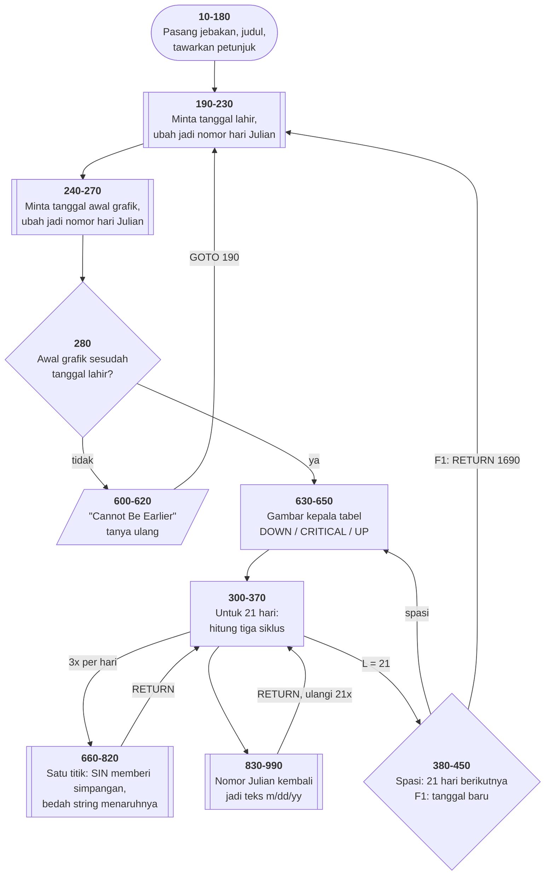

# BIO.BAS di penelusur

> Program kesepuluh, dan yang pertama benar-benar berhitung. 169 baris, nomor
> 10–1690, cakupan tabel **169/169 (100%)**.

Sumber: `run/BIO.BAS` · tabel: `tracer/program/BIO.js` ·
analisis: [`reviews/BIO.md`](../../reviews/BIO.md) ·
port lengkap: [`web/docs/bio.md`](../../web/docs/bio.md)

Grafik biorhythm tiga siklus — fisik 23 hari, emosi 28 hari, intelektual 33
hari — digambar di layar **teks** dengan bedah string.

## Nomor hari Julian: ubah bentuk, lalu tanyakan

Pertanyaan yang harus dijawab: *sudah berapa hari sejak Anda lahir?*

Dijawab langsung dari tanggal, itu pekerjaan berat: tahun penuh, bulan dengan
panjang berbeda-beda, tahun kabisat, dan aturan bahwa tahun kelipatan 100 bukan
kabisat kecuali kelipatan 400.

Program ini tidak melakukan satu pun dari itu. Baris 490–550 mengubah kedua
tanggal jadi **nomor hari Julian** — hitungan hari sejak 1 Januari 4713 SM —
lalu:

```basic
300 N=JC-JB
```

Satu pengurangan. Terverifikasi di penelusur: lahir 30-11-1962 → `JB=2437999`,
grafik mulai 1-1-1983 → `JC=2445336`, selisih **7337 hari**.

Baris 830–990 mengubahnya kembali jadi teks `m/dd/yy`. Rumus di kedua arah
bukan karangan penulisnya — itu rumus baku astronomi, dan masih dipakai hari
ini.

**Pola yang berlaku jauh melampaui tanggal: ubah data ke bentuk yang membuat
pertanyaan Anda sepele, kerjakan di sana, lalu ubah kembali.**

## Menggambar tanpa mode grafis

Layar CGA punya mode grafis 320×200. Program ini tidak memakainya sama sekali.

Tiap baris grafik adalah satu **string** 71 karakter. Menaruh titik di kolom W
berarti membelah string itu dan menyambungnya lagi:

```basic
790 E=LEFT$(E,W-1)+C+RIGHT$(E,T+T+1-W)
```

Dan kolomnya datang dari trigonometri:

```basic
730 W=R/V:W=W*2*P
740 W=T*SIN(W):W=W+T+1.5
```

Sisa hari dibagi panjang siklus memberi posisi dalam satu putaran; dikali 2π
jadi sudut; `SIN` memberi simpangan −1..+1; dikali 35 dan digeser 35
menaruhnya di kolom 1..71.

Kenapa tidak mode grafis? Karena ini **lebih cepat**, dan jalan di komputer
yang tidak punya kartu grafis sama sekali. Kendala melahirkan teknik, dan
tekniknya bertahan lebih lama daripada kendalanya.

## Satu cacat yang menutupi cacat lain

```basic
680 E=SPACE$(72)
690 E=LEFT$(E,T)+CHR$(222)+RIGHT$(E,T)
```

Baris 680 membuat string **72** karakter. Baris 690 mengambil 35 dari kiri,
menyisipkan satu penanda, dan 35 dari kanan — hasilnya **71**. Dua karakter di
tengah hilang tanpa jejak.

Dan 71 itulah angka yang dipakai seluruh sisa program: `T+T+1` di baris 780 dan
790 sama dengan 71.

Jadi ada dua hal yang tidak cocok — panjang 72 di baris 680 dan lebar 71 di
seluruh sisanya — tapi baris 690 **diam-diam memperbaikinya** setiap kali.
Hasilnya benar, jadi tidak ada yang pernah melihat.

Terukur langsung di penelusur:

| titik | panjang `E` |
|---|--:|
| sebelum baris 680 | 72 |
| sesudah baris 680 | 72 |
| **sesudah baris 690** | **71** |
| lebar yang dipakai sisanya (`T+T+1`) | 71 |

Ini bentuk cacat yang paling sulit ditemukan: **yang gejalanya ditutupi oleh
kode lain.** Pasang titik henti di baris 690 dan periksa sendiri.

## Peta arsitektur



## `RETURN` yang tidak pulang

```basic
1680 RETURN 1690
```

`RETURN` biasanya kembali ke pernyataan sesudah `GOSUB` yang memanggilnya.
Bentuk ini tidak: ia **membuang** alamat pulang itu dan melanjutkan di baris
1690.

Kenapa perlu? Karena baris 1680 adalah penangan jebakan F1, dan F1 bisa ditekan
kapan saja — termasuk di tengah penggambaran grafik. Kembali ke tempat yang
disela tidak ada gunanya: pemakainya baru saja minta tanggal baru.

Bentuknya ada padanannya di bahasa modern dengan nama beragam: `longjmp`,
pelemparan pengecualian, pembatalan tugas. Semuanya menjawab pertanyaan yang
sama: **bagaimana meninggalkan pekerjaan yang sedang berjalan tanpa harus
membereskannya lapis demi lapis?** Dan semuanya punya bahaya yang sama: apa pun
yang seharusnya dibereskan di lapisan yang dilompati, tidak akan dibereskan.

Ini kemampuan mesin yang baru — sebelumnya `m.kembali()` selalu polos.

## Pseudokode

```
baris   30   pasang jebakan: F1 tanggal baru, F10 keluar, sisanya mandul
baris  140   T = 35 (setengah lebar grafik), P = pi
baris  210   minta tanggal lahir -> NOMOR HARI JULIAN JB
baris  260   minta tanggal awal grafik -> nomor hari Julian JC
baris  280   JC lebih awal dari JB? tolak, tanya ulang

baris  300   ULANG 21 kali:
baris  300       N = JC - JB   <- UMUR DALAM HARI, SATU PENGURANGAN
baris  310       untuk siklus 23, 28, dan 33 hari:
baris  660           sisa = N mod panjang siklus
baris  680           siklus pertama juga menyiapkan baris grafiknya
baris  730           sisa/panjang x 2pi = sudut
baris  740           35 x sin(sudut) + 35 + 1,5 = kolom titiknya
baris  760           sudah ada siklus lain di kolom itu? pakai "&"
baris  790           BELAH STRING, SISIPKAN TANDA, SAMBUNG LAGI
baris  830       ubah nomor Julian kembali jadi teks m/dd/yy
baris  360       cetak tanggal lalu barisan grafiknya
baris  370       maju satu hari
baris  380   spasi: 21 hari berikutnya - F1: RETURN 1690, tanggal baru
```

## Penyunting tanggal buatan sendiri

Baris 1340–1670 tidak memakai `INPUT` sama sekali. Program membaca tombol satu
per satu: menolak yang bukan angka, menerima titik/garis/spasi sebagai pemisah,
menangani Backspace dan panah kiri sebagai "batalkan semua".

Tiga puluh baris untuk apa yang `INPUT` lakukan dalam satu — dan imbalannya:
**pemakainya tidak bisa mengetik apa pun yang salah.** Bulan di luar 1–12
ditolak di tempat (baris 1430); hari di luar 1–31 ditolak di baris 1530.

Di dalamnya ada satu nomor baris yang salah ketik:

```basic
1490 IF LEN(Z1)>1 THEN 1360
1500 IF LEN(Z)>1 THEN 1450
```

Baris 1490 berada di gelung pembacaan **hari**, tapi melompat ke 1360 — gelung
pembacaan **bulan**. Baris 1500 di sebelahnya melompat ke 1450 yang benar.
Salah satu angka, dan hanya terlihat kalau ditelusuri.

## Yang bisa dicoba di halaman

| coba ini | yang terlihat |
|---|---|
| jawab `N`, ketik `11-30-62` lalu `Y` | `JB` jadi 2437999 — tanggal lahir sudah berupa satu bilangan |
| ketik `1-1-83` lalu `Y` | `JC` jadi 2445336; `N` di baris 300 jadi 7337 |
| pasang titik henti di 690 | ukur panjang `E` sebelum dan sesudah: 72 lalu 71 |
| turunkan laju, perhatikan 660–820 | tiga panggilan per hari; yang pertama (V=23) menyiapkan barisnya |
| ketik bulan `13` | ditolak di baris 1430, kembali ke awal tanpa pesan |
| tekan `F1` di layar grafik | `RETURN 1690` — meninggalkan penggambaran, minta tanggal baru |

## Penyimpangan dari aslinya

1. **`DEFINT`, `DEFDBL`, `DEFSTR` di baris 20 tidak ditiru.** Ketiganya
   menyatakan tipe variabel menurut huruf awalnya. JavaScript tidak punya
   padanannya, dan seluruh hitungan di sini muat dalam bilangan pecahan ganda
   yang memang dipakai JavaScript.
2. **Gelung tunda `FOR A=1 TO 4000:NEXT` di baris 620 habis seketika**, jadi
   pesan "Cannot Be Earlier" terhapus sebelum sempat terbaca.
3. **Panjang string 72-vs-71 bukan penyimpangan porting** — itu memang yang
   terjadi di aslinya; penelusur cuma membuatnya bisa dilihat.

---
[Rancangan penelusur](_rancangan.md) · [MENU](menu.md) · [INTRO](intro.md) · [CHECK](check.md) · [TOWERS](towers.md) · [HEAREYE](heareye.md) · [TICTAC](tictac.md) · [MASTER](master.md) · [BOGGY](boggy.md) · [PEGLEAP](pegleap.md)
