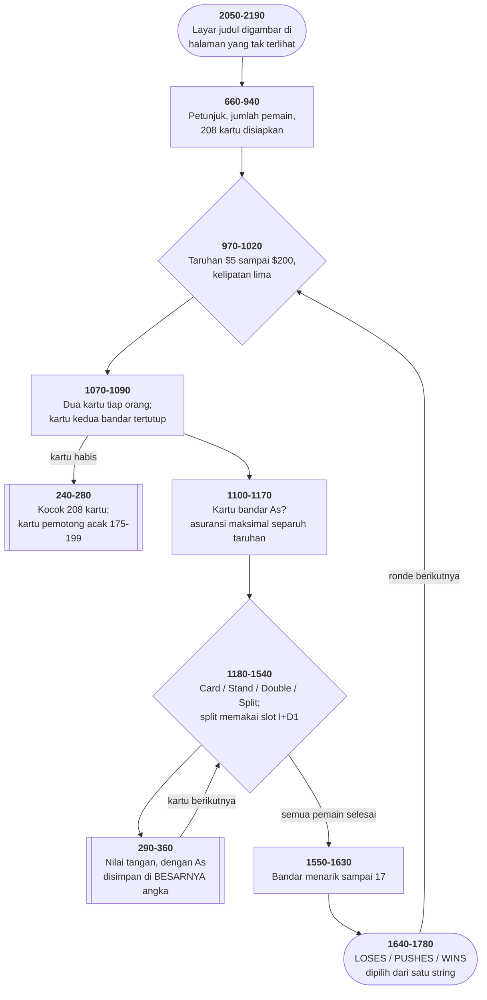

# BJ.BAS di penelusur

> Program keenam puluh satu. 218 baris, nomor 100–2190, cakupan tabel
> **218/218 (100%)**.

Sumber: `run/BJ.BAS` · tabel: `tracer/program/BJ.js`

Blackjack (Ensign Software, 1982). Blackjack empat dek dengan split dan asuransi — dan kartu As dilacak tanpa satu pun bendera.

## As yang tidak butuh bendera

Sebuah tangan blackjack yang berisi As punya dua nilai sekaligus. A+6 bisa dibaca 7 atau 17, dan mana yang dipakai bergantung pada kartu berikutnya.

Cara biasa menanganinya: simpan totalnya, ditambah sebuah bendera "masih punya As yang bisa dihitung besar". Dua variabel, dan tiap kartu baru harus memperbarui keduanya.

Program ini menyimpan **satu bilangan**. Selama masih ada As yang bisa dihitung sebelas, nilainya disimpan **dengan sebelas tambahan**. Jadi A+6 tersimpan sebagai 18, bukan 7 dan bukan 17.

Dan yang mengembalikannya jadi angka yang ditampilkan satu baris:

```basic
130 DEF FNA(Q)=Q+11*(Q>=22)
```

Karena perbandingan bernilai −1 saat benar, `11*(Q>=22)` adalah −11. Jadi nilai yang tersimpan 22 atau lebih dikurangi sebelas sebelum ditampilkan.

Penurunan As-nya sendiri — saat menarik kartu membuat tangan yang tadinya aman jadi bust — juga tanpa `IF`:

```basic
350 Q=Q1-(Q<=21 AND Q1>21):IF Q>=33 THEN Q=-1
```

Kalau tadinya belum bust tapi sekarang bust, kurangi satu. Kalau melewati 33, tangannya benar-benar bust dan ditandai −1.

Yang membuat cara ini menarik bukan penghematannya — satu variabel lebih sedikit tidak berarti apa-apa hari ini. Yang menarik adalah bahwa **keadaan dan nilainya tidak bisa terpisah**. Bendera bisa lupa diperbarui; angka yang membawa keadaannya sendiri tidak bisa.

Harganya juga jelas: siapa pun yang membaca `Q=18` tidak bisa tahu artinya tanpa membaca baris 130 lebih dulu.

## Layar yang digambar di tempat yang tidak terlihat

Baris 2050 dan 2190 mengapit seluruh layar judul:

```basic
2050 SCREEN 0,0,1,1 : CLS : SCREEN 0,0,0,1 : CLS …
2190 SCREEN 0,0,0,0
```

Dua argumen terakhir `SCREEN` adalah **halaman tulis** dan **halaman tampil**. Kartu layar teks PC punya beberapa halaman 80×25 di memorinya, dan yang ditampilkan cuma satu.

Jadi yang terjadi: bersihkan halaman 1 sambil menampilkan halaman 1, lalu **tulis ke halaman 0 sambil tetap menampilkan halaman 1** — pemakai melihat layar kosong sementara judulnya digambar di tempat lain. Baris 2190 menukar tampilannya ke halaman 0, dan judulnya **muncul utuh, seketika**.

Itu *double buffering*, 1982, di layar teks. Gagasan yang sama dipakai setiap kali sebuah program grafik menggambar ke penyangga belakang lalu menukarnya — supaya penggambaran setengah jadi tidak pernah terlihat.

Di penelusur ini halamannya cuma satu, jadi Anda melihat judulnya tergambar baris demi baris. Yang hilang justru gagasannya.

## Peta arsitektur



## Alur yang layak diikuti

| baris | yang terjadi |
|---|---|
| `130` | `FNA(Q)=Q+11*(Q>=22)` — nilai **tampilan** sebuah tangan |
| `140` | `FNT(Q)=(5-Q)*12+17` — kolom layar pemain ke-Q |
| `260` | kocok 208 kartu dengan tukar-acak; `CZ` = kartu pemotong 175–199 |
| `200` | nomor kartu dipecah jadi pangkat dan lambang dengan sisa bagi 13 dan 4 |
| `330` | nilai tangan menyimpan **+11** selama As masih bisa dihitung besar |
| `350` | As diturunkan dengan **aritmetika**: `Q1-(Q<=21 AND Q1>21)` |
| `940` | `D1` = nomor bandar **dan** jarak ke tangan hasil split |
| `1170` | bayaran asuransi 2:1 ditulis sebagai satu perkalian bertanda |
| `1600` | bandar menarik kartu sampai 17 — aturan kasino, satu baris |
| `1710` | kalah/seri/menang dipilih dari **satu string** dengan `SGN` |

## Yang bisa dicoba di halaman

| coba ini | yang terlihat |
|---|---|
| pasang titik henti di 130 | `FNA(Q)=Q+11*(Q>=22)` — nilai **tampilan** sebuah tangan |
| pasang titik henti di 140 | `FNT(Q)=(5-Q)*12+17` — kolom layar pemain ke-Q |
| pasang titik henti di 260 | kocok 208 kartu dengan tukar-acak; `CZ` = kartu pemotong 175–199 |
| pasang titik henti di 200 | nomor kartu dipecah jadi pangkat dan lambang dengan sisa bagi 13 dan 4 |
| pasang titik henti di 330 | nilai tangan menyimpan **+11** selama As masih bisa dihitung besar |

Aslinya dijalankan dengan `run\\BJ.bat`.

> C = ambil kartu, S = berhenti, D = double, / = split. Di mesin aslinya F1/F3/F5/F9 diprogram mengetik huruf-huruf itu.

## Penyimpangan dari aslinya

1. **HALAMAN LAYAR tidak ditiru.** Baris 2050 memakai `SCREEN 0,0,1,1` lalu `SCREEN 0,0,0,1`: argumen ketiga dan keempat adalah halaman **tulis** dan halaman **tampil**. Judulnya digambar ke halaman yang tidak terlihat lalu ditukar. Konsol penelusur cuma punya satu halaman, jadi penggambarannya terlihat.
2. **`KEY 1,"C"` sampai `KEY 9,"S"` tidak ditiru.** Perintah itu memprogram tombol fungsi supaya **mengetik** huruf, bukan memicu jebakan. Di penelusur, pakai huruf C, D, /, dan S langsung.
3. **`COLOR 26` dan `COLOR 31` memakai atribut kedip** (10+16 dan 15+16); konsol tidak berkedip.
4. **`RANDOMIZE` memasang benih tetap.**
5. **Baris 2150 sudah disunting pemilik koleksi ini** — nomor telepon digantikan penanda "[disunting UU PDP]". Yang ditelusuri berkas apa adanya.
6. **Subrutin dalam-baris 310-360 ditulis sekali sebagai pembantu.** Baris-barisnya tetap ada di tabel supaya cakupannya utuh, tapi perhitungannya dikerjakan satu fungsi — karena ia dipanggil dari dalam gelung di baris 290 dan tidak bisa dipecah tanpa mengubah alurnya.

## Yang layak ditiru

**As yang dilacak di besarnya angka.** Sebuah tangan blackjack yang berisi As punya dua nilai: satu atau sebelas. Cara biasa: simpan bendera "punya As yang bisa besar". Program ini **menyimpan nilainya dengan sebelas tambahan**, dan `FNA(Q)=Q+11*(Q>=22)` mengembalikannya jadi angka yang ditampilkan. Satu bilangan membawa dua informasi, dan fungsinya yang memisahkannya lagi.

**Aritmetika menggantikan percabangan.** Baris 350: `Q=Q1-(Q<=21 AND Q1>21)`. Perbandingan bernilai −1 atau 0, jadi seluruh syarat "kalau tadinya belum bust tapi sekarang bust, turunkan As-nya" jadi satu pengurangan. Baris 1170 memakai trik yang sama untuk bayaran asuransi 2:1.

**Satu variabel, dua arti yang menguatkan.** `D1 = N+1` adalah nomor bandar. Ia **juga** jarak ke tangan hasil split: tangan kedua pemain `I` disimpan di `I+D1`. Karena bandar selalu tepat sesudah pemain terakhir, kedua arti itu cocok dengan sendirinya, dan rumus tata letak `FNT(I+D1*(I>D1))` tetap berlaku untuk keduanya.

**Kartu pemotong yang acak.** Baris 250: `CZ=INT(RND(1)*25)+175`. Pengocokan berikutnya terjadi di antara kartu ke-175 dan ke-199 dari 208 — tidak pernah di tempat yang sama. Itu persis alasan kasino sungguhan memakai kartu pemotong: **supaya penghitung kartu tidak bisa memastikan berapa yang tersisa**.

**Setengah angka yang memutuskan siapa kalah.** Tangan yang bust ditandai `-1`, baik punya pemain maupun punya bandar. Kalau keduanya bust, perbandingan di baris 1670 akan memberi `SGN(-1 - -1) = 0` — **seri**, dan pemain yang sudah bust malah dapat uangnya kembali. Itu salah: di blackjack, pemain yang bust kalah lebih dulu, apa pun yang terjadi sesudahnya. Baris 1610 menyelesaikannya dengan `Q(I)=Q-(Q<0)/2`. Karena perbandingan bernilai −1, bust **bandar** jadi −0,5 — dan sekarang bust pemain (−1) selalu lebih kecil. Terukur di penelusur: bandar 5+7 menarik satu kartu, bust, dan `Q(2)` berisi tepat **−0,5**. Satu pembagian dengan dua, tanpa satu pun `IF`, dan tanpa satu kata pun yang menjelaskannya.

**Tiga hasil dari satu string.** `Z$="LOSES PUSHES WINS "`, dan baris 1710 memilih dengan `MID$(Z$, SGN(S(I))*6+7, 6)`. `SGN` memberi −1, 0, atau 1; dikali enam dan digeser, ia jadi tempat yang tepat di string. Tidak ada satu pun `IF`.

**Membaca sebelum menulis.** Baris 2185: `POKE &H417, PEEK(&H417) OR &H60`. Bendera papan tombol BIOS **dibaca dulu**, lalu dua bitnya dinyalakan. Program lain di koleksi ini (BOWLING, DROIDS, ATTACK) menimpanya begitu saja — dan dengan itu mematikan bendera lain yang mungkin sedang dipakai pemakainya.

## Yang jangan ditiru

**Lambang kartu yang disalin dari pangkatnya.** Baris 1430: `P(I1,1)=P(I,2):PS(I1,1)=P(I,2)`. Yang kedua seharusnya `PS(I,2)` — **lambang** kartu, bukan **pangkat**-nya. Akibatnya kartu pertama tangan hasil split bisa digambar dengan lambang yang salah. Nilainya tetap benar, jadi permainannya tidak terganggu — yang salah cuma gambarnya, dan itu jenis cacat yang bisa bertahan bertahun-tahun.

**Sepuluh pesan, satu tabel lompat, nol nama.** Baris 1930: `ON E GOTO 1940,1950,…,2030`. Untuk tahu apa arti `E=7`, satu-satunya cara adalah menghitung sampai entri ketujuh. Enam belas tempat berbeda menyetel `E` sebelum memanggil 1920.

**Salah eja di layar petunjuk.** `responces` (baris 760).

**Variabel yang disetel dan tidak dipakai.** `H1` disetel ke 5, 3, dan 7 di baris 380, 1210, dan 1350, dan **tidak pernah dibaca di mana pun**. Begitu juga `FL` dan `I$` di baris 670.

---
[Rancangan penelusur](_rancangan.md) · [BLACKJCK](blackjck.md) · [BLACK](black.md) · [CRAZY8](crazy8.md)
