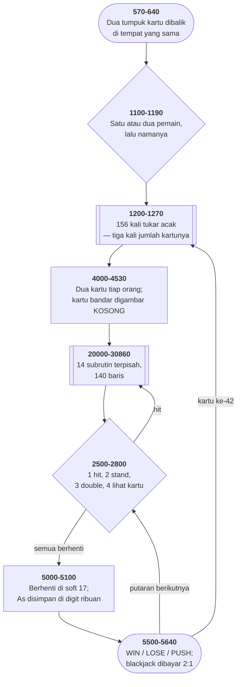

# BLACK.BAS di penelusur

> Program keenam puluh tujuh. 396 baris, nomor 10–59990, cakupan tabel
> **396/396 (100%)**.

Sumber: `run/BLACK.BAS` · tabel: `tracer/program/BLACK.js`

Blackjack (Hughes J. Glantzberg). Program kedua Hughes Glantzberg di koleksi ini — dengan tiga subrutin yang disalin utuh dari TRUCKER.BAS, cacatnya ikut.

## Nomor baris lima puluh sembilan ribu

Tiga subrutin di ujung berkas ini — jeda, pemasang benih acak, dan pembaca tombol — sama persis dengan yang ada di [TRUCKER.BAS](trucker.md). Bukan mirip: **sama, sampai ke nomor barisnya**.

```basic
59950 TIMEOUT$=TIME$:TIME2=VAL(LEFT$(TIMEOUT$,2))*120+…
59980 RNDTIME$=TIME$:…:RANDOMIZE RNDVAL:RETURN
59990 IKEY$=INKEY$:IF IKEY$="" THEN 59990 ELSE RETURN
```

Kenapa 59950 dan bukan 9000, atau 5000?

Karena BASIC tidak punya cara mengimpor apa pun. Satu-satunya cara memakai ulang kode adalah **menyalin barisnya** ke program baru — dan salinan itu akan bentrok kalau nomornya bertabrakan dengan kode yang sudah ada.

Jadi penulisnya memesan wilayah. Lima puluh sembilan ribu ke atas adalah **tanah miliknya**: tidak ada program yang tumbuh sampai sana, jadi subrutinnya bisa mendarat di berkas apa pun tanpa menabrak apa-apa.

Itu *namespace*, dibangun dari kesepakatan dengan diri sendiri.

Dan seperti setiap pustaka salin-tempel, ia membawa cacatnya ke mana-mana. Rumus di baris 59950 mengalikan jam dengan **120**, bukan 3600. Selama jedanya tidak menyeberang pergantian jam, tidak ada yang terasa. Begitu menyeberang, gelungnya berjalan hampir satu jam.

Dua program, satu cacat, dan tidak ada satu tempat pun untuk memperbaikinya.

## Sembilan baris, atau seratus empat puluh

Di disket yang sama ada dua program blackjack yang harus menggambar tiga belas wajah kartu di layar teks.

**BLACKJCK.BAS** mengerjakannya dalam 21 baris. Tiap pangkat didefinisikan sebagai selisih dari pangkat lain: sembilan adalah dua pip ditambah tujuh, tujuh adalah satu pip ditambah enam. Rantai `GOTO` dan jatuh-tembus yang menyimpan *hubungan* antar gambar, bukan gambarnya.

**BLACK.BAS** — berkas ini — mengerjakannya dalam 98 baris. Empat belas subrutin terpisah, masing masing enam `LOCATE`/`PRINT` yang menuliskan tiap barisnya apa adanya.

Selisihnya hampir lima kali lipat, dan gampang menyimpulkan yang satu lebih baik. Tapi keduanya punya harga.

Yang pendek **tidak bisa dibaca** tanpa menelusuri tiga lompatan. Menyisipkan satu baris di tempat yang salah memutus rantainya dan merusak empat kartu sekaligus, diam-diam.

Yang panjang bisa dibaca sekilas. Wajah kartu tujuh terlihat persis seperti kartu tujuh, tertulis di enam baris berurutan. Mengubahnya tidak mengubah apa pun yang lain.

Dan buktinya ada di berkas ini sendiri. Baris **30475** disisipkan di antara 30470 dan 30480 — seseorang menambahkan satu baris pip ke wajah kartu tujuh, belakangan, dan **tidak ada yang rusak**. Di rancangan jatuh-tembus, sisipan di tempat itu akan merusak enam, delapan, dan sembilan sekaligus.

Yang satu hemat; yang satu bisa disunting. Disket ini menyimpan keduanya, berdampingan, tanpa memihak.

## Peta arsitektur



## Alur yang layak diikuti

| baris | yang terjadi |
|---|---|
| `2601` | As bernilai **1001** — digit ribuan menghitung As, satuan menyimpan nilai keras |
| `5060` | `W=V/1000 : V=V-W*1000` memisahkan keduanya dengan bagi bulat |
| `2660` | `A(Q)=9000` — nilai ajaib untuk blackjack, di larik yang sama |
| `4505` | `CARD=0` → wajah **kosong**: begitulah kartu bandar ditutup |
| `20080` | `ON CARD+1 GOSUB` — **14 subrutin**, 98 baris, satu per wajah |
| `2500` | `STEP 3-PLAYERS` mengurus satu maupun dua pemain dengan satu gelung |
| `5080` | bandar **berhenti** di soft 17 — kebalikan BLACKJCK.BAS di koleksi yang sama |
| `2800` | double menggandakan `T(L)` — larik yang **tidak pernah dibaca** |
| `59950` | jam × 120, bukan 3600 — **cacat yang sama persis dengan TRUCKER.BAS** |

## Yang bisa dicoba di halaman

| coba ini | yang terlihat |
|---|---|
| pasang titik henti di 2601 | As bernilai **1001** — digit ribuan menghitung As, satuan menyimpan nilai keras |
| pasang titik henti di 5060 | `W=V/1000 : V=V-W*1000` memisahkan keduanya dengan bagi bulat |
| pasang titik henti di 2660 | `A(Q)=9000` — nilai ajaib untuk blackjack, di larik yang sama |
| pasang titik henti di 4505 | `CARD=0` → wajah **kosong**: begitulah kartu bandar ditutup |
| pasang titik henti di 20080 | `ON CARD+1 GOSUB` — **14 subrutin**, 98 baris, satu per wajah |

Aslinya dijalankan dengan `run\\BLACK.bat`.

> Satu atau dua pemain. 1 = ambil kartu, 2 = berhenti, 3 = double, 4 = lihat kartu yang sudah keluar. Ketik E sebagai taruhan untuk keluar. F10 kembali ke menu.

## Penyimpangan dari aslinya

1. **Subrutin jeda 59950-59970 habis seketika**; ketiga barisnya tetap ditelusuri karena rumusnya sendiri yang jadi bahan halaman ini.
2. **`RANDOMIZE` memasang benih tetap.** Baris 59980 tetap dijalankan supaya terlihat bahwa benihnya dibangun dari jam sistem.
3. **`RUN "b:???0??"` dibangkitkan sebagai galat 64** (Bad file name) — nama berkasnya berisi kartu liar yang tidak diterima `RUN`. Persis sama dengan TRUCKER.BAS.
4. **`DEFINT A-Z` ditiru**: semua penugasan angka dibulatkan. Itu yang membuat `BET(1)*0.5` di baris 2920 tidak pernah menghasilkan pecahan.
5. **`ON ERROR GOTO 3000` dipasang tapi tidak terpicu** di jalur mana pun yang bisa dijalankan penelusur.
6. **Baris 622 sudah disunting pemilik koleksi** (alamat rumah penulis).

## Yang layak ditiru

**Pustaka pribadi, dengan nomor baris yang dipesan.** Baris 59950 sampai 59990 di berkas ini **sama persis** dengan [TRUCKER.BAS](trucker.md): jeda, pemasang benih acak, dan pembaca satu tombol. Terverifikasi baris demi baris: 59950, 59960, 59970, dan 59990 **identik aksara demi aksara** di kedua berkas; 59980 hanya ada di sini. Nomor barisnya yang menarik. Lima puluh sembilan ribu — setinggi mungkin, sejauh mungkin dari kode program. Itu **ruang yang dipesan**, supaya subrutinnya bisa disalin ke program apa pun tanpa bentrok. Sebuah pustaka bersama, di zaman sebelum ada cara mengimpor apa pun.

**As disimpan di digit ribuan.** `IF CARD=1 THEN R=1001`. Sebuah As menambah 1001 ke total: satu ke satuan, dan satu ke **digit ribuan**. Baris 5060 memisahkannya kembali dengan dua operasi: `W=V/1000` (pembagian bulat memberi jumlah As) dan `V=V-W*1000` (sisanya nilai keras). Ini **cara ketiga** di koleksi ini. [BJ.BAS](bj.md) menyembunyikan sebelasnya di dalam angka totalnya; [BLACKJCK.BAS](blackjck.md) memakai larik penghitung terpisah. Tiga program, satu masalah, tiga jawaban — dan ketiganya benar.

**Satu larik untuk empat hal.** `A(1..52)` adalah dek. `A(57)` dan `A(58)` total tangan pemain. `A(59)` nilai kartu terbuka bandar. `A(0)` kartu tertutupnya. Dan `A(Q)=9000` penanda blackjack. Satu `DIM A(64)`, dan seluruh keadaan permainan ada di dalamnya. Yang membedakan artinya cuma **indeksnya** — dan tidak ada satu `REM` pun yang menuliskan peta itu.

**Kartu tertutup dari wajah yang kosong.** Baris 4505: `CARD=0`. Lalu 20080 memakai `ON CARD+1 GOSUB`, dan sasaran pertamanya (20500) menggambar kartu dengan interior kosong. Nilainya sendiri sudah disimpan di `A(0)` dan `A(59)` sebelum `CARD` dinolkan. Jadi menutup kartu bukan cabang tersendiri — ia **wajah nomor nol**, dan tabel lompat yang sama yang mengurusnya.

**Satu gelung untuk satu atau dua pemain.** `FOR M=1 TO 2 STEP 3-PLAYERS`. Dengan satu pemain, langkahnya 2, jadi M jalan 1 lalu 3 — melewati kursi kedua. Dengan dua pemain, langkahnya 1. Tidak ada percabangan. Jumlah pemainnya sendiri yang jadi langkah gelungnya.

## Yang jangan ditiru

**Sembilan puluh delapan baris untuk apa yang bisa dua puluh satu.** Berkas ini menggambar tiga belas wajah kartu dengan **empat belas subrutin terpisah**, masing-masing enam baris `LOCATE`/`PRINT` yang hampir sama — **98 baris** tanpa menghitung REM. [BLACKJCK.BAS](blackjck.md), di koleksi yang sama, mengerjakan hal yang sama dalam **21 baris** — tiap pangkat didefinisikan sebagai selisih dari pangkat di bawahnya, lewat rantai jatuh-tembus. Selisih hampir lima kali lipat. Dan yang panjang itu justru lebih mudah dibaca — tiap wajah kartu terlihat apa adanya di sumbernya. Yang pendek lebih mudah diubah, dan jauh lebih mudah dirusak. Tidak ada yang menang mutlak di sini; yang ada dua pilihan dengan harga yang berbeda.

**Cacat yang ikut disalin.** Rumus waktu di baris 59950 mengalikan jam dengan **120**, bukan 3600 — dan itu sama persis di TRUCKER.BAS. Menyeberang pergantian jam membuat gelung jedanya berjalan hampir satu jam. Itulah harga sebuah pustaka salin-tempel: **satu cacat, dua program**, dan memperbaikinya di satu tempat tidak memperbaiki yang lain.

**Double down yang tidak menggandakan apa pun.** Baris 2800: `T(L)=T(L)*2`. Larik `T()` tidak pernah di-`DIM`, tidak pernah diisi, dan **tidak pernah dibaca di baris mana pun** — pencarian di seluruh berkas menemukan `T(` tepat sekali, di baris ini juga. Taruhannya disimpan di `BET(X)`. Jadi memilih "3 = DOUBLE" memberi pemain satu kartu tambahan lalu memaksanya berhenti — tanpa menggandakan taruhannya. Keuntungannya diambil, risikonya tidak.

**Asuransi yang tidak pernah dibayar.** Baris 2190 dan 2200 mencatat siapa yang membeli asuransi. Satu satunya tempat yang membacanya adalah 2920-2930 — yang ada di jalur "**No Blackjack**". Kalau bandar *benar-benar* punya blackjack, baris 2160 melompat ke 2300 dan kedua bendera itu tidak pernah dilihat lagi. Asuransi hanya bisa **merugikan** pemain, tidak pernah membayar.

**Dua penangan galat untuk kejadian yang mustahil.** Baris 3080 menangani `ERR=4` — "Out of DATA". Berkas ini **tidak punya satu pun pernyataan DATA**. Baris 3085 menangani `ERR=71` di `ERL=2090`. **Baris 2090 tidak ada.** Keduanya kemungkinan besar tertinggal dari program lain yang penangan galatnya disalin ke sini — sama seperti ketiga subrutin di ujung berkas.

**Perintah pencetak yang menyamar jadi komentar.** Puluhan baris berbunyi `REM $s2` atau `REM $pa`. Itu bukan catatan untuk pembaca — itu perintah untuk sebuah **alat pencetak daftar program**: "lewati dua baris" dan "ganti halaman". Sumbernya membawa tata letak cetakannya sendiri, di dalam komentar, karena tidak ada tempat lain untuk menaruhnya.

**Nomor baris yang tertinggal tidak rapi.** Wajah kartu tujuh memakai baris **30475**, di antara 30470 dan 30480 — sebuah baris yang **disisipkan belakangan**, waktu wajah tujuh dibedakan dari enam. Dan `RETURN` kartu K bernomor **30860**, bukan 30851 seperti ketiga belas yang lain. Dua jejak penyuntingan yang tidak sempat dirapikan, dan keduanya menceritakan urutan program ini dibangun.

---
[Rancangan penelusur](_rancangan.md) · [TRUCKER](trucker.md) · [BJ](bj.md) · [BLACKJCK](blackjck.md)
