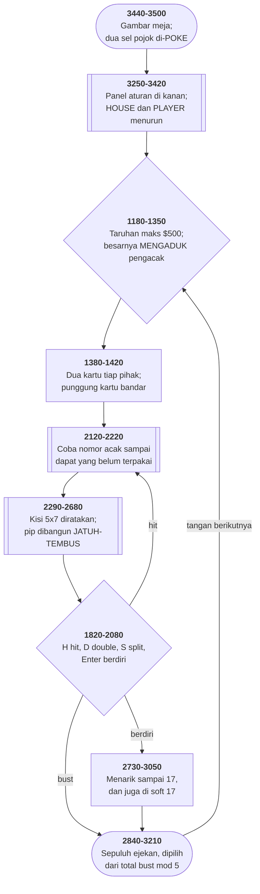

# BLACKJCK.BAS di penelusur

> Program keenam puluh dua. 282 baris, nomor 1000–3820, cakupan tabel
> **282/282 (100%)**.

Sumber: `run/BLACKJCK.BAS` · tabel: `tracer/program/BLACKJCK.js`

Blackjack (CCII, 3 Januari 1978. Ditulis 3 Januari 1978, empat tahun sebelum mesin yang menjalankannya ada.

## Kartu yang menggambar dirinya dari kartu lain

Sebuah kartu di layar ini adalah kisi lima kolom kali tujuh baris, disimpan sebagai **larik 35 string** yang diratakan — indeks 17 adalah tengahnya, 6 dan 8 pojok atas, 26 dan 28 pojok bawah.

Cara yang biasa: tulis dua belas blok, satu per pangkat, masing masing menaruh pipnya sendiri. Yang dilakukan program ini lain:

`2440 T$(7)=U$:T$(27)=U$:GOTO 2460`   ← sembilan
`2460 T$(17)=U$`   ← tujuh, lalu **jatuh**
`2470 T$(6)=U$:T$(8)=U$:T$(16)=U$:…`   ← enam

Sembilan menaruh dua pip lalu **melompat ke tujuh**. Tujuh menaruh satu pip di tengah lalu **jatuh** ke enam. Enam menggambar pola dasarnya dan selesai.

Delapan (2450) melompat langsung ke enam. Sepuluh (2420) menggambar enam pip lalu melompat ke **empat** di 2510. Tiga, dua, dan As berdiri sendiri.

Yang tersimpan bukan gambarnya, melainkan **hubungan antar gambar** — dan yang menyimpannya adalah urutan nomor baris dan letak `GOTO`-nya.

Itu juga kelemahannya. Mengubah pola enam mengubah tujuh, delapan, dan sembilan sekaligus. Menyisipkan satu baris di antara 2460 dan 2470 memutus tujuh dari enam tanpa peringatan apa pun. Struktur yang cerdas, disimpan di tempat yang tidak bisa memeriksanya.

## Empat tahun sebelum mesinnya ada

Dua baris pertama berkas ini:

```basic
1000 REM ** CCII BLACKJACK - JAN 3,78 - JESSEN **
1010 REM ADAPTED TO PC BY PATRICK LEABO--TUCSON
```

Tiga Januari 1978. IBM PC baru diumumkan Agustus 1981 — **tiga setengah tahun kemudian**. Program ini ditulis untuk mesin lain, dan orang kedua memindahkannya.

Bekas pemindahan itu masih terlihat di beberapa tempat.

`REM GOSUB 64000` di baris 2650 memanggil nomor baris yang tidak ada di berkas ini — sesuatu di mesin asal yang tidak ikut pindah, dan panggilannya dijadikan komentar alih-alih dihapus.

Baris 1060 mengacak `N` dan `X`, lalu keduanya tidak pernah dibaca lagi.

Dan baris 3480 memoke ke `&HB000` — memori layar **monokrom**. Yang memindahkan program ini punya kartu MDA, bukan CGA. Di mesin CGA, pojok kanan bawah bingkainya tetap bolong, dan tidak ada yang tahu kenapa.

Berkas ini menyimpan jejak dua mesin sekaligus: yang tidak dikenalnya lagi, dan yang baru saja dikenalnya.

## Peta arsitektur



## Alur yang layak diikuti

| baris | yang terjadi |
|---|---|
| `2350` | `ON Q(X) GOTO` — dua belas sasaran untuk **tiga belas** pangkat |
| `2440` | sembilan = dua pip, lalu **lompat ke tujuh** |
| `2460` | tujuh = satu pip di tengah, lalu **jatuh ke enam** |
| `2470` | enam = pola dasarnya |
| `2670` | kisi 5×7 yang diratakan dicetak **terbalik**: indeks besar di atas |
| `1350` | besar taruhan menentukan **berapa RND dibuang** sebelum kartu dibagi |
| `2170` | mengocok = **mengosongkan penanda**, bukan mengaduk larik |
| `2240` | As selalu 11 dulu; `E(P)` mencatat berapa yang bisa diturunkan |
| `2760` | bandar menarik juga di **soft 17** — satu baris, menguntungkan rumah |
| `1750` | `C1 = T(P) MOD 5` memilih ejekan bandar — **hanya disetel saat pemain bust** |
| `3480` | `POKE` dua sel pojok yang **tidak bisa dicetak** tanpa menggulirkan layar |

## Yang bisa dicoba di halaman

| coba ini | yang terlihat |
|---|---|
| pasang titik henti di 2350 | `ON Q(X) GOTO` — dua belas sasaran untuk **tiga belas** pangkat |
| pasang titik henti di 2440 | sembilan = dua pip, lalu **lompat ke tujuh** |
| pasang titik henti di 2460 | tujuh = satu pip di tengah, lalu **jatuh ke enam** |
| pasang titik henti di 2470 | enam = pola dasarnya |
| pasang titik henti di 2670 | kisi 5×7 yang diratakan dicetak **terbalik**: indeks besar di atas |

Aslinya dijalankan dengan `run\\BLACKJCK.bat`.

> H ambil kartu, D double down, S split, Enter berdiri. F10 mematikan bunyi. Ketik END sebagai taruhan untuk keluar.

## Penyimpangan dari aslinya

1. **`PLAY` diam**, tapi F10 tetap membalik bendera `SND` lewat jebakan di baris 3800 — jadi alurnya tetap bisa ditelusuri.
2. **`POKE` ke `&HB000` tidak ditiru.** Itu memori layar **monokrom** (MDA), bukan `&HB800` milik CGA. Penelusur menulis dua aksara itu ke konsolnya langsung. Di mesin CGA sungguhan, kedua poke ini **tidak terlihat sama sekali**.
3. **`RANDOMIZE` memasang benih tetap**, jadi urutan kartunya sama tiap kali dijalankan.
4. **Gelung tunda di 3610 habis seketika.**
5. **`LOAD "MENU",R` diperlakukan sama seperti `RUN "MENU"`.** `COMMON MENU` di baris 1030 tidak ditiru — penelusur tidak mewariskan variabel antarprogram.

## Yang layak ditiru

**Pip yang dibangun dengan jatuh-tembus.** Kartu sembilan tidak digambar dari nol. Baris 2440 menaruh dua pip, lalu `GOTO 2460` — kartu **tujuh**, yang menaruh satu pip di tengah lalu **jatuh** ke 2470, kartu **enam**, yang menggambar enam pip dasarnya. Jadi 9 = 2 + 7, dan 7 = 1 + 6. Delapan melompat langsung ke enam (8 = 2 + 6); sepuluh melompat ke empat (10 = 6 + 4). **Tiap pangkat didefinisikan sebagai selisihnya dari pangkat lain**, dan urutan barisnya yang menyimpan hubungan itu. Hasilnya: dua belas gambar kartu dalam sembilan baris.

**Mengocok tanpa mengaduk apa pun.** `D(A)` menyimpan **nomor tangan** saat kartu itu keluar, bukan sekadar "sudah terpakai". Mengocok (baris 2170-2190) cukup mengosongkan semua penanda **kecuali** yang bernilai `K` — tangan yang sedang berjalan. Kartu yang sudah di meja tetap tidak bisa keluar dua kali, dan tidak ada satu pun larik yang diaduk.

**Taruhan yang mengaduk pengacak.** Baris 1350: `FOR A4=1 TO Q3:X=RND(1):NEXT`, dengan `Q3` adalah besar taruhan. Makin besar taruhan, makin banyak bilangan acak yang **dibuang** sebelum kartu dibagi. Pemain sendiri yang mengaduk deknya, tanpa tahu, lewat angka yang ia ketik.

**Aksara yang tidak bisa dicetak.** Sel terakhir layar teks tidak bisa diisi dengan `PRINT`: menulis di sana memicu penggulungan. Baris 3480 mengisinya dengan `POKE` langsung ke memori layar — satu-satunya cara menutup pojok kanan bawah bingkai.

**Dua blackjack, dua cara melacak As.** Berkas ini memakai penghitung terpisah `E(P)`: tiap As dihitung sebelas dulu, dan diturunkan satu per satu saat bust mengancam. [BJ.BAS](bj.md) di koleksi yang sama menyimpan sebelasnya **di dalam** angka totalnya. Dua program, satu masalah, dua jawaban yang sama benarnya — dan yang satu butuh tiga baris disalin tiga kali, yang lain satu baris `DEF FN`.

## Yang jangan ditiru

**Gelung yang batasnya memakai pencacahnya sendiri.** Baris 3400: `FOR YP=1 TO YP+LEN(ME$)`. Batasnya dihitung dari `YP` — variabel yang baru saja diberi nilai awal oleh `FOR` itu sendiri. Kebetulan hasilnya masuk akal, tapi maknanya bergantung pada urutan yang tidak jelas dari membacanya. Baris 3410 mengulang pola yang sama, dan di sana batasnya kelebihan satu — ia mencetak satu aksara kosong setelah "PLAYER".

**Penugasan ke diri sendiri, bekas baris yang dicabut.** Baris 2600: `IF X>13 AND X<40 THEN T$=T$`. Syaratnya memilih tepat wajik dan hati — **kartu merah**. Yang tersisa adalah kerangka sebuah baris pewarna yang isinya sudah dicabut, dan syaratnya ditinggal berdiri sendiri.

**Empat baris yang tidak bisa dicapai.** Baris **1360** dan **1370**: baris 1350 berakhir dengan `GOTO 1380`, dan tidak ada satu pun lompatan ke keduanya. Baris **3070** dan **3080**: pemanggilnya (1150-1170) sudah memilih sendiri antara 3090, 3100, dan 3110. Empat baris yang tidak akan pernah dijalankan sekali pun.

**Kepribadian yang bergantung nilai basi.** `C1` hanya disetel di baris 1750 — **saat pemain bust**. Tapi baris 2860-2890 dan 2930-2960 membacanya di **setiap** pembayaran. Tangan yang dimenangkan tanpa bust akan memilih ejekan berdasarkan sisa tangan sebelumnya, atau nol di awal permainan.

**Bayaran asuransi yang tidak cocok dengan tulisannya.** Baris 1630 menambah `W` ke saldo, lalu baris 1640 menulis *"YOU WIN $";W/2*. Yang bertambah dua kali lipat dari yang dikatakan.

**Panggilan ke baris yang tidak ada.** Baris 2650 berisi `REM GOSUB 64000:GOSUB 3000` — sudah dijadikan komentar, dan 64000 memang tidak ada di berkas ini. Sisa dari versi 1978, waktu ada sesuatu di sana yang tidak ikut pindah ke PC.

---
[Rancangan penelusur](_rancangan.md) · [BJ](bj.md) · [BLACK](black.md) · [YAHTZEE](yahtzee.md)
