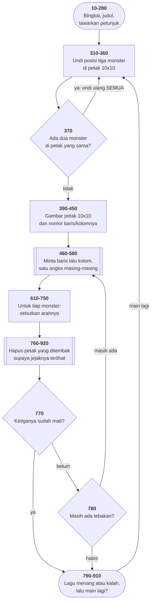

# BOGGY.BAS di penelusur

> Program kedelapan. 101 baris, nomor 10–1100, cakupan tabel
> **101/101 (100%)**.

Sumber: `run/BOGGY.BAS` · tabel: `tracer/program/BOGGY.js` ·
analisis: [`reviews/BOGGY.md`](../../reviews/BOGGY.md)

Petak 10×10, tiga monster tersembunyi, sepuluh tebakan. Tiap tebakan dijawab
dengan **arah** — North, Southeast, West — bukan "panas/dingin". Itu yang
membuatnya bisa diselesaikan dengan berpikir.

## Kenapa "undi ulang" lebih baik daripada "geser"

Tiga monster diundi ke petak seratus kotak. Kadang dua mendarat di kotak yang
sama. Apa yang harus dilakukan?

Naluri pertama: geser salah satunya ke kotak sebelah. Masalahnya, kotak sebelah
bisa saja sudah ditempati monster ketiga — jadi Anda perlu memeriksa lagi,
menggeser lagi, memeriksa lagi.

Baris 370 memilih jalan lain: **buang semuanya, undi ulang dari nol.**

```basic
370 IF (R(1)=R(2) AND C(1)=C(2)) OR (R(2)=R(3) AND C(2)=C(3))
       OR (R(3)=R(1) AND C(3)=C(1)) THEN 310
```

Lebih boros? Secara teori ya — bisa mengulang berkali-kali. Dalam praktik,
peluang tabrakan tiga monster di seratus kotak kecil sekali, jadi ia hampir tak
pernah mengulang lebih dari sekali.

Yang didapat sebagai gantinya: **kode yang tidak mungkin salah.** Tidak ada
kasus tepi, tidak ada urutan yang harus benar. Pola ini punya nama di dunia
nyata — *rejection sampling* — dan dipakai dari pembangkit bilangan acak sampai
simulasi fisika.

Bandingkan [MASTER.BAS](master.md), yang tidak memeriksa tabrakan sama sekali.

## Dua program, satu kesalahan, satu tidak

| | BOGGY | MASTER |
|---|---|---|
| menyemai | `310 RANDOMIZE(…)` **sebelum** gelung | `720 RANDOMIZE(…)` **di dalam** gelung |
| akibatnya | enam angka berturut-turut dari satu deret | angka pertama diminta berulang kali |

Keduanya dari koleksi yang sama, keduanya memakai benih yang sama (detik jam
dinding), dan yang satu benar.

Menyemai adalah tindakan **sekali**: ia menetapkan titik awal deret.
Mengulanginya di dalam gelung, dengan benih yang sama, sama saja dengan meminta
angka pertama berkali-kali.

Aturan praktisnya: **semai di tempat paling luar yang masuk akal, dan hanya
sekali.**

## Peta arsitektur



Flowchart saja sudah cukup: tidak ada keadaan yang berganti arti, dan
subrutinnya lurus. Panah balik `tabrak → sembunyi` adalah gelung undi-ulang.

## Pseudokode

```
baris  110   pasang jebakan F1-F10, gambar bingkai dan judul
baris  310   SEMAI PENGACAK SEKALI, di luar gelung
baris  320   untuk tiap dari tiga monster: undi baris dan kolomnya (0-9)
baris  370   ada dua monster di kotak sama? BUANG SEMUANYA, UNDI ULANG
baris  390   gambar petak 10x10 dan nomor baris/kolomnya

baris  460   untuk sepuluh tebakan:
baris  510       minta satu angka untuk baris
baris  560       minta satu angka untuk kolom
baris  610       untuk tiap monster:
baris  630           sudah mati (ditandai 99)? bilang begitu
baris  640           tepat sasaran? tandai mati, gambar penanda berkedip
baris  660           meleset? sebutkan ARAHNYA - delapan kemungkinan
baris  760       meleset semua? hapus juga kotak yang barusan ditembak
baris  770       ketiganya mati? MENANG, mainkan lagu, umumkan
baris  800   tebakan habis: mainkan "Taps", umumkan kalah
baris  860   main lagi? buang larik, undi ulang - atau kembali ke menu
```

## Penjelasan untuk pemula

### Arah, bukan panas-dingin

Permainan tebak-koordinat paling sederhana menjawab "lebih dekat" atau "lebih
jauh". Program ini menjawab **arah**.

Bedanya besar. "Lebih dekat" memberi satu bit informasi per tebakan; arah
memberi cukup untuk mempersempit dua sumbu sekaligus. Dengan sepuluh tebakan
untuk tiga monster di seratus kotak, permainannya **bisa** dimenangkan dengan
berpikir — dan itulah yang membuatnya permainan, bukan undian.

Kalau Anda merancang permainan tebak-tebakan, pertanyaan pertamanya selalu:
berapa banyak informasi yang diberikan tiap jawaban, dan apakah cukup untuk
menang dengan jumlah kesempatan yang Anda beri?

### Nilai di luar jangkauan sebagai penanda

```basic
630 IF R(I)=99 THEN PRINT"You've Killed Number" I
```

`R(I)=99` menandai monster yang sudah mati. Baris dan kolom hanya 0–9, jadi 99
tidak mungkin bentrok dengan posisi yang sah.

Ini cara lama menyatakan "kosong" ketika bahasanya tidak punya nilai kosong —
dan cara yang masih sering dipakai hari ini, kadang dengan akibat buruk. Yang
membuatnya aman di sini: jangkauan nilainya **benar-benar** terbatas 0–9, dan
99 **benar-benar** mustahil. Begitu salah satu dari dua syarat itu goyah,
penanda ajaib berubah jadi cacat.

### Dua NEXT yang berbagi satu baris

```basic
390 FOR I=3 TO 21 STEP 2:FOR J=33 TO 80 STEP 5
400   LOCATE I,J,O:PRINT CHR$(219) CHR$(219) CHR$(219)
410 NEXT:NEXT
```

Dua gelung dibuka di satu baris dan ditutup di satu baris. `NEXT` yang pertama
menutup gelung **J** dan kembali ke baris 400. Yang kedua menutup gelung **I**
dan kembali ke `FOR J` — yang ada di **tengah baris 390**.

Di penelusur, kedua baris itu ditulis "berbagian", dan alamat pulang tiap
gelung membawa nomor bagiannya. Telusuri dengan laju 4 baris/detik dan
perhatikan sorotan bolak-balik antara 390, 400, dan 410.

### Salah ketik yang jalan

```basic
400 LOCATE I,J,O:PRINT …
```

Argumen ketiga `LOCATE` mengatur kursor terlihat atau tidak. Yang tertulis di
sana huruf **O**, bukan angka nol.

Di BASIC, variabel numerik yang belum pernah diisi bernilai 0. Jadi `LOCATE
I,J,O` sama dengan `LOCATE I,J,0` — "sembunyikan kursor", persis yang dimaksud
penulisnya.

Salah ketik yang kebetulan benar. Ada di baris 270, 400, 480, dan 600. Ia
mengajarkan sesuatu tentang bahasa yang tidak mengeluh soal variabel yang tak
dideklarasikan: **kesalahan ketik tidak selalu memberi tahu Anda.**

## Yang bisa dicoba di halaman

| coba ini | yang terlihat |
|---|---|
| jawab `N`, telusuri sampai baris 370 | `R()` dan `C()` sudah terisi; kalau ada tabrakan, penunjuknya kembali ke 310 |
| turunkan laju ke 4 baris/detik saat 390–410 | gelung bersarang menggambar seratus kotak, dan sorotan bolak-balik di tiga baris |
| tebak `0` lalu `0` | ketiga arahnya muncul di baris 11–13 |
| tebak posisi monster yang benar | "You Just Killed Number", petak diganti penanda, `R(I)` jadi 99 |
| tebak lagi ke petak yang sama | "You've Killed Number" — baris 630 mengenali penanda 99 |
| pasang titik henti di 800 | jalur kalah, tempat lagu "Taps" seharusnya berbunyi |

## Penyimpangan dari aslinya

1. **Kedua lagunya tidak berbunyi.** Baris 800–840 memainkan "Taps" saat kalah
   dan 1060–1090 memainkan "Rule Britannia" saat menang. Keduanya makro `PLAY`
   lengkap dengan tempo, oktaf, dan panjang not — bukan REM kosong seperti lagu
   yang tak pernah ditulis di [MASTER.BAS](master.md). **Yang hilang di sini
   nyata.**
2. **Pengacaknya bukan pengacak GW-BASIC, dan benihnya tetap**, supaya tiap
   penelusuran bisa diulang persis. Posisi monsternya karena itu selalu sama.
3. **`COLOR 20,0` tidak berkedip.** Warna 20 berarti merah + kedip (4 + 16).
4. **`LOCATE r,c,O` ditulis sebagai `0`** — lihat "Salah ketik yang jalan".

---
[Rancangan penelusur](_rancangan.md) · [MENU](menu.md) · [INTRO](intro.md) · [CHECK](check.md) · [TOWERS](towers.md) · [HEAREYE](heareye.md) · [TICTAC](tictac.md) · [MASTER](master.md)
