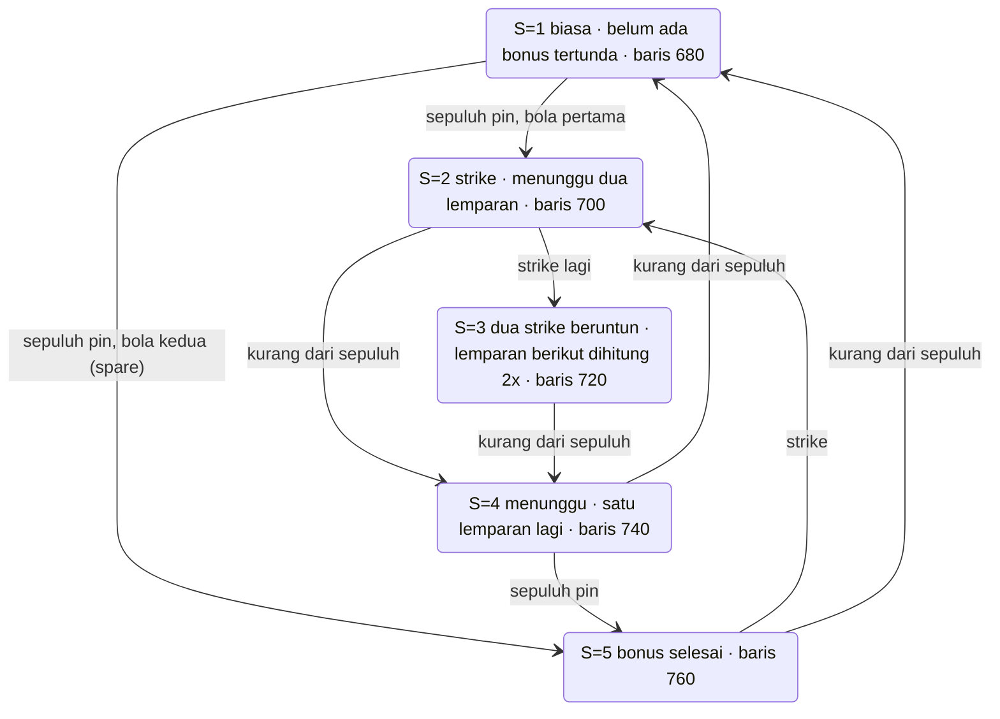
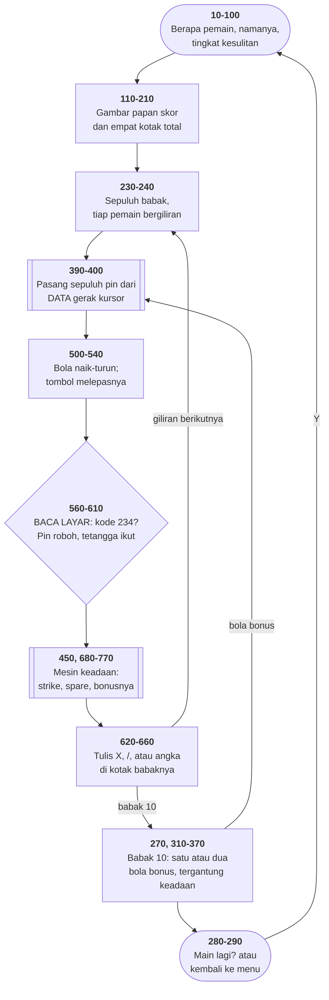

# BOWLING.BAS di penelusur

> Program keempat puluh enam. 75 baris, nomor 10–1003, cakupan tabel
> **75/75 (100%)**.

Sumber: `run/BOWLING.BAS` · tabel: `tracer/program/BOWLING.js`

Tiga gagasan, masing-masing layak ditelusuri sendiri: pin yang digambar oleh
datanya sendiri, layar sebagai peta tabrakan, dan aritmetika atas nilai
benar/salah. Ditambah mesin keadaan penilaian bowling yang sungguhan.

## Sepuluh pin yang digambar oleh datanya sendiri

```basic
1001 DATA 234,31,29,29,234,31,29,29,234,28
1002 DATA 234,31,29,29,29,29,234,28,234,31
1003 DATA 29,29,234,28,234,31,29,29,234,31,234

400  FOR I=1 TO 31:READ PC:PRINT CHR$(PC);:NEXT:RESTORE
```

Kode **234** adalah Ω di CP437 — sebuah pin. Tapi **28, 29, dan 31 bukan
gambar sama sekali**: di GW-BASIC, mencetaknya *memindahkan kursor* ke kanan,
kiri, dan bawah.

Jadi ketiga puluh satu bita itu terbaca sebagai perintah: pin, turun, kiri,
kiri, pin, turun, kiri, kiri, pin, kanan…

Terverifikasi di penelusur — posisi pin sesudah baris 400 dijalankan:

```
kol:   36   37   38   39
row17:                 O
row18:            O
row19:       O         O
row20:  O         O
row21:       O         O
row22:            O
row23:                 O
```

Baca menurut kolom: **1 – 2 – 3 – 4**. Segitiga bowling yang ujungnya
menghadap kiri — karena bolanya menggelinding dari kiri ke kanan. Sepuluh pin,
dari satu string bita.

Ini bentuk paling awal dari sesuatu yang masih ada di mana-mana: menyimpan
**langkah-langkah menggambar**, bukan gambarnya. Urutan escape terminal,
perintah `DRAW` di BASIC grafik, jalur SVG — prinsip yang sama.

Dan `RESTORE` di ujung baris 400 yang membuat rak yang sama bisa dipasang lagi
untuk lemparan berikutnya.

## Layar sebagai peta tabrakan

```basic
570 IF SCREEN(V,H)=234 THEN J=J+1 ELSE 610
580 FOR D=-1 TO 1 STEP 2:X1=V:X2=H
590 X1=X1+D:X2=X2+1:IF SCREEN(X1,X2)=234 THEN LOCATE X1,X2:PRINT " ";:J=J+1:GOTO 590
```

Tidak ada larik pin. Bola menyusuri lajurnya, membaca layar, dan kode 234
berarti pin. Yang roboh **dihapus dari layar** — dan itulah satu-satunya
catatan bahwa ia sudah roboh.

Baris 580–600 adalah seluruh "fisika"-nya: pin yang kena menjatuhkan
tetangganya secara diagonal, ke atas dan ke bawah, selama masih ketemu pin.

Terverifikasi: bola dilepas di baris 20 (baris pin kepala) → **J=10, nol pin
tersisa di layar**. Strike.

Gagasan yang sama dengan [SERPENT.BAS](serpent.md), dipakai untuk hal yang
sama sekali lain.

## Aritmetika atas nilai benar/salah

Di BASIC, perbandingan bernilai **−1** (benar) atau **0** (salah), dan keduanya
bilangan biasa. Baris 470 memakainya untuk menempatkan empat kotak skor dalam
kisi 2×2 **tanpa satu pun `IF`**:

```basic
470 LOCATE 14+(Z9<2)*2, 31+(Z9/2=INT(Z9/2))*20
```

| pemain | `(Z9<2)` | baris | `(genap)` | kolom |
|--:|--:|--:|--:|--:|
| 0 | −1 | 12 | −1 | 11 |
| 1 | −1 | 12 | 0 | 31 |
| 2 | 0 | 14 | −1 | 11 |
| 3 | 0 | 14 | 0 | 31 |

Baris 630 memakai trik yang sama untuk **menukar** warna depan dan belakang:

```basic
630 COLOR -(2+Z9)*(B1=0), -(2+Z9)*(B1<>0)
```

Bola pertama tampil terang di atas gelap; bola kedua kebalikannya. Satu baris,
tanpa percabangan.

Yang menarik: baris 160 melakukan hal yang **sama** dengan `IF I=2 THEN LOCATE
14,1`. Dua cara, satu program, sepuluh baris berjauhan.

## Penilaian bowling sebagai mesin keadaan

Nilai bowling tidak bisa dihitung saat itu juga: strike bernilai 10 **ditambah
dua lemparan berikutnya**, spare 10 ditambah satu. Artinya nilai sebuah babak
**belum bisa diketahui saat babak itu selesai**.

Jadi `S(pemain)` menyimpan "sedang menunggu bonus apa", dan satu baris memilih
perlakuannya:

```basic
450 ON S(Z9) GOSUB 680,700,720,740,760
```



**Terverifikasi dengan permainan sempurna** — dua belas strike, dilepas tepat
di baris pin kepala tiap kali:

```
0 → 10 → 30 → 60 → 90 → 120 → 150 → 180 → 210 → 240 → 270 → 290 → 300
```

**Tiga ratus.** Mesin keadaan lima keadaan, lima subrutin dua baris, dan
penilaian bowling yang benar sampai angka terakhir.

## Peta arsitektur



## Yang bisa dicoba di halaman

| coba ini | yang terlihat |
|---|---|
| pasang titik henti di 400 | rak pin terbentuk dari kode gerak kursor |
| pasang titik henti di 570 | `SCREEN(V,H)` di depan bola |
| pasang titik henti di 590 | tetangga roboh diagonal, satu per satu |
| pasang titik henti di 450 | `S(Z9)` — keadaan mesin penilaian |
| lepas bola di baris 20 | strike: sepuluh pin sekaligus |

## Penyimpangan dari aslinya

1. **`WIDTH 40` tidak ditiru**; konsol tetap 80 kolom. Lajur dan rak pin
   menempati separuh kiri layar. Batas geraknya diperiksa program sendiri
   (`WHILE H<40`), jadi permainannya berjalan benar.
2. **`SOUND` diam.**
3. **Gelung tunda habis seketika** — pakai penggeser laju.
4. **`POKE 1047,64` tidak ditiru.** Alamat itu bendera papan tombol BIOS, dan
   64 menyalakan Caps Lock supaya `A$="Y"` di baris 290 selalu cocok.
5. **`WHILE+` diperlakukan sebagai `WHILE` biasa** — bentuk itu muncul di
   delapan berkas koleksi ini, artefak alat yang mengubah .BAS ter-token jadi
   teks.
6. **Larik `S()` dan `T()` diberi nama berkurung** di berkas port, karena
   BASIC mengizinkan `S` dan `S(0)` hidup berdampingan sebagai dua variabel
   berbeda — dan program ini memakai keduanya (baris 440, 460).

## Yang jangan ditiru

- **Satu huruf untuk dua hal.** `S` skalar dan `S()` larik; `T` sama; `D`
  dipakai sebagai arah bidikan **dan** pencacah gelung diagonal.
- **Rak pin dipasang ulang tiap lemparan.** Yang mencegah pin berdiri lagi di
  bola kedua cuma letak nomor baris 430.
- **`ON S GOTO 280,310,310,280,340`** — lima tujuan, dua di antaranya sama,
  tanpa satu pun nama.

---
[Rancangan penelusur](_rancangan.md) · [SERPENT](serpent.md) · [METEOR](meteor.md) · [CURVE](curve.md) · [HINTS](hints.md)
