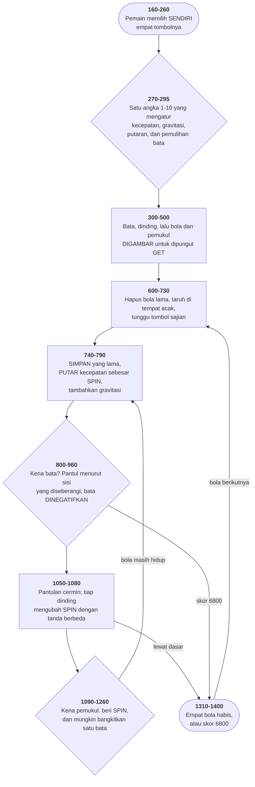

# BREAKOUT.BAS di penelusur

> Program ketujuh puluh enam. 164 baris, nomor 10–1530, cakupan tabel
> **164/164 (100%)**.

Sumber: `run/BREAKOUT.BAS` · tabel: `tracer/program/BREAKOUT.js`

Spinout (K.R. Sloan Jr., 1 Januari 1982). Satu Januari 1982, lima bulan sesudah IBM PC dijual — dan bolanya melengkung.

## Kenapa ia bernama Spinout

Berkasnya bernama BREAKOUT.BAS. Baris pertamanya berkata lain:

```basic
10 REM ibm pc spinout
```

Dan baris 140 mencetaknya ke layar: *Welcome to Spinout*. Nama berkas boleh delapan aksara; nama sebenarnya tidak muat.

Bedanya bukan soal nama. Breakout memantulkan bola pada sudut yang bergantung tempat kena. Program ini melakukan sesuatu yang lain:

```basic
1240 MISS=(X-(PL+PR)/2)/(PL-PR)
```

```basic
1260 SPIN=(SPIN*SKILL)+MISS*SKILL
```

Kena di pinggir pemukul tidak hanya mengubah arah — ia memberi **putaran**, dan putaran itu tersimpan di variabel `SPIN` yang bertahan sesudah pantulan selesai.

Lalu tiap langkah bola:

```basic
760 VX=OVX-(SPIN*OVY*.05):VY=OVY+(SPIN*OVX*.05)+G
```

Arah geraknya diputar sedikit demi sedikit. Bolanya tidak bergerak lurus di antara pantulan — ia MELENGKUNG, seperti bola yang benar-benar berputar di udara.

Dan putaran ini tidak menjaga lajunya. Bentuk sebenarnya butuh sinus dan kosinus; yang ditulis di sini bentuk hampirannya, dan hampiran itu **mengalikan laju bola dengan &radic;(1+(0,05&middot;SPIN)²) tiap langkah**. Diukur di penelusur pada `SPIN=5`: 6,375 → 6,571 → 6,773 → 6,981 — naik 3,08 persen tiap langkah.

Bola yang berputar kencang jadi makin cepat sampai baris 770-781 memotongnya di `MAXVX` dan `MAXVY`. Dua pemotongan itu bukan pemanis: tanpa keduanya, permainan ini meledak sendiri.

Baris 761 membuat lengkungannya luruh: `SPIN=SPIN*.9999`. Sepersepuluh ribu tiap langkah — cukup lambat sehingga lengkungan sebuah pukulan bertahan sepanjang beberapa pantulan, cukup cepat sehingga tidak selamanya.

Dan ada tiga tempat lain yang menyentuh SPIN, satu untuk tiap dinding:

`1050 ... VY=VY+SPIN`   (dinding kiri)

`1060 ... VY=VY-SPIN`   (dinding kanan)

`1070 ... VX=VX-SPIN`   (langit-langit)

Bola yang berputar dan menyerempet dinding terlempar — ke arah yang bergantung dinding mana dan arah putarannya. Itu gesekan, ditulis sebagai satu penjumlahan.

Seluruh mekanika ini — putaran, peluruhan, gesekan dinding, gravitasi — muat dalam tujuh baris yang tersebar di seluruh gelung utamanya. Satu Januari 1982.

## Bata yang bangkit lagi, dan variabel yang dicurinya

Baris 960 tidak menolkan bata yang hancur:

```basic
960 BRICK[1+BX,1+BY]=-BRICK[1+BX,1+BY]
```

Ia menegatifkannya. Tandanya sekarang berarti "sudah hancur", besarnya tetap berarti "berapa nilainya". Dua keterangan di satu bilangan.

Yang dibeli dengan itu terlihat di baris 1150-1200, yang jalan tiap kali bola kena pemukul:

```basic
1150 IF (RND(1)*2)>SKILL GOTO 1210
```

```basic
1160 BX=INT(RND(1)*19.99):BY=INT(RND(1)*3.99):
```

```basic
1170 IF BRICK[1+BX,1+BY]>0 GOTO 1210
```

```basic
1180 BRICK[1+BX,1+BY]=-BRICK[1+BX,1+BY]
```

```basic
1200 SCORE=SCORE-BRICK[1+BX,1+BY]
```

Ambil satu petak acak. Kalau batanya masih berdiri, tidak ada yang terjadi. Kalau sudah hancur, **bangkitkan lagi** — gambar ulang, dan potong nilainya dari skor pemain.

Peluangnya `SKILL/2`. Pemain yang mengaku pandai dihukum lebih sering: pada tingkat 10, satu dari dua pukulan membangunkan sebuah bata.

Itu bagian yang dirancang. Sekarang bagian yang tidak.

Baris 1160 memakai `BX` dan `BY`. Kedua nama itu sudah punya arti di tempat lain: baris 800-830 mengisinya dengan petak bata yang sedang ditempati bola, dan baris 740 menyalinnya ke `OBX,OBY` di awal tiap langkah.

`OBX` dan `OBY` dipakai baris 890-900 untuk memutuskan arah pantul: kalau nomor kolomnya berubah, bola masuk dari samping; kalau nomor barisnya berubah, dari atas.

Sesudah satu pemulihan, keduanya menunjuk petak acak di seluruh dinding bata. Tabrakan berikutnya membandingkan petak yang benar dengan petak sembarang, dan hampir pasti menemukan KEDUANYA berbeda — jadi bola dipantulkan di kedua sumbu sekaligus, terlepas dari sisi mana yang sebenarnya disentuh.

Diperiksa langsung: bola di petak `(10,2)`, satu kali jalan baris 1150-1200, dan `BX,BY` berakhir di `(18,1)`. Baris 740 menyalinnya apa adanya.

Gejalanya: sesekali bola memantul balik ke arah datangnya — kedua sumbu dibalik sekaligus. Tidak sering, tidak dapat ditebak.

Dan justru karena permainan ini SENGAJA tidak dapat ditebak — bolanya melengkung, batanya bangkit, gravitasinya menarik — cacat itu punya tempat sempurna untuk bersembunyi. Ia terlihat seperti bagian dari rancangannya.

Perbaikannya dua nama variabel. Menemukannya butuh membaca delapan ratus baris di antara dua pemakaian yang tidak pernah muncul di layar yang sama.

## Peta arsitektur



## Alur yang layak diikuti

| baris | yang terjadi |
|---|---|
| `760` | kecepatan **diputar** sebesar sudut kecil → bolanya melengkung |
| `761` | putarannya luruh `×0,9999` tiap langkah |
| `1260` | SPIN datang dari **seberapa pinggir** bola kena pemukul |
| `295` | `G` gravitasi — dan besarnya ikut angka yang diakui pemain |
| `960` | bata **dinegatifkan**, bukan dinolkan: tandanya menyimpan nasibnya |
| `1180` | …jadi ia bisa **dibangkitkan lagi** lengkap dengan harganya |
| `1160` | …tapi baris ini **menimpa BX,BY** yang masih dipakai baris 740 |
| `470` | bola dibuat dengan **menggambarnya**, lalu dipungut `GET` |
| `890` | arah pantul dari **nomor petak** yang berubah, bukan dari geometri |
| `1050` | `X=L+L-X` — pantulan cermin, bukan penempelan ke dinding |

## Yang bisa dicoba di halaman

| coba ini | yang terlihat |
|---|---|
| pasang titik henti di 760 | kecepatan **diputar** sebesar sudut kecil → bolanya melengkung |
| pasang titik henti di 761 | putarannya luruh `×0,9999` tiap langkah |
| pasang titik henti di 1260 | SPIN datang dari **seberapa pinggir** bola kena pemukul |
| pasang titik henti di 295 | `G` gravitasi — dan besarnya ikut angka yang diakui pemain |
| pasang titik henti di 960 | bata **dinegatifkan**, bukan dinolkan: tandanya menyimpan nasibnya |

Aslinya dijalankan dengan `run\\BREAKOUT.bat`.

> Program menanyakan empat tombol lebih dulu — kanan, kiri, sajian, dan bunyi — lalu satu angka 1 sampai 10. Coba angka 10 dan perhatikan bolanya melengkung; coba 1 dan ia hampir lurus.

## Penyimpangan dari aslinya

1. **`PLAY` dan `SOUND` diam.** Termasuk lagu kemenangan yang disimpan di `BRUNO$`.
2. **`RANDOMIZE(VAL(RIGHT$(TIME$,2)))` diganti benih tetap**, supaya sajian yang sama bisa ditelusuri dua kali.
3. **`PEEK(&H410)` diisi nilai kartu warna yang masuk akal.** Programnya menyimpannya ke `EQUIPMENT%` lalu tidak pernah membacanya lagi — baris yang memakainya sudah jadi komentar.
4. **`INPUT;"How good are you..."` dipecah jadi dua bagian** di penelusur (`LOCATE` lalu permintaannya), supaya permintaan masukan berdiri sendiri sebagai satu langkah.
5. **Baris 720 diperlakukan sebagai komentar** meski aksara penandanya backtick, bukan apostrof. Lihat catatan cacat — ini yang membuat sisa berkasnya bisa ditelusuri sama sekali.

## Yang layak ditiru

**Putaran vektor sebagai dua perkalian.** `760 VX=OVX-(SPIN*OVY*.05):VY=OVY+(SPIN*OVX*.05)+G` Itu putaran vektor kecepatan sebesar sudut kecil. Bentuk lengkapnya butuh sinus dan kosinus; untuk sudut kecil, `sin&theta;&asymp;&theta;` dan `cos&theta;&asymp;1`, dan yang tersisa persis dua perkalian di atas. Yang membuatnya benar: keduanya dihitung dari `OVX` dan `OVY` yang **sama** — nilai sebelum baris ini. Kalau `VX` yang baru dipakai untuk menghitung `VY`, hasilnya bukan putaran lagi melainkan dua penyesuaian berurutan yang saling memakan. Itu sebabnya baris 750 ada. Dua variabel bayangan, semata-mata supaya satu baris di bawahnya bisa membaca keadaan yang belum berubah. Diukur di penelusur dengan `SPIN=5` dan gravitasi dimatikan, arah bolanya berbelok **14,036&deg; tiap langkah** — tepat `atan(0,25)`, dan 0,25 adalah `SPIN×0,05`. Dengan `SPIN=0` arahnya tetap 0&deg; langkah demi langkah.

**Sprite yang dibuat dengan menggambarnya.** Baris 430-470 tidak mengisi larik dengan angka. Ia menggambar lingkaran sungguhan di tengah layar — gelung 5×5 dengan uji `(I-3)²+(J-3)²<6.25` — lalu MEMUNGUTNYA dengan `GET`. Uji jaraknya sendiri layak dilihat: 6,25 adalah 2,5 dikuadratkan, jadi tidak ada akar yang perlu dihitung. Dan gambar aslinya tidak dihapus. Ia ditinggalkan di layar, lalu baris 640 — `PUT` pertama pada bola pertama — menghapusnya dengan XOR di tempat yang sama. Pembuatan dan pembersihan dikerjakan oleh dua mekanisme berbeda yang kebetulan saling melengkapi.

**Satu tanda minus, dua keterangan.** Baris 960 menegatifkan nilai bata alih-alih menolkannya. Sesudah itu **tandanya** berarti "sudah hancur atau belum" dan **besarnya** tetap berarti "berapa nilainya". Dua keterangan di satu bilangan, dan tidak satu pun dari keduanya perlu larik tersendiri. Itulah yang membuat baris 1170-1200 bisa membangkitkan bata yang sudah hancur lengkap dengan harganya — dan memotong harga itu dari skor.

**Pantulan cermin, bukan penempelan.** `1050 IF X<=L THEN X=L+L-X:VX=-VX` Bola yang menembus dinding tiga piksel ditaruh tiga piksel di sisi dalam, bukan tepat di dinding. Jaraknya terjaga. Bedanya baru terasa pada kecepatan tinggi: menempelkan bola ke dinding membuatnya bisa terperangkap di sana — posisi tetap di batas, syaratnya benar lagi di langkah berikutnya, dan ia bergetar. Pantulan cermin tidak pernah punya masalah itu.

**Tombol yang dipilih pemainnya.** Baris 160-260 tidak memaksakan tata letak apa pun. Pemain menekan tombol, dan tombol itulah yang jadi "kanan". Tiap pilihan berikutnya diuji terhadap yang sudah dipilih, dan kalau bentrok, semuanya diulang dari awal — tidak ada usaha menambal sebagian. Sembilan baris untuk sesuatu yang di zaman ini butuh satu layar pengaturan tersendiri.

## Yang jangan ditiru

**Variabel kerja yang dipakai dua orang.** Baris 1160 mengambil bata acak untuk dibangkitkan lagi, dan ia memakai `BX` dan `BY` — dua variabel yang di baris 800-830 berarti "petak bata yang sedang ditempati bola". Sesudah satu pemulihan, keduanya menunjuk petak acak. Lalu baris 740 menyalinnya ke `OBX,OBY` sebagai "petak yang tadi ditempati", dan baris 890-900 memakai perbandingan itu untuk memutuskan arah pantul. Diperiksa langsung di penelusur: dengan bola berada di petak `(10,2)`, sekali jalan baris 1150-1200 meninggalkan `BX,BY` di `(18,1)` — dan baris 740 menyalin angka itu bulat-bulat ke `OBX,OBY`. Jadi tabrakan bata pertama sesudah tiap pemulihan memantul ke arah yang salah — dan hampir selalu ke arah yang PALING salah: karena petak acak itu biasanya berbeda di kedua sumbu, baris 890 dan 900 sama-sama menyala dan bola dibalik dua kali. Ia pulang ke arah datangnya. Tambalannya dua baris: pakai nama lain di 1160-1200. Yang mahal menemukannya, karena gejalanya menyamar jadi bagian dari permainan yang memang sengaja tidak dapat ditebak.

**Angka 6800 yang dihitung di kepala.** Baris 970 menguji `SCORE<6800` sebagai syarat menang. Angka itu jumlah seluruh nilai bata: 20 kolom kali (10+60+110+160). Tapi tidak ada satu baris pun yang menghitungnya. Ia dihitung sekali oleh penulisnya lalu dituliskan sebagai bilangan telanjang, dan baris 330 yang menentukan nilainya berada 640 baris di atasnya. Mengubah nilai bata — atau menambah satu baris bata — membuat kemenangan mustahil, dan tidak ada apa pun di baris 330 yang memperingatkannya.

**Backtick yang bukan apostrof.** `720 GOSUB 1410 `MOVE PADDLE` Aksara sebelum "MOVE" adalah backtick (bita &H60), bukan apostrof (&H27). Baris 1290 di berkas yang sama menulis perintah yang persis sama dengan apostrof yang benar. Backtick memang banyak dipakai di koleksi ini — tapi selalu DI DALAM string, sebagai tanda kutip pembuka: `PRINT "Press `E' to quit"`. Baris 720 satu-satunya tempat ia berada di luar string, di posisi yang mengharuskannya jadi penanda komentar. GW-BASIC tidak mengenal backtick sebagai penanda komentar. Apa persisnya yang terjadi saat berkas ini dimuat — ditolak saat LOAD, atau galat sintaks saat baris 720 pertama kali dijalankan — belum diuji di mesin aslinya, dan ditandai untuk diperiksa. Yang pasti: di berkas ini, di salinan ini, aksaranya salah.

**Jalan pulang ke berkas yang tidak ada.** `1390 IF D$="n" OR D$="N" THEN CLS:RUN "MENU.PGM"` Tidak ada MENU.PGM di disketnya. Yang ada MENU.BAS. Ini varian ketiga dari cacat yang sama di koleksi ini: MENU yang disunting jadi komentar (15PUZZLE, SPACE), MENU yang namanya salah (di sini), dan MENU yang benar tapi programnya tidak pernah sampai ke sana. Tiga cara berbeda untuk kehilangan jalan pulang.

---
[Rancangan penelusur](_rancangan.md) · [15PUZZLE](15puzzle.md) · [ABM2A](abm2a.md) · [LANDER](lander.md)
