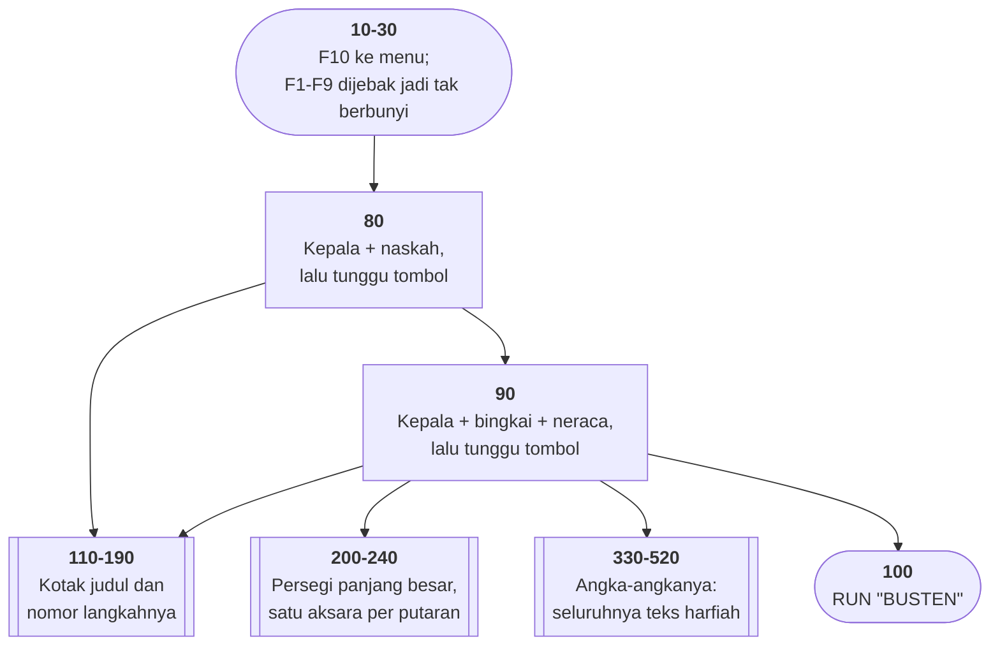
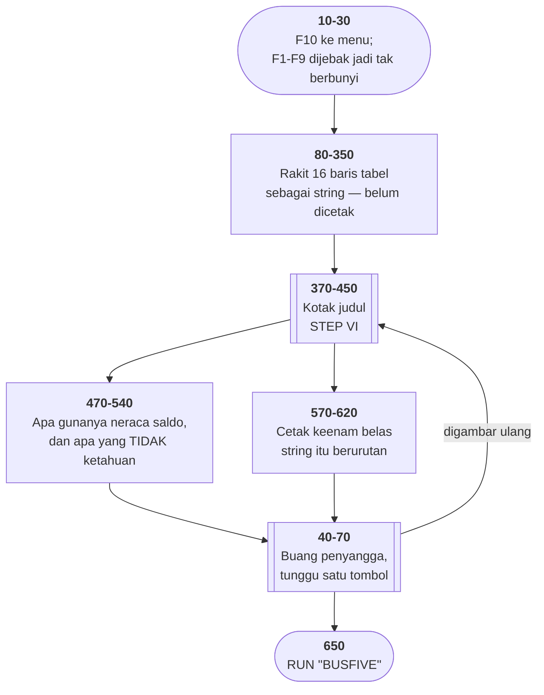
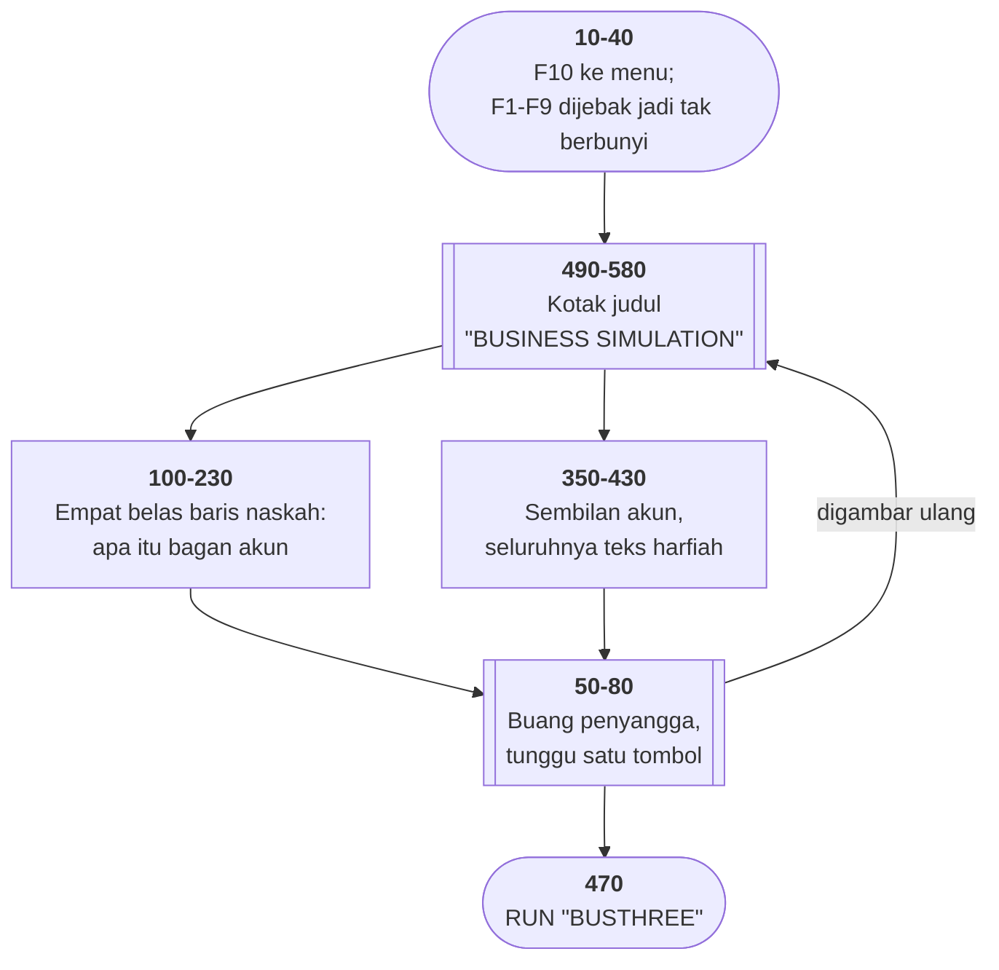
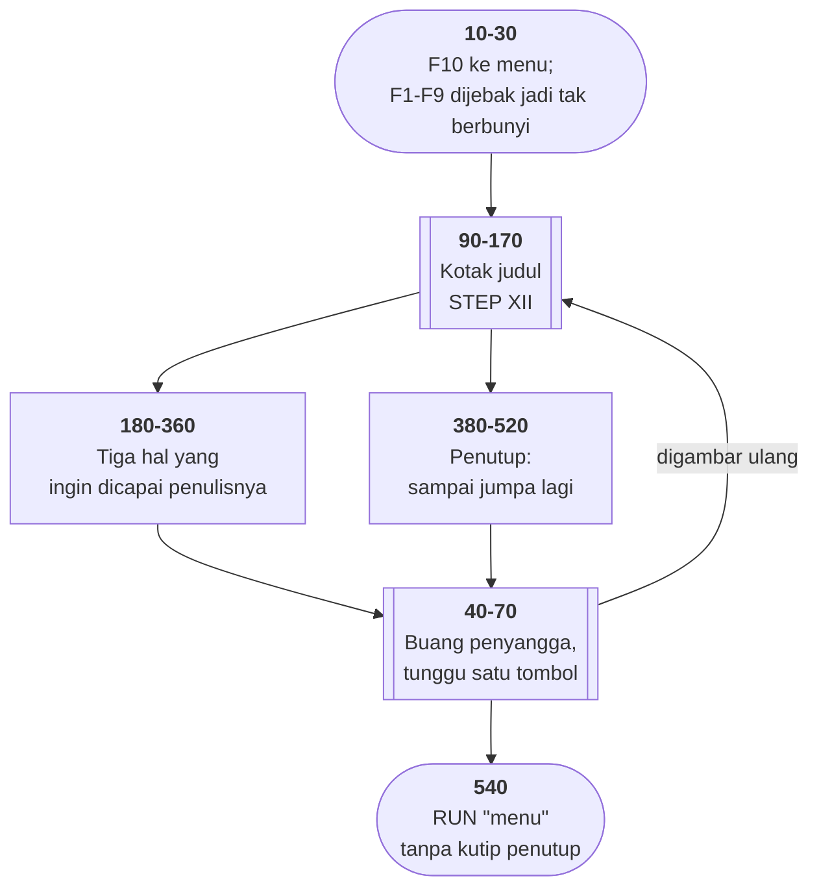
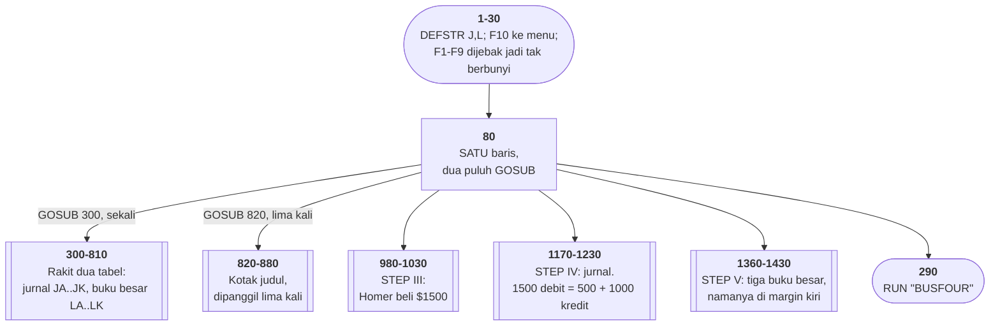
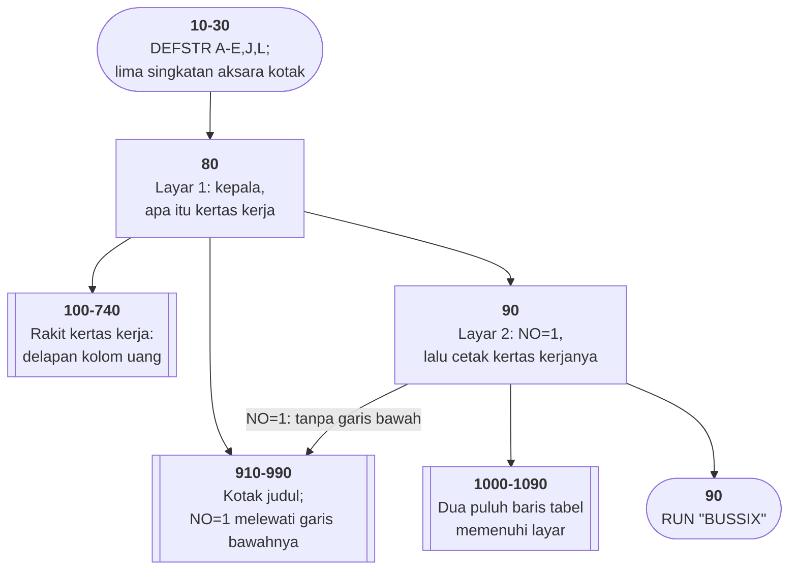
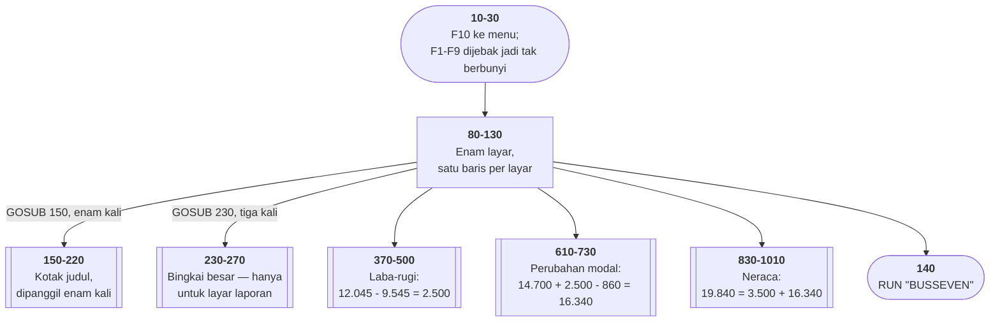
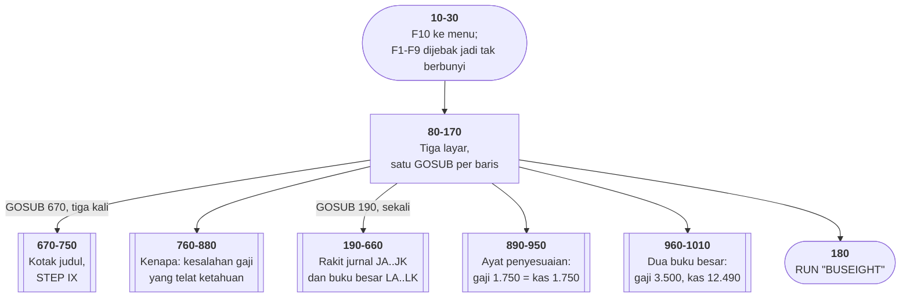
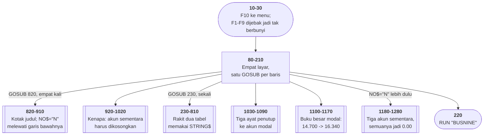

# Keluarga BUS* di penelusur — dua belas pelajaran akuntansi

> **Rantainya lengkap.** Sembilan berkas di halaman ini: **BUSTWO** (59),
> **BUSTHREE** (125), **BUSFOUR** (66), **BUSFIVE** (110), **BUSSIX** (102),
> **BUSSEVEN** (102), **BUSEIGHT** (102), **BUSNINE** (53), **BUSTEN** (54).
> Semuanya cakupan tabel **100%**. BUSONE sudah lebih dulu, di
> [halamannya sendiri](busone.md).
>
> Terverifikasi: `BUSONE → BUSTWO → … → BUSTEN → MENU` berjalan penuh di
> penelusur, sembilan `RUN` berturut-turut tanpa satu pun berhenti.

Tabel: `tracer/program/BUSTWO.js` · `BUSTHREE.js` · `BUSFOUR.js` ·
`BUSFIVE.js` · `BUSSIX.js` · `BUSSEVEN.js` · `BUSEIGHT.js` · `BUSNINE.js` ·
`BUSTEN.js`

Dua belas berkas yang saling memanggil dengan `RUN`, dari BUSONE sampai BUSTEN,
menyusuri siklus akuntansi sebuah perusahaan rekaan bernama **ABC Hardware
Company** milik Homer Jones. Bentuknya sama semua: mesin presentasi yang
ditulis sebagai kode lurus, satu `PRINT` per baris naskah.

Yang layak ditelusuri bukan isi akuntansinya, melainkan tiga hal ini.

## 1. Tidak ada satu pun angka yang pernah dihitung

Neraca pembukanya, di BUSTWO baris 350–430:

```
11  Cash                    $8000    Asset
14  Supplies                $6700    Asset
31  Homer Jones, Capital   $14700    Capital
```

8000 + 6700 = 14.700. Aset = kewajiban + modal. **Seimbang.**

Neraca saldonya, di BUSFOUR baris 190–310:

```
debit :  14.240 + 1.695 + 5.655 + 860 + 1.750 + 6.045  =  30.245
kredit:   3.500 + 14.700 + 12.045                       =  30.245
```

**Seimbang.**

Neraca penutupnya, di BUSNINE baris 370–420:

```
12.490 + 1.695 + 5.655  =  19.840
 3.500 + 16.340         =  19.840
```

**Seimbang.** Dan selisih 19.840 − 14.700 = 5.140 adalah laba sebulan ABC
Hardware.

Semua angka itu benar. Dan **tidak ada satu baris kode pun yang
menjumlahkannya** — seluruhnya teks harfiah di dalam `PRINT`, termasuk baris
totalnya. Yang menyeimbangkan ketiga neraca itu manusia, sekali, pada 1982,
sebelum mengetiknya.

Ubah satu angka dan tidak ada apa pun yang akan memberi tahu bahwa neracanya
sudah tidak seimbang lagi.

## 2. BUSTEN mengakuinya sendiri

Baris 320–330 dari berkas terakhir:

```
C) We hoped to show you what we are capable of doing
   so that you will use our software in the future.
```

Ini **brosur penjualan**. Dan begitu disebut, semuanya masuk akal: kenapa tidak
ada angka yang dihitung, kenapa tidak ada masukan pemakai selain "tekan
tombol", kenapa tiap layar berakhir dengan ajakan menekan tombol berikutnya.

Yang layak diingat: pada 1982, **satu-satunya cara memperlihatkan apa yang bisa
dilakukan sebuah komputer adalah menulis program yang berpura-pura
melakukannya.** Tidak ada tangkapan layar untuk dibagikan, tidak ada video,
tidak ada versi percobaan yang bisa diunduh. Yang ada disket, dan orang yang
duduk di depan mesinnya.

Jadi mereka menulis dua belas program yang berjalan seperti perangkat lunak
akuntansi, menjumlahkan angkanya sendiri lebih dulu supaya meyakinkan, dan
menaruh ajakannya di layar terakhir dengan cara paling sopan yang bisa
dibayangkan: *"you may anticipate hearing from us in the future"*.

## 3. Dua cara menggambar tabel, di keluarga yang sama

**BUSNINE** menggambar tabelnya **sesudah** angkanya. Angka dicetak dulu di
baris 370–420, lalu garis kolomnya ditimpakan satu aksara per `LOCATE`:

```basic
430 LOCATE 10,47:PRINT "┬":LOCATE 10,61:PRINT "┬"
440 FOR I=11 TO 23:LOCATE I,47:PRINT "│":LOCATE I,61:PRINT "│":NEXT
480 LOCATE 21,61:PRINT "┼"
```

**BUSFOUR** melakukan kebalikannya. Baris 80–350 merakit **seluruh tabelnya**
sebagai enam belas string — garis, persimpangan, angka, semuanya — tanpa
menyentuh layar sama sekali:

```basic
80  JA=CHR$(201):FOR I=1 TO 6:JA=JA+"═":NEXT
90  JA=JA+"╦":FOR I=1 TO 30:JA=JA+"═":NEXT
```

Baru baris 570–620 mencetak keenam belasnya berurutan.

Cara kedua lebih baik, dan alasannya bukan selera: tabel yang sudah utuh
sebagai string bisa dicetak ke mana saja — layar, printer, berkas. Tabel yang
digambar dengan `LOCATE` cuma bisa ke satu tempat, dan urutan penggambarannya
jadi bagian dari hasilnya.

Yang menarik: keduanya ditulis untuk rangkaian yang sama, kemungkinan besar
oleh orang yang sama, dan tidak ada satu pun petunjuk mana yang lebih dulu.

## Menjebak tombol untuk mematikannya

Keempat berkas membuka dengan baris yang sama:

```basic
20 FOR A=1 TO 9:KEY(A) ON:ON KEY(A) GOSUB 70:NEXT
```

Baris 70 isinya cuma `RETURN`. Sembilan tombol fungsi dijebak, dan semuanya
langsung kembali — **itulah cara mematikan sebuah tombol** supaya presentasi
tidak terganggu. Hanya F10 yang punya arti: `RUN "menu"`.

## Peta arsitektur — BUSNINE



## Peta arsitektur — BUSFOUR



## Peta arsitektur — BUSTWO



## Peta arsitektur — BUSTEN



## 4. Fosil sebuah penyuntingan, di BUSEIGHT

Sepuluh berkas merakit garis tabelnya dengan gelung — lima baris untuk satu
garis:

```basic
190 JA="╔":FOR I=1 TO 10:JA=JA+"═":NEXT
200 JA=JA+"╦":FOR I=1 TO 4:JA=JA+"═":NEXT
```

**BUSEIGHT** melakukannya dalam satu baris:

```basic
230 JA="╔"+STRING$(10,"═")+"╦"+STRING$(4,"═")+…+"╗"
```

Dan nomor barisnya melompat: 230 → 280, 290 → 340, 450 → 500, 570 → 630,
750 → 810.

**Lima lubang, masing-masing seukuran gelung yang dulu ada di sana.** Berkas ini
ditulis seperti saudara-saudaranya, lalu disunting belakangan: seseorang
mengganti lima baris dengan satu, menghapus sisanya, dan berhenti di situ.
Penomorannya tidak dirapikan — merapikannya berarti memeriksa ulang setiap
`GOSUB` yang menunjuk ke sana.

Empat puluh tahun kemudian, lubang di penomoran itu masih menceritakan bahwa
berkas inilah yang terakhir disentuh. Dan meninggalkan satu pertanyaan yang
tidak akan terjawab: kalau `STRING$` lebih baik — dan memang lebih baik —
kenapa sepuluh berkas lain dibiarkan?

## 5. Tiga gaya menulis naskah, di satu keluarga

Tugasnya sama persis di ketiga berkas ini: panggil beberapa subrutin berurutan.

| berkas | gaya |
|---|---|
| BUSTHREE | **dua puluh `GOSUB` dalam satu baris** (baris 80) |
| BUSSIX | satu baris per **layar** (baris 80–130) |
| BUSSEVEN, BUSEIGHT | satu baris per **pemanggilan** (baris 80–170) |

Yang paling terbaca yang tengah: di BUSSIX, pola penjelasan/laporan yang
berselang-seling terlihat langsung dari bentuk keenam barisnya, dan
`GOSUB 230` (bingkai besar) hanya muncul di baris laporan.

Yang paling buruk yang pertama. Bukan karena panjangnya — melainkan karena
**batas antar layar kehilangan wujudnya**. Nomor 820 muncul lima kali di tengah
kerumunan dan tidak ada apa pun yang menandai bahwa di situlah layar baru
dimulai.

## 6. Cacat yang ikut tersalin

BUSTHREE baris 1210 dan BUSSEVEN baris 930 sama-sama mencetak `JP` — sebuah
variabel yang **tidak pernah diisi di berkas mana pun**. `DEFSTR J` membuatnya
string kosong, jadi yang tercetak baris kosong tanpa satu pun tanda.

Dua berkas, satu kesalahan yang sama. Menyalin berkas berarti menyalin
kesalahannya, dan sekarang ada dua tempat yang harus diperbaiki.

Jejak penyalinan lain: BUSSEVEN menulis `DEFSTR A-E,J,L` yang disalin dari
BUSFIVE — tapi `A` sampai `E` tidak pernah dipakai sebagai string di sana. Dan
urutan variabelnya melompat `JD, JE, JG` — `JF` tidak ada, karena BUSTHREE
punya tiga baris ayat jurnal sementara BUSSEVEN cuma dua.

## Peta arsitektur — BUSTHREE



## Peta arsitektur — BUSFIVE



## Peta arsitektur — BUSSIX



## Peta arsitektur — BUSSEVEN



## Peta arsitektur — BUSEIGHT



## Naskah yang mengaku apa yang tidak bisa dilakukannya

BUSFOUR baris 470–530 layak dibaca sampai habis, karena isinya jujur dengan
cara yang jarang:

> tujuan neraca saldo bukan memberi bukti lengkap ketelitian, melainkan
> memastikan debit dan kredit sama. Kesalahan penjumlahan akan terlihat, tapi
> kesalahan seperti mencatat transaksi dua kali, atau tidak mencatatnya sama
> sekali, atau mencatatnya ke akun yang salah, **tidak** akan ketahuan.

Itu penjelasan yang tepat tentang **apa yang bisa dan tidak bisa dijamin sebuah
pemeriksaan**. Neraca saldo adalah *checksum*: ia menangkap kesalahan
aritmetika, dan buta terhadap kesalahan makna.

Setiap pemeriksaan otomatis punya bentuk yang sama. Uji yang lulus membuktikan
satu hal, dan orang yang membacanya sering menyimpulkan hal lain. Naskah 1982
ini mengatakannya lebih jelas daripada kebanyakan dokumentasi hari ini.

## Yang bisa dicoba di halaman

| coba ini | yang terlihat |
|---|---|
| BUSFOUR, titik henti di 310 | `JP` — baris total, teks harfiah |
| BUSFOUR, titik henti di 570 | keenam belas string sudah jadi sebelum dicetak |
| BUSNINE, titik henti di 420 | `$19,840.00` dua kali, tak pernah dijumlahkan |
| BUSTEN, titik henti di 320 | kalimat yang menjelaskan seluruh rangkaiannya |
| BUSTWO, jalankan sampai habis | berhenti di `RUN"BUSTHREE"` — belum ditelusuri |

## Penyimpangan dari aslinya

1. **`POKE 106,0` dijadikan pembuang penyangga tombol** di keempat berkas,
   karena selalu dipasangkan dengan gelung pembuang `IF INKEY$<>""` di baris
   berikutnya. Bandingkan DRAW.BAS, tempat poke yang sama **bukan** pembuang
   penyangga.
2. **BUSFOUR: gelung perakit garis ditulis sebagai satu pemanggilan.**
   `FOR I=1 TO 6:JA=JA+"═":NEXT` tidak punya percabangan dan tidak ada apa pun
   di dalamnya yang bisa disorot. Hasil stringnya identik.
3. **BUSFOUR: aksara kotak ditulis sebagai glif di berkas port** supaya
   terbaca, lalu dibalikkan ke bita CP437 sebelum dipakai.
4. **BUSTEN: `LOCATE ,14` ditiru apa adanya** — pindah kolom, jangan sentuh
   barisnya.
5. **Rantai `RUN` berhenti di berkas yang belum punya tabel baris**, dan
   penelusur mengatakannya.

## Yang jangan ditiru

- **Angka yang seimbang karena diketik seimbang.** Ketiga neraca.
- **BUSFOUR: total yang bentuknya beda sendiri.** Kesembilan angkanya
  `14,240.00` dengan koma; totalnya `30245.00` tanpa koma.
- **BUSFOUR: nama variabel yang melompat.** JE…JM, lalu JO, JP, baru JN.
- **BUSNINE: persegi panjang dalam 136 pencetakan.** `STRING$` sudah ada.
- **BUSTEN: "11 steps"** sementara berkasnya dua belas dan berkas itu sendiri
  berjudul STEP XII.
- **BUSTWO: `END` di baris 480** yang berada tepat sesudah `RUN` — mati sejak
  ditulis.

---
[Rancangan penelusur](_rancangan.md) · [BUSONE](busone.md) · [SERPENT](serpent.md) · [SIMEQN](simeqn.md) · [INTEGRAT](integrat.md)
