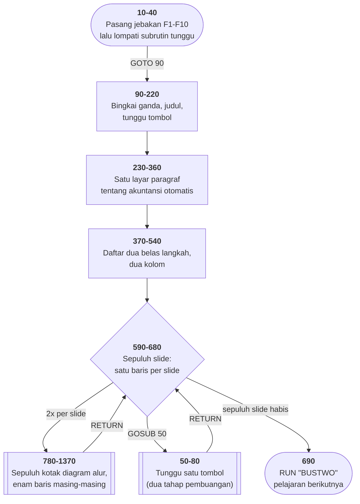

# BUSONE.BAS di penelusur

> Program kedua belas, dan yang pertama **bukan permainan**. 138 baris, nomor
> 10–1380, cakupan tabel **138/138 (100%)**.

Sumber: `run/BUSONE.BAS` · tabel: `tracer/program/BUSONE.js` ·
analisis: [`reviews/BUSONE.md`](../../reviews/BUSONE.md)

Bagian pertama dari sepuluh pelajaran akuntansi (BUSONE sampai BUSTEN). Yang
menarik bukan isinya, melainkan bentuknya: **ini mesin presentasi yang ditulis
sebagai kode lurus.**

## Sepuluh slide, sepuluh baris, nol variabel

Bagaimana membuat presentasi yang membuka satu kotak per tombol?

Naluri modern: simpan nomor langkah di sebuah variabel, buat gelung, dan
sebuah tabel berisi apa yang harus digambar di tiap langkah.

Program ini tidak melakukan satu pun dari itu:

```basic
590 COLOR 15,0:GOSUB 780:GOSUB 50
600 GOSUB 780:COLOR 15,0:GOSUB 840:GOSUB 50
610 GOSUB 840:COLOR 15,0:GOSUB 900:GOSUB 50
620 GOSUB 900:COLOR 15,0:GOSUB 960:GOSUB 50
…
680 GOSUB 1260:COLOR 15,0:GOSUB 1320:GOSUB 50
```

Tiap baris menyebut **dua nomor subrutin**: yang sebelumnya (digambar ulang
dengan warna biasa, jadi meredup) dan yang berikutnya (digambar dengan putih
terang, jadi menyorot). Lalu tunggu tombol.

Tidak ada variabel yang mengingat "sekarang slide berapa". **Penunjuk barisnya
sendiri yang menjadi penanda langkah.**

Terverifikasi di penelusur — slide 1 lalu slide 2:

```
    ╔═════════════╗                              ╔═════════════╗     ╔═════════════╗
──> ║ SET UP CHART║          →   tombol   →   ──> ║ SET UP CHART║ ──> ║ TRANSCATION ║
    ║ OF ACCOUNTS ║                              ║ OF ACCOUNTS ║     ║   OCCURS    ║
    ╔═════════════╗                              ╔═════════════╗     ╔═════════════╗
```

Apakah bentuk ini bagus? Untuk sepuluh slide yang tidak pernah berubah — ya. Ia
tidak bisa salah urutan, tidak bisa kehilangan keadaan, dan dibaca dari atas ke
bawah persis seperti naskahnya. Untuk seratus slide yang isinya datang dari
berkas — tentu tidak.

Pelajarannya bukan "tiru ini", melainkan: **jumlah yang tetap dan kecil kadang
lebih jujur ditulis sebagai daftar daripada sebagai gelung.**

## Menyorot tanpa objek

Di antarmuka modern, menyoroti sesuatu berarti mengubah sifat sebuah objek —
warnanya, kelasnya, gayanya. Objeknya tetap ada, dan sistem yang menggambar
ulang.

Layar teks CGA tidak punya objek. Yang ada cuma dua ribu sel, dan apa pun yang
tertulis di sana adalah hasil gambar terakhir.

Jadi "menyorot kotak" berarti **menggambar kotak itu lagi, dalam warna lain**.
Dan "meredupkan" berarti menggambarnya sekali lagi, dalam warna biasa.

Kelihatan boros — tiap kotak digambar dua kali seumur presentasi. Tapi ia punya
sifat yang berharga: **tidak ada keadaan tersembunyi yang bisa keliru.** Yang
terlihat di layar selalu persis hasil perintah gambar terakhir, dan tidak ada
daftar "apa yang sedang tersorot" yang harus dijaga tetap benar.

Kerangka antarmuka modern kembali ke gagasan yang sama, dengan nama yang lebih
mentereng: gambar ulang dari keadaan, jangan tambal selisihnya.

## Peta arsitektur



## Sepuluh berkas untuk satu presentasi

Baris terakhir program ini: `690 RUN"BUSTWO"`.

BUSONE sampai BUSTEN adalah **satu** presentasi akuntansi yang dipecah jadi
sepuluh berkas. Tiap berkas memuat yang berikutnya, dan program yang lama
hilang dari memori.

Kenapa dipecah? Karena satu program BASIC harus muat seluruhnya di memori, dan
memori itu 64 KB dibagi bersama penafsirnya, layarnya, dan sistem operasinya.

Yang hilang saat berpindah: **seluruh variabel**. Jadi tiap berkas harus
berdiri sendiri — tidak ada yang bisa dititipkan dari BUSONE ke BUSTWO kecuali
lewat berkas di disket.

Ini nenek moyang langsung dari pemuatan bertahap yang dipakai aplikasi web hari
ini: muat bagian yang dibutuhkan sekarang, buang yang sudah lewat. Kendalanya
berubah dari 64 KB jadi kecepatan jaringan, tapi bentuk penyelesaiannya sama.

Di penelusur, `RUN"BUSTWO"` berhenti dan mengatakan bahwa BUSTWO belum punya
tabel baris — bukan diam-diam melanjutkan.

## Pseudokode

```
baris   10   pasang jebakan: F10 kembali ke menu, F1-F9 mandul
baris   40   lompati subrutin tunggu-tombol yang duduk di depan alur
baris   90   gambar bingkai ganda sisi demi sisi, searah jarum jam
baris  220   tunggu tombol
baris  240   satu layar paragraf tentang akuntansi otomatis
baris  410   daftar dua belas langkah dalam dua kolom
baris  560   judul "STEP I. FLOW OF ACCOUNTING CYCLE"

baris  590   SEPULUH SLIDE, SATU BARIS MASING-MASING:
baris  590       slide 1: sorot kotak pertama, tunggu tombol
baris  600       slide 2: REDUPKAN kotak 1, sorot kotak 2, tunggu
baris  610       slide 3: redupkan kotak 2, sorot kotak 3, tunggu
baris  680       ... sampai slide 10
baris  690   muat BUSTWO - pelajaran berikutnya
```

## Yang bisa dicoba di halaman

| coba ini | yang terlihat |
|---|---|
| tekan spasi tiga kali | judul → paragraf → daftar dua belas langkah → slide pertama |
| tekan spasi lagi | kotak kedua muncul, kotak pertama meredup — sorotan berjalan |
| telusuri baris 590–680 satu per satu | tiap baris menyebut dua nomor subrutin, dan itulah seluruh naskahnya |
| perhatikan kotak di layar | sudut bawahnya memakai `╔` dan `╗`, bukan `╚` dan `╝` — salah karakter di baris 800, dan tetap begitu di semua sepuluh kotak |
| baca tulisan kotak kedua | `TRANSCATION` — salah eja yang bertahan empat puluh tahun |
| tekan spasi sepuluh kali | `RUN"BUSTWO"`; penelusur berhenti karena BUSTWO belum ditelusuri |

## Yang jangan ditiru

- **Sepuluh kotak, enam puluh baris, nol subrutin bersama.** Baris 780–1370
  menggambar sepuluh kotak yang bentuknya sama persis; yang berbeda cuma
  koordinat dan tulisannya. Satu subrutin dengan empat parameter akan
  menggantikan seluruhnya. Bandingkan tangga gambar
  [HANGMAN.BAS](hangman.md), yang justru menghindari pengulangan semacam ini.
- **Delapan baris untuk satu bingkai** (baris 100–170). [INTRO.BAS](intro.md)
  mengerjakan hal yang sama dengan dua `STRING$`.
- **Salah karakter dan salah eja yang ikut tercetak.** Sudut bawah kotak
  memakai karakter sudut atas, dan `TRANSCATION` kehilangan satu huruf. Tidak
  merusak apa pun — dan justru karena itu keduanya bertahan.

## Penyimpangan dari aslinya

1. **`RUN"BUSTWO"` berhenti**, karena BUSTWO belum punya tabel baris di
   penelusur ini.
2. **`KEY OFF` tidak berbuat apa-apa.**

---
[Rancangan penelusur](_rancangan.md) · [MENU](menu.md) · [INTRO](intro.md) · [CHECK](check.md) · [TOWERS](towers.md) · [HEAREYE](heareye.md) · [TICTAC](tictac.md) · [MASTER](master.md) · [BOGGY](boggy.md) · [PEGLEAP](pegleap.md) · [BIO](bio.md) · [HANGMAN](hangman.md)
