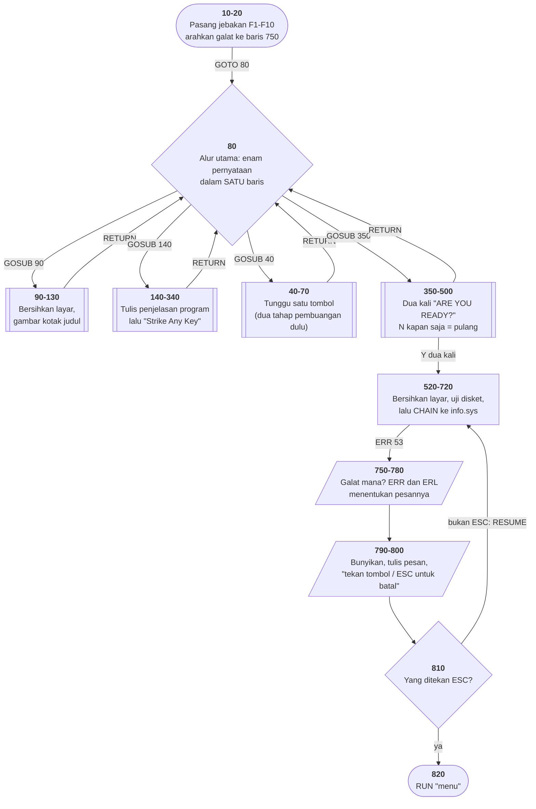

# CHECK.BAS di penelusur

> Program ketiga yang ditelusuri. 65 baris, nomor 10–9000, cakupan tabel
> **65/65 (100%)**.

Sumber: `run/CHECK.BAS` · tabel: `tracer/program/CHECK.js` ·
analisis: [`reviews/CHECK.md`](../../reviews/CHECK.md)

## Apa yang program ini patahkan

### 1. Satu baris, lima GOSUB

```basic
80 GOSUB 90:GOSUB 140:GOSUB 40:GOSUB 90:GOSUB 350:RUN"menu
```

Sampai program ini, tiap entri tabel hanya boleh melakukan **satu** tindakan
kendali. Dengan aturan itu, `RETURN` yang pertama akan pulang ke baris 90 —
salah. Ia harus pulang ke pernyataan **kedua di baris 80**.

Maka entri tabel sekarang boleh berbentuk:

```js
{ baris: 80, bagian: [
    function (m) { m.gosub(90); },
    function (m) { m.gosub(140); },
    ...
] }
```

dan alamat pulang `GOSUB` membawa nomor bagiannya, bukan cuma nomor baris.
Sorotan tidak berubah sedikit pun: seluruh bagian milik satu nomor baris, dan
nomor baris itulah yang disorot. Kalau ditelusuri langkah demi langkah,
penunjuknya terlihat **kembali ke baris 80 lima kali** — dan itu memang yang
terjadi.

Baris 80 sendiri layak dibaca sebagai kalimat: gambar kotak, tulis
penjelasannya, tunggu tombol, gambar kotak lagi (yang sekalian membersihkan
layar), tanya kesiapan, kembali ke menu. Seluruh alur program dalam satu baris.

### 2. `CHR$` punya dua arti, dan mesinnya cuma meniru satu

Ini cacat yang nyata, dan program ini yang menemukannya.

```basic
60  PRINT CHR$(196)            ' INTRO.BAS: gambar garis mendatar
810 IF RS$=CHR$(27) THEN ...   ' CHECK.BAS: bandingkan dengan tombol ESC
```

Sesudah `INTRO.BAS`, `m.chr(n)` mengembalikan **glif** CP437 — garis mendatar
untuk 196. Dengan aturan itu, `m.chr(27)` mengembalikan `←`, sedangkan `INKEY$`
mengembalikan bita 27. Perbandingan di baris 810 tidak akan pernah cocok, dan
tombol ESC berhenti berfungsi tanpa satu pun pesan galat.

Perbaikannya memindahkan pemetaan ke tempat yang benar:

| | sebelum | sesudah |
|---|---|---|
| `m.chr(196)` | glif `─` | bita 196 |
| yang tersimpan di string program | glif | **bita**, seperti di memori aslinya |
| yang menerjemahkan ke gambar | `m.chr` | **konsol, saat mencetak** — seperti ROM font |

Sesudah itu keduanya benar sekaligus: `PRINT CHR$(196)` tetap menggambar garis,
dan `RS$=CHR$(27)` cocok dengan ESC. Yang menyatukannya adalah bitanya, bukan
gambarnya — persis seperti di perangkat kerasnya.

### 3. `ERL`, `RESUME`, dan `ERROR n`

Penanganan galat di baris 750–9000 menuntut tiga hal baru:

- **`ERL`** — nomor baris tempat galat terjadi. Baris 760 dan 770 memakainya
  untuk memilih pesan yang tepat: satu penangan, tiga pesan berbeda.
- **`RESUME`** dan **`RESUME <baris>`** — dan `RESUME` tanpa argumen harus
  mengulangi **pernyataan** yang gagal, bukan seluruh barisnya. Karena
  bagian sudah dilacak, titik galatnya bisa disimpan sampai ke nomor bagian.
- **`ERROR n`** — memicu galat buatan sendiri.

Satu aturan ikut ditegakkan: galat yang terjadi **di dalam** penangan galat
tidak ditangkap lagi. Tanpa itu, satu berkas yang hilang bisa memutar
penangannya selamanya tanpa ada yang tahu.

## Peta arsitektur

Dihasilkan oleh `TRACER.peta.mermaid()` dari data `arsitektur` di
[`tracer/program/CHECK.js`](../program/CHECK.js) — sumber yang sama dengan peta
SVG di halaman penelusur.



Bentuk peta ini berbeda dari dua program sebelumnya, dan bedanya bercerita.
Kotak **baris 80** adalah simpul dengan paling banyak panah keluar-masuk:
empat `GOSUB` pergi, empat `RETURN` pulang. Itu bentuk **hub** — satu tempat
yang memegang urutan, dan semua detail dititipkan ke tempat lain.

Setengah bagian bawah peta seluruhnya jalur galat (kotak merah putus-putus).
Untuk program 65 baris, itu proporsi yang mencolok — dan memang begitulah
program yang harus berurusan dengan disket yang bisa saja tidak ada.

## Pseudokode

```
baris  10   pasang jebakan F10 -> baris 510 (kembali ke menu)
baris  20   pasang jebakan F1..F9 -> baris 70, yang isinya cuma PULANG
baris  20   kalau ada galat, lompat ke baris 750
baris  30   lompat ke baris 80, melewati subrutin di bawah ini

baris  40   SUBRUTIN tunggu-tombol (baris 40-70):
baris  40       buang tombol yang tertunda
baris  50       masih ada sisa? buang lagi - dua tahap, bukan satu
baris  60       baru sekarang tunggu tombol yang sungguhan
baris  70       pulang

baris  80   ALUR UTAMA, seluruhnya dalam satu baris:
baris  80       1. gambar kotak judul          (subrutin 90)
baris  80       2. tulis penjelasan program    (subrutin 140)
baris  80       3. tunggu satu tombol          (subrutin 40)
baris  80       4. gambar kotak lagi - sekalian membersihkan layar
baris  80       5. tanya kesiapan pemakai      (subrutin 350)
baris  80       6. kembali ke menu

baris 100   gambar sisi kotak SATU KARAKTER DEMI SATU KARAKTER, 86 kali

baris 350   SUBRUTIN tanya kesiapan (baris 350-500):
baris 390       tanya "ARE YOU READY? (Y/N)"
baris 420       kalau Y: lanjut ke pertanyaan kedua
baris 430       kalau N: pulang. Tombol lain: tanya lagi tanpa berkata apa-apa
baris 490       kalau Y lagi: lanjut ke baris 520 - PEKERJAAN SESUNGGUHNYA

baris 720   uji disket dengan mencoba membuka MENU.BAS, lalu:
baris 720       serahkan kendali ke info.sys - BERKAS INI HILANG DARI KOLEKSI

baris 750   KALAU ADA GALAT:
baris 754       galat 70/71/72 (disket bermasalah) -> pesan "Disk Not Ready"
baris 755       galat 200 (sandi buatan sendiri)   -> "Insert CHECK REGISTER Diskette"
baris 760       gagalnya di baris berapa? ERL yang menjawab
baris 790       bunyikan bel, tulis pesannya di baris 24
baris 800       tulis "tekan tombol kalau sudah siap, ESC untuk batal"
baris 810       tunggu tombol:
baris 810           ESC        -> menyerah, lanjut di baris 820
baris 810           tombol lain -> hapus pesan, ULANGI PERNYATAAN YANG TADI GAGAL
baris 820   kembali ke menu
```

## Penjelasan untuk pemula

### Seluruh cerita program dalam satu baris

Baris 80 berbunyi `GOSUB 90:GOSUB 140:GOSUB 40:GOSUB 90:GOSUB 350:RUN"menu`.
Enam pernyataan berderet, dan kalau dibaca sebagai kalimat ia adalah daftar isi
programnya: gambar, jelaskan, tunggu, bersihkan, tanya, pulang.

Pola ini masih hidup dan bagus: **satu tempat yang membaca seperti ringkasan**,
dan semua detailnya di tempat lain. Kalau Anda bisa menulis fungsi utama yang
seluruhnya muat dalam beberapa baris panggilan bernama jelas, pembaca
berikutnya akan berterima kasih.

```python
def main():
    gambar_kotak()
    tulis_penjelasan()
    tunggu_tombol()
    gambar_kotak()
    if tanya_kesiapan():
        kerjakan()
    kembali_ke_menu()
```

Itu baris 80, ditulis ulang dengan nama-nama. Isinya sama.

### Membuka berkas sebagai cara bertanya

Baris 740 membuka `MENU.BAS` lalu langsung menutupnya. Isinya tidak pernah
dibaca. Jadi apa gunanya?

Itu **pertanyaan**: "apakah disket FriendlyWare ada di drive?" Kalau tidak ada,
membukanya gagal, dan galatnya yang menjawab. Menguji keberadaan dengan
*mencoba memakai*, bukan dengan bertanya lebih dulu.

Pola ini masih dipakai hari ini, dan ada namanya: lebih mudah meminta maaf
daripada meminta izin. Alasannya bukan gaya, tapi kebenaran — antara "apakah
berkasnya ada?" dan "buka berkasnya" selalu ada jeda, dan dalam jeda itu
berkasnya bisa hilang.

### Galat sebagai keadaan yang bisa diperbaiki

Kebanyakan program pemula memperlakukan galat sebagai kematian: tampilkan
pesan, berhenti. Program ini memperlakukannya sebagai **keadaan yang bisa
diperbaiki manusia**.

Baris 810 memberi dua pilihan. Tekan sembarang tombol berarti "sudah saya
perbaiki, coba lagi" — dan `RESUME` mengulangi persis pernyataan yang tadi
gagal. Tekan ESC berarti menyerah, dan `RESUME 820` keluar dengan rapi.

Di penelusur, gelung "coba lagi" itu tidak akan pernah berhasil karena berkas
`info.sys` memang hilang dari koleksi — tidak ada disket untuk dimasukkan.
Tekan ESC untuk melihat jalan keluar yang dirancang program ini.

### Dua penulis dalam satu produk

Bandingkan cara dua program menggambar kotak yang sama:

```basic
INTRO.BAS  60  PRINT CHR$(218) STRING$(42,196) CHR$(191)
CHECK.BAS 100  FOR I=1 TO 3 STEP 2:FOR J=20 TO 62:LOCATE I,J,0:PRINT"-":NEXT:NEXT
```

Yang pertama: satu baris, sekali cetak. Yang kedua: gelung bersarang yang
memindahkan kursor lalu mencetak satu karakter, **86 kali**.

Hasilnya sama. Yang satu tahu `STRING$` ada, yang satu tidak. Membaca kode lama
sering berarti membaca jejak beberapa orang dengan tingkat pengalaman berbeda —
dan itu bukan alasan untuk mencela, melainkan pengingat bahwa "cara yang lebih
baik" hanya lebih baik kalau Anda tahu cara itu ada.

## Jalur galat, ditelusuri utuh

`CHAIN"info.sys"` di baris 720 menuju berkas yang **tidak ada di koleksi ini**.
Bukan program BASIC yang belum ditelusuri — berkasnya memang hilang dari disket
yang tersalin, seperti `DRAW.EXE`. Yang terjadi sesudahnya adalah jalur asli
program, dan seluruhnya bisa dilihat:

```
720.0 → 740 (OPEN "MENU.BAS" — berhasil, disketnya ada) → 720.1 (CLOSE)
      → 720.2 (CHAIN gagal, ERR 53)
      → 750 → 754 → 755 → 760 → 770 → 780 → 800 → 810.0 → 60 (menunggu)
```

Di baris 60 program menunggu satu tombol, dan dari situ ada dua jalan:

| tekan | yang terjadi |
|---|---|
| tombol biasa | `810.1` → `RESUME` → kembali ke **`720.2`** — pernyataan `CHAIN` yang tadi gagal, bukan awal barisnya. Gagal lagi, dan gelungnya berputar. |
| `ESC` | `810.1` → `RESUME 820` → `820.0` GOSUB 740 → `820.1` `RUN"menu"` → MENU mulai dari baris 10. |

Gelung yang berputar itu **bukan cacat**. Di mesin aslinya ia berhenti begitu
pemakai memasukkan disket yang benar; di sini tidak ada disket untuk
dimasukkan. Program ini menunggu manusia, dan manusianya tidak punya yang
diminta.

## Yang bisa dicoba di halaman

| coba ini | yang terlihat |
|---|---|
| Langkah dari awal, perhatikan panel kanan | sorotan **kembali ke baris 80 lima kali** — sekali untuk tiap GOSUB yang pulang. |
| pasang titik henti di 130, lalu Jalan | berhenti dengan kotak sudah utuh tapi judul dan dinding teks belum ada. |
| tekan `F10` kapan saja | jebakan dari baris 10 melompat ke 510 → `RUN"menu"`. |
| jawab `Y` dua kali | masuk ke jalur galat di atas. |
| di baris 60, tekan huruf apa saja berkali-kali | gelung `RESUME` yang tak berujung — dan sorotannya memperlihatkan persis pernyataan mana yang diulang. |
| lalu tekan `ESC` | keluar lewat 820, seperti yang dirancang program ini. |

## Dua baris yang paling aneh

```basic
730 ERX=0:CLOSE:OPEN "I",1,"MENU.BAS":IF ERX=0 THEN ERROR 200 ELSE RETURN
```

`ERX` baru saja diisi 0, jadi `IF ERX=0` selalu benar — kecuali kalau `OPEN`-nya
gagal lebih dulu, karena penangan galat di 750 mengisi `ERX=1` lalu `RESUME`
kembali ke sini. Jadi `ERX` bukan penanda keadaan, melainkan cara bertanya
"apakah barusan ada galat?". Logikanya benar, tapi tidak ada satu pun petunjuk
di barisnya bahwa begitulah cara membacanya.

```basic
740 CLOSE:OPEN "I",1,"MENU.BAS":RETURN
```

Membuka berkas hanya untuk menutupnya lagi. Ini bukan pembacaan berkas,
melainkan pertanyaan: **"apakah disket FriendlyWare ada di drive?"** Menguji
keberadaan dengan mencoba memakai, bukan dengan bertanya lebih dulu — pola yang
masih dipakai sampai sekarang.

## Penyimpangan dari aslinya

1. **`CHAIN"info.sys"` gagal karena berkasnya hilang dari koleksi**, bukan
   karena penelusurnya belum menulisnya. Isi buku ceknya ada di berkas terpisah
   yang tidak ikut tersalin.
2. **Gelung `RESUME` memang tak berujung** — lihat penjelasan di atas.
3. **`BEEP` tidak berbunyi** dan **`COLOR 31,0` tidak berkedip.** Warna 31
   berarti putih-terang + kedip (15 + 16); yang keluar putih terang saja.
   Selera, dinyatakan sebagai selera.
4. **`OPEN` hanya menguji keberadaan berkas.** Program ini tidak pernah membaca
   isi berkas yang dibukanya, jadi itulah yang ditiru — tidak lebih.
5. **Jebakan F1–F10 dijemput di batas baris.** Di baris 100 yang menggambar 86
   karakter dalam satu langkah, bedanya paling terasa.

## Membandingkan dengan yang asli

```
run\CHECK.bat
```

Di DOSBox-X pun program ini berhenti di tempat yang sama — `info.sys` tidak ada
di disket yang tersalin. Bedanya di sana pesannya berkedip dengan sungguhan,
dan `BEEP`-nya berbunyi.

---
[Rancangan penelusur](_rancangan.md) · [Catatan MENU](menu.md) · [Catatan INTRO](intro.md) · [Review CHECK.BAS](../../reviews/CHECK.md)
