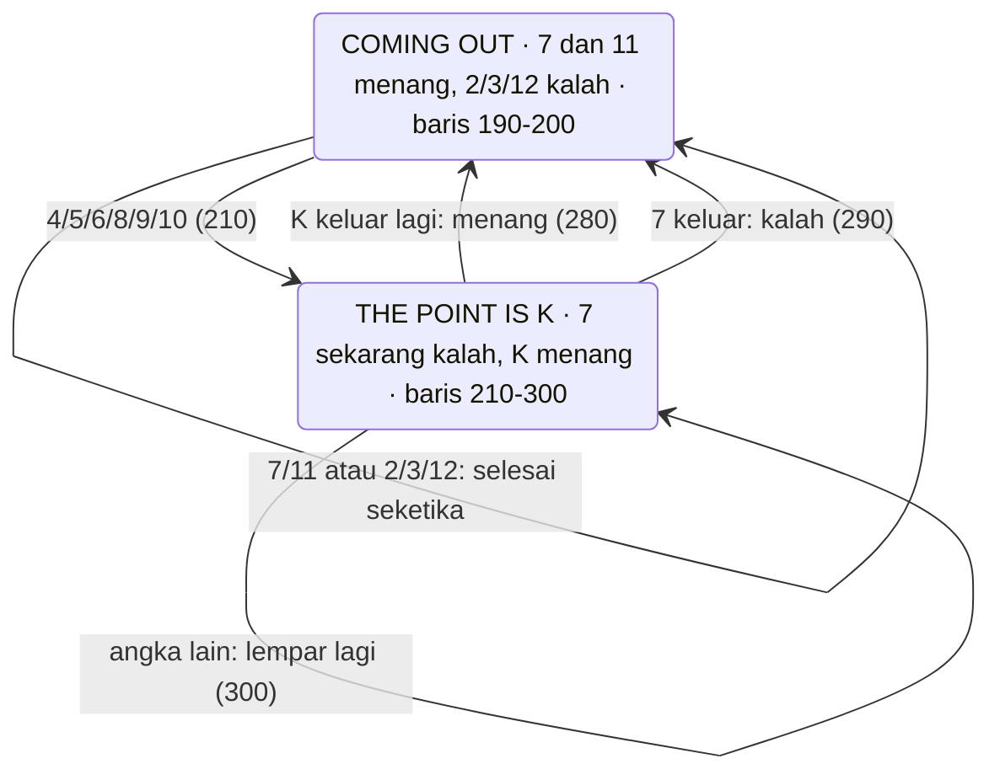
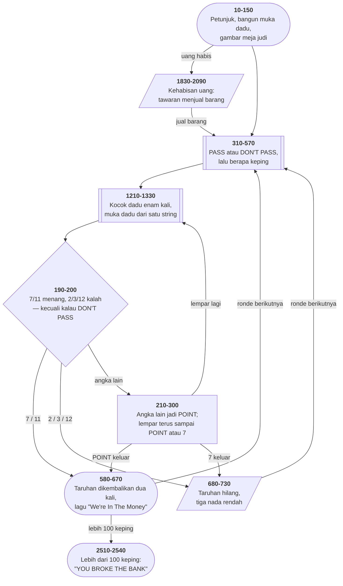

# CRAPS.BAS di penelusur

> Program keempat belas. 254 baris, nomor 10–2540, cakupan tabel
> **254/254 (100%)**.

Sumber: `run/CRAPS.BAS` · tabel: `tracer/program/CRAPS.js`

Dadu Nevada. Di sini gagasan yang muncul sepotong-sepotong di
[HANGMAN.BAS](hangman.md) mencapai bentuk paling murninya: **satu perintah
`PRINT` yang menggambar sebuah kotak tiga baris.**

## Satu string, satu dadu

Pertanyaannya sederhana: bagaimana menggambar dadu 7×3 di layar teks?

Cara wajar: tiga `LOCATE`, tiga `PRINT`. Program ini memakai **satu** `PRINT`.
Kuncinya baris 1340:

```basic
1340 A=STRING$(7,29):A3=SPACE$(7):A4=SPACE$(5):A5=SPACE$(3)
```

`STRING$(7,29)` bukan teks — itu **tujuh kali perintah "kursor mundur"**. Lalu
muka dadu bernilai satu, baris 1360:

```basic
1360 A(1)=A3+CHR$(31)+A+A5+CHR$(254)+A5+CHR$(31)+A+A3
```

Dibaca satu per satu:

| potongan | yang terjadi |
|---|---|
| `A3` | cetak tujuh spasi — baris atas dadu |
| `CHR$(31)` | **turun** satu baris |
| `A` | **mundur** tujuh kolom — kursor kini tepat di bawah awal tadi |
| `A5 CHR$(254) A5` | tiga spasi, satu ■, tiga spasi — baris tengah |
| `CHR$(31)` `A` | turun, mundur lagi |
| `A3` | tujuh spasi — baris bawah |

Ketujuh muka (`A(0)`–`A(6)`) dibangun begitu di baris 1350–1410, dan penanda
POINT di baris 1420–1430 memakai cara yang sama.

Kenapa repot? Karena tiap lemparan mengocok dadu **enam kali**, dua dadu
sekaligus — dua belas gambar. Di prosesor 4,77 MHz, satu string panjang jauh
lebih murah daripada tiga `LOCATE` terpisah.

Terverifikasi di penelusur — satu lemparan, dua dadu, dan penanda POINT yang
juga digambar dari satu string:

```
║                THE POINT IS 5                    ║
║              ╔══╗                                ║
║    2   3   4 ║ 5║  6   7   8   9  10  11  12     ║
║              ╚══╝                                ║
║               ┌───────┐ ┌───────┐                ║
║               │       │ │ ■   ■ │                ║
║               │   ■   │ │       │                ║
║               │       │ │ ■   ■ │                ║
║               └───────┘ └───────┘                ║
```

Komentar di `web/_shared/svg.js` menyebut berkas ini sebagai contoh tekniknya.
Sekarang barisnya bisa ditelusuri satu per satu.

## Yang ditagih: `PRINT USING`

Uang dicetak berformat — perintah pertama semacam ini di koleksi:

```basic
950 LOCATE 10,69:COLOR 15:PRINT USING"$$#####,.##";H*100+H1*1000
```

Empat baris memanggilnya (540, 740, 950, 2040), semuanya dengan rumus yang
sama. Mesin penelusur menirunya lewat `m.cetakFormat`. Yang ditiru **hanya**
bentuk `$`, `#`, `,` dan `.##`; bentuk lain (`**`, `^^^^`, medan string) belum
ada, dan kalau nanti dipakai hasilnya akan salah **tanpa** menghentikan
penelusuran. Itu dicatat di `mesin/penjalan.js`.

Terverifikasi: uang awal `H=10`, `H1=1` → `10*100 + 1*1000` = 2000, tercetak
`$2,000.00`.

## Dua permainan dari satu kode

Di craps Anda bisa bertaruh **untuk** dadu (PASS) atau **melawan** dadu
(DON'T PASS). Aturan menang-kalahnya terbalik sepenuhnya.

Program ini tidak menulis dua set aturan. Ia menulis satu, lalu memakai satu
variabel untuk memilih tujuan lompatannya:

```basic
190 K=INT(C+D):IF K=7 OR K=11 THEN IF P=0 THEN 580 ELSE 680
200 IF K=2 OR K=3 OR K=12 THEN IF P=0 THEN 680 ELSE 580
```

580 adalah "menang", 680 adalah "kalah". Empat baris, dua permainan — dan
polanya berulang di baris 280 dan 290 untuk fase POINT.

Terverifikasi dengan lemparan yang **sama persis** di kedua taruhan (jam
penelusur berjalan tetap, jadi ini bisa diulang):

| taruhan | POINT | lemparan berikutnya | hasil | uang |
|---|---|---|---|---|
| PASS, 7 keping | 6 | 5+2 = 7 | kalah | $2.000 → $1.300 |
| DON'T PASS, 2 keping | 6 | 5+2 = 7 | **menang** | $2.000 → $2.200 |

Tujuh yang sama, dua hasil berlawanan, satu baris kode.

Ini kerabat dekat `U` di [OTHELLO.BAS](othello.md) (satu rutin, dua peran) dan
`HOLD` di [TOWERS.BAS](towers.md) (satu tombol, dua arti). Pola yang sama, tiga
bentuk: **satu nilai yang mengubah arti kode yang sama.**

## Dua fase yang membalik arti angka



Diagram keadaan dipakai di sini karena yang berubah **bukan jalurnya melainkan
artinya**: 7 menang di fase pertama dan kalah di fase kedua. Peta alur tidak
bisa menunjukkan itu.

## Peta arsitektur



## Uang yang bentuknya mengikuti gambarnya

Uang pemain disimpan sebagai **dua** variabel: `H` keping ratusan, `H1` keping
ribuan. Baris 2230–2240 terus menukar di antara keduanya supaya `H` tetap di
0..10:

```basic
2230 COLOR 3,0:IF H<1 AND H1>0 THEN H1=H1-1:H=H+10:GOTO 2230
2240 IF H>10 THEN H1=H1+1:H=H-10:GOTO 2240
```

Kenapa tidak satu angka saja? Karena yang dibutuhkan bukan angkanya melainkan
**gambarnya**: baris 2260–2290 menggambar dua tumpukan keping di tepi kanan
layar, satu untuk ratusan dan satu untuk ribuan. **Tinggi tiap tumpukan *adalah*
nilai variabelnya.**

```
                                              ▀▀▀
                                              ▀▀▀
                                              ▀▀▀
                                              ▀▀▀
                                              ▀▀▀   ▀▀▀▀▀
                                              100's 1000's
```

Jadi bentuk datanya dipilih mengikuti bentuk tampilannya — kebalikan dari
nasihat biasa, dan dibayar dengan dua baris yang harus terus-menerus merapikan.

Perhatikan juga: jumlah yang dicetak (`H*100+H1*1000`) ditulis ulang di
**empat** tempat. Satu rumus, empat salinan — kalau satuannya diubah, empat
baris harus ikut diubah, dan yang terlupa tidak akan mengeluh.

## Jam yang harus dibuat berjalan

Baris 1260 dan 1290 menyemai ulang pengacak **di dalam gelung enam kocokan**:

```basic
1260 RANDOMIZE(VAL(RIGHT$(TIME$,2))*RND)
1290 RANDOMIZE(VAL(RIGHT$(TIME$,2)))
```

Penelusur tidak punya jam, dan aturan proyek ini adalah **benih tetap** supaya
tiap penelusuran bisa diulang persis. Percobaan pertama memakai satu angka
tetap untuk `TIME$` — dan hasilnya **dadu yang beku**: karena baris 1290
menyemai ulang di tiap putaran, keenam kocokan dan semua lemparan berikutnya
keluar angka yang sama persis (1 dan 4, selamanya).

Jadi `TIME$` ditiru sebagai **jam yang maju**: mulai dari 23 detik, bertambah
tujuh tiap kali dibaca, berputar di 60. Dadunya berubah, dan penelusurannya
tetap bisa diulang.

Itu sekaligus memperlihatkan kenapa pola ini keliru di aslinya: menyemai ulang
di tengah gelung **membuang** deret acak yang sedang berjalan untuk memulai
deret baru yang tidak lebih baik. Kesalahan yang sama sudah muncul di
[MASTER.BAS](master.md) dan [HANGMAN.BAS](hangman.md); ini kali ketiga.

## Lelucon yang seluruhnya ada di tabel angka

Kalau uang pemain habis, baris 1830–1940 menawarkan menjual barang:

| barang | harga |
|---|---|
| Car | $2.000 |
| Boat | $2.000 |
| Computer | $2.000 |
| Motorcycle | $1.800 |
| Stereo | $1.200 |
| Golf Clubs | $600 |
| **House** | **$500** |
| Skate Board | $500 |

Rumah dihargai sama dengan papan luncur. Tidak ada satu kata pun yang
melucu — humornya sepenuhnya ada di angka `VV`.

Perhatikan juga cara daftarnya berputar, baris 1850:

```basic
1850 XXX=XXX+1:ON XXX-1 GOTO 1880,1890,1900,1910,1920,1930,1940
1860 IF XXX>7 THEN XXX=0
```

`ON n GOTO` dengan `n = 0` tidak melompat ke mana-mana — ia **jatuh ke baris
berikutnya**. Jadi mobil (1870) hanya tercapai lewat kejatuhan itu, dan setelah
daftarnya habis `XXX` dikembalikan ke 0 sehingga mobil ditawarkan **dua kali
berturut-turut**. Cacat kecil yang tidak pernah terlihat, karena tidak ada
pemain yang bangkrut sembilan kali dalam satu duduk.

## Masukan taruhan: spasi yang tidak pernah diumumkan

Baris 1740–1820 menulis penyunting angkanya sendiri lagi — tombol demi tombol,
seperti [BIO.BAS](bio.md) dan [HANGMAN.BAS](hangman.md). Yang aneh di sini:

```basic
1750 A=INKEY$:IF A="" THEN 1750 ELSE IF A=" " THEN G=VAL(A0):RETURN
1760 IF A=CHR$(13) THEN 1750
```

**Spasi** mengakhiri masukan; **Enter ditolak**. Dan petunjuk "Press Space Bar
To Roll" baru muncul di baris 1790 — yaitu **setelah** tombol pertama ditekan.
Sebelum itu pemain tidak diberi tahu apa pun.

Terverifikasi: mengetik `1`, `9`, lalu Backspace → isi jadi `1`; lalu panah
kiri (baris 1800 menerima keduanya) → isi kosong; lalu spasi → `G = 0`, dan
baris 460 menolaknya dengan "Please Bet An Amount Greater Than Zero".

## Yang bisa dicoba di halaman

| coba ini | yang terlihat |
|---|---|
| pasang titik henti di 1360 | muka dadu dibangun — satu string, tiga baris gambar |
| jalankan sampai baris 1240 | `A(C)` dicetak, dan kotak dadunya muncul utuh sekali jalan |
| taruh di PASS, lalu di DON'T PASS | lemparan yang sama memberi hasil berlawanan |
| pasang titik henti di 950 | `PRINT USING` — `$2,000.00` dari `H*100+H1*1000` |
| tekan Backspace atau panah kiri saat mengetik taruhan | keduanya menghapus, baris 1800 |
| tekan spasi tanpa mengetik angka | `G=0`, ditolak baris 460 |
| tekan `F10` | jebakan baris 2100 → `CHAIN "MENU"` |
| perhatikan tumpukan keping di tepi kanan | tingginya *adalah* nilai `H` dan `H1` |

## Penyimpangan dari aslinya

1. **`SOUND` dan `PLAY` tidak berbunyi** — enam bunyi kocokan dadu, lagu
   "We're In The Money" saat menang (baris 610–630), dan tiga nada rendah saat
   kalah.
2. **`PRINT USING` yang ditiru hanya bentuk `$$#####,.##`.** Bentuk lain akan
   salah **tanpa** menghentikan penelusuran.
3. **`TIME$` ditiru sebagai jam yang maju tujuh detik tiap kali dibaca** —
   lihat bagian di atas. Angka tetap sudah dicoba dan membekukan dadunya.
4. **`COLOR 31` di baris 2520 tidak berkedip** — "YOU BROKE THE BANK"
   seharusnya berkedip putih terang.
5. **Kelima gelung tunda habis seketika**, jadi pesan kesalahan taruhan terhapus
   sebelum sempat terbaca. Pasang titik henti di baris 390, 480, atau 510.

## Yang jangan ditiru

- **Menyemai ulang pengacak di tengah gelung.** Baris 1260 bahkan menyemai
  dengan angka yang **sudah acak**.
- **Spasi sebagai tombol "selesai", dan Enter yang ditolak.**
- **Gelung yang ditulis sebagai lompatan ke nomor barisnya sendiri.** Baris 2230
  dan 2240 itu `WHILE` yang menyamar — dan GW-BASIC punya `WHILE`/`WEND`.
- **Satu rumus yang disalin ke empat tempat.** `H*100+H1*1000` di baris 540,
  740, 950, dan 2040.

---
[Rancangan penelusur](_rancangan.md) · [MENU](menu.md) · [INTRO](intro.md) · [CHECK](check.md) · [TOWERS](towers.md) · [HEAREYE](heareye.md) · [TICTAC](tictac.md) · [MASTER](master.md) · [BOGGY](boggy.md) · [PEGLEAP](pegleap.md) · [BIO](bio.md) · [HANGMAN](hangman.md) · [BUSONE](busone.md) · [OTHELLO](othello.md)
