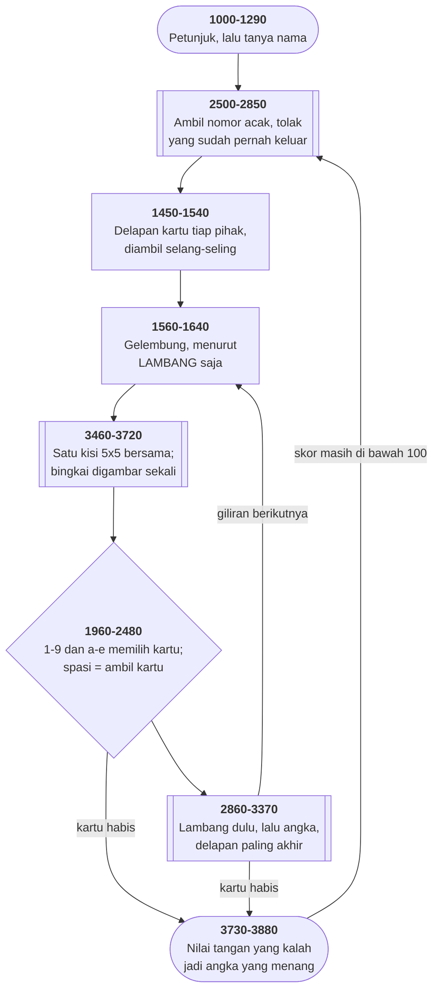

# CRAZY8.BAS di penelusur

> Program keenam puluh empat. 294 baris, nomor 1000–3940, cakupan tabel
> **294/294 (100%)**.

Sumber: `run/CRAZY8.BAS` · tabel: `tracer/program/CRAZY8.js`

Crazy Eights (Les Davids). Kartu digambar dengan mengubah satu kisi bersama, dan pintu untuk mengosongkannya tidak pernah diketuk.

## Kisi yang dipakai bergantian

Sebuah kartu di layar ini berukuran lima kali lima aksara, dengan bingkai ganda CP437 di pinggirnya, pangkat di dua pojok, dan lambang di tengah.

Cara yang biasa: bangun stringnya tiap kali sebuah kartu perlu digambar. Yang dilakukan berkas ini lain — ada **satu** kisi, `FIG$(5,5)`, dan semua kartu memakainya bergantian.

```basic
3470 IF PASS = 1 THEN 3630
```

Kalau bingkainya sudah pernah digambar, seluruh bagian 3480-3620 dilewati. Yang tersisa cuma menimpa empat sel: `FIG$(2,2)` dan `FIG$(4,4)` untuk pangkatnya, `FIG$(3,3)` untuk lambangnya.

Dua puluh lima sel, dan yang berubah antar kartu cuma empat.

Yang lebih rapi lagi, ada jalan pulang. Baris 3630:

`IF THE$="   " THEN …semua jadi spasi… : PASS=0 : RETURN`

Memberi kartu kosong bukan cuma mengosongkan kisinya — ia juga **mencabut** tanda bahwa bingkainya sudah ada. Panggilan berikutnya akan membangunnya dari awal.

Satu bendera, dan sebuah struktur yang tahu kapan dirinya perlu dibangun kembali. Untuk BASIC 1983, itu rancangan yang matang.

Dan tidak ada yang pernah memakainya.

## Kesalahan satu digit

Satu-satunya tempat di seluruh berkas yang mencoba mengosongkan kisi kartu adalah baris 1650:

```basic
1650 THE$="   ": GOSUB 3370
```

Dan baris 3370 berbunyi:

```basic
3370 RETURN
```

Itu `RETURN` milik subrutin komputer yang berakhir di atasnya. Pembuat gambar kartu mulai di **3460**.

Jadi baris 1650 menyetel `THE$`, memanggil sebuah subrutin, dan subrutin itu langsung pulang. Tidak ada yang dikosongkan. `PASS` tidak pernah kembali nol sesudah disetel satu di baris 3480.

Apa akibatnya? Hampir tidak ada — dan itulah yang membuat cacat ini bertahan. Bingkai kartunya memang tidak perlu digambar ulang; ia sama untuk semua kartu. Jalur pengosongan itu ada untuk kerapian, bukan untuk kebenaran.

Yang hilang cuma satu hal: waktu tumpukan buangan kosong, `UPCARD$` tetap menampilkan kartu lama, karena tidak ada yang menghapusnya.

Dan begitulah cacat semacam ini hidup. Bukan karena tidak ada yang menguji, tapi karena **akibatnya lebih kecil daripada ambang perhatian siapa pun**. Kode yang ditulis dengan hati-hati, dipanggil ke alamat yang meleset sepuluh nomor baris, dan berjalan bertahun-tahun tanpa ada yang tahu.

## Peta arsitektur



## Alur yang layak diikuti

| baris | yang terjadi |
|---|---|
| `3470` | `IF PASS=1 THEN 3630` — **bingkai kartu digambar sekali seumur hidup** |
| `3630` | kartu kosong mengosongkan kisinya dan menyetel `PASS=0`… |
| `1650` | …tapi `GOSUB 3370` mendarat di sebuah `RETURN`. **Pintu itu tak pernah diketuk** |
| `1710` | kartu yang tidak berubah **tidak digambar ulang** — singgahan lewat `OLDHAND$()` |
| `2580` | kocok dengan **menolak**: ambil acak, buang yang di luar 1–52 atau sudah keluar |
| `2360` | `MID$(IN$,3,1)=…` — MID$ sebagai **sasaran**, mengganti lambang di tempat |
| `2400` | kartu terakhir pindah ke lubangnya; tidak ada larik yang digeser |
| `2990` | komputer: lambang dulu… |
| `3050` | …lalu angka… |
| `3110` | …dan **delapan paling akhir**, karena ia kartu paling berharga |
| `2160` | salinan yang lupa diganti: `"e"` memilih kartu **15**, bukan 14 |
| `2170` | dan penjaganya menolak `"f"`—`"g"`: **kartu 14 dan 16 tak punya tombol** |

## Yang bisa dicoba di halaman

| coba ini | yang terlihat |
|---|---|
| pasang titik henti di 3470 | `IF PASS=1 THEN 3630` — **bingkai kartu digambar sekali seumur hidup** |
| pasang titik henti di 3630 | kartu kosong mengosongkan kisinya dan menyetel `PASS=0`… |
| pasang titik henti di 1650 | …tapi `GOSUB 3370` mendarat di sebuah `RETURN`. **Pintu itu tak pernah diketuk** |
| pasang titik henti di 1710 | kartu yang tidak berubah **tidak digambar ulang** — singgahan lewat `OLDHAND$()` |
| pasang titik henti di 2580 | kocok dengan **menolak**: ambil acak, buang yang di luar 1–52 atau sudah keluar |

Aslinya dijalankan dengan `run\\CRAZY8.bat`.

> Tekan 1-9 atau a-e untuk memainkan kartu, spasi untuk mengambil kartu baru. Kalau memainkan delapan, tekan h, c, s, atau d untuk lambang berikutnya.

## Penyimpangan dari aslinya

1. **`PLAY` dan `SOUND` diam.** Baris 2830 membunyikan satu nada per kartu selama pengocokan — lima puluh dua kali.
2. **`RANDOMIZE` memasang benih tetap.** Baris 2520-2540 tetap ditelusuri supaya terlihat bahwa benihnya dibangun dari menit dan detik jam sistem.
3. **`SWAP` ditulis sebagai tukar biasa** lewat variabel sementara.
4. **`MID$(A$,n,1)=B$` ditiru dengan menyambung potongan string.** Di BASIC ini pernyataan tersendiri — MID$ sebagai **sasaran** penugasan, yang menimpa aksara tanpa mengubah panjang stringnya. JavaScript tidak punya padanannya.
5. **`WHILE`/`WEND` ditiru sebagai lompatan bersyarat**: `WHILE` melompat ke baris sesudah `WEND` kalau syaratnya salah, dan `WEND` melompat balik. Alurnya sama persis.

## Yang layak ditiru

**Satu kisi untuk lima puluh dua kartu.** `FIG$(5,5)` adalah **satu** kisi lima kali lima. Bingkainya — empat pojok, empat sisi — digambar sekali, lalu `PASS=1` menandainya sudah ada. Kartu berikutnya melompati seluruh bagian itu dan cuma menimpa empat sel di dalamnya: pangkat di dua pojok, lambang di tengah. Dua puluh lima sel untuk lima puluh dua kartu, dan yang berubah cuma empat.

**Menggambar ulang hanya yang berubah.** `OLDHAND$()` menyimpan apa yang sudah ada di layar. Baris 1710 dan 1810 membandingkannya dengan tangan sekarang, dan kartu yang sama **dilewati**. Di layar teks 1983 yang menggambar satu kartu dengan dua puluh lima `LOCATE`, itu selisih yang terasa.

**Gelung yang sengaja jalan satu lebih.** Baris 1700 dan 1790 memakai `PCARDS+1` sebagai batas. Kartu ke-*n*+1 tidak ada — dan itulah maksudnya: petak yang baru saja dikosongkan harus **dihapus dari layar**. Batas yang kelebihan satu, disengaja, dan tepat.

**MID$ di sebelah kiri tanda sama dengan.** Baris 2360: `MID$(IN$,3,1)=MID$(S$,1,1)`. Di BASIC, `MID$` bisa jadi **sasaran** penugasan — ia menimpa aksara di tempatnya tanpa mengubah panjang string. Itu cara mengganti lambang sebuah kartu delapan tanpa membangun ulang stringnya, dan bahasa modern jarang punya padanannya.

**Menghapus dari tengah tanpa menggeser.** Baris 2400: kartu **terakhir** dipindah ke lubang yang ditinggalkan kartu yang baru dimainkan, lalu jumlahnya dikurangi. Urutannya jadi kacau — tapi baris 1560 mengurutkannya lagi sebelum digambar, jadi tidak ada yang tahu.

## Yang jangan ditiru

**Pintu yang tidak pernah diketuk.** Baris 3630 punya jalur khusus: kalau kartunya `"   "`, seluruh kisi dikosongkan dan `PASS` dikembalikan ke nol, supaya bingkainya dibangun ulang nanti. Jalur itu masuk akal dan ditulis dengan hati-hati. Satu-satunya tempat yang mencoba memakainya adalah baris 1650: `THE$="   ": GOSUB 3370`. Tapi baris **3370** isinya `RETURN`. Yang dimaksud **3460**. Jadi baris 1650 memanggil sesuatu, kembali seketika, dan tidak melakukan apa pun. Kesalahan satu digit, dan sebuah cabang yang ditulis lengkap jadi tidak pernah dijalankan sekali pun.

**Baris yang disalin tanpa diperbaiki.** Baris 2150: `IF IN$="e" THEN IN=14`. Baris 2160: `IF IN$="e" THEN IN=15`. Hurufnya lupa diganti jadi "f". Akibatnya lebih dalam daripada kelihatannya. Keduanya menguji huruf yang **sama**, dan yang belakangan menang — jadi menekan "e" memilih kartu ke-**15**, bukan ke-14. Terukur di penelusur: `IN=15`. Lalu baris 2170 menutup sisanya: `IF IN$<"a" OR IN$>"e"` menolak "f" dan "g" mentah-mentah, walaupun baris 1930 dan 1940 dengan rapi mencetak "F" dan "G" di bawah kartu ke-15 dan ke-16. Hasil akhirnya: dari tujuh kartu yang bisa dipegang di baris kedua, **kartu ke-14 dan ke-16 tidak punya tombol sama sekali**, dan tombol yang seharusnya milik kartu ke-14 menunjuk ke kartu ke-15. Satu huruf yang lupa diganti, tiga kartu yang terpengaruh.

**Plus yang tidak menambah apa-apa.** `WHILE+ SORTTEST` di baris 1570, 2570, dan 2900. Tanda tambah di depan sebuah variabel adalah plus uner yang sah dan tidak berarti apa-apa. Tiga kali, konsisten — jadi bukan salah ketik sekali, melainkan kebiasaan.

**Kecerdasan yang memilih lambang secara asal.** Baris 3250: sesudah membuang delapan, komputer memilih lambang dari kartu **pertama** lainnya di tangannya. Tangannya sudah diurutkan menurut lambang, jadi "yang pertama" adalah lambang yang paling kecil menurut abjad — bukan yang paling banyak dipegangnya. Menghitung mana yang terbanyak butuh satu gelung tambahan, dan gelung itu tidak ada.

**Satu baris, dua arti.** Baris 3850 dimasuki dari dua arah. Dari 3840 ia lanjutan wajar penghitungan skor. Dari 2030 dan 3220 — saat dek habis — ia **melompati seluruh penghitungan**, jadi tidak ada yang dapat angka dan tangannya diulang diam-diam. Dua makna yang berbeda di satu nomor baris, dan tidak ada `REM` yang menyebutkannya.

---
[Rancangan penelusur](_rancangan.md) · [BJ](bj.md) · [BLACKJCK](blackjck.md)
