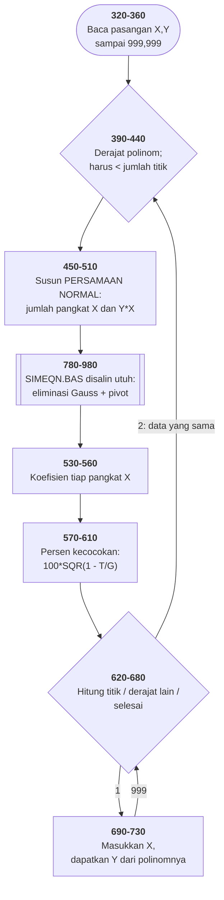

# CURVE.BAS di penelusur

> Program keempat puluh delapan. 89 baris, nomor 100–980, cakupan tabel
> **89/89 (100%)**.

Sumber: `run/CURVE.BAS` · tabel: `tracer/program/CURVE.js`

Pencocokan kurva kuadrat terkecil, Feldman & Rugg 1982. Diberi sekumpulan
titik, ia mencari polinom derajat berapa pun yang paling dekat melewatinya.

**Dan separuh bawahnya adalah [SIMEQN.BAS](simeqn.md), disalin utuh.**

## Dua ratus baris yang sama, di dua berkas

Baris 780 sampai 980 di sini adalah baris 390 sampai 590 di SIMEQN.BAS, digeser
tepat **390** nomor. Bukan mirip — sama persis, pernyataan demi pernyataan:

| SIMEQN | CURVE | isi |
|---|---|---|
| 390 | 780 | `IF N>1 THEN 410` → `THEN 800` |
| 470 | 860 | `FOR J=K TO N:SWAP A(K,J),A(L,J):NEXT` |
| 500 | 890 | `Q=A(M,K)/A(K,K):A(M,K)=0` |
| 590 | 980 | `V(M)=(R(M)-Q)/A(M,M):NEXT:NEXT:RETURN` |

Ini cara memakai ulang kode di zaman tanpa pustaka: `LIST 390-590`, salin ke
berkas lain, `RENUM`. Dan pada 1982 itu **satu-satunya cara** — tidak ada
`#include`, tidak ada modul, tidak ada penaut.

Harganya terlihat langsung. **Kedua cacat SIMEQN.BAS ikut tersalin:**

- pembagian tanpa memeriksa nol (baris 790, 890, 950)
- `V(M)=…` yang tertinggal di dalam gelung `J` (baris 980)

Memperbaiki satu tidak memperbaiki yang lain, dan tidak ada apa pun di kedua
berkas yang menyebutkan bahwa mereka berkerabat.

Pola ini muncul **tiga kali** di koleksi ini:

| dari | ke | yang ikut terbawa |
|---|---|---|
| SIMEQN | CURVE | dua cacat penyelesai persamaan |
| BUSTHREE | BUSSEVEN | `JP` yang tidak pernah diisi |
| sepuluh berkas BUS* | — | gelung perakit garis, hanya diperbaiki di BUSEIGHT |

**Penyalinan menyebarkan yang benar dan yang salah dengan kecepatan yang persis
sama.**

## Kenapa "kuadrat terkecil" menghasilkan sistem persamaan

Yang diperkecil bukan selisih antara data dan kurva, melainkan **jumlah
kuadrat** selisihnya — karena kuadrat membuat selisih ke atas dan ke bawah
sama-sama menghukum, dan karena kuadrat bisa diturunkan.

Begitu diturunkan, muncul sesuatu yang rapi: syarat "jumlah kuadrat sekecil
mungkin" ternyata setara dengan **sistem persamaan linear** dalam koefisien
polinomnya. Namanya *persamaan normal*.

Isinya cuma jumlah-jumlah sederhana:

```basic
450 FOR J=1 TO D2:P(J)=0:FOR K=1 TO NP
460 P(J)=P(J)+X(K)^J:NEXT:NEXT:P(0)=NP        ' jumlah X pangkat J
470 R(1)=0:FOR J=1 TO NP:R(1)=R(1)+Y(J)
500 R(J)=R(J)+Y(K)*X(K)^(J-1)                 ' jumlah Y kali X pangkat J-1
510 FOR J=1 TO N:FOR K=1 TO N:A(J,K)=P(J+K-2) ' matriks Hankel
520 GOSUB 780                                 ' selesaikan
```

Baris 510 layak diperhatikan: tiap unsur matriks cuma bergantung pada
**jumlah** indeksnya, jadi seluruh matriks (D+1)×(D+1) terisi dari satu larik
`P()` sepanjang 2D. Bentuk seperti itu punya nama — matriks Hankel — dan ia
muncul sendiri dari aljabarnya, bukan dari pilihan penulisnya.

Seluruh "kecerdasan" berkas ini ada di enam baris itu. Sisanya masukan,
tampilan, dan sebuah subrutin yang disalin dari program lain.

## Terverifikasi

Garis lurus `y = 2x`, empat titik, derajat 1:

```
NP=4   V(1)=0   V(2)=2   kecocokan=100%
```

Parabola `y = x²`, lima titik, derajat 2:

```
V(1)=0   V(2)=0   V(3)=1   kecocokan=100%
```

Koefisien tepat, kecocokan seratus persen. Penyelesai persamaannya bekerja —
dan bekerjanya di dua berkas sekaligus.

## Ukuran kecocokan yang punya arti

```basic
570 Q=0:FOR J=1 TO NP:Q=Q+Y(J):NEXT:M=Q/NP:T=0:G=0
580 …:T=T+(Y(J)-Q)^2      ' sisa kuadrat terhadap KURVA
590 G=G+(Y(J)-M)^2        ' sisa kuadrat terhadap RATA-RATA
600 T=100*SQR(1-T/G)
```

Kalau kurvanya tidak lebih baik daripada sekadar menebak rata-rata, `T = G` dan
hasilnya nol persen. Kalau kurvanya lewat tepat di semua titik, `T = 0` dan
hasilnya seratus. Itu koefisien korelasi, ditulis tanpa menyebut namanya.

## Peta arsitektur



## Yang bisa dicoba di halaman

| coba ini | yang terlihat |
|---|---|
| `1,2` `2,4` `3,6` `999,999`, derajat 1 | koefisien 0 dan 2, kecocokan 100% |
| titik yang sama, derajat 2 | koefisien pangkat dua ≈ 0 — data lurus tetap lurus |
| pasang titik henti di 510 | `A()` terisi dari satu larik `P()` |
| pasang titik henti di 780 | mulai penyelesai SIMEQN yang disalin |
| bandingkan 780–980 dengan [SIMEQN](simeqn.md) 390–590 | identik |

## Penyimpangan dari aslinya

1. **`WIDTH 40` tidak ditiru**; konsol tetap 80 kolom.
2. **`BEEP` diam, dan `COLOR 23` tidak berkedip.** Nilai 23 adalah 7 + 16, dan
   bit ke-16 itulah atribut kedip CGA — kata "ERROR!" di baris 740 seharusnya
   berkedip.
3. **Pembagian nol memberi `NaN`**, bukan tak-hingga mesin — sama seperti di
   SIMEQN.BAS, karena penyelesainya memang berkas yang sama.
4. **`INPUT X(J),Y(J)` menerima dua angka dipisah koma** dalam satu baris.

## Yang jangan ditiru

- **Cacat yang ikut tersalin.** Baris 780–980, kedua-duanya.
- **Penjaga yang juga bisa jadi data.** `EF=999` menandai akhir masukan — dan
  999 adalah angka yang sangat mungkin muncul sebagai data sungguhan. Siapa pun
  yang punya titik (999, 999) tidak bisa memasukkannya.
- **Dua subrutin yang bedanya satu kata.** Baris 740–750 dan 760–770, identik
  kecuali kata "FATAL".
- **Dua batas yang harus dijaga sejalan.** `MX=100` untuk jumlah titik, `MD=7`
  untuk derajat, masing-masing dipakai di tiga tempat berbeda.

---
[Rancangan penelusur](_rancangan.md) · [SIMEQN](simeqn.md) · [INTEGRAT](integrat.md) · [BOWLING](bowling.md) · [HINTS](hints.md)
