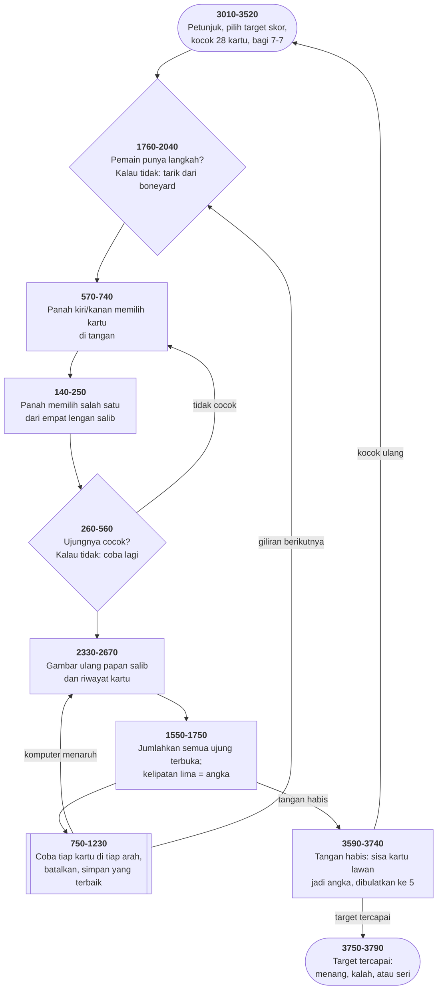

# DOMINOES.BAS di penelusur

> Program kedua puluh tiga. 387 baris, nomor 10–3870, cakupan tabel
> **387/387 (100%)**.

Sumber: `run/DOMINOES.BAS` · tabel: `tracer/program/DOMINOES.js`

Domino "Five-Up" dengan satu spinner. Papan berbentuk **salib** — spinner di
tengah, empat lengan ke kiri, kanan, atas, bawah — dan angka hanya didapat
kalau jumlah **seluruh** ujung terbuka habis dibagi lima.

## Tujuh nilai dalam tiga aksara

```basic
2130 DATA "   "," . ",". .","...",": :",":.:",":::"
```

*(Aksara tengahnya sebenarnya `CHR$(249)`, titik kecil di tengah sel.)*

Kuncinya: **titik dua sudah dua titik bertumpuk**. Jadi tiga kolom aksara bisa
memuat nol sampai enam mata — tanpa mode grafik dan tanpa aksara khusus.
Terverifikasi apa adanya:

```
┌───┬───┐ ┌───┬───┐ ┌───┬───┐ ┌───☺───┐ ┌───┬───┐ ┌───┬───┐ ┌───┬───┐
│ ∙ │   │ │:::│.∙.│ │.∙.│.∙.│ │. ∙│ ∙ │ │.∙.│ ∙ │ │:::│   │ │:::│ ∙ │
└───┴───┘ └───┴───┘ └───┴───┘ └───┴───┘ └───┴───┘ └───┴───┘ └───┴───┘
```

Tangan `1|0  6|3  3|3  2|1  3|1  6|0  6|1`, dan penunjuk pilihan (`☺`,
`CHR$(1)`) duduk di kartu keempat — digambar dengan trik **simpan-di-bawah**
yang sama seperti [SUB.BAS](sub.md): `SCREEN()` membaca aksara di bawahnya,
baris 230 mengembalikannya.

## Seluruh papan dalam lima string

`TBL$(4)` adalah spinner; `TBL$(0..3)` empat lengannya. Tiap string **dua
aksara**. Papan salib, dua puluh delapan kartu, dan seluruh keadaan permainan
muat dalam sepuluh huruf.

Terverifikasi: pemain menaruh `2|1` (jadi spinner), komputer menjawab `0|2` di
lengan atas — `TBL$` menjadi `["02","  ","  ","  ","21"]`:

```
My Score Is 0                                                    Dominoes Played
Your Score Is 0
                                     ┌───┐                            2:1
▄▄                                   │   │                            0:2
▄▄                                   ├───┤
▄▄                                   │. ∙│
▄▄                                   └───┘
▄▄                                   ┌───┐
▄▄                                   │. ∙│
                                     ├───┤
                                     │ ∙ │
                                     └───┘
```

## Coba, nilai, batalkan

Komputer perlu memilih langkah terbaik dari tujuh kartu dikali empat arah.
Baris 1150–1230:

```basic
1160 FOR A=0 TO 4:SAV$(A)=TBL$(A):NEXT      ' salin papan
1180 IF IS THEN TBL$(DD)=ZRP2+ZLP2          ' taruh
1200 GOSUB 1550                             ' hitung skornya
1210 IF HOLDY AND HOLD<=HOLDY THEN HOLD=HOLDY
1220 HH1=PLA:HH2=DD                         ' ingat kartu dan arahnya
1230 FOR A=0 TO 4:TBL$(A)=SAV$(A):NEXT      ' KEMBALIKAN
```

Ini pola yang masih dipakai di setiap mesin catur: **make move — evaluate —
unmake move**. Yang membuatnya murah di sini: keadaan permainannya cuma lima
string dua aksara.

Dan perhatikan yang **tidak** dilakukannya: tidak ada pencarian ke depan.
Komputer menilai satu langkah, bukan akibatnya. Itu sebabnya seluruh otaknya
muat dalam delapan puluh baris.

## Spinner yang pindah sendiri

Kartu **ganda** pertama menjadi spinner. Masalahnya: kartu pertama yang
dimainkan belum tentu ganda. Baris 1340–1540 menyelesaikannya dengan menyusun
ulang papan:

```basic
1430 SWAP TBL$(2),TBL$(4):SWAP TBL$(0),TBL$(4)
1440 TBL$(2)=RIGHT$(TBL$(2),1)+LEFT$(TBL$(2),1)
```

Dua `SWAP` berurutan yang memutar tiga string, lalu satu pembalikan karena
kartu yang berpindah lengan juga berganti arah hadap. Bendera `NOSPR`
memastikan ini hanya terjadi sekali.

Yang membuatnya mungkin: **papannya bukan gambar melainkan lima string.**
Baris 2330 menggambar ulang seluruhnya dari nol setiap kali. Memisahkan keadaan
dari tampilannya membuat operasi yang terdengar rumit jadi tiga baris.

## Peta arsitektur



## Dua idiom yang layak diingat

**Habis dibagi lima, tanpa `MOD`** (baris 1720):

```basic
IF PTOT/5=PTOT\5 THEN 1730
```

Pembagian pecahan sama dengan pembagian bulat hanya kalau tidak ada sisa. Idiom
yang lebih tua daripada `MOD` — dan program ini memakai `MOD` juga, di baris
3620. Dua gaya untuk satu pertanyaan, di satu program.

**Membuat 28 kartu tanpa larik bantu** (baris 2160–2200): `B` naik sampai 6,
lalu dipatok ke `C` dan `C` naik. Hasilnya 00, 10, …, 60, lalu 11, 21, …, 61,
lalu 22, … — tepat separuh atas tabel 7×7, yang memang isi satu set domino.

## Yang bisa dicoba di halaman

| coba ini | yang terlihat |
|---|---|
| pasang titik henti di 2130 | tujuh pola mata; titik dua = dua titik |
| pasang titik henti di 160 | `SCREEN()` menyimpan aksara di bawah penunjuk |
| pasang titik henti di 2160 | 28 kartu dibuat dari dua pencacah saja |
| pasang titik henti di 1150 | coba-nilai-batalkan, satu langkah per putaran |
| pasang titik henti di 1230 | papan dikembalikan dari salinannya |
| pasang titik henti di 1430 | spinner pindah dengan dua `SWAP` |
| pasang titik henti di 1720 | "habis dibagi lima" tanpa `MOD` |
| pasang titik henti di 490 | `TBL$(A)` — `A` yang nilainya tertinggal |

## Penyimpangan dari aslinya

1. **`COLOR 26` dan `COLOR 28` tidak berkedip.** Penunjuk pilihan kartu dan
   arah seharusnya berkedip.
2. **Pengacaknya berbenih tetap.** Baris 2140 memakai `m.semaiCampur` seperti
   [MATCH.BAS](match.md).
3. **Gelung tunda habis seketika** (baris 2080 dan 3580).
4. **Baris 490 dibiarkan apa adanya**, termasuk pemakaian `A` yang nilainya
   tertinggal dari gelung lain — cacatnya ikut terbawa, dan itu memang
   maksudnya.

## Yang jangan ditiru

- **Memakai variabel yang nilainya tertinggal.** Baris 490:
  `IF LEFT$(TBL$(4),1)<>RIGHT$(TBL$(A),1)`. `A` tidak diisi di jalur ini —
  nilainya apa pun yang tersisa dari gelung terakhir yang memakainya.
- **Tujuh subrutin yang isinya sama.** Baris 2940–3000, berbeda cuma di
  angkanya — dan lariknya **sudah ada**, namanya `DT$`.
- **Tanda kutip yang hilang di `RUN`.** Baris 3310 menulis `RUN"menu` tanpa
  penutup; baris 3790 menulis `RUN"menu"` dengan penutup.
- **Rombongan `IF` sepanjang enam belas baris.** Baris 840–950: enam belas
  syarat yang semuanya berbentuk `IF Zx=Zy AND DD=n THEN … GOSUB 1150:GOTO 960`.
  Yang membedakannya cuma tiga hal, dan ketiganya bisa jadi tabel.

---
[Rancangan penelusur](_rancangan.md) · [MENU](menu.md) · [INTRO](intro.md) · [CHECK](check.md) · [TOWERS](towers.md) · [HEAREYE](heareye.md) · [TICTAC](tictac.md) · [MASTER](master.md) · [BOGGY](boggy.md) · [PEGLEAP](pegleap.md) · [BIO](bio.md) · [HANGMAN](hangman.md) · [BUSONE](busone.md) · [OTHELLO](othello.md) · [CRAPS](craps.md) · [DRAW](draw.md) · [WILDCAT](wildcat.md) · [MAZE](maze.md) · [SUB](sub.md) · [21](21.md) · [FOOTBALL](football.md) · [GOLF](golf.md) · [MATCH](match.md)
