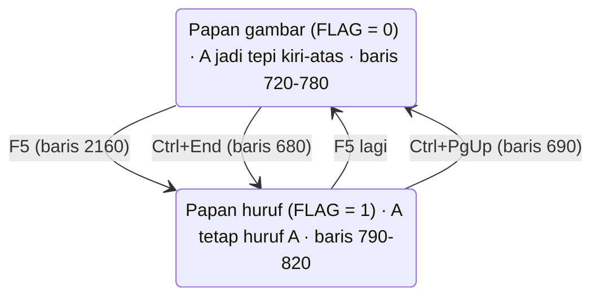
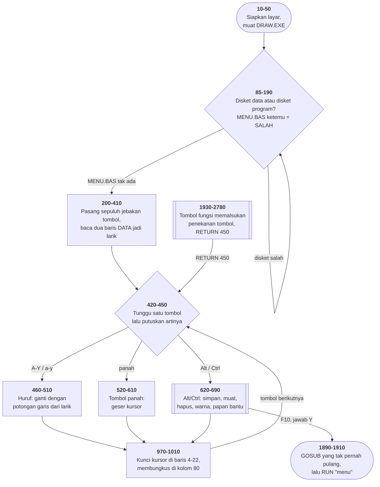

# DRAW.BAS di penelusur

> Program kelima belas. 287 baris, nomor 1–10000, cakupan tabel
> **287/287 (100%)**.

Sumber: `run/DRAW.BAS` · tabel: `tracer/program/DRAW.js`

Satu-satunya program di koleksi ini yang **bukan permainan**: penyunting gambar
layar penuh. Dan satu-satunya yang **tidak bisa dijalankan di DOSBox-X**.

## Dua hal yang harus dibaca lebih dulu

**Pertama: `DRAW.EXE` tidak ada di koleksi ini.** Baris 50 memuatnya, baris 400
dan 2220 memanggil kode mesin di dalamnya. Karena `ON ERROR` baru dipasang di
baris 70, GW-BASIC yang sungguhan **berhenti di baris 50 dengan galat 53**.
`run\DRAW.bat` tidak akan jalan.

Penelusur menggantikan kedua rutin itu dengan **tafsiran**: offset 0 menyimpan
kanvas, offset `&H40` mengembalikannya. Dasarnya kelima tempat pemanggilan —
baris 400 (saat mulai), 2330 tiga kali (sebelum `CLS`, sebelum menyimpan,
sebelum memuat), dan 2200 yang di menunya tertulis "Runs Previous Picture
(memory)". Cocok di kelimanya, **tapi tidak terbukti**, dan tidak bisa
dibuktikan selama berkasnya hilang. Seluruh sisa program adalah BASIC biasa dan
diterjemahkan apa adanya.

**Kedua: uji disketnya terbalik.** Baris 85 mencari `MENU.BAS`, dan baris 86
melanjutkan ke penyunting hanya kalau berkasnya **tidak** ketemu. Penjelasannya
di bawah.

## Papan ketik yang disulap jadi papan gambar

Layar teks IBM PC punya sekitar empat puluh potongan garis — sudut, siku,
palang, tunggal, ganda. Tidak ada yang hafal nomornya. Maka program ini
memetakannya ke papan ketik, dan pemetaannya punya logika:

**huruf besar = potongan "pembuka", huruf kecil = potongan "penutup".**

Seluruh pemetaannya cuma dua baris `DATA` di ujung program:

```basic
2310 DATA 200,188,186,202,185,197,192,217,179,193,180,177,176,221,220,...
2320 DATA 201,187,205,203,204,206,218,191,196,194,195,219,178,222,223,...
```

Dan supaya tak perlu dihafal, baris 720–770 menggambar tabelnya di kaki layar —
tiga baris sejajar, potongan tepat di atas dan di bawah hurufnya. Terverifikasi
apa adanya di penelusur:

```
UPPER ╔  ╗  ═  ╦  ╠  ╬  ┌  ┐  ─  ┬  ├  █  ▓  ▐  ▀  ►  →  »  ↑  ☼  °  ≈  ♠  ♥  ☺
      A  B  C  D  E  F  G  H  I  J  K  L  M  N  O  P  Q  R  S  T  U  V  W  X  Y
LOWER ╚  ╝  ║  ╩  ╣  ┼  └  ┘  │  ┴  ┤  ▒  ░  ▌  ▄  ◄  ←  «  ↓  ∙  ·  ¥  ♦  ♣  ☻
```

`A` sudut kiri-**atas**, `a` sudut kiri-**bawah**. `B` kanan-atas, `b`
kanan-bawah. `C` garis mendatar, `c` garis tegak.

Jadi menggambar kotak berarti mengetik tiga baris. Terverifikasi:

| yang diketik | hasilnya |
|---|---|
| `ACCCB` | `╔═══╗` |
| `c   c` | `║   ║` |
| `aCCCb` | `╚═══╝` |

**Antarmuka yang seluruhnya ada di dalam sebuah tabel.**

## Satu penyalur, banyak jalan masuk

Program ini punya sepuluh tombol fungsi, tujuh perintah Alt/Ctrl, dan sepuluh
gerakan kursor. Godaannya: tulis penangan untuk masing-masing.

Yang dilakukannya lain. Semua perintah diputuskan di **satu** tempat — rantai
`IF` di baris 520–700 yang membaca kode pindai tombol. Lalu tombol fungsi, yang
datang lewat jalur berbeda (`ON KEY`), **memalsukan sebuah penekanan tombol**:

```basic
1940 FOR A=2 TO 10:KEY(A) OFF:NEXT:Z=CHR$(0)+CHR$(31):RETURN 450
```

F4 mengisi `Z` dengan kode Alt+S, lalu `RETURN 450` — pulang bukan ke
pemanggilnya, melainkan ke **tengah penyalur**. Dari sana jalannya sama persis
seperti kalau pemakainya menekan Alt+S sendiri.

Akibatnya F4 dan Alt+S tidak mungkin berbeda perilaku, karena keduanya kode
yang sama. Ini kerabat `U` di [OTHELLO.BAS](othello.md) dan `P` di
[CRAPS.BAS](craps.md) — tapi arahnya terbalik: bukan satu kode yang berubah
arti, melainkan banyak jalan masuk yang dipaksa bertemu di satu kode.

## Dua arti papan ketik



Diagram keadaan dipakai karena yang berubah bukan alurnya melainkan **arti
tombol huruf**. Terverifikasi: dengan `FLAG = 1`, mengetik `AC` mencetak huruf
`AC`, dan papan bantu di kaki layar berganti jadi satu kalimat — "You Are In
AlphaNumeric Character Set". **Tampilan yang memberitahu keadaan.**

## Peta arsitektur



## Menyimpan gambar = menyalin RAM layar

Tidak ada format berkas yang dirancang. Gambar disimpan begini:

```basic
1520 BSAVE KEEP$,480,3040
1750 BLOAD KEEP$,480
```

Angkanya bicara sendiri. Satu sel teks memakan **dua** bita (aksara + atribut
warna), jadi 480 bita = sel ke-240 = **baris 4**, dan 3040 bita = 1520 sel =
**19 baris**, yaitu baris 4 sampai 22. Persis kanvasnya — dan itu bukan
kebetulan: baris 970–980 mengunci kursor di 4..22 juga.

Terverifikasi bolak-balik di penelusur: gambar kotak → F4 simpan sebagai
`KOTAK   .pic` → F6 bersihkan kanvas → F3 muat → kotaknya kembali persis.

Perhatikan nama berkasnya: `KOTAK` diketik huruf kecil, dan baris 1850
menaikkannya ke huruf besar; baris 1800 (`LSET ZA=ZH`) merapatkannya ke kiri
dalam medan delapan aksara. Itu sebabnya baris 1490 mengujinya dengan **delapan
spasi**, bukan dengan string kosong.

## Kenapa "berkas ketemu" berarti gagal

```basic
85 LOCATE 14,35:FILES"menu.bas"
86 IF F THEN 200
```

`F` bernilai 1 hanya kalau `MENU.BAS` **tidak** ketemu — baris 1170 yang
mengisinya, dari penangan galat. Jadi "berkas tidak ada" = "semuanya beres".

Sebabnya masuk akal begitu diketahui: `MENU.BAS` ada di disket **program**.
Yang diminta program ini adalah disket **data** — disket kosong yang boleh
ditulisi gambar. Menemukan MENU.BAS berarti pemakainya belum menukar disket.

Dan kalau sudah ditukar, baris 180–190 melakukan hal yang mengejutkan:

```basic
180 BSAVE "DRAW.EXE",0,200
190 SAVE"DRAW.BAS",P
```

Program itu **menyalin dirinya sendiri** ke disket data — kode mesinnya lewat
`BSAVE`, sumbernya sendiri lewat `SAVE ,P` (terproteksi). Sesudah itu disket
data bisa dipakai sendirian.

Penelusur berpura-pura pemakainya benar-benar menukar disket saat diminta: uji
di baris 85 menjawab "ada", uji di baris 130 menjawab "tidak ada". Tanpa itu
baris 90–160 berputar selamanya dan penyuntingnya tak pernah tercapai.

## `POKE 106,0` yang ternyata bukan penghapus tombol

Lima baris melakukan `DEF SEG:POKE 106,0`, dan lore lama menyebutnya "membuang
isi penyangga papan ketik". Di penelusur ia ditulis **tidak berbuat apa-apa**,
karena programnya sendiri membantah tafsiran itu di dua tempat:

1. Baris 430 melakukannya **di dalam** gelung tunggu-tombol, tepat sebelum
   `INKEY$` di baris 440. Kalau ia membuang tombol tertunda, tak satu tombol
   pun akan pernah terbaca.
2. Baris 1321, 1370, dan 1780 memasangkannya dengan `IF INKEY$<>"" THEN <ulang>`
   — dan **itulah** cara baku membuang ketikan mendahului. Gelungnya mubazir
   kalau poke-nya sudah membuang.

Agaknya offset 106 mencatat sisa **penjabaran tombol fungsi**, bukan isi
penyangga BIOS. Tafsiran, bukan fakta — tapi tafsiran yang membuat programnya
bisa jalan, dan tafsiran lain tidak.

*(Ini ditemukan justru karena penelusur salah lebih dulu: dengan poke ditiru
sebagai "buang semua tombol", huruf pertama tergambar dan huruf kedua hilang.)*

## Yang bisa dicoba di halaman

| coba ini | yang terlihat |
|---|---|
| ketik `ACCCB` | tepi atas sebuah kotak, satu huruf satu potongan |
| lihat baris 23–25 | tabel terjemahannya, selalu terpampang |
| tekan `F5` lalu ketik `AC` | huruf tercetak apa adanya; papan bantu berganti |
| pasang titik henti di 2290 | dua baris DATA masuk ke larik 2&times;25 |
| `F4`, ketik nama, Enter | `BSAVE` &mdash; baris 4..22 disalin ke memori |
| `F6` lalu `F3` + nama | kanvas bersih, lalu gambarnya kembali persis |
| pasang titik henti di 1940 | tombol fungsi memalsukan tombol, `RETURN 450` |
| pasang titik henti di 86 | uji yang artinya terbalik |
| `F1` | daftar gambar, lalu kanvas dipulihkan dari `tempory.tmp` |

## Penyimpangan dari aslinya

1. **`DRAW.EXE` tidak ada**, dan dua rutin kode mesinnya digantikan tafsiran
   (simpan kanvas / kembalikan kanvas). Cocok di kelima tempat pemanggilan,
   tidak terbukti.
2. **GW-BASIC yang sungguhan berhenti di baris 50.** `run\DRAW.bat` tidak akan
   jalan — satu-satunya program di koleksi yang begitu.
3. **Penelusur berpura-pura pemakainya menukar disket** saat diminta.
4. **Disketnya cuma ada di memori.** Gambar yang disimpan hilang begitu halaman
   disegarkan.
5. **`POKE`, `PEEK`, `DEF SEG` tidak berbuat apa-apa**, termasuk `POKE 106,0`
   (lihat bagian di atas). Uji kartu monokrom di baris 310 selalu menjawab
   "kartu warna".
6. **Gelung tunda habis seketika.**

## Yang jangan ditiru

- **Uji yang artinya terbalik tanpa satu kata penjelasan.** Baris 86, dan tidak
  ada satu pun `REM` di seluruh program yang menerangkannya.
- **GOSUB yang tidak pernah RETURN.** Baris 1890 memanggil 1900; 1900 kalau
  perlu melompat balik ke 1890, yang memanggil 1900 lagi. Tiap putaran
  menumpuk alamat kembali yang tak akan dipakai, lalu jatuh ke 1910.
- **Penangan galat yang mengandalkan galat.** Baris 1400 `RESUME 1410`, dan
  1410 `RETURN` — kalau tidak ada `GOSUB` yang menunggu, itu galat 3, dan baris
  1250 menangkap justru keadaan itu.
- **Kode mati yang ikut terkirim.** Baris 1920 adalah penangan tombol fungsi
  yang lengkap, dan tidak ada satu pun `ON KEY(n) GOSUB 1920`.
- **Satu variabel untuk dua tugas.** Baris 2400–2420 memakai `A` sebagai cacah
  nama; baris 2580 memakainya lagi sebagai pencacah gelung tunda dan
  menghancurkan cacahnya.

---
[Rancangan penelusur](_rancangan.md) · [MENU](menu.md) · [INTRO](intro.md) · [CHECK](check.md) · [TOWERS](towers.md) · [HEAREYE](heareye.md) · [TICTAC](tictac.md) · [MASTER](master.md) · [BOGGY](boggy.md) · [PEGLEAP](pegleap.md) · [BIO](bio.md) · [HANGMAN](hangman.md) · [BUSONE](busone.md) · [OTHELLO](othello.md) · [CRAPS](craps.md)
