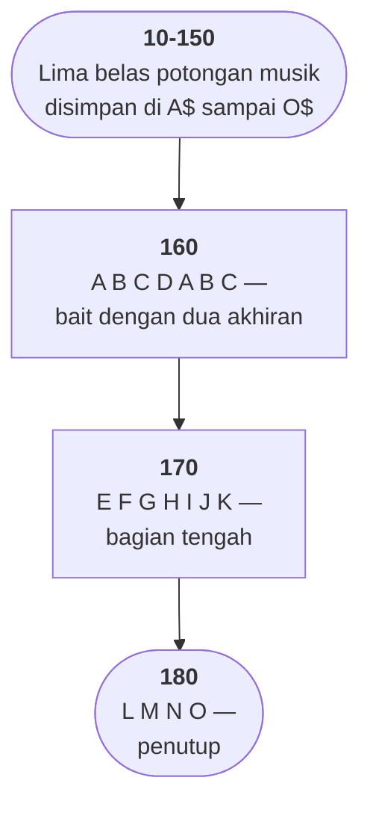

# DREAM.BAS di penelusur

> Program kedua puluh sembilan. 18 baris, nomor 10–180, cakupan tabel
> **18/18 (100%)**.

Sumber: `run/DREAM.BAS` · tabel: `tracer/program/DREAM.js`

Lima belas baris mengisi variabel, tiga baris memainkannya. Dan di ketiga baris
terakhir itu ada perintah yang membuat berkas ini menarik.

## Subrutin di dalam tanda kutip

```basic
160 PLAY "XA$;XB$;XC$;XD$;XA$;XB$;XC$;"
```

String yang diberikan ke `PLAY` **tidak berisi satu pun nada**. Isinya tujuh
perintah `X`, dan tiap `X` berarti *"berhenti di sini, mainkan isi variabel ini,
lalu lanjutkan"*.

Ini bukan penggabungan string oleh BASIC. BASIC menyerahkan string itu apa
adanya; **penafsir `PLAY`** yang membaca huruf `X`, mencari variabelnya, dan
melompat ke sana. Titik koma adalah penutup namanya.

Artinya bahasa makro musik GW-BASIC punya tiga hal yang biasanya dipakai untuk
menyebut sesuatu sebagai "bahasa": keadaan yang menempel (oktaf, tempo,
artikulasi — lihat [GERMFOLK](germfolk.md)), data (nada dan durasi), dan
**pemanggilan**.

Perintah kembarannya ada di `DRAW`: `X<variabel>$;` di sana berarti "gambar isi
variabel ini". Dua bahasa makro, satu perintah yang sama, alasan yang sama.

## Bentuk lagu yang bisa dibaca sekali lihat

Tiga baris terakhir adalah **peta seluruh lagunya**:

```
160  A B C D A B C
170  E F G H I J K
180  L M N O
```

Sembilan belas pemakaian dari lima belas potongan. Yang berulang cuma A, B, dan
C — dan letaknya menceritakan bentuknya: sebuah bait dimainkan, diteruskan
dengan potongan D, lalu baitnya diulang dan berhenti di C. Itu bentuk "bait
dengan dua akhiran", salah satu yang paling tua di musik rakyat.

Yang layak diperhatikan sebagai **pemrograman**, bukan musik: informasi tentang
struktur dipisahkan sepenuhnya dari isinya. Lima belas baris berisi *apa*; tiga
baris berisi *dalam urutan apa*.

Mengubah lagunya jadi `A B C D A B C D` berarti mengetik satu huruf. Kalau
nadanya disalin-tempel seperti [GERMFOLK.BAS](germfolk.md), perubahan yang sama
berarti menyalin tiga puluh nada dan berharap tidak ada yang tertinggal.

Di penelusur kedua lapisan itu terlihat terpisah: lima belas baris pertama
berjalan tanpa satu pun bunyi atau perubahan layar — cuma variabel yang terisi —
lalu tiga baris terakhir memakai semuanya sekaligus.

## Peta arsitektur



## Nama satu huruf yang justru tepat

`A$` sampai `O$` — lima belas variabel dengan nama satu huruf. Di sini itu
**tepat**: potongannya tidak punya arti sendiri-sendiri, dan yang penting adalah
urutannya di baris 160.

Bandingkan dengan nama satu huruf di program lain koleksi ini — `CSH` versus
`CHS` di [WILDCAT](wildcat.md), `T` yang sekaligus skalar dan larik di
[MATCH](match.md) — yang hampir selalu menyembunyikan sesuatu yang punya nama.

## Yang bisa dicoba di halaman

| coba ini | yang terlihat |
|---|---|
| jalankan sampai baris 150 | lima belas variabel terisi, layar tetap kosong |
| pasang titik henti di 160 | struktur lagunya, tujuh pemanggilan dalam satu string |
| lihat `A$` di panel variabel | satu frasa musik utuh, dipakai dua kali |

## Penyimpangan dari aslinya

1. **`PLAY` tidak berbunyi**, dan program ini tidak punya keluaran lain.
2. **Perintah `X<var>$;` ditiru sebagai penggabungan string biasa.** Hasil
   bunyinya sama; bedanya di GW-BASIC yang sungguhan penafsir `PLAY`-lah yang
   melompat ke variabel itu dan kembali, bukan BASIC yang menyambung stringnya
   lebih dulu.

## Yang jangan ditiru

- **Struktur yang tidak dijelaskan satu kata pun.** Tidak ada `REM` di seluruh
  berkas; bahwa baris 160 adalah bait, 170 bagian tengah, dan 180 penutup harus
  disimpulkan sendiri — atau didengar.
- **Tidak ada tanda kehidupan.** Nama berkasnya adalah satu-satunya petunjuk
  tentang apa yang sedang dimainkan.

---
[Rancangan penelusur](_rancangan.md) · [WHATMONF](whatmonf.md) · [GERMFOLK](germfolk.md) · [OCTAVE](octave.md)
