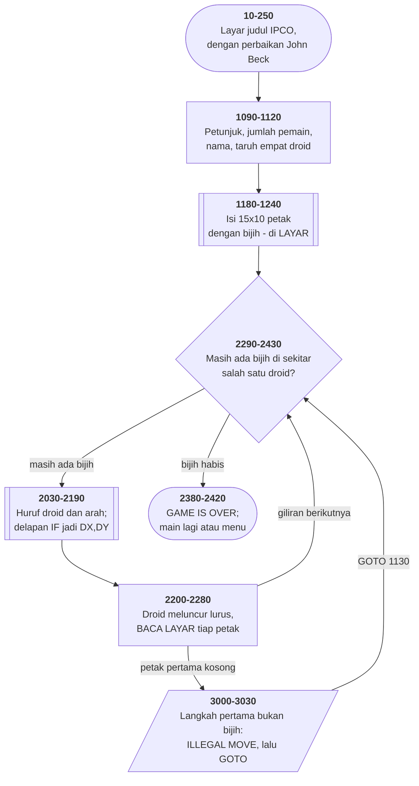

# DROIDS.BAS di penelusur

> Program kelima puluh tujuh. 183 baris, nomor 10–3030, cakupan tabel
> **183/183 (100%)**.

Sumber: `run/DROIDS.BAS` · tabel: `tracer/program/DROIDS.js`

Droids (ladang bijih yang disimpan di layar). Menambang bijih di terowongan sambil menghindari droid yang meluncur — dan droidnya membaca layar untuk tahu ke mana ia bisa pergi.

## Ladang yang tidak ada di mana pun kecuali di layar

Baris 1230 mengisi ladangnya:

```basic
1230 FOR J=3 TO 12:LOCATE J,5:PRINT X15$:NEXT
```

Sepuluh baris, masing-masing lima belas `CHR$(254)`. Seratus lima puluh petak bijih.

Dan itu saja. Tidak ada `DIM LADANG(15,10)`, tidak ada larik apa pun yang menyimpan isi papan. **Yang tergambar itulah datanya.**

Setiap pertanyaan tentang papan dijawab dengan membacanya kembali:

`1930 CHT=SCREEN(IY(J),IX(J)):IF CHT<>ORE THEN 1910` — boleh taruh droid di sini?
`2210 CT=SCREEN(IY(DN)+DY,IX(DN)+DX)` — ada bijih di depan droid?
`2340 CT=SCREEN(IY(J)+JY,IX(J)+JX)` — masih ada bijih di mana pun?

Yang menarik: karena layar cuma menyimpan **satu bita per petak**, program harus memakai kode aksara sebagai jenis benda. 254 bijih, 65–68 droid, 32 luar papan, dan **0** untuk petak yang sudah diambil.

Nol itu pilihan yang bagus. Kalau petak yang dimakan dihapus dengan spasi, ia jadi tidak bisa dibedakan dari luar papan — dan baris 2222 memeriksa keduanya untuk alasan yang berbeda. Dengan `CHR$(0)`, keduanya sama-sama kosong di mata manusia dan berbeda di mata program.

## Satu baris yang seharusnya dihapus

Baris 2215 berbunyi:

```basic
2215 LOCATE 1,20:PRINT CT
```

Ia mencetak kode aksara yang barusan dibaca dari layar, di pojok kiri atas, tiap langkah droid.

Bagi pemain, angka itu tidak berarti apa-apa. Bagi orang yang sedang mencari tahu kenapa droidnya berhenti di tempat yang salah, ia segalanya — 254 berarti bijih, 0 berarti sudah diambil, 65 berarti droid lain.

Nomor barisnya mengatakan sisanya. Ia **2215**, di antara 2210 dan 2220 — disisipkan belakangan, di tengah kode yang sudah jadi, persis seperti orang menyisipkan `print()` hari ini.

Dan seperti kebanyakan `print()` semacam itu, ia tidak pernah dicabut.

Yang membuatnya bertahan: **ia tidak merusak apa pun**. Baris 1 kolom 20 kosong; angkanya muncul dan hilang terlalu cepat untuk terbaca. Program berjalan benar. Satu-satunya yang tersisa adalah kedipan kecil di pojok layar yang tidak ada penjelasannya di mana pun — dan penelusur ini, empat puluh tahun kemudian, membuatnya berhenti tepat di sana.

## Peta arsitektur



## Alur yang layak diikuti

| baris | yang terjadi |
|---|---|
| `1230` | isi 15×10 petak dengan bijih — **langsung ke layar**, bukan larik |
| `1930` | taruh empat droid di petak yang **masih berisi bijih** (baca layar) |
| `2050` | tanya huruf droid, lalu arah; delapan `IF` jadi `DX,DY` |
| `2210` | **ULANG:** `CT = SCREEN(y+DY, x+DX)` — apa di depan droid? |
| `2220` | bijih → maju, skor +1, dan tinggalkan `CHR$(0)` |
| `2221` | langkah **pertama** bukan bijih → ILLEGAL MOVE |
| `2227` | langkah **berikutnya** bukan bijih → berhenti, giliran selesai |
| `2340` | periksa delapan tetangga tiap droid: masih ada bijih di mana pun? |
| `2215` | …dan **cetakan pengawakutu yang tertinggal** di baris 1 kolom 20 |

## Yang bisa dicoba di halaman

| coba ini | yang terlihat |
|---|---|
| pasang titik henti di 1230 | isi 15×10 petak dengan bijih — **langsung ke layar**, bukan larik |
| pasang titik henti di 1930 | taruh empat droid di petak yang **masih berisi bijih** (baca layar) |
| pasang titik henti di 2050 | tanya huruf droid, lalu arah; delapan `IF` jadi `DX,DY` |
| pasang titik henti di 2210 | **ULANG:** `CT = SCREEN(y+DY, x+DX)` — apa di depan droid? |
| pasang titik henti di 2220 | bijih → maju, skor +1, dan tinggalkan `CHR$(0)` |

Aslinya dijalankan dengan `run\\DROIDS.bat`.

> Ketik huruf droid (A sampai D, HURUF BESAR) lalu arah (N, NE, E, SE, S, SW, W, NW). Droid meluncur sampai kehabisan bijih.

## Penyimpangan dari aslinya

1. **`WIDTH 40` tidak ditiru**; konsol tetap 80 kolom.
2. **`PLAY` diam**, jadi bunyi tiap petak bijih yang diambil tidak terdengar.
3. **Gelung tunda habis seketika** (baris 3010).
4. **`RANDOMIZE` memasang benih tetap.**
5. **`POKE 23,64` di segmen 64 tidak ditiru** — alamat 0040:0017, bendera papan tombol BIOS, nilai 64 menyalakan Caps Lock. Akibatnya di penelusur huruf droid **harus diketik besar**, sedangkan di mesin aslinya Caps Lock mengurusnya.
6. **`LOAD"MENU",R` diperlakukan sama seperti `RUN "MENU"`.**

## Yang layak ditiru

**Layar sebagai ladang.** Bijih digambar sekali di baris 1230 — sepuluh baris berisi lima belas `CHR$(254)` — dan sesudah itu **satu-satunya catatan tentang apa yang masih ada adalah layar itu sendiri**. Droid membaca `SCREEN(y,x)` untuk tahu apakah di depannya masih ada bijih, dan penempatan awal droid pun diperiksa dengan cara yang sama. Program keempat di koleksi ini yang memakai gagasan itu, sesudah SERPENT, BOWLING, dan METEOR.

**Jejak yang bukan spasi.** Baris 2230 menghapus petak yang sudah diambil dengan `CHR$(0)`, bukan spasi. Alasannya ada di baris 2222: spasi (kode 32) berarti **di luar papan**. Dua jenis "kosong" yang harus dibedakan, dan yang membedakannya cuma kode aksaranya.

**Delapan arah dari delapan baris.** Baris 2080–2150 mengubah nama arah jadi sepasang penambahan: `"NE"` jadi `DY=-1:DX=1`. Sesudah itu seluruh peluncuran droid cuma `y+DY, x+DX` berulang — satu gelung untuk delapan arah.

**Berhenti sendiri, bukan dihitung.** Droid tidak tahu berapa jauh ia akan bergerak. Ia terus maju sampai `SCREEN` mengembalikan sesuatu yang bukan bijih. **Panjang langkah adalah akibat, bukan masukan** — dan itu yang membuat permainannya menarik: pemain harus melihat papan untuk menebak seberapa jauh droidnya akan pergi.

**Dua kelompok pengguna, dua benua, satu berkas.** Layar judulnya menyebut International PC Owners di Pittsburgh, dan baris 193–196 menambahkan "Error correction by JOHN BECK, Melbourne PC-Group". Perangkat lunak bebas 1982 berpindah lewat pos dan disket, dan tiap tangan yang menyentuhnya menambahkan barisnya sendiri di layar judul.

## Yang jangan ditiru

**Cetakan pengawakutu yang tertinggal.** Baris 2215: `LOCATE 1,20:PRINT CT`. Kode aksara yang barusan dibaca dicetak di pojok kiri atas, **tiap langkah, selamanya**. Tidak ada gunanya bagi pemain, dan tidak ada apa pun yang menandainya sebagai sisa pengawakutuan. Nomor barisnya (2215, di antara 2210 dan 2220) mengatakan sisanya: ia disisipkan belakangan dan tidak pernah dicabut.

**Melompat keluar dari subrutin.** Baris 3030 `GOTO 1130` keluar dari `GOSUB 2200` tanpa `RETURN`. Tiap langkah tidak sah meninggalkan satu alamat pulang di tumpukan. Di GW-BASIC tumpukan itu terbatas, dan permainan yang cukup panjang dengan cukup banyak salah ketik akan berakhir dengan "Out of memory".

**Enam baris yang diulang dalam satu baris.** Baris 2221–2226 memeriksa enam kode aksara satu per satu. Baris 2229 memeriksa keenamnya lagi dalam satu `IF`. Yang kedua menangkap kasus yang sama untuk `Z>1`, tapi susunannya membuat pembaca harus membandingkan tujuh baris untuk memastikan tidak ada yang terlewat.

**Pintu masuk kedua yang tidak dipakai siapa pun.** Baris 1020 melompati baris 1030 (`SAMPLE$="YES"`), jadi `CHAIN "SAMPLES",1000` di baris 2420 tidak pernah tercapai. Bentuk yang **sama persis** ada di MORTGAGE.BAS baris 980–1000 — dua berkas dari sumber berbeda, satu idiom yang sama.

**Huruf besar yang dipaksa lewat BIOS.** Baris 2060 membandingkan huruf droid dengan `CHR$(65)` sampai `CHR$(68)` saja. Yang membuat huruf kecil tetap bekerja bukan program ini, melainkan `POKE 23,64` di baris 1050 yang menyalakan Caps Lock. **Program yang benar karena perangkat kerasnya disetel**, bukan karena kodenya menanganinya.

---
[Rancangan penelusur](_rancangan.md) · [BACKGAM](backgam.md) · [SERPENT](serpent.md) · [METEOR](meteor.md)
