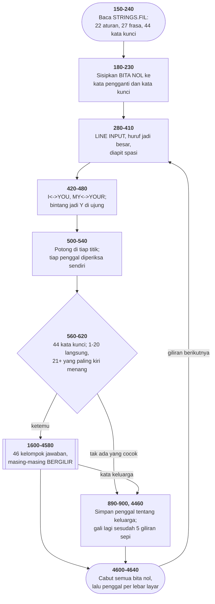

# ELIZA.BAS di penelusur

> Program keenam puluh delapan. 514 baris, nomor 10–5120, cakupan tabel
> **514/514 (100%)**.

Sumber: `run/ELIZA.BAS` · tabel: `tracer/program/ELIZA.js`

Eliza 3.0 (Steve Grumette, 1981). Psikoterapis Weizenbaum, ditulis ulang untuk PC — dengan seluruh kosakatanya di berkas terpisah dan sebuah bita nol yang menjaga pekerjaannya.

## Bita yang tidak bisa diketik siapa pun

Bagian tersulit dari ELIZA bukan menjawab. Bagian tersulitnya adalah **membalik kata ganti**.

Kalau pemakainya menulis *"I think you hate me"*, ELIZA harus menjawabnya sebagai *"you think I hate you"* — artinya "I" jadi "you", "you" jadi "I", dan "me" jadi "you". Tiga penukaran, dan dua di antaranya saling membalikkan.

Program ini menjalankan aturannya satu per satu, dua puluh dua kali, dari atas ke bawah:

```basic
420 FOR I=1 TO 22
440 A=INSTR(B,A$,OW$(I)):IF A<>0 THEN A$=LEFT$(A$,A-1)+RW$(I)+…
```

Aturan ke-12 mengubah " I " jadi " YOU ". Aturan ke-13 mengubah " YOU " jadi " I ". Kalau yang pertama menulis "YOU" apa adanya, yang kedua akan menemukannya sepuluh mikrodetik kemudian dan mengubahnya kembali jadi "I".

Jawaban yang biasa: tandai bagian yang sudah diubah, di larik lain, dengan posisi awal dan akhirnya. Itu berarti larik tambahan, perhitungan pergeseran tiap kali panjang string berubah, dan kode yang panjangnya berlipat.

Yang dilakukan berkas ini, di baris 180:

`RW$(12)=" YO"+CHR$(0)+"U "`

Sebuah **bita nol di tengah kata**. " YO␀U " tidak cocok dengan pola " YOU ", jadi aturan ke-13 melewatinya. Dan tepat sebelum jawabannya dicetak, baris 4600-4605 mencabut semua nol:

```basic
4600 ZZ=INSTR(B$,CHR$(0))
4605 IF ZZ THEN B$=LEFT$(B$,ZZ-1)+MID$(B$,ZZ+1):GOTO 4600
```

Penandanya tidak menambah larik, tidak butuh perhitungan posisi, dan **ikut ke mana pun stringnya pergi** — disalin, dipotong, disambung. Ia bagian dari datanya, bukan catatan tentang datanya.

Percobaan bandingnya bisa dijalankan di penelusur ini. Ketik *"I THINK YOU HATE ME"*:

**Dengan** bita nol, isi `A$` sesudah baris 480 adalah `"  YO␀U THINK I HATE YOU "`, dan jawabannya *"WHY DO YOU THINK I HATE YOU?"*

**Tanpa** bita nol — ganti saja isi `RW$(12)` jadi `" YOU "` biasa — hasilnya `"  I THINK I HATE YOU "`, dan jawabannya *"WHY DO YOU THINK I THINK I HATE YOU?"*

Kata "I" pertama diubah jadi "YOU" oleh aturan ke-12, lalu **diubah kembali jadi "I"** oleh aturan ke-13 dalam putaran yang sama. Satu bita, dan seluruh kalimatnya selamat.

Satu-satunya syaratnya: bita itu tidak boleh bisa diketik pemakainya, dan tidak boleh muncul di layar. Nol memenuhi keduanya.

Dan konsekuensinya menjalar dengan rapi. Kata **kunci** di baris 230 juga harus memakai bentuk bernol — karena yang dicari di baris 570 adalah teks yang *sudah* ditukar, dan teks itu penuh bita nol. Penulisnya menyadari itu, dan memperbaiki dua entri yang perlu.

## Empat puluh enam pencacah dan tidak satu pun undian

ELIZA punya ratusan jawaban. Cara yang paling gampang memilihnya adalah `RND`.

Berkas ini tidak memakai `RND` sama sekali. Tiap kelompok jawaban punya pencacahnya sendiri yang **berputar**:

```basic
1600 X0=X0+1:IF X0=7 THEN X0=1
1610 ON X0 GOTO 1620,1630,1640,1650,1660,1670
```

Enam jawaban tentang komputer, bergilir. Delapan tentang kemiripan. Sembilan tentang pertanyaan. Empat puluh enam kelompok, dengan panjang yang berbeda-beda, masing-masing dengan variabelnya sendiri — `X0` sampai `X9`, `XA` sampai `XZ`, lalu `Y0` sampai `Y9`.

Kenapa bukan undian?

Karena undian bisa mengulang. Menanyakan hal yang sama dua kali berturut-turut adalah cara tercepat menghancurkan ilusi bahwa ada seseorang di seberang sana. Bergilir **menjamin** itu tidak terjadi, dan jaminannya gratis — satu penambahan dan satu perbandingan.

Ada harga yang dibayar, dan ia terlihat di baris seperti ini:

```basic
740 GOSUB 1900:IF X4=4 THEN 1100 ELSE 4600
```

Slot keempat di kelompok itu isinya `RETURN` telanjang — sebuah "lewati saya". Tapi pencacahnya di dalam subrutin, dan yang harus tahu artinya adalah pemanggilnya, di luar. Sembilan baris di berkas ini melakukan pemeriksaan semacam itu, masing masing dengan angka yang berbeda dan tanpa satu `REM` pun yang menyebutkan kenapa.

Menambah satu jawaban ke daftar mana pun akan menggeser nomor slot kosongnya — dan pemeriksa di luar sana tidak akan ikut berubah. Itu jenis kaitan yang tidak bisa dilihat dari kedua ujungnya sekaligus.

## Peta arsitektur



## Alur yang layak diikuti

| baris | yang terjadi |
|---|---|
| `160` | seluruh kosakatanya dibaca dari **berkas terpisah**, bukan dari program |
| `180` | kata pengganti disisipi **bita nol**: `" YO"+CHR$(0)+"U "` |
| `440` | …jadi aturan berikutnya **tidak mengenalinya** dan tidak membalikkannya |
| `4600` | …dan semua nol dicabut **tepat sebelum dicetak** |
| `480` | penanda kedua: `*` di berkas data, jadi `Y` sesudah semua tukar selesai |
| `570` | kata kunci 1–20 **langsung menang**; 21+ bersaing, yang paling kiri dipakai |
| `630` | `A` membawa **tiga arti**: 0 = coba kunci lain, −1 = menyerah, lain = sudah dijawab |
| `1600` | jawaban **bergilir**, bukan diundi — 46 pencacah, nol `RND` |
| `1500` | lima giliran tanpa kata kunci → gali kembali sesuatu dari ingatannya |
| `4740` | dua teguran yang **hanya bisa keluar sekali** seumur percakapan |

## Yang bisa dicoba di halaman

| coba ini | yang terlihat |
|---|---|
| pasang titik henti di 160 | seluruh kosakatanya dibaca dari **berkas terpisah**, bukan dari program |
| pasang titik henti di 180 | kata pengganti disisipi **bita nol**: `" YO"+CHR$(0)+"U "` |
| pasang titik henti di 440 | …jadi aturan berikutnya **tidak mengenalinya** dan tidak membalikkannya |
| pasang titik henti di 4600 | …dan semua nol dicabut **tepat sebelum dicetak** |
| pasang titik henti di 480 | penanda kedua: `*` di berkas data, jadi `Y` sesudah semua tukar selesai |

Aslinya dijalankan dengan `run\\ELIZA.bat`.

> Ketik kalimat biasa lalu Enter. Perintah khusus: DISPLAY menampilkan ulang percakapan, SAVE menyimpannya, CLEAR mengosongkan, RESTART mengulang dari awal. Berkas STRINGS.FIL harus ada di direktori yang sama.

## Penyimpangan dari aslinya

1. **`STRINGS.FIL` dimuat sebagai disket dalam memori** — 159 nilai, persis isi berkas aslinya sepanjang 1.274 bita. Baris 160-230 benar-benar membacanya lewat `OPEN` dan `INPUT#`, jadi alurnya utuh.
2. **Lebar layar dipatok 80.** Baris 30-55 membacanya dari BIOS di alamat 0040:004A, yang menyimpan jumlah kolom layar sekarang. Konsol penelusur selalu 80 kolom.
3. **Menyimpan percakapan menulis ke disket dalam memori**, bukan ke cakram sungguhan. Isinya tetap bisa dibaca kembali di sesi yang sama.
4. **`RUN` (baris 330 dan 4990) memuat ulang program yang sama**, sesuai artinya di BASIC.

## Yang layak ditiru

**Bita nol sebagai penanda "sudah diubah".** Baris 420-450 menjalankan dua puluh dua aturan penukaran berturut-turut. Aturan ke-12 mengubah " I " jadi " YOU ". Aturan ke-13 mengubah " YOU " jadi " I ". Kalau yang pertama menulis "YOU" apa adanya, yang kedua akan menemukannya dan **membalikkannya kembali** dalam putaran yang sama. Jawabannya di baris 180: penggantinya ditulis `" YO"+CHR$(0)+"U "`. Bita nol di tengah kata membuatnya tidak pernah cocok dengan pola `" YOU "`. Dan baris 4600-4605 mencabut semua nol tepat sebelum jawabannya dicetak. Yang membuat trik ini rapi: **penandanya tidak terlihat**. Ia tidak menambah panjang yang terasa, tidak muncul di layar, dan tidak bisa diketik pemakainya. Sebuah keadaan yang dibawa di dalam datanya sendiri, bukan di variabel terpisah.

**Penanda kedua, untuk masalah yang sama.** Berkas datanya menulis `" MY "," *OUR "`. Bintangnya mencegah aturan " YOUR " mengenalinya, dan baris 480 mengubah tiap bintang jadi huruf Y sesudah seluruh penukaran selesai. Kenapa dua cara? Karena bintang hanya bisa menggantikan aksara **pertama**, dan kebetulan huruf itu Y untuk YOUR, YOU'RE, dan YOURSELF. Untuk " ARE " dan " YOU " — yang harus disamarkan di **tengah** — bintang tidak bisa dipakai, dan nol bisa.

**Kosakata yang bisa diganti tanpa menyentuh program.** Dua puluh dua aturan penukaran, 27 penggal frasa, dan 44 kata kunci — semuanya di `STRINGS.FIL`, 1.274 bita. Program BASIC-nya tidak memuat satu pun kata Inggris yang bisa dikenali sebagai kosakata. Itu berarti seseorang bisa menerjemahkan seluruh ELIZA ke bahasa lain dengan menyunting satu berkas teks. Pemisahan program dan datanya, 1981, di sebuah disket.

**Dua tingkat prioritas kata kunci.** Baris 570: `IF Z<21 THEN 620` — kata kunci nomor 1 sampai 20 **langsung dipakai** begitu ketemu. Itu kata yang kuat: COMPUTER, DREAM, MOTHER, SORRY. Nomor 21 ke atas cuma dicatat, dan yang **posisinya paling kiri** di kalimat yang menang (baris 580). Itu kata yang lemah: WHY, WHAT, MAYBE, NO. Prioritasnya tidak ditulis di mana pun sebagai angka. Ia **urutan baris di berkas data**, dan satu perbandingan.

**Jawaban yang bergilir, bukan diundi.** Tidak ada satu `RND` pun di seluruh berkas ini. Tiap kelompok jawaban punya pencacahnya sendiri: `X0=X0+1:IF X0=7 THEN X0=1`. Empat puluh enam pencacah, masing-masing berputar di panjangnya sendiri. Akibatnya ELIZA **tidak pernah mengulang jawaban yang sama dua kali berturut-turut** untuk kata kunci yang sama — sesuatu yang tidak bisa dijamin oleh undian. Ia juga bisa diulang persis: percakapan yang sama menghasilkan jawaban yang sama.

**Ingatan yang digali saat percakapan buntu.** Tiap kali pemakainya menyebut anggota keluarga, baris 900 menyimpan penggal kalimatnya di `M$(S)`. Kalau lima giliran berturut-turut lewat tanpa satu kata kunci pun cocok (baris 1500), ELIZA menarik yang paling lama dari tumpukan itu: *"EARLIER YOU SAID YOUR…"*. Itu mekanisme MEMORY milik Weizenbaum yang asli, dan ia yang membuat percakapannya terasa punya benang.

**Satu variabel dengan tiga arti.** Sesudah tiap penangan kata kunci, baris 630 memeriksa `A`: nol berarti "coba kata kunci berikutnya"; minus satu berarti "menyerah, coba kalimat berikutnya"; nilai lain berarti "jawaban sudah dicetak". Nilai kembalian bertiga arah, tanpa satu pun cara resmi mengembalikan nilai dari sebuah `GOSUB`.

## Yang jangan ditiru

**Slot jawaban kosong yang harus diperiksa dari luar.** Beberapa daftar jawaban punya sasaran yang isinya cuma `RETURN` — misalnya baris 1960, 2040, 2420, 2740. Slot itu tidak menyusun `B$` sama sekali. Kalau pemanggilnya langsung mencetak, yang keluar adalah jawaban **sebelumnya**, terulang. Jadi tiap pemanggil harus memeriksa pencacahnya sendiri: `IF X4=4 THEN 1100`, `IF XA=6 THEN 1100`, `IF XF=5 THEN 1100`… sembilan kali di berkas ini, masing-masing dengan angka yang berbeda. Sebuah nilai penanda yang **tidak bisa dilihat dari tempat ia dipakai**. Menambah satu jawaban ke daftar mana pun akan menggeser nomornya, dan pemeriksa di luar sana tidak ikut berubah.

**Empat baris yang ditulis dua kali.** Baris 4610-4640 memenggal baris untuk layar. Baris 4650-4680 melakukan hal yang **persis sama** untuk berkas — satu satunya bedanya `PRINT` lawan `PRINT#1`. BASIC tidak punya cara menjadikan "cetak ke mana" sebagai parameter, jadi salinan itu memang tidak terhindarkan. Tapi ia tetap dua tempat yang harus diperbaiki bersamaan.

**Baris yang tidak bisa dicapai.** Baris **830** (`PRINT B$:RETURN`) tidak dituju satu lompatan pun, dan baris 820 di atasnya berakhir dengan `GOTO 4600`. Ia tidak akan pernah dijalankan.

**Kata kotor yang disembunyikan sebagai angka.** Baris 1510: `DATA 83,72,73,84,70,85,67,75`. Delapan bilangan yang dirakit jadi dua kata di baris 250-260, lalu dipakai baris 460 untuk menegur pemakainya. Ditulis begitu supaya kata-katanya **tidak terbaca** oleh siapa pun yang mencetak daftar programnya — termasuk oleh anak-anak yang memakai disket ini di sekolah. Penyamaran yang sopan, dan sekaligus penyamaran yang membuat siapa pun yang ingin menambah kata ketiga harus menghitung kode ASCII dengan tangan.

**Bendera yang dinyalakan dan tidak pernah dimatikan.** `T=1` di baris 140 menyalakan pengubahan huruf kecil jadi besar di baris 380. Tidak ada satu baris pun di seluruh berkas yang menyetelnya kembali ke nol — jadi cabang `IF T=0` itu tidak pernah diambil. Kemungkinan besar sisa dari versi yang bisa dimatikan.

---
[Rancangan penelusur](_rancangan.md) · [STARTREK](startrek.md) · [WIZARD](wizard.md)
