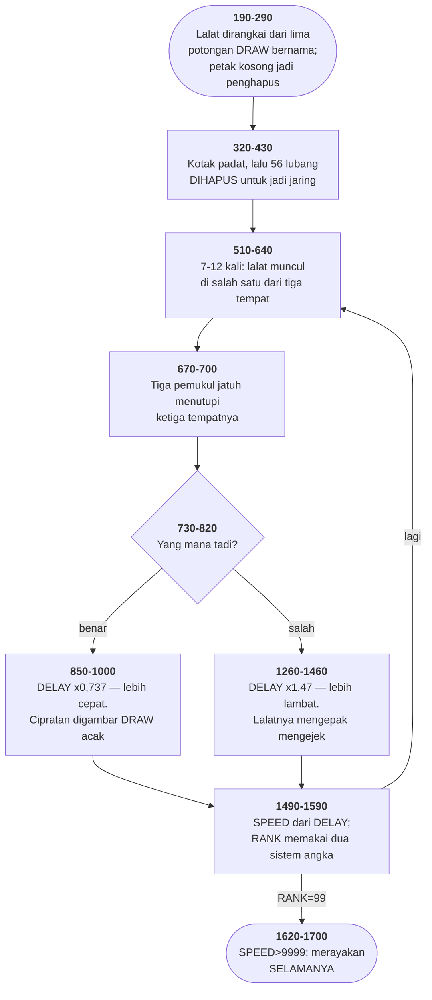

# FLYS.BAS di penelusur

> Program ketujuh puluh tujuh. 180 baris, nomor 10–9999, cakupan tabel
> **180/180 (100%)**.

Sumber: `run/FLYS.BAS` · tabel: `tracer/program/FLYS.js`

Fly (penulis tidak disebut). String DRAW yang membaca variabel BASIC dari dalam dirinya sendiri, dan sepetak layar kosong yang dipungut jadi penghapus.

## String yang membaca variabel

Bahasa `DRAW` milik BASIC punya satu bentuk yang mudah terlewat:

```basic
400 DRAW "c=clr; bm0,=y; m+25,25 m+25,0 m+25,-25"
```

Bagian `=clr;` dan `=y;` bukan salah ketik. Bentuk `=NAMA;` berarti: *ambil nilai variabel BASIC bernama NAMA, sekarang.*

Bedanya dengan menyambung string terlihat di baris 380-410:

```basic
380 FOR Y = 106 TO 135
```

```basic
390 IF Y < 111 THEN CLR=3 ELSE CLR=0
```

```basic
400 DRAW "c=clr; bm0,=y; ..."
```

```basic
410 NEXT Y
```

Stringnya **tidak pernah berubah** sepanjang tiga puluh putaran. Yang berubah `CLR` dan `Y`, dan string yang sama membacanya lagi tiap kali.

Kalau harus disambung, baris 400 akan berbunyi `DRAW "c"+STR$(CLR)+"bm0,"+STR$(Y)+"..."` — lebih panjang, lebih mudah salah, dan merangkai string baru tiga puluh kali.

Baris 980 memakainya untuk hal yang berbeda lagi:

```basic
980 DRAW "c=clr; m+=dx;,=dy;"
```

Di sini yang dibaca **arah langkah**. Tiga variabel acak yang diisi baris 950-970, dan satu string tetap yang menjelmakannya jadi coretan. Empat puluh putaran, empat puluh coretan berbeda, satu string.

Dan baris 940 melengkapinya:

```basic
940 IF I MOD 3 = 0 THEN DRAW "bm=spot;,67"
```

Tiap tiga langkah, pena dikembalikan ke titik lalatnya. Tanpa baris ini cipratannya akan berjalan pergi seperti gerak Brown; dengan baris ini ia memancar dari satu titik — dan itulah bentuk yang benar untuk sesuatu yang baru saja ditepuk.

## Tujuh ratus lima belas kali empat

Baris 140 dan 430:

```basic
140 DIM SWAT(714)
```

```basic
430 GET (0,50)-(75,199),SWAT
```

Petak yang dipungut 76 piksel lebar, 150 piksel tinggi. Di SCREEN 1 tiap piksel dua bit, jadi satu baris butuh `76×2/8 = 19` bita. Seratus lima puluh baris ditambah empat bita kepala: **2854 bita**.

`DIM SWAT(714)` memberi 715 unsur — karena BASIC menghitung dari nol.

715 kali empat bita = **2860 bita**. Cukup, dengan sisa enam.

Kali **dua** bita = 1430 bita. Tidak cukup, dan `GET` akan menolak.

Jadi seluruh program ini bergantung pada `SWAT` bertipe presisi tunggal, bukan bulat. Dan yang menjaminnya satu baris di bagian atas:

```basic
120 DEFINT X,Y
```

Hanya X dan Y yang dijadikan bulat. Bukan A-Z, bukan A-S. Dua huruf, dipilih tepat karena keduanya pencacah gelung di baris 340-370, dan tidak satu pun huruf lain ikut serta.

Kalau baris 120 berbunyi `DEFINT A-Z` — yang ditulis belasan program lain di koleksi ini tanpa berpikir dua kali — `SWAT`, `FLY0`, `FLY1`, dan `FLY2` semuanya menyusut jadi separuh, dan program ini mati di baris 270 sebelum sempat menggambar apa pun.

Yang membuatnya layak dicatat bukan bahwa penulisnya benar. Ia benar. Yang layak dicatat adalah bahwa kebenarannya dititipkan pada sebuah baris yang letaknya 310 baris dari tempat akibatnya, dan yang bunyinya tidak menyebut-nyebut ukuran, larik, atau gambar — cuma dua huruf.

## Peta arsitektur



## Alur yang layak diikuti

| baris | yang terjadi |
|---|---|
| `400` | `=NAMA;` di dalam DRAW membaca **variabel BASIC**, saat itu juga |
| `980` | …string yang sama, nilai berbeda tiap putaran gelung |
| `270` | petak **kosong** dipungut jadi sprite penghapus |
| `360` | jaring pemukul dibuat dengan **menghapus** 56 lubang dari kotak padat |
| `850` | kena: `DELAY×0,7370001` — dan angka aneh itu tak dijelaskan |
| `1260` | luput: `×1,47`; hasil kali keduanya **1,0834** — memaafkan |
| `1560` | `RANK` memakai dua sistem angka: 0/1/2 dan 11/12/99 |
| `910` | nada cipratan: **sinus pangkat tiga** — datar di tengah, tajam di ujung |
| `1700` | menang → `GOTO 1660` → **tidak pernah berhenti** |
| `570` | `WHILE+` — plus nyasar yang sama dengan 15PUZZLE baris 355 |

## Yang bisa dicoba di halaman

| coba ini | yang terlihat |
|---|---|
| pasang titik henti di 400 | `=NAMA;` di dalam DRAW membaca **variabel BASIC**, saat itu juga |
| pasang titik henti di 980 | …string yang sama, nilai berbeda tiap putaran gelung |
| pasang titik henti di 270 | petak **kosong** dipungut jadi sprite penghapus |
| pasang titik henti di 360 | jaring pemukul dibuat dengan **menghapus** 56 lubang dari kotak padat |
| pasang titik henti di 850 | kena: `DELAY×0,7370001` — dan angka aneh itu tak dijelaskan |

Aslinya dijalankan dengan `run\\FLYS.bat`.

> Lalatnya berdengung di salah satu dari tiga tempat, lalu tiga pemukul menutupi ketiganya. Tekan 1, 2, atau 3. Setiap tebakan yang benar mempercepat lalat berikutnya. ESC atau F10 keluar.

## Penyimpangan dari aslinya

1. **`PLAY` dan `SOUND` diam**, dan yang hilang lebih banyak daripada biasanya: dengung lalat, bunyi pemukul jatuh, dan amplop nada berbentuk sinus pangkat tiga di baris 910.
2. **`RANDOMIZE VAL(MID$(TIME$,4,2)+RIGHT$(TIME$,2))` diganti benih tetap** — menit dan detik jam disambung jadi satu bilangan, cara membuat benih yang berubah tiap detik.
3. **`CHAIN "MENU"` di baris 9000 tidak bisa dijalankan.** Ia satu-satunya jalan keluar yang disediakan program ini.
4. **Tidak ada satu pun koordinat mutlak di baris 240-260.** Lalatnya digambar dari *titik acuan terakhir*, dan sesudah `SCREEN 1` titik itu adalah TENGAH LAYAR — (160,100). Angka-angka `GET` di baris 270-290 hanya masuk akal dengan aturan itu, dan permukaan grafik penelusur harus diperbaiki untuk menirunya.
5. **Ukuran larik penampung `GET` tidak diperiksa penelusur.** Di mesin aslinya ia menentukan hidup-matinya program — lihat catatan tentang `SWAT(714)`.

## Yang layak ditiru

**Gambar yang dirangkai dari potongan bernama.** Baris 190-230 memberi nama pada lima potongan gambar: badan, sayap kanan atas, sayap kiri atas, sayap kanan bawah, sayap kiri bawah. Lalu baris 240 dan 260 merangkainya jadi dua lalat berbeda dengan menukar sepasang sayapnya: `240 DRAW BODY$+URWING$+ULWING$` `260 DRAW BODY$+DRWING$+DLWING$` Badannya digambar dua kali dan hanya ditulis sekali. Bahasa DRAW berupa string biasa, jadi penyambungan string adalah penyusunan gambar — dan itu berlaku tanpa satu pun perintah tambahan.

**Menghapus untuk menggambar.** Pemukulnya dibuat terbalik. Baris 330 menggambar kotak padat 76×86, lalu baris 340-370 memotong 56 lubang dari dalamnya dengan `LINE ...,0,BF`. Jaring dibuat dari lubang-lubangnya, bukan dari benangnya. Dua gelung bersarang, satu perintah. Dan baris 380-410 melakukannya lagi untuk lengkung bawahnya: tiga puluh garis patah, lima yang teratas berwarna 3 dan sisanya berwarna 0 — yang berwarna 0 mengunyah bagian bawah kotak sampai bentuknya benar.

**Petak kosong sebagai sprite penghapus.** Tiga `GET` di baris 270-290, padahal cuma dua lalat yang digambar. Yang ketiga — `FLY0` — dipungut dari petak di sebelah kiri lalatnya. Isinya hampir seluruhnya kosong, dan itu justru gunanya. `PUT ...,FLY0,PSET` di baris 630 menimpakan kekosongan itu ke atas lalat, dan lalatnya hilang. Dihitung di penelusur: `FLY1` dan `FLY2` masing-masing berisi 50 piksel bergambar dari 286, sedangkan `FLY0` berisi **nol dari 286**. Ia benar-benar kosong — sepetak layar hitam yang dijadikan alat. Alternatifnya `LINE ...,0,BF`. Ini bukan lebih cepat dan bukan lebih pendek — tapi ia memakai jalur kode yang persis sama dengan menggambar, jadi tidak ada kemungkinan ukuran penghapusnya melenceng dari ukuran yang digambar.

**Bendera sekali-pakai di dalam nilainya sendiri.** `RANK` bernilai 0, 1, atau 2 — pangkat yang sudah diumumkan. Tapi baris 1560-1580 mengisinya dengan 11, 12, atau 99. Angka-angka itu berarti "baru saja naik, dan belum diumumkan". Baris 1020 dan 1100 memeriksanya, mencetak selamatnya, lalu menggantinya dengan 1 atau 2. Satu variabel membawa dua hal: tingkat, dan kejadian sekali-pakai. Yang membuatnya bekerja bukan kepintaran melainkan pemilihan angka — 11 dan 1 sengaja dibuat berbeda cukup jauh sehingga perbandingan `<` di baris 1560 tetap masuk akal untuk keduanya.

## Yang jangan ditiru

**Ukuran larik yang benar karena tipenya kebetulan tepat.** `140 DIM SWAT(714)`, dan baris 430 memungut petak 76×150 piksel ke dalamnya. Di SCREEN 1 satu piksel dua bit, jadi satu baris 76 piksel butuh 19 bita; 150 baris ditambah 4 bita kepala = **2854 bita**. Larik 715 unsur menampung 2854 bita hanya kalau tiap unsurnya EMPAT bita — presisi tunggal. Kalau `SWAT` bertipe bulat, ia cuma 1430 bita dan `GET` gagal. Yang menjaganya: baris 120 menulis `DEFINT X,Y` — hanya X dan Y. Kalau baris itu berbunyi `DEFINT A-Z`, seperti belasan program lain di koleksi ini, program ini mati di baris 430. Larik penampung `GET` yang dihitung pas-pasan selalu begini: benar sampai seseorang mengubah sesuatu yang kelihatannya tidak berhubungan.

**Larik yang di-DIM lalu dilupakan.** `150 DIM X(3),Y(3)`. Keduanya tidak pernah muncul lagi di 180 baris sesudahnya. Yang membuatnya lebih dari sekadar sampah: nama X dan Y juga dipakai sebagai pencacah gelung biasa di baris 340-370 dan 380-410. Jadi pembaca yang menemukan `X` harus tahu lebih dulu apakah yang dimaksud larik atau skalar — dan jawabannya selalu skalar, karena lariknya tidak pernah dipakai.

**Akhir yang tidak berakhir.** Baris 1620-1700 adalah layar kemenangan. Ia mencetak dua kalimat, memainkan lagu, mengacak warna, lalu `GOTO 1660`. Tidak ada tombol yang dibaca. Tidak ada `END`. Satu-satunya jalan keluar F10, yang dipasang di baris 52 dan tidak disebut lagi di layar mana pun sesudahnya. Pemain yang menang harus menekan tombol yang tidak pernah diberitahukan kepadanya, atau mematikan mesinnya.

**Dua angka yang tidak dijelaskan.** `850 DELAY=0.7370001*DELAY` dan `1260 DELAY=1.47*DELAY`. Angka pertama punya ekor: 0,737**0001**. Tidak ada satu pun komentar yang menyebutnya, dan bedanya dari 0,737 terlalu kecil untuk berpengaruh pada apa pun. Yang lebih besar akibatnya: hasil kali keduanya 1,0834 — lebih dari satu. Satu kena dan satu luput meninggalkan pemainnya **lebih lambat** daripada saat mulai. Permainan ini diam-diam memaafkan, dan tidak ada baris yang mengatakannya.

---
[Rancangan penelusur](_rancangan.md) · [ABM2A](abm2a.md) · [15PUZZLE](15puzzle.md)
