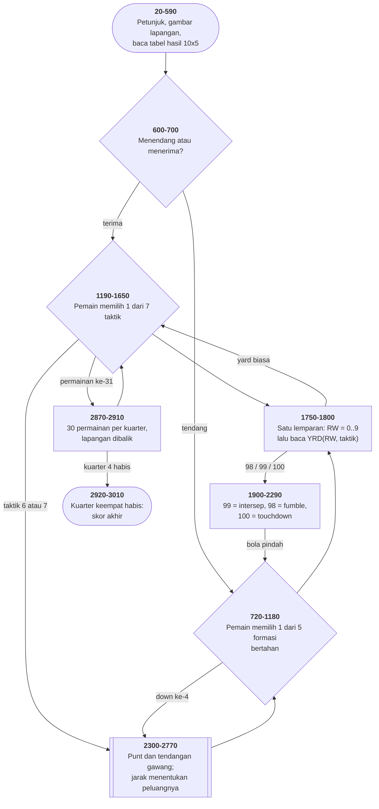

# FOOTBALL.BAS di penelusur

> Program kedua puluh. 345 baris, nomor 10–3450, cakupan tabel
> **345/345 (100%)**.

Sumber: `run/FOOTBALL.BAS` · tabel: `tracer/program/FOOTBALL.js`

"Head Coach". Sepak bola Amerika, satu lapangan teks, dan seluruh hasil
permainannya diambil dari **satu tabel 10×5**.

```
     OFFENSIVE PLAY      ██████████████████████████████
     SELECTION(1-7)      ██                   «»     ██
   ------------------    ██  HOME     QTR  VISITORS  ██      It's Your Ball
   1 = Line Plunge       ██   0        1      0      ██    On The 36 Yard Line
   3 = Screen Pass       ██  DOWN 1  YARDS TO GO 10  ██    Select An Offensive
   7 = Punt                  Gain Of 16 On The Play
               0   10   20   30   40   50   40   30   20   10  0
          ███████████████████████████████████████████████████████████
          ░░░░░    ▌    ▌    ▌  ► ▌    ▌    ▌    ▌    ▌    ▌    ░░░░░
          ███████████████████████████████████████████████████████████
```

## Seluruh permainan dalam satu tabel

Program ini tidak menyimulasikan apa pun. Tidak ada pemain, tidak ada bola,
tidak ada fisika. Yang ada satu tabel lima puluh angka dan tiga baris kode:

```basic
1780 R=RND*10
1790 RW=FIX(R)
1050 YDS=YDS-YRD(RW,POSI)
```

Satu lemparan dadu memilih **baris**, taktik pemain memilih **kolom**, dan
angka di persimpangannya adalah hasil permainannya dalam yard.

Tiga angka diberi arti khusus: **98** fumble, **99** intersep, **100**
touchdown. Baris 1480–1500 memeriksanya sebelum angkanya diperlakukan sebagai
yard.

Konsekuensinya menarik: taktik "Long Bomb" (kolom 5) punya dua nilai 99 dan
satu 50 di tabelnya — sering intersep, sesekali lima puluh yard. **Itulah
keseimbangan permainannya, dan seluruhnya ada di dalam angka.**

## Cacat yang tidak pernah ketahuan

```basic
590  FOR I=1 TO 10:FOR J=1 TO 5:READ YRD(I,J):NEXT J,I
1790 RW=FIX(R)                              ' R = RND*10
```

`RND` menghasilkan 0 sampai (hampir) 1, jadi `RND*10` adalah 0 sampai 9,999
dan `FIX`-nya **0 sampai 9**.

Tabelnya diisi baris **1 sampai 10**. Yang dibaca baris **0 sampai 9**.

Terverifikasi di penelusur:

| baris tabel | isinya | dipakai? |
|---|---|---|
| `YRD(0,*)` | `0, 0, 0, 0, 0` | **ya, 1 dari 10 kali** |
| `YRD(1,*)` | `0, 2, 14, 10, 0` | ya |
| … | … | ya |
| `YRD(10,*)` | `2, 0, 4, 2, 0` | **tidak pernah** |

Jadi **satu dari sepuluh permainan menghasilkan tepat nol yard**, apa pun
taktik yang dipilih kedua belah pihak — dan lima angka terakhir DATA tidak
pernah muncul di layar.

Kenapa tidak pernah ketahuan? Karena hasilnya **masuk akal**. Nol yard adalah
hasil yang wajar di sepak bola; pemain akan menganggapnya pertahanan yang
bagus.

> Cacat yang menghasilkan keluaran mustahil akan langsung terlihat. Cacat yang
> menghasilkan keluaran **wajar** bisa bertahan empat puluh tahun.

Di penelusur ini bisa dilihat langsung: pasang titik henti di baris 1790 dan
perhatikan `RW`.

Dan ada lagi: **baris 3030 tidak pernah dibaca.** Baris 590 mengambil lima
puluh angka, yaitu seluruh isi baris 3020. Bedanya dengan 3030 cuma satu angka
— yang kedelapan, `0` versus `6`.

## Kolom layar yang jadi koordinat permainan

Di mana bolanya? Program ini menjawabnya dengan **nomor kolom layar**: `OPS`
dan `NPS` bernilai 16 sampai 64, dan itu langsung dipakai di `LOCATE 17,NPS`.

Tidak ada terjemahan dari "yard" ke "kolom" karena **tidak ada yang namanya
yard di dalam program**. Terjemahan baru terjadi waktu angkanya perlu
ditampilkan:

```basic
2780 YLN=(NPS-15)*2
2790 IF YLN>50 THEN YLN=100-YLN
```

Kolom 16 jadi yard 2, kolom 40 jadi yard 50, kolom 64 jadi yard 98 — yang lalu
dipantulkan jadi 2, karena garis yard memang dihitung dari gawang **terdekat**.

Dan karena posisinya cuma satu angka, membalik lapangan di ganti kuarter cukup
satu pengurangan (baris 2900):

```basic
NPS=80-OPS
```

Tengah lapangan di kolom 40, jadi mencerminkan posisi berarti mengurangkannya
dari 80. **Memilih satuan yang tepat membuat operasi yang sulit jadi satu
baris.**

Harganya: yard bergerak setengah kolom (`YRD/2` di baris 1530), jadi permainan
satu yard tidak menggeser bola sama sekali di layar — dan posisi bola diam-diam
menyimpan setengahan yang tidak pernah terlihat.

## Menyembuhkan lapangan sesudah bola lewat

```basic
900 IF OPS=20 OR OPS=25 OR ... THEN LOCATE 17,OPS:PRINT"▌" ELSE LOCATE 17,OPS:PRINT"á"
```

Tanda lapangan di bawah posisi lama dikembalikan: garis lima yard kalau
kolomnya kelipatan lima, titik biasa kalau bukan.

Kerabat sederhana dari trik "simpan-di-bawah" di [SUB.BAS](sub.md) — di sini
yang disimpan bukan **isi layar** melainkan **aturan cara menggambarnya
kembali**. Lebih murah, dan cukup selama latarnya bisa dihitung ulang.

## Peta arsitektur



## Yang bisa dicoba di halaman

| coba ini | yang terlihat |
|---|---|
| pasang titik henti di 1790 | `RW` — perhatikan waktu nilainya **0** |
| pasang titik henti di 1050 | dengan `RW=0`, yard yang dikurangi selalu nol |
| lihat `YRD` di baris 590 | baris ke-10 terisi, dan tak pernah dibaca lagi |
| pasang titik henti di 2780 | kolom layar diterjemahkan jadi garis yard |
| pasang titik henti di 2900 | `NPS=80-OPS` — lapangan dibalik dengan satu pengurangan |
| pasang titik henti di 900 | tanda lapangan disembuhkan sesudah bola lewat |
| pilih taktik 5 berkali-kali | "Long Bomb": dua 99 dan satu 50 di tabelnya |
| tekan `0` sebagai taktik | diterima baris 1320, dan `YRD(RW,0)` selalu nol |

## Penyimpangan dari aslinya

1. **`PLAY` dan `SOUND` diam.** Empat lagu lengkap tidak terdengar: lagu
   pembuka (3420), lagu gol (3130), lagu ganti kuarter (3340), dan lagu turun
   minum sepanjang **dua belas baris `PLAY`** (3190–3300).
2. **`COLOR 31` di baris 3450 tidak berkedip** — "Two Minute Warning".
3. **Pengacaknya berbenih tetap.** `RIGHT$(TIME$,2)` di baris 1750 memakai jam
   penelusur yang maju tujuh detik tiap dibaca, seperti [CRAPS.BAS](craps.md) —
   kalau angkanya tetap, seluruh permainan akan menghasilkan yard yang sama
   persis berulang-ulang.
4. **Gelung "PLAY IN PROGRESS" habis seketika.**

## Yang jangan ditiru

- **Larik yang diisi dari 1 tapi dibaca dari 0.** Baris 590 versus 1790.
- **Data yang tidak pernah dibaca.** Baris 3030, lima puluh angka.
- **Satu tanda banding yang terbalik di tengah rombongan.** Baris 2520–2550
  polanya sama dan semuanya memakai `NPS<` — kecuali baris 2540 yang menulis
  `NPS>35`. **Rombongan baris yang mirip persis adalah tempat paling mudah
  untuk menyembunyikan satu yang tidak.**
- **Sisa yang tidak pernah dituju.** Baris 3320 dan 3330 dua `RETURN` telanjang
  tanpa `GOSUB`, dan baris 710 `END` yang tidak mungkin tercapai.

---
[Rancangan penelusur](_rancangan.md) · [MENU](menu.md) · [INTRO](intro.md) · [CHECK](check.md) · [TOWERS](towers.md) · [HEAREYE](heareye.md) · [TICTAC](tictac.md) · [MASTER](master.md) · [BOGGY](boggy.md) · [PEGLEAP](pegleap.md) · [BIO](bio.md) · [HANGMAN](hangman.md) · [BUSONE](busone.md) · [OTHELLO](othello.md) · [CRAPS](craps.md) · [DRAW](draw.md) · [WILDCAT](wildcat.md) · [MAZE](maze.md) · [SUB](sub.md) · [21](21.md)
