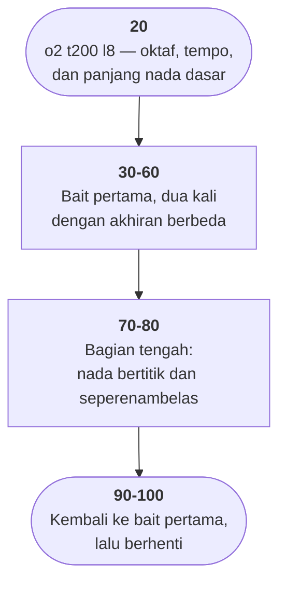

# GERMFOLK.BAS di penelusur

> Program kedua puluh tujuh. 10 baris, nomor 10–100, cakupan tabel
> **10/10 (100%)**.

Sumber: `run/GERMFOLK.BAS` · tabel: `tracer/program/GERMFOLK.js`

Sepuluh baris, dan seluruhnya `PLAY`. Layar penelusur tetap kosong; yang
bergerak cuma sorotan barisnya. Yang layak dipelajari ada **di dalam tanda
kutipnya**.

## Perintah BASIC yang sebenarnya bahasa lain

Ada dua perintah di GW-BASIC yang argumennya bukan data melainkan **program
kecil**: `PLAY` untuk musik dan `DRAW` untuk gambar. Keduanya menerima string
dan menafsirkannya huruf demi huruf.

```basic
20 PLAY "o2 t200 l8"
30 PLAY "d g a b >c d4 ml e c< "
```

| huruf | artinya |
|---|---|
| `a`–`g` | nada |
| `o` | oktaf |
| `t` | tempo (ketuk per menit) |
| `l` | panjang nada dasar |
| `p` | diam |
| `>` `<` | naik / turun satu oktaf |
| angka sesudah nada | menimpa panjangnya |
| titik | memperpanjang setengah kali |
| `ml` / `mn` | *legato* / normal |

Baris 30 dibaca satu per satu: nada D, G, A, B di oktaf 2; `>` naik ke oktaf 3
lalu C; D dengan panjang **seperempat** (angka 4 menimpa `l8`); `ml` mengubah
artikulasi jadi legato; E, C; lalu `<` turun lagi.

## Keadaan yang menempel antar-baris

Yang mudah terlewat: `ml` di ujung baris 30 **masih berlaku** waktu baris 40
mulai — itu sebabnya baris 40 dibuka dengan `mn` untuk mengembalikannya.

```basic
30 PLAY "d g a b >c d4 ml e c< "
40 PLAY "mn b p8 a p8 g4 p8 "
```

Jadi kesepuluh baris ini bukan sepuluh potongan yang berdiri sendiri,
melainkan **satu aliran perintah** yang kebetulan dipotong supaya muat di layar.
Di penelusur itu terlihat sebagai sorotan yang berjalan lurus tanpa satu pun
percabangan.

Notasi yang sama masih hidup hari ini di RTTTL (nada dering ponsel), dan
alasannya sama: **notasi musik yang bisa diketik, dikirim, dan disimpan sebagai
teks biasa.**

## Peta arsitektur



## Kenapa layarnya kosong

Penelusur ini dibangun untuk memperlihatkan **apa yang terjadi di layar** sambil
menunjukkan baris mana yang sedang berjalan. Untuk berkas ini, jawabannya: tidak
ada apa-apa.

Seluruh keluaran program ini adalah **suara**, dan suara adalah satu-satunya hal
yang penelusur putuskan untuk tidak tiru sejak awal — karena membunyikannya
berarti menyalakan pengeras suara tiap kali sebuah baris disorot, termasuk waktu
pemakai melangkah maju-mundur di baris yang sama.

Yang tersisa justru itu gunanya: **panel sumber di kanan adalah keluarannya.**

Untuk mendengarnya: `run\GERMFOLK.bat` di DOSBox-X. Sekitar dua puluh detik.

## Yang jangan ditiru

- **Program tanpa satu pun tanda kehidupan.** Tidak ada judul, tidak ada "tekan
  tombol". Kalau pengeras suaranya mati, pemakai tidak punya cara apa pun
  mengetahui bahwa programnya berjalan — atau bahwa ia sudah selesai.
- **Nomor baris sebagai birama.** Pembagian antar-baris mengikuti frasa
  musiknya, bukan strukturnya: baris 30 berakhir di tengah frasa dan baris 40
  melanjutkannya.

---
[Rancangan penelusur](_rancangan.md) · [WHATMONF](whatmonf.md) · [OCTAVE](octave.md) · [DREAM](dream.md)
