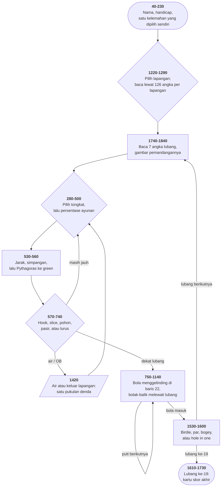

# GOLF.BAS di penelusur

> Program kedua puluh satu. 361 baris, nomor 10–3610, cakupan tabel
> **361/361 (100%)**.

Sumber: `run/GOLF.BAS` · tabel: `tracer/program/GOLF.js`

"PC Golf". Tiga lapangan, delapan belas lubang masing-masing, dan pemandangan
yang digambar ulang tiap lubang:

```
╔══════════════════════════╗            ┌─────────────────────────────────────┐
║    You Are At No. 1 Tee  ║            │                                     │
║     Distance 501 Yards   ║            │                                     │
║         Par 5            ║            │                ▓▓▓▓▓                │
╚══════════════════════════╝            │                ▓▓▓▓▓                │
                                        │            ░░░░      ♣♣♣♣           │
On Your Left Is Deep Rough              │           ░░░░        ♣♣♣♣          │
On Your Right Is Trees                  │         ░░░░░         ♣♣♣♣♣         │
```

## Pengacak yang disemai oleh jari pemain

Pertanyaan lama: dari mana angka acak yang benar-benar tak tertebak di mesin
yang tidak punya apa pun yang acak?

Jawaban program ini ada di baris 1170:

```basic
1170 Z=INKEY$:IF Z="" THEN RANDOMIZE VAL(RIGHT$(TIME$,2)):GOTO 1170 ELSE RETURN
```

Baca alurnya. Selama **tidak ada tombol ditekan**, program menyemai ulang
pengacaknya dengan detik jam — lalu mengulang. Ribuan kali per detik.

Begitu pemain menekan tombol, gelungnya berhenti. Benih yang terakhir dipasang
adalah **detik pada saat itu**.

Jadi hasil pukulan berikutnya ditentukan oleh **kapan pemain menekan
tombolnya** — sesuatu yang tidak diketahui program, tidak diketahui pemain, dan
tidak bisa diulang.

Bandingkan dengan [CRAPS.BAS](craps.md) dan [MASTER.BAS](master.md), yang
menyemai ulang di dalam gelung **kerja** — di sana penyemaian ulang cuma
membuang deret yang sedang berjalan. Di sini ia berada di gelung **tunggu**,
dan itu membuat seluruh perbedaannya.

Idenya masih hidup: sistem operasi modern mengumpulkan entropi dari jarak
antar-ketukan papan ketik dan gerakan tetikus, dengan alasan yang persis sama.

## Sebuah lubang golf dalam tujuh angka

```basic
1740 CLS:READ PAR,YARDS,LEFT,RIGHT,DIFF,LNG,FAC
```

| angka | gunanya |
|---|---|
| `PAR`, `YARDS` | ditampilkan di papan info |
| `LEFT`, `RIGHT` | nomor medan — **dipakai dua kali**: nama (`Z(LEFT)`) dan gambar (`ON LEFT-1 GOSUB`) |
| `DIFF` | ambang kesulitan; baris 590 membandingkannya dengan simpangan pukulan |
| `LNG` | **baris layar** tempat green digambar — "panjang lubang" dan "gambar" satu angka yang sama |
| `FAC` | **tidak pernah dipakai di mana pun** |

`FAC` adalah 54 angka di DATA yang tidak berarti apa-apa. Dan tidak ada yang
berani membuangnya, karena itu akan menggeser seluruh penunjuk `DATA` —

```basic
1290 FOR D=1 TO ((C-1)*126):READ E:NEXT
```

Memilih lapangan berarti **membaca lewat** 126 angka per lapangan (18 × 7).
Sesudah baris itu tidak ada indeks lapangan di mana pun; yang tersisa cuma
posisi penunjuk `DATA`. Gagasan yang sama dengan pemilih labirin di
[MAZE.BAS](maze.md).

Angka 126 itu **harus** cocok dengan jumlah angka per lapangan. Membuang `FAC`
berarti mengubahnya jadi 108, dan lupa melakukannya berarti lapangan kedua dan
ketiga membaca angka yang salah **tanpa satu pun pesan galat**.

## Satu variabel, tiga rumus

Di awal permainan pemain memilih **kelemahannya sendiri** dari enam pilihan
(baris 160–210), dan jawabannya disimpan di `B`. Yang menarik: `B` dipakai di
tiga rumus yang berbeda.

| baris | perannya |
|---|---|
| 590 | `ON B+1 GOTO 610,620` — arah melencengnya pukulan: hook atau slice |
| 660 | `IF B=4` — peluang keluar dari pasir |
| 930 | `IF B=5` — rentang acak putt jadi lebih sempit, lebih sulit disetel |

Ini kebalikan dari `P` di [CRAPS.BAS](craps.md) (satu nilai yang membalik
seluruh aturan): di sini satu nilai memberi **bumbu** pada tiga aturan yang
tetap berlaku semuanya.

## Peta arsitektur



## Pythagoras dan bola yang menggelinding lewat

```basic
540 OF=(RND/0.6)*(2*A+16)*ABS(TAN(DIST*0.003)):GRN=INT(SQR(OF^2+ABS(YARDS-DIST)^2))
```

Simpangan dari garis (`OF`) dan sisa jarak lurus adalah dua sisi siku-siku;
jarak sebenarnya ke lubang adalah sisi miringnya. Satu baris, dan pukulan yang
melenceng jadi terasa mahal dengan sendirinya.

Di green, baris 1040–1080 menggerakkan bola satu kolom per langkah di baris 22:

```basic
1080 IF GRN<0 THEN FF=-FF:GRN=-GRN
```

Kalau jaraknya negatif, arahnya dibalik dan jaraknya dipositifkan — jadi putt
yang terlalu keras menggelinding **lewat lubang**, lalu balik lagi dari sisi
lain. Fisika yang seluruhnya berupa satu tanda.

*(Dan baris 920 punya belas kasihan: sesudah enam putt, bolanya dianggap masuk
saja.)*

## Yang bisa dicoba di halaman

| coba ini | yang terlihat |
|---|---|
| pasang titik henti di 1170 | penyemaian ulang di dalam gelung tunggu-tombol |
| pasang titik henti di 1290 | lapangan dipilih dengan membaca lewat 126 angka |
| pasang titik henti di 1740 | tujuh angka satu lubang, termasuk `FAC` yang mati |
| pasang titik henti di 2680 | `ON RIGHT-1 GOSUB` — nomor medan memilih penggambarnya |
| pasang titik henti di 540 | Pythagoras: simpangan + sisa jarak → jarak sebenarnya |
| putt terlalu keras | bola menggelinding lewat, lalu balik (baris 1080) |
| pasang titik henti di 2460 | `GOTO` ke dalam subrutin, meminjam `RETURN`-nya |
| ketik nama 10 huruf | tiga huruf terakhir hilang tanpa penjelasan |

## Penyimpangan dari aslinya

1. **`Z(10)` jadi `Z_`** karena baris 3070 memakai `Z` sebagai teks biasa.
2. **`SOUND` diam** (tujuh bunyi hasil lubang di 1530–1590) dan **`COLOR 31`
   di baris 1040 tidak berkedip** — bolanya seharusnya berkedip waktu
   menggelinding.
3. **Pengacaknya berbenih tetap.** Ini penting untuk program ini khususnya:
   sifat "ditentukan oleh jari pemain" hilang, karena jam penelusur maju tetap.
   Itu harga yang harus dibayar supaya titik henti bisa dipasang.
4. **Gelung tunda habis seketika** (baris 1190).

## Yang jangan ditiru

- **`GOTO` ke dalam subrutin, meminjam `RETURN`-nya.** Baris 2460 `GOTO 1170`;
  `RETURN`-nya nanti memulangkan alur ke pemanggil **2200**, bukan ke 2460.
- **Dua subrutin yang berbagi baris penutup.** Baris 3340 (bahaya sisi **kiri**)
  melompat ke 3000 (penutup bahaya sisi **kanan**).
- **Batas panjang yang tidak cocok dengan medannya.** Baris 3560 menerima 10
  aksara, baris 3530 menaruhnya di medan 8, dan baris 100 mengambil 7.
- **Larik yang di-`DIM` dan tidak pernah dipakai.** `A(10)` di baris 40.
- **Nilai yang dibaca dan tidak pernah dipakai.** `FAC`, 54 angka.

---
[Rancangan penelusur](_rancangan.md) · [MENU](menu.md) · [INTRO](intro.md) · [CHECK](check.md) · [TOWERS](towers.md) · [HEAREYE](heareye.md) · [TICTAC](tictac.md) · [MASTER](master.md) · [BOGGY](boggy.md) · [PEGLEAP](pegleap.md) · [BIO](bio.md) · [HANGMAN](hangman.md) · [BUSONE](busone.md) · [OTHELLO](othello.md) · [CRAPS](craps.md) · [DRAW](draw.md) · [WILDCAT](wildcat.md) · [MAZE](maze.md) · [SUB](sub.md) · [21](21.md) · [FOOTBALL](football.md)
